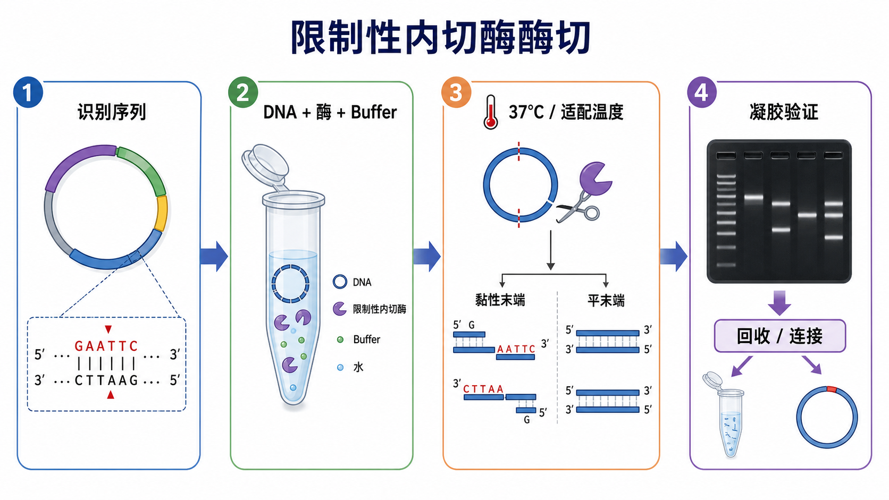

# 限制性内切酶酶切

限制性内切酶酶切（restriction enzyme digestion / restriction endonuclease digestion，限制性内切酶消化）是用[限制性内切酶](<../材(实验耗材工具篇)/限制性内切酶.md>)在特定[识别序列](<../番外/补充知识/识别序列.md>)处切开 DNA 的实验。它常用于质粒验证、传统分子克隆、PCR 产物处理、DNA 线性化和片段回收，是连接 PCR、凝胶电泳、回收、连接反应和转化之间的基础节点。

## 实验发明历史

限制性内切酶最初来自细菌的 restriction-modification system（限制-修饰系统）：细菌利用限制性内切酶识别并切割外源 DNA，同时通过甲基化等修饰保护自身基因组。Werner Arber、Daniel Nathans 和 Hamilton O. Smith 因发现限制性内切酶及其在分子遗传学中的应用获得 1978 年诺贝尔生理学或医学奖；这类酶随后成为重组 DNA、质粒构建和基因工程的核心工具。参考：[The Nobel Prize in Physiology or Medicine 1978](https://www.nobelprize.org/prizes/medicine/1978/summary/)。

在现代实验室里，限制性酶切已经从“是否能剪开 DNA”的技术，变成了一个关于位点设计、buffer 兼容、酶活单位、底物纯度、甲基化状态和后续连接效率的综合判断流程。

## 应用场景

| 场景 | 酶切在这里解决什么问题 | 关键关注点 |
|---|---|---|
| 质粒鉴定 | 用条带大小判断插入片段、方向或载体是否正确 | 选择能区分正确/错误构型的位点组合 |
| PCR 产物克隆 | 在 PCR 产物和载体两端产生兼容末端 | 引物 5' 端保护碱基、PCR 产物纯度、酶切位点是否完整 |
| 载体线性化 | 把环状质粒切成线性载体，便于插入片段连接 | 单一切点、完全酶切、必要时去磷酸化 |
| 插入片段制备 | 从质粒或 PCR 产物中释放目标 DNA 片段 | 目标条带与背景条带是否容易分离 |
| 限制性图谱分析 | 根据不同酶切组合推断 DNA 结构 | 预期条带必须能被胶分辨 |
| 甲基化敏感性分析 | 利用部分酶对甲基化状态敏感的特点判断 DNA 修饰 | 酶是否受 dam/dcm/CpG 甲基化影响 |

## 实验目的

限制性内切酶酶切的目的不是“把 DNA 剪碎”，而是在可预测的位置得到可解释的 DNA 片段。常见目标包括：

- 判断 DNA 是否为目标构建体。
- 为后续[连接反应](<连接反应.md>)准备兼容末端。
- 为[凝胶回收](<凝胶回收.md>)释放目标片段。
- 把质粒线性化，用于体外转录、模板制备或定量标准品。
- 去除不需要的片段、背景载体或错误构型。

## 简要实验原理

### 识别序列决定“剪哪里”

限制性内切酶通常识别短的双链 DNA 序列，许多识别序列具有回文结构。例如 EcoRI 识别 `GAATTC` 并在特定位点切开 DNA。只要 DNA 上存在该位点，且该位点没有被不兼容的甲基化或结构遮挡，酶就可能切割。

实际设计时必须先在序列图谱里确认：

- 目标酶切位点是否存在。
- 每个酶在载体或插入片段上切几次。
- 切出来的片段大小是否能通过[琼脂糖凝胶电泳](<琼脂糖凝胶电泳.md>)区分。
- 识别位点距离 DNA 末端是否足够远，尤其是 PCR 引物引入位点时。

### 黏性末端和平末端影响后续连接

酶切后 DNA 末端主要分为[黏性末端](<../番外/补充知识/黏性末端.md>)（sticky end / cohesive end，带互补突出端）和[平末端](<../番外/补充知识/平末端.md>)（blunt end，无突出端）。

黏性末端更容易定向连接，背景通常更低；平末端不依赖互补突出端，适用范围更宽，但连接效率通常较低，载体自连和插入方向不可控的问题更明显。

### 酶活单位、buffer 和温度共同决定效率

多数厂家把 1 unit（U，酶活单位）定义为在推荐条件下、一定时间内切割一定量 DNA 的酶量。实际反应中常见设计是“DNA + 10X [限制性内切酶缓冲液](<../材(实验耗材工具篇)/限制性内切酶缓冲液.md>) + 限制性内切酶 + [无核酸酶水](<../材(实验耗材工具篇)/无核酸酶水.md>)”，再按酶的推荐温度孵育。NEB 的常规说明把 1 µg DNA、50 µL 体系、1X buffer、37°C、约 1 h 作为典型酶切框架之一，但具体酶必须以厂家页面为准。参考：[NEB Optimizing Restriction Endonuclease Reactions](https://www.neb.com/en-us/tools-and-resources/usage-guidelines/optimizing-restriction-endonuclease-reactions)。

### 双酶切的核心是兼容，而不是简单多加一个酶

双酶切（double digestion）可以同时产生两个不同末端，常用于方向性克隆。但两个酶必须在同一 buffer、同一温度、同一盐浓度和相近反应条件下都有足够活性。如果不兼容，应考虑顺序酶切、中间纯化，或换用同尾酶/同裂酶。

NEB 的双酶切使用建议强调需要检查 buffer 兼容性、反应条件、甲基化敏感性和热失活条件。参考：[NEB Double Digestion with Restriction Enzymes](https://www.neb.com/en-us/tools-and-resources/usage-guidelines/double-digestion-with-restriction-enzymes)。

### 星号活性说明“剪错地方”也会发生

[星号活性](<../番外/补充知识/星号活性.md>)（star activity）指限制性内切酶在非理想条件下切割与正常识别序列相似但不完全相同的序列。常见诱因包括酶量过多、甘油终浓度过高、反应时间太长、buffer 不合适、盐浓度异常、pH 偏离或有机溶剂污染。星号活性会让胶图出现异常条带、拖尾或不可解释的额外片段。

### DNA 甲基化可能让位点“看起来存在但切不开”

部分限制性内切酶受[甲基化](<../番外/补充知识/甲基化.md>)状态影响。例如来源于普通大肠杆菌的质粒可能带有 dam 或 dcm 甲基化，某些酶的识别位点会因此无法切割或切割效率下降。遇到“序列上有位点但怎么也切不动”的情况，必须检查酶的 methylation sensitivity（DNA 甲基化敏感性）。

## 所需试剂、材料与设备

| 类别 | 常用内容 | 作用 |
|---|---|---|
| DNA 底物 | 质粒 DNA、PCR 产物、凝胶回收片段、基因组 DNA | 被限制性内切酶识别和切割 |
| 酶 | 限制性内切酶 | 在特定识别序列处切割 DNA |
| Buffer | 限制性内切酶缓冲液 | 提供适合酶活性的盐、pH、Mg2+ 等条件 |
| 添加剂 | [BSA](<../材(实验耗材工具篇)/BSA.md>)，视厂家和酶而定 | 稳定部分酶活或减少吸附损失 |
| 水 | 无核酸酶水 | 补足反应体积，避免核酸酶污染 |
| 反应耗材 | [PCR管](<../材(实验耗材工具篇)/PCR管.md>)、低吸附离心管 | 小体积反应容器 |
| 温控设备 | [PCR仪](<../材(实验耗材工具篇)/PCR仪.md>)、[水浴锅](<../材(实验耗材工具篇)/水浴锅.md>)、金属浴 | 提供稳定孵育温度 |
| 验证材料 | [琼脂糖](<../材(实验耗材工具篇)/琼脂糖.md>)、[TAE缓冲液](<../材(实验耗材工具篇)/TAE缓冲液.md>)或[TBE缓冲液](<../材(实验耗材工具篇)/TBE缓冲液.md>)、[DNA Ladder](<../材(实验耗材工具篇)/DNA Ladder.md>) | 判断酶切是否完全、条带大小是否正确 |
| 下游纯化 | [PCR纯化试剂盒](<../材(实验耗材工具篇)/PCR纯化试剂盒.md>)、[DNA凝胶回收试剂盒](<../材(实验耗材工具篇)/DNA凝胶回收试剂盒.md>) | 去除酶、盐、buffer、短片段或非目标条带 |

## 实验操作

### 确认实验目标和位点设计

**怎么做：**在质粒图谱或 DNA 序列中标出所有候选限制性位点，模拟单酶切和双酶切后的片段大小。对于克隆实验，还要确认插入片段与载体末端是否兼容，阅读框、方向和标签是否正确。

**为什么重要：**酶切实验的成败往往在上机前已经决定。选择一个“看起来能切”的酶不够，必须能切出能解释、能分离、能用于下游操作的片段。

**注意事项：**如果两个预期片段大小太接近，凝胶上可能分不开；如果一个片段太小，可能跑出胶或染色弱；如果酶切位点位于 PCR 产物末端附近，必须检查厂家对末端保护碱基数量的要求。

**替代方案：**如果没有合适限制性位点，可以考虑重新设计引物引入位点，换用同尾酶/同裂酶，或使用[Gibson组装](<Gibson组装.md>)等不依赖限制性位点的克隆策略。

**出错后果：**位点选择错误会导致条带大小与预期不符、插入方向错误、载体无法连接，或者后续转化出现大量空载体背景。

### 选择酶、buffer 和反应体系

**怎么做：**根据厂家页面确认每个酶的推荐 buffer、推荐温度、热失活条件、甲基化敏感性、是否需要 BSA，以及在双酶切中的 buffer 活性。常规体系可按 20-50 µL 设置；DNA 量、酶量和反应时间根据目的调整。

**为什么重要：**限制性酶切是典型的“条件依赖型”反应。即使识别位点正确，buffer 不匹配或温度错误也会显著降低切割效率。

**注意事项：**

- 10X buffer 必须稀释到 1X，不能凭感觉多加。
- 酶通常保存在甘油中，酶体积过大可能使甘油终浓度过高，增加星号活性风险。
- 酶取出后尽量放冰上，使用后及时放回 -20°C。
- 不同厂家、不同 buffer 体系不能随意混用。

**替代方案：**如果两个常规酶不能共用 buffer，可先用第一个酶切，随后用[PCR产物纯化](<PCR产物纯化.md>)或柱纯化去除盐和酶，再加入第二个酶及其 buffer。若需要快速操作，可选择 [Thermo Scientific](<../番外/试剂厂商/Thermo Scientific.md>) FastDigest 等快速酶切体系，但仍要查具体酶的说明。参考：[Thermo Fisher FastDigest Restriction Enzyme Digestion Protocol](https://www.thermofisher.com/us/en/home/references/protocols/cloning/dna-restriction-digestion-restriction-endonucleases/fastdigest-restriction-enzyme-digestion-protocol.html)。

**出错后果：**buffer 不兼容会导致部分酶切；酶太多或孵育太久可能出现星号活性；DNA 中盐、乙醇、酚、胍盐残留会抑制酶活，导致看似“酶失效”。

### 配制酶切反应

**怎么做：**在冰上配反应。通常先加无核酸酶水和 buffer，再加 DNA，最后加限制性内切酶。轻轻吹打混匀或轻弹混匀，短暂离心把液体收到底部。

一个常见 20 µL 反应的逻辑如下，具体体积以厂家和 DNA 量为准：

| 组分 | 常见设置逻辑 |
|---|---|
| DNA | 质粒验证可用数百 ng；片段制备可用 0.5-2 µg 或更多 |
| 10X buffer | 终浓度 1X |
| 限制性内切酶 | 按 U 数和 DNA 量计算，避免酶体积过大 |
| BSA | 仅在厂家推荐时加入 |
| 无核酸酶水 | 补足总体积 |

**为什么重要：**酶最后加入可以减少酶在非最佳条件中停留的时间；短暂离心能保证反应液位于管底，避免小体积反应因为液滴挂壁而浓度不稳定。

**注意事项：**不要剧烈 vortex 限制性内切酶；不要把酶长时间放在室温；不要用污染过的枪头接触酶管；DNA 体积过大时要注意带入盐和 EDTA。

**替代方案：**如果需要多个反应平行比较，可以先配 master mix（不含 DNA 或不含酶，取决于变量设计），再分装，以降低移液误差。

**出错后果：**漏加 buffer 会导致酶活低或完全不切；酶加错或加漏会出现未切质粒条带；DNA 定量不准会让酶量与底物比例失衡。

### 孵育与终止反应

**怎么做：**按酶的推荐温度孵育。常规酶多为 37°C、约 30-60 min；快速酶切体系可能 5-15 min 即可完成，但要以具体产品说明为准。反应结束后可根据下游目的选择直接上胶、热失活、柱纯化或凝胶回收。

**为什么重要：**孵育时间太短会造成部分酶切；时间过长不一定更好，尤其在高酶量、非最佳 buffer 或高甘油条件下，可能增加非特异切割风险。

**注意事项：**不是所有酶都能热失活；有些酶热失活温度高、时间长，可能影响 DNA 或后续反应。若要直接进入连接反应，要确认酶、盐、ATP、buffer 组分不会干扰 T4 DNA ligase。

**替代方案：**如果目标是载体线性化并降低自连，可在酶切后使用[碱性磷酸酶](<../材(实验耗材工具篇)/碱性磷酸酶.md>)处理载体末端；如果目标片段需要最高纯度，优先凝胶切胶回收。

**出错后果：**未终止或未纯化的酶可能在后续连接体系中继续切割 DNA；热失活不充分可能残留活性；过度热处理可能降低后续连接效率。

### 凝胶验证和下游处理

**怎么做：**取少量酶切产物进行琼脂糖凝胶电泳，比较未切对照、单酶切/双酶切样本和 DNA ladder。根据条带判断是否完全切开、片段大小是否正确、是否需要凝胶回收或柱纯化。

**为什么重要：**酶切不是一个“配完就默认成功”的步骤。凝胶验证能区分未切超螺旋质粒、线性质粒、开环质粒、部分酶切和目标片段。

**注意事项：**环状质粒的迁移速度不只由分子量决定，未切质粒可能出现超螺旋、开环和多聚体条带；不能简单把未切质粒条带与线性 DNA ladder 直接等同分子量。

**替代方案：**如果只是质粒鉴定，少量产物上胶即可；如果用于克隆，通常需要对载体或插入片段进行纯化，必要时进行凝胶回收以去除未切载体和非目标片段。

**出错后果：**未验证就进入连接，容易得到空载体、错误插入或无克隆；胶上切胶过度曝光 UV 会损伤 DNA，降低连接和转化效率。

## 结果解析

| 观察结果 | 可能说明什么 | 下一步 |
|---|---|---|
| 条带与预期完全一致 | 酶切成功，片段大小正确 | 可进入纯化、回收或连接 |
| 仍有大量未切质粒 | 酶量不足、时间不足、buffer 错、位点被甲基化或 DNA 有抑制物 | 延长孵育、补酶、换 buffer、检查甲基化敏感性 |
| 出现额外条带 | 星号活性、质粒重排、样本混杂、错误酶切位点 | 降低酶量/时间，重查序列，做单酶切对照 |
| 全泳道拖尾 | DNA 降解、盐污染、过量上样、核酸酶污染 | 重新纯化 DNA，减少上样量，检查耗材和水 |
| 目标条带很弱 | DNA 量少、染色不足、片段太小或回收损失 | 增加起始 DNA，优化胶浓度和成像条件 |
| 后续连接失败 | 末端不兼容、载体自连、酶/盐残留、DNA 损伤 | 重新设计末端，去磷酸化载体，纯化后再连接 |

## 常见异常与 troubleshooting

### 完全不切

先确认酶没有失活，再检查 buffer、温度、反应时间、DNA 纯度和识别位点。若模板来自普通大肠杆菌，要查看目标酶是否受 dam/dcm 甲基化影响。可以设置阳性对照 DNA 来判断是“酶的问题”还是“样本的问题”。

### 部分酶切

部分酶切通常表现为未切质粒和目标条带同时存在。常见原因包括 DNA 量过大、酶量不足、孵育时间不够、位点靠近 DNA 末端、质粒构象影响、盐/乙醇残留。处理策略是增加反应体积、补酶、延长时间、先纯化 DNA，或选择更适合的酶切位点。

### 星号活性或异常条带

如果胶上出现不符合图谱的额外条带，要优先检查酶量是否过多、甘油终浓度是否过高、反应是否过夜、buffer 是否错误。减少酶量、缩短时间、使用高保真版本酶、改用推荐 buffer，通常比盲目重做更有效。

### 双酶切只有一个酶工作

这类情况常见于两个酶的 buffer 兼容性不够、温度不同、其中一个酶受甲基化影响，或一个酶在反应体系中被另一种条件抑制。建议先做两个单酶切对照，再决定是否改为顺序酶切。

## 相关方法对比

| 方法 | 核心逻辑 | 优点 | 局限 |
|---|---|---|---|
| 单酶切 | 一个酶切位点切开 DNA | 简单，适合线性化或快速鉴定 | 方向性弱，载体自连风险高 |
| 双酶切 | 两个不同位点产生两个末端 | 适合方向性克隆，背景较低 | 需要 buffer 和温度兼容 |
| 快速酶切 | 使用优化酶和通用/快速 buffer | 时间短，适合常规验证 | 不代表所有酶和所有底物都适用 |
| 酶切 + 凝胶回收 | 切出目标条带后纯化 | 目标片段纯度高 | DNA 损失和光损伤风险更高 |
| PCR 纯化后酶切 | 先去除 PCR 体系杂质再切 | 酶切更稳定 | 需要确认 PCR 产物末端位点足够 |
| Gibson 组装 | 依赖片段重叠区组装 | 不依赖限制性位点，设计灵活 | 引物设计和片段质量要求更高 |

## 购买与选择建议

限制性内切酶优先选择资料完整、活性稳定、批次记录清晰的厂家。常用选择包括 [NEB](<../番外/试剂厂商/NEB.md>)、[Thermo Scientific](<../番外/试剂厂商/Thermo Scientific.md>)、[Takara](<../番外/试剂厂商/Takara.md>) 和 [Promega](<../番外/试剂厂商/Promega.md>)。

选择时重点看：

- 是否有清晰的 buffer 活性表和双酶切建议。
- 是否提供高保真版本或降低星号活性的改良酶。
- 是否标明甲基化敏感性。
- 是否能热失活。
- 是否有快速体系和常规体系两种选择。
- 实验室已有 buffer 体系是否兼容，避免不同厂家体系混用。

## 推荐记录模板

### 中文记录模板

| 项目 | 记录内容 |
|---|---|
| 样本名称 | 质粒/PCR 产物/片段编号 |
| 酶切目的 | 鉴定、线性化、插入片段释放、克隆准备 |
| DNA 量与浓度 | ng 或 µg，体积 |
| 酶名称与厂家 | 酶名、厂家、货号、批号 |
| Buffer | 名称、终浓度、是否加 BSA |
| 反应体系 | 总体积、各组分体积 |
| 反应条件 | 温度、时间、是否热失活 |
| 对照 | 未切、单酶切、阳性模板、阴性对照 |
| 胶图结果 | 预期条带、实际条带、是否完全酶切 |
| 下游处理 | 直接连接、PCR 纯化、凝胶回收、保存 |

### English Record Template

| Item | Record |
|---|---|
| Sample ID | Plasmid, PCR product, or DNA fragment name |
| Purpose | Diagnostic digest, linearization, insert release, cloning preparation |
| DNA input | Amount, concentration, and volume |
| Enzyme information | Enzyme name, vendor, catalog number, lot number |
| Buffer | Buffer name, final concentration, BSA if used |
| Reaction setup | Total volume and component volumes |
| Incubation | Temperature, time, heat inactivation if used |
| Controls | Uncut DNA, single digest, positive DNA, negative control |
| Gel result | Expected bands, observed bands, digestion completeness |
| Downstream step | Direct ligation, column cleanup, gel extraction, storage |

## 参考来源

- [The Nobel Prize in Physiology or Medicine 1978](https://www.nobelprize.org/prizes/medicine/1978/summary/)
- [NEB: Optimizing Restriction Endonuclease Reactions](https://www.neb.com/en-us/tools-and-resources/usage-guidelines/optimizing-restriction-endonuclease-reactions)
- [NEB: Double Digestion with Restriction Enzymes](https://www.neb.com/en-us/tools-and-resources/usage-guidelines/double-digestion-with-restriction-enzymes)
- [Addgene: Restriction Digest of Plasmid DNA](https://www.addgene.org/protocols/restriction-digest/)
- [Thermo Fisher Scientific: FastDigest Restriction Enzyme Digestion Protocol](https://www.thermofisher.com/us/en/home/references/protocols/cloning/dna-restriction-digestion-restriction-endonucleases/fastdigest-restriction-enzyme-digestion-protocol.html)
