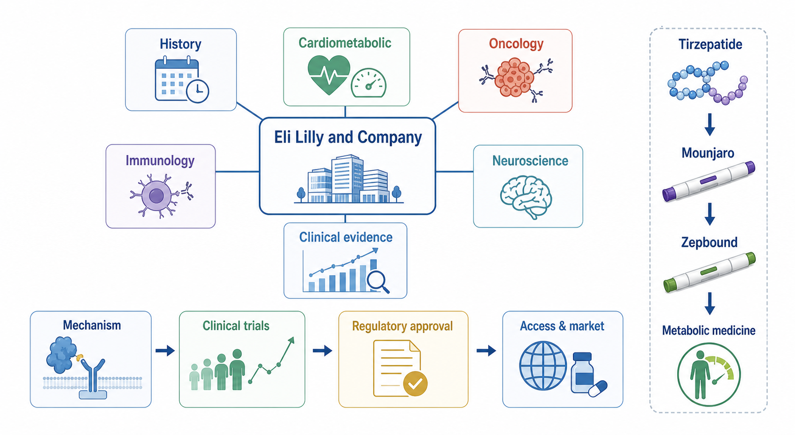
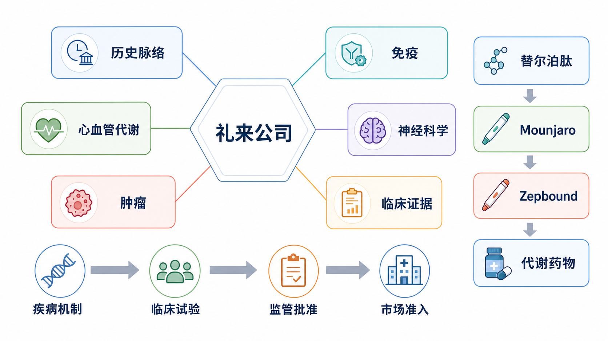

# 礼来





Eli Lilly and Company（礼来公司，常简称 Lilly / 礼来，中文语境中也常称礼来制药）是一家以人用处方药研发、生产和商业化为核心的跨国制药公司。它不属于本知识库中“试剂厂商”的主线，因为它的价值不是为实验室提供常规试剂，而是帮助理解 modern pharmaceutical company（现代制药公司）如何把疾病机制、药物发现、临床试验、监管审批、市场准入和商业化连接成完整链条。

> 本页仅用于个人学习和知识整理，不构成医学建议、投资建议或用药建议。药品适应症、安全性、批准状态和医保准入会随时间变化，实际判断必须以药品说明书、监管机构和医生建议为准。

## 基本信息

| 项目 | 内容 |
| --- | --- |
| 英文全称 | Eli Lilly and Company |
| 中文常用名 | 礼来公司、礼来制药、礼来 |
| 常用简称 | Lilly |
| 总部 | Indianapolis, Indiana, United States（美国印第安纳州印第安纳波利斯） |
| 创立时间 | 1876 年，创始人为 Colonel Eli Lilly |
| 公司类型 | 跨国创新药/处方药公司 |
| 学习关键词 | 糖尿病、肥胖、肠促胰岛素、肿瘤、免疫、神经科学、临床证据、市场准入 |

礼来 2025 年报显示，公司产品销售覆盖多个国家和地区，研发、制造、商业化和监管事务共同构成其全球制药体系。年报是研究礼来最重要的一手资料之一，因为它同时披露公司收入结构、重点产品、研发风险、专利风险、产能投入和监管风险。参考：[Lilly Annual Reports](https://investor.lilly.com/financial-information/annual-reports)

## 为什么值得单独学习

礼来的学习价值不只是“它很大”，而是它把很多现代药企的核心问题集中在同一家公司里：

| 学习角度 | 礼来的代表性                                             |
| ---- | -------------------------------------------------- |
| 药物历史 | 从早期标准化制药、胰岛素工业化到重组蛋白药物和现代多适应症创新药                   |
| 转化医学 | 从疾病机制和受体药理进入临床终点，再进入真实市场                           |
| 临床证据 | 代谢、肿瘤、免疫、神经系统药物都依赖大规模临床试验                          |
| 商业化  | 以 Mounjaro / Zepbound 为代表的代谢药物展示了适应症扩展、产能和市场准入的重要性 |
| 风险理解 | 药价、可及性、产能、长期安全性、专利和产品集中度同时存在                       |

如果把普通试剂厂商看作“实验供应链”，礼来这类药企更像“临床转化链条”。它从一个靶点或疾病机制开始，经过药物设计、动物和早期人体研究、随机对照临床试验、监管审评、医保和商业保险谈判，最后才真正进入患者可及的治疗选择。

## 历史脉络

礼来由 Colonel Eli Lilly 在 1876 年创立。早期制药行业仍处在从药房制剂向工业化标准化生产过渡的阶段，质量控制、批次一致性和药品标签规范还不像现代制药这样成熟。礼来的早期意义之一，是参与把药品生产从经验性配制推向更稳定的工业体系。

糖尿病药物是礼来历史中非常重要的一条线。胰岛素从发现到工业化生产，改变了 1 型糖尿病和部分严重 2 型糖尿病患者的生存方式。后来 recombinant human insulin（重组人胰岛素）和 insulin analog（胰岛素类似物）进一步把生物技术引入慢病治疗。这个历史背景解释了为什么礼来今天在 [2型糖尿病](../补充知识/2型糖尿病.md)、[肥胖](../补充知识/肥胖.md) 和 incretin biology（肠促胰岛素生物学）方向有深厚积累。

从研究底稿看，礼来历史里最值得记住两个节点：一是 Iletin（礼来早期胰岛素商品名）把胰岛素推向商业化供应；二是 Humulin（重组人胰岛素）把 recombinant DNA technology（重组 DNA 技术）正式带入人用治疗性蛋白药物的工业化时代。也就是说，礼来并不是突然因为肠促胰岛素药物变重要，而是长期围绕 diabetes care（糖尿病照护）、生物制药、给药装置、医生渠道和支付体系积累能力。

现代礼来的转折点，是从“糖尿病大公司”进一步变成“多治疗领域创新药公司”。它既保留代谢疾病优势，也扩展到 oncology（肿瘤）、immunology（免疫）和 neuroscience（神经科学）。这个转变让礼来不再只靠传统胰岛素业务，而是通过新机制药物、适应症扩展和临床证据持续更新公司结构。

## 核心治疗领域

| 治疗领域 | 礼来的典型关注点 | 代表性学习问题 |
| --- | --- | --- |
| Cardiometabolic diseases（心血管代谢疾病） | 糖尿病、肥胖、睡眠呼吸暂停、心血管肾脏代谢相关风险 | 一个受体药物如何扩展到多个疾病结局 |
| Oncology（肿瘤） | 乳腺癌、血液肿瘤、靶向治疗 | 分子靶点、耐药和联合治疗如何影响药物价值 |
| Immunology（免疫） | 银屑病、炎症性肠病、自身免疫疾病 | 炎症通路和抗体/小分子抑制剂如何选择 |
| Neuroscience（神经科学） | 阿尔茨海默病、偏头痛、精神神经疾病 | 临床终点、影像/生物标志物和长期疗效如何证明 |

这几个领域背后的共同逻辑是：药企不是按“单个药”来运行，而是按 disease area（疾病领域）和 platform（药物平台）来积累能力。一个成功产品通常会带来更多机制研究、适应症扩展、剂型优化、真实世界研究和后续分子。

### 机制平台线索

读礼来时，可以把产品先翻译成 mechanism platform（机制平台），再去看商品名。这样不会被产品列表淹没。

| 平台/机制 | 对应疾病逻辑 | 礼来学习价值 |
| --- | --- | --- |
| Glucagon-like peptide-1（胰高血糖素样肽-1，GLP-1）/ glucose-dependent insulinotropic polypeptide（葡萄糖依赖性促胰岛素多肽，GIP）incretin signaling（肠促胰岛素信号） | 血糖、食欲、体重、胃排空、代谢并发症 | 解释 Mounjaro/Zepbound 为什么能从糖尿病扩展到肥胖和部分肥胖相关疾病 |
| Insulin and insulin analogs（胰岛素与胰岛素类似物） | 胰岛素替代、餐时血糖控制、慢病给药体系 | 连接礼来百年糖尿病历史和现代生物制药制造能力 |
| Cyclin-dependent kinase 4/6（细胞周期蛋白依赖性激酶 4/6，CDK4/6）、Bruton's tyrosine kinase（布鲁顿酪氨酸激酶，BTK）、rearranged during transfection（RET 原癌基因/RET 受体酪氨酸激酶，RET）等靶向治疗 | 细胞周期、B 细胞信号、驱动基因融合/突变 | 说明礼来肿瘤业务更偏精准治疗和分子分型，而不是单纯化疗产品 |
| Interleukin-17A（白细胞介素-17A，IL-17A）、interleukin-23 p19 subunit（白细胞介素-23 p19 亚基，IL-23p19）、interleukin-13（白细胞介素-13，IL-13）、Janus kinase-signal transducer and activator of transcription pathway（JAK-STAT 通路） | 炎症通路、皮肤/肠道/关节免疫疾病 | 适合把免疫药物和细胞因子网络、JAK 抑制剂安全性联系起来 |
| Amyloid beta（淀粉样 β 蛋白）和 calcitonin gene-related peptide（降钙素基因相关肽，CGRP） | 阿尔茨海默病病理、偏头痛神经肽信号 | 用来学习神经系统药物为什么更依赖生物标志物、影像和长期安全性 |

## 代表性产品：只看战略意义

礼来的 current medicines 页面会随时间更新，正式查药品时应回到官方产品页和药品说明书核对。这里不做完整产品目录，只选能代表公司战略和药理逻辑的产品。参考：[Lilly Current Medicines](https://www.lilly.com/our-medicines/current-medicines)

| 商品名 | 通用名 | 领域 | 为什么值得学习 |
| --- | --- | --- | --- |
| Mounjaro | tirzepatide（替尔泊肽） | 2 型糖尿病 | [GLP-1](../补充知识/GLP-1.md) / [GIP](../补充知识/GIP.md) 双重受体激动剂，是礼来代谢药物平台的核心案例 |
| Zepbound | tirzepatide（替尔泊肽） | 肥胖、肥胖相关疾病 | 同一活性成分通过不同适应症和商品名进入慢病体重管理市场 |
| Trulicity | dulaglutide（度拉糖肽） | 2 型糖尿病 | GLP-1 受体激动剂时代的重要产品，代表礼来在 tirzepatide 前的代谢药物积累 |
| Humalog | insulin lispro（赖脯胰岛素） | 糖尿病 | 胰岛素类似物，连接礼来糖尿病历史和现代慢病治疗 |
| Verzenio | abemaciclib（阿贝西利） | 肿瘤 | CDK4/6 inhibitor（CDK4/6 抑制剂）案例，连接细胞周期和乳腺癌治疗 |
| Taltz | ixekizumab（依奇珠单抗） | 免疫 | IL-17A antibody（IL-17A 抗体），连接炎症通路和银屑病/关节炎 |
| Olumiant | baricitinib（巴瑞替尼） | 免疫 | JAK inhibitor（JAK 抑制剂），可连接 [JAK-STAT通路](../补充知识/JAK-STAT通路.md) |
| Kisunla | donanemab（多奈单抗） | 神经科学 | 阿尔茨海默病抗淀粉样蛋白抗体，适合学习神经退行性疾病临床证据争议 |

## Tirzepatide：从机制到商业化

[替尔泊肽](../补充知识/替尔泊肽.md) 是理解现代礼来的入口。它是一种 GIP receptor and GLP-1 receptor agonist（GIP 受体和 GLP-1 受体激动剂），也常被称为 dual incretin agonist（双重肠促胰岛素受体激动剂）。Mounjaro 用于 2 型糖尿病治疗，Zepbound 用于肥胖和相关适应症，其背后是同一活性成分在不同临床场景中的商业化和监管路径。

从机制上看，GLP-1 和 GIP 都属于 incretin hormone（肠促胰岛素激素）系统。它们会影响胰岛素分泌、胰高血糖素、胃排空、食欲和体重调节等过程。药企真正需要证明的不是“机制看起来合理”，而是药物在随机对照临床试验中能否改善 glycated hemoglobin A1c（糖化血红蛋白 A1c，HbA1c）、体重、心血管代谢风险或其他临床终点，同时安全性可以被接受。

U.S. Food and Drug Administration（美国食品药品监督管理局，FDA）在 2024 年 12 月批准 Zepbound 用于合并肥胖的 moderate-to-severe obstructive sleep apnea（中重度阻塞性睡眠呼吸暂停，OSA）成人患者，并说明其作用与体重下降相关。这个例子很典型：代谢药物不只是“减重药”，还可能通过体重、炎症、代谢和器官功能改变进入更多疾病场景。参考：[FDA Approves First Medication for Obstructive Sleep Apnea](https://www.fda.gov/news-events/press-announcements/fda-approves-first-medication-obstructive-sleep-apnea)

这也是礼来当前最需要警惕的地方：当一个药物平台过于成功，公司收入、投资者预期、产能建设、监管压力和公众讨论都会集中到少数产品上。好处是增长清晰，风险是产品集中度和长期安全性问题会被放大。

## 研发体系与 pipeline

Pipeline（研发管线）是药企最值得长期追踪的资料之一。礼来官网的 clinical development pipeline 页面会按治疗领域和临床阶段更新候选药物。参考：[Lilly Clinical Development Pipeline](https://www.lilly.com/discovery/clinical-development-pipeline)

读礼来的 pipeline 时，不要只看“有多少药”，而要看这些药之间是否形成平台：

| 读法 | 具体问题 |
| --- | --- |
| 靶点连续性 | 后续药物是否围绕已有机制继续优化，例如 incretin、JAK、IL-17、amyloid beta 等 |
| 适应症扩展 | 同一分子是否从一个疾病扩展到相关疾病 |
| 临床阶段 | 早期管线多不等于成功，III 期和已提交监管的项目权重更高 |
| 终点质量 | 终点是替代指标、症状改善，还是硬临床结局 |
| 商业互补 | 新药是补强现有领域，还是打开全新领域 |

一个成熟药企的 pipeline 不是随机药物列表，而是公司对疾病领域、技术平台、商业机会和风险分散的综合表达。

## 临床证据与监管路径

药企笔记最容易写成“谁家有什么药”，但真正值得学习的是证据链：

```text
疾病机制 -> 药物靶点 -> 早期临床安全性 -> 有效性信号 -> III期随机对照试验 -> 监管批准 -> 标签适应症 -> 真实世界使用
```

| 环节 | 需要看的资料 | 礼来案例 |
| --- | --- | --- |
| 疾病机制 | 综述、基础研究、靶点生物学 | GLP-1/GIP 与代谢，amyloid beta 与阿尔茨海默病 |
| 临床试验 | [ClinicalTrials.gov](../补充知识/ClinicalTrials.gov.md)、论文、公司公告 | SURPASS、SURMOUNT、TRAILBLAZER-ALZ |
| 监管批准 | [FDA](../补充知识/FDA.md)、European Medicines Agency（欧洲药品管理局，[EMA](../补充知识/EMA.md)）、National Medical Products Administration（国家药品监督管理局，[NMPA](../补充知识/NMPA.md)） | Mounjaro、Zepbound、Kisunla 等标签 |
| 药品标签 | FDA label、说明书、禁忌和警告 | 适应症、剂量、禁忌、不良反应 |
| 市场准入 | 年报、医保、保险、价格政策 | 肥胖药、糖尿病药和阿尔茨海默病药物可及性 |

以 tirzepatide 为例，SURPASS 系列更偏 2 型糖尿病，SURMOUNT 系列更偏肥胖和体重管理。正式写机制或临床笔记时，应回到原始论文和试验注册信息，而不是只读新闻稿。参考：New England Journal of Medicine（新英格兰医学杂志，NEJM）上的 SURPASS-2 论文 [NEJM](https://www.nejm.org/doi/full/10.1056/NEJMoa2107519)；SURMOUNT-1 论文 [NEJM](https://www.nejm.org/doi/full/10.1056/NEJMoa2206038)

### 关键证据怎么读

研究报告里最有价值的不是“某药有效”这个结论，而是它把 trial population（试验人群）、endpoint（终点）、effect size（效应量）和 label safety（标签安全性）连在一起。下面这些例子适合作为以后读药品说明书和临床论文的入口：

| 例子 | 证据线索 | 读的时候注意什么 |
| --- | --- | --- |
| Mounjaro / SURPASS-2 | 1,879 名二甲双胍控制不足的 2 型糖尿病成人，比较 tirzepatide 5/10/15 mg 与 semaglutide 1 mg，每周一次、40 周 | HbA1c 下降幅度只是一个入口，还要看体重、胃肠道不良反应、低血糖背景用药和试验人群是否适合外推 |
| Zepbound / 体重管理 | 标签研究中，非糖尿病肥胖/超重人群 Week 72 平均体重变化约为 -15.0%、-19.5%、-20.9%，安慰剂约 -3.1%；合并 2 型糖尿病人群下降幅度较低 | 不能把平均减重直接当作个人预期；合并糖尿病、停药反弹、长期维持和支付可及性都很关键 |
| Zepbound / OSA | FDA 2024 年批准依据包括两项 52 周 randomized, double-blind, placebo-controlled study（随机双盲安慰剂对照研究），469 名合并肥胖的中重度 OSA 成人 | 主要终点是 apnea-hypopnea index（呼吸暂停低通气指数，AHI），疗效与体重下降关系密切 |
| Kisunla / 阿尔茨海默病 | 早期症状性、淀粉样蛋白阳性患者；终点包括 integrated Alzheimer's Disease Rating Scale（综合阿尔茨海默病评定量表，iADRS）、Clinical Dementia Rating-Sum of Boxes（临床痴呆评定量表箱式总分，CDR-SB）、amyloid positron emission tomography（淀粉样蛋白正电子发射断层成像，amyloid PET）等 | 神经退行性疾病不能只看统计学显著，还要看绝对获益、amyloid-related imaging abnormalities（淀粉样蛋白相关影像异常，ARIA）风险、magnetic resonance imaging（磁共振成像，MRI）监测负担和患者筛选 |
| Verzenio / 乳腺癌 | monarchE、MONARCH 3 等试验连接 hormone receptor-positive（激素受体阳性，HR-positive）/ human epidermal growth factor receptor 2-negative（人表皮生长因子受体 2 阴性，HER2-negative）乳腺癌、CDK4/6 抑制和内分泌治疗 | 读肿瘤药时要看分期、分子分型、治疗线数、联合治疗和终点是 invasive disease-free survival（无侵袭性疾病生存期，IDFS）、progression-free survival（无进展生存期，PFS）还是 overall survival（总生存期，OS） |

### 标签安全性怎么读

药企页面不适合写成用药指南，但必须提醒自己：药物价值等于疗效、风险、监测成本和可及性的组合。

| 药物/类别 | 标签阅读重点 |
| --- | --- |
| Tirzepatide 类产品 | 甲状腺 C 细胞肿瘤 boxed warning（黑框警告），以及 medullary thyroid carcinoma（甲状腺髓样癌，MTC）/ multiple endocrine neoplasia syndrome type 2（2 型多发性内分泌腺瘤综合征，MEN2）相关禁忌；胃肠道反应；胰腺炎、胆囊疾病、脱水相关肾损伤；与胰岛素或促泌剂合用时低血糖风险；麻醉/深镇静相关误吸风险 |
| Kisunla | ARIA 黑框警告；ARIA-E（脑水肿型 ARIA）/ ARIA-H（脑微出血或含铁血黄素沉积型 ARIA）；apolipoprotein E ε4（载脂蛋白 E ε4，ApoE ε4）风险分层；MRI 监测；输注反应和出血风险 |
| Verzenio | 腹泻、中性粒细胞减少、间质性肺病/肺炎、肝毒性、静脉血栓栓塞和胚胎-胎儿毒性 |
| Olumiant / JAK 抑制剂 | 感染、血栓、心血管事件、恶性肿瘤等类别风险需要按具体标签和适应症阅读，不能只按“抗炎药”理解 |

## 中国相关性

中国部分需要单独核对，因为同一药物在美国、欧盟和中国的批准时间、适应症、说明书和支付状态可能不同。礼来相关中文信息应优先看礼来中国官网、NMPA 批准信息、药品说明书和国家医保目录，而不是只参考美国标签。

写中国相关性时建议分四层：

| 层级    | 需要确认                      |
| ----- | ------------------------- |
| 公司层面  | 礼来中国主体、业务范围、研发/医学事务/商业团队  |
| 产品层面  | 药品是否在中国获批，中文通用名和商品名是什么    |
| 适应症层面 | 中国标签是否与 FDA/EMA 标签一致      |
| 可及性层面 | 是否进入医保、是否有适应症限制、真实购买和处方门槛 |

这个部分不建议凭二手新闻直接下结论。正式补写中国药物状态时，应逐项查询 NMPA、药品说明书和医保目录。

## 2025 年报里的商业结构

研究报告汇总的 Lilly 2025 Form 10-K（美国上市公司年度报告）信息显示，礼来当下最重要的商业结构是 cardiometabolic health（心血管代谢健康）成为收入和增长中心，尤其是 Mounjaro 与 Zepbound。这个信息很适合写进笔记，但具体数字后续引用时仍应回到 Lilly 年报原表复核。参考：[Lilly Annual Reports](https://investor.lilly.com/financial-information/annual-reports)

| 项目 | report 汇总口径 | 为什么重要 |
| --- | --- | --- |
| 2025 total revenue（总收入） | 约 651.79 亿美元 | 说明礼来已经是超大型创新药公司，不能只按单个药物理解 |
| Mounjaro 2025 revenue | 约 229.65 亿美元 | 代谢平台的核心收入来源之一 |
| Zepbound 2025 revenue | 约 135.42 亿美元 | 肥胖和相关疾病适应症扩展带来的新增长核心 |
| Verzenio 2025 revenue | 约 57.23 亿美元 | 说明礼来仍需要肿瘤等 specialty medicine（专科药物）分散风险 |
| Mounjaro + Zepbound 占比 | 约占总收入 56% | 增长非常清晰，但也意味着产品集中度风险很高 |
| 六个主要产品/合作收入占比 | 约占总收入 82% | 年报阅读时必须看产品集中度、专利、供应和准入风险 |

这个部分的学习重点不是“礼来赚了多少钱”，而是理解药企的结构性风险：一个平台越成功，公司越容易把产能、资本开支、投资者预期、支付谈判和监管关注都集中到这个平台上。Mounjaro/Zepbound 是增长引擎，也是压力源。

## 竞争格局

礼来必须放进竞争格局里看，尤其是 GLP-1/GIP 和代谢疾病领域。

| 公司 | 与礼来的关键关系 |
| --- | --- |
| [诺和诺德](诺和诺德.md) | GLP-1 和肥胖药物最直接竞争者，Ozempic/Wegovy 与 Mounjaro/Zepbound 构成核心对照 |
| [赛诺菲](赛诺菲.md) | 胰岛素和糖尿病传统竞争者，也有免疫和疫苗等业务 |
| [罗氏](罗氏.md) | 肿瘤和诊断强势公司，可用于比较“药物 + 诊断”生态 |
| [默沙东](默沙东.md) | 肿瘤免疫和疫苗强势公司，可用于比较 Keytruda 式平台产品 |
| [辉瑞](辉瑞.md) | 大型综合药企，可用于比较并购、疫苗、抗感染和管线重建 |
| [阿斯利康](阿斯利康.md) | 肿瘤、心肾代谢和呼吸领域强势，可用于比较多治疗领域布局 |

其中诺和诺德是礼来当前最重要的对照对象之一。二者都不只是“减重药公司”，而是在慢性代谢疾病、注射制剂、患者长期用药、供应链扩张和支付体系中竞争。

## 风险与争议

| 风险 | 为什么重要 | 阅读资料 |
| --- | --- | --- |
| 产品集中度 | Mounjaro/Zepbound 占比越高，礼来越容易受到少数产品安全性、支付、竞争和供应波动影响 | 年报收入结构、risk factors（风险因素） |
| 产能与供应 | GLP-1/GIP 药物需求巨大，peptide drug substance（多肽原料药）、注射笔、灌装、冷链和质量检查都可能成为限制 | 年报、供应公告、监管短缺信息 |
| 药价与可及性 | 药物疗效好不等于患者可获得，商业保险、pharmacy benefit manager（药品福利管理机构，PBM）、医保和政府价格谈判会决定真实使用 | 年报、医保政策、患者援助项目、PBM formulary（PBM 药品目录） |
| 专利、仿制和非法复方 | 成熟产品会遇到 loss of exclusivity（独占期丧失），高需求 incretin 药物还会遇到假药、非法复方和在线灰色渠道 | 年报风险因素、FDA 警告、专利数据库 |
| 长期安全性 | 慢病药常需长期使用，真实世界风险可能晚于上市出现 | FDA label、真实世界研究、药物警戒 |
| 监管和标签变化 | 适应症扩展能扩大市场，安全警告也能改变使用边界 | FDA/EMA/NMPA、药品说明书修订记录 |
| 中国和国际准入差异 | 同一药物在不同国家的批准适应症、价格和报销条件可能完全不同 | NMPA、国家医保目录、EMA EPAR、当地说明书 |

FDA 关于 Zepbound 的 OSA 批准页面同时列出常见不良反应和重要警告，这提醒我们：评价药物时不能只看疗效终点，也要看禁忌、警告、真实世界使用和患者筛选。参考：[FDA Zepbound OSA approval](https://www.fda.gov/news-events/press-announcements/fda-approves-first-medication-obstructive-sleep-apnea)

研究报告里特别值得保留的一点是 manufacturing capacity（制造产能）风险。对于小分子片剂，产能压力通常更像“工厂和原料供应问题”；对于 GLP-1/GIP 注射药，产能还涉及多肽生产、装置、灌装、冷链、批次放行和全球监管检查。只要其中一段跟不上，临床需求和商业收入都会受到影响。

## 如何阅读一家药企

礼来可以作为以后阅读药企的案例。更重要的是形成阅读顺序：

| 资料 | 看什么 | 为什么 |
| --- | --- | --- |
| 年报 / 10-K | 先看公司怎么定义业务，再看产品收入、增长解释、风险因素、专利、诉讼、制造和资本开支 | 看公司真实压力，不只看宣传 |
| Current medicines | 当前上市产品、商品名、通用名、适应症入口 | 建立产品地图 |
| Pipeline | 区分 new molecular entity（新分子实体，NME）和 indication extension（适应症扩展），按机制、疾病领域和临床阶段阅读 | 判断未来增长和失败风险 |
| 药品标签 | 按适应症、人群、剂量、黑框警告、禁忌、不良反应、临床研究、储存供应顺序读 | 用药边界和安全性最权威 |
| 临床试验注册和论文 | 看人群、随机化、对照、终点、样本量、效应量、随访时间和局限 | 判断证据质量 |
| 竞争公司 | 对比诺和诺德、罗氏、默沙东、阿斯利康、辉瑞等公司在机制、管线、产能、支付和地理市场上的差异 | 避免把单家公司孤立理解 |

读药企时，一个好问题是：这家公司到底靠什么形成“可重复的创新能力”？是某个单品爆发，还是在某个疾病领域建立了机制、临床、监管、制造和商业化的连续优势？礼来的答案目前明显偏向代谢疾病平台，但它也在用肿瘤、免疫和神经科学分散长期风险。

## 小结

礼来是一家适合用来学习“药企闭环”的公司：它有足够长的制药历史，也有非常现代的 GLP-1/GIP 代谢药物平台；它既能展示机制如何进入临床，也能展示临床证据如何被监管、商业化和市场准入重新塑形。写礼来时不要陷入产品罗列，应该把重点放在疾病机制、临床证据、监管标签、商业化和风险之间的关系。

## 参考来源

- Lilly. [Annual Reports](https://investor.lilly.com/financial-information/annual-reports)
- Lilly. [Current Medicines](https://www.lilly.com/our-medicines/current-medicines)
- Lilly. [Clinical Development Pipeline](https://www.lilly.com/discovery/clinical-development-pipeline)
- Lilly. [Mounjaro Prescribing Information](https://uspl.lilly.com/mounjaro/mounjaro.html?s=pi)
- Lilly. [Zepbound Prescribing Information](https://uspl.lilly.com/zepbound/zepbound.html?s=pi)
- Lilly. [Kisunla Prescribing Information](https://uspl.lilly.com/kisunla/kisunla.html?s=pi)
- Lilly. [Verzenio Prescribing Information](https://uspl.lilly.com/verzenio/verzenio.html?s=pi)
- FDA. [Drugs@FDA: FDA-Approved Drugs](https://www.accessdata.fda.gov/scripts/cder/daf/)
- FDA. [FDA Approves First Medication for Obstructive Sleep Apnea](https://www.fda.gov/news-events/press-announcements/fda-approves-first-medication-obstructive-sleep-apnea)
- ClinicalTrials.gov. [ClinicalTrials.gov](https://clinicaltrials.gov/)
- Frías JP et al. [Tirzepatide versus Semaglutide Once Weekly in Patients with Type 2 Diabetes](https://www.nejm.org/doi/full/10.1056/NEJMoa2107519). New England Journal of Medicine, 2021.
- Jastreboff AM et al. [Tirzepatide Once Weekly for the Treatment of Obesity](https://www.nejm.org/doi/full/10.1056/NEJMoa2206038). New England Journal of Medicine, 2022.
