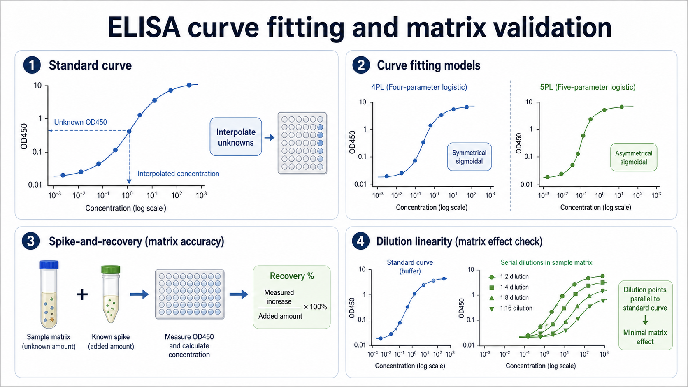

# 4PL曲线

4PL curve（four-parameter logistic curve，四参数逻辑曲线）是一种常用于 ELISA、细胞因子检测和剂量反应实验的 S 形非线性拟合模型，用四个参数描述下平台、上平台、曲线中点和斜率。



图：ELISA 曲线拟合与基质验证。4PL 常用于对称 S 形标准曲线，5PL 则适合明显不对称的曲线。本图由 Image2 / image-generation model 生成，用于个人学习笔记示意。

## 一句话理解

4PL 是 ELISA 最常用的“标准曲线语言”之一：它承认低端有背景平台，高端会饱和，中间才是最适合定量的区域。

在 [标准曲线](标准曲线.md) 中，如果响应呈典型 S 形，并且低端和高端相对对称，4PL 通常比线性拟合更合理。GraphPad Prism 的 variable slope dose-response model 就是典型四参数剂量反应模型。参考：[GraphPad Prism dose-response model](https://www.graphpad.com/guides/prism/latest/curve-fitting/reg_dr_stim_variable.htm)。

## 四个参数代表什么

不同软件的命名不同，但核心类似：

| 参数 | 常见含义 | 实验解释 |
| --- | --- | --- |
| Bottom | 下平台 | 背景或最低响应 |
| Top | 上平台 | 饱和响应 |
| EC50 / IC50 / inflection point | 曲线中点 | 响应变化最快的位置 |
| Hill slope | 斜率 | 曲线陡峭程度 |

对 ELISA 来说，未知样本最好落在曲线中段，而不是贴近上下平台。靠近平台时，OD 小变化会换算成很大的浓度不确定性。

## 4PL vs 线性拟合

| 项目 | 线性拟合 | 4PL |
| --- | --- | --- |
| 假设 | 信号和浓度成直线关系 | 信号随浓度呈 S 形 |
| 适用范围 | 很窄的线性区间 | 完整 ELISA 标准曲线 |
| 低端背景 | 处理较差 | 有下平台 |
| 高端饱和 | 处理较差 | 有上平台 |
| 风险 | 过度外推 | 需要足够标准点 |

如果只取标准曲线中间一小段，线性拟合可能可用；但完整 ELISA 曲线通常更适合 4PL 或 [5PL曲线](5PL曲线.md)。

## 何时优先用 4PL

适合 4PL 的情况：

- 标准点覆盖低端、中段和高端。
- 曲线低端和高端平台清楚。
- 曲线左右相对对称。
- 软件回算浓度可接受。
- 5PL 并没有明显改善残差或回算。

不适合 4PL 的情况：

- 高端或低端明显不对称。
- 标准点数量太少。
- 高端点受 [Hook效应](Hook效应.md) 影响下降。
- 背景太高导致下平台不稳定。

## 权重设置

ELISA 标准曲线常有 heteroscedasticity（异方差）：高 OD 点和低 OD 点的绝对误差不同。如果不加权，高浓度点可能主导拟合，低浓度区误差被忽略。

常见软件会提供 unweighted、1/Y、1/Y²、1/X、1/X² 等权重方式。是否加权要看低端回算和质控表现，而不是只看 R²。

## 常见错误与 troubleshooting

| 异常 | 可能原因 | 调整方向 |
| --- | --- | --- |
| 低端回算差 | 背景高、低浓度点不稳定、权重不合适 | 优化背景，尝试合适权重 |
| 高端点偏离 | 饱和、显色过久或 Hook effect | 稀释最高标准品，缩短显色 |
| 拟合曲线穿不过标准点 | 配点错误或模型不适合 | 检查标准品稀释和板图 |
| 参数异常 | 标准点太少或范围不完整 | 增加标准点，覆盖平台 |
| 样本落在平台区 | 曲线斜率低，浓度不可靠 | 稀释样本进入中段 |

## 记录模板

中文记录：

```text
检测项目：
标准曲线模型：4PL
软件：
权重方式：
标准点数量：
最高标准品：
最低标准品：
下平台：
上平台：
曲线中点：
斜率：
回算标准是否通过：
异常标准点：
备注：
```

English record:

```text
Target analyte:
Curve model: 4PL
Software:
Weighting:
Number of standards:
Top standard:
Lowest standard:
Bottom:
Top:
Inflection point:
Slope:
Back-calculated standards accepted: yes / no
Abnormal standard points:
Notes:
```

## 小结

4PL 曲线适合多数典型 ELISA 标准曲线，但它不是自动正确。真正要看的是低端、高端和样本落点是否都在模型能可靠解释的区域。

## 参考来源

- [GraphPad Prism dose-response model](https://www.graphpad.com/guides/prism/latest/curve-fitting/reg_dr_stim_variable.htm)
- [ICH M10 Bioanalytical Method Validation and Study Sample Analysis](https://database.ich.org/sites/default/files/M10_Guideline_Step4_2022_0524.pdf)
- [ICH Q2(R2) Validation of Analytical Procedures](https://database.ich.org/sites/default/files/ICH_Q2%28R2%29_Guideline_2023_1130.pdf)
