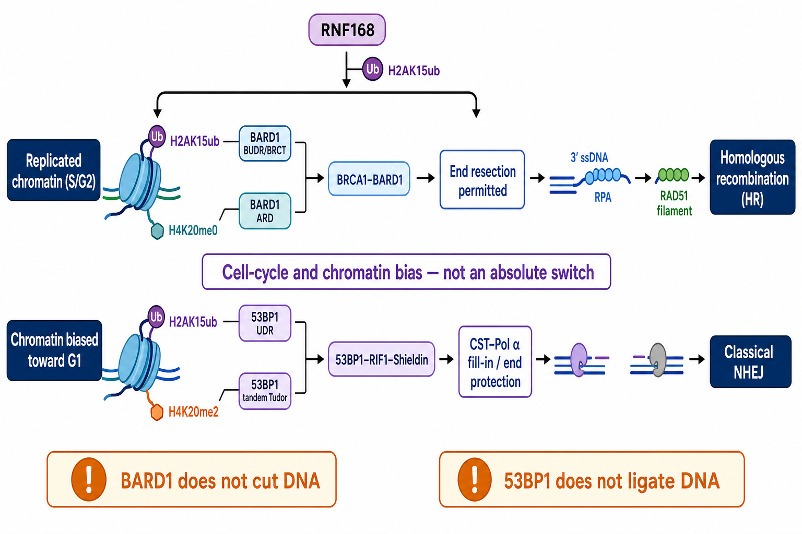

# 53BP1

53BP1（tumor protein p53-binding protein 1，肿瘤蛋白 p53 结合蛋白 1；基因名 `TP53BP1`）是 DNA double-strand break（DSB，DNA 双链断裂）应答中的大型染色质支架蛋白。它读取断裂邻近核小体标记，募集 [RIF1](RIF1.md)–[Shieldin complex（Shieldin 屏蔽蛋白复合物）](Shieldin复合物.md)等效应因子，限制 [DNA 末端切除](DNA末端切除.md)并影响 [homologous recombination（HR，同源重组）](同源重组.md)与 [classical non-homologous end joining（c-NHEJ，经典非同源末端连接）](NHEJ.md)之间的路径选择。

53BP1 不是一种直接连接 DNA 断端的连接酶。它更像给断端组织保护与加工环境的“护送支架”；真正执行 NHEJ 识别、加工、聚合和连接的是 Ku、DNA-PKcs、Artemis、XRCC4–LIG4 等下游机器。

图：[RNF168](RNF168.md) 产生 H2AK15ub 损伤标记；53BP1 以 UDR 读取 H2AK15ub、以 tandem Tudor domain（串联 Tudor 结构域）读取 [H4K20me2](组蛋白H4K20甲基化.md)，随后组织 RIF1–Shieldin–CTC1–STN1–TEN1（CST）/DNA polymerase α（Pol α，DNA 聚合酶 α）轴以保护或回填断端，偏向 c-NHEJ。复制后的 H4K20me0 则更利于 BARD1–BRCA1 进入 HR。这里表达的是细胞周期与染色质偏置，而非“G1 只能 NHEJ、S/G2 只能 HR”的绝对开关。本图由 Image2 / image-generation model 生成，用于个人学习示意。

## 名字容易造成的误解

53BP1 最初因能够结合 p53 而得名，但在现代 DNA damage response（DDR，DNA 损伤应答）语境中，其最核心、最常用的实验身份是 DSB 染色质支架和末端保护调控因子。

因此不应把以下概念混为一谈：

- `53BP1` 不是 `p53`，两者由不同基因编码。
- 53BP1 focus（53BP1 焦点）主要反映损伤染色质募集，不等于 p53 转录程序被激活。
- TP53 突变并不自动意味着 53BP1 不能形成焦点；TP53BP1 异常也不等价于整个 p53 通路缺失。

## 关键结构与功能区域

| 53BP1 区域 | 主要作用 | 实验解释 |
| --- | --- | --- |
| N-terminal S/TQ sites（N 端丝/苏氨酸-谷氨酰胺位点） | 经 ATM 磷酸化后募集 RIF1、PTIP 等效应因子 | 突变可保留可见焦点，却丢失末端保护功能 |
| oligomerization domain（寡聚化结构域） | 支持 53BP1 在损伤染色质形成高亲和、多价复合物 | 片段焦点不能完全代表全长蛋白功能 |
| tandem Tudor domain（串联 Tudor 结构域） | 识别 H4K20me2 | 破坏该界面通常降低核小体结合和焦点形成 |
| UDR motif（ubiquitination-dependent recruitment motif，泛素化依赖募集基序） | 识别 H2AK15ub | UDR 与 Tudor 需要协同读取核小体标记 |
| C-terminal BRCT domains（C 端 BRCT 结构域） | 参与蛋白相互作用和特定损伤应答支路 | 并非解释所有 53BP1 焦点与末端保护功能的单一开关 |

53BP1 的“出现”和“工作”是两层问题：Tudor–UDR 模块让蛋白到达损伤染色质，ATM-dependent phosphorylation（ATM 依赖磷酸化）再招募 RIF1、PTIP、Shieldin 等效应网络。

## 双重染色质读取

### H4K20me2：基础染色质标记

53BP1 tandem Tudor domain 对 histone H4 lysine 20 dimethylation（H4K20me2，组蛋白 H4 第 20 位赖氨酸二甲基化）具有选择性。结构研究显示，该结合口袋更适配二甲基赖氨酸，而排斥三甲基状态。参考：[Botuyan et al., Cell, 2006](https://doi.org/10.1016/j.cell.2006.10.043)。

H4K20me2 并不是损伤发生后才新产生的专属标记。它广泛存在于染色质中，DNA 复制会暂时稀释新生染色质上的该状态；因此 53BP1 还需要损伤诱导的第二个信号来获得空间特异性。

### H2AK15ub：损伤位置标记

RNF168 在断裂邻近核小体上产生 H2AK15ub。53BP1 的 UDR 与 H2AK15ub 周边核小体表面结合，并与 Tudor–H4K20me2 接触协同，使 53BP1 在损伤染色质稳定积累。参考：[Fradet-Turcotte et al., Nature, 2013](https://doi.org/10.1038/nature12318)；[Wilson et al., Nature, 2016](https://doi.org/10.1038/nature18951)。

H2AK15ub 也可被 [BARD1](BARD1.md) 读取。真正影响通路偏好的不是单个泛素标记，而是 H2AK15ub、H4K20 状态、细胞周期、ATM 磷酸化和竞争/协同因子共同形成的上下文。

## 53BP1–RIF1–Shieldin 如何限制切除

### 先建立保护屏障

ATM（ataxia-telangiectasia mutated，毛细血管扩张性共济失调突变蛋白）磷酸化 53BP1 N 端位点，促进 RIF1 和其他效应因子募集。RIF1 是 53BP1 抑制 5′ 端切除的重要执行层，能够限制 CtIP、BLM、EXO1 等切除网络接近或扩展。参考：[Zimmermann et al., Science, 2013](https://doi.org/10.1126/science.1231573)；[Escribano-Díaz et al., Molecular Cell, 2013](https://doi.org/10.1016/j.molcel.2013.01.001)。

### 再处理已经暴露的单链末端

Shieldin 由 REV7、SHLD1、SHLD2、SHLD3 组成，可结合 single-stranded DNA（ssDNA，单链 DNA）并限制进一步切除。它还能募集 CTC1–STN1–TEN1（CST）复合物和 DNA polymerase α-primase（Pol α–primase，DNA 聚合酶 α–引物酶）进行局部 fill-in synthesis（回填合成），把部分 3′ 突出端重新变成更适合末端连接的底物。参考：[Ghezraoui et al., Nature, 2018](https://doi.org/10.1038/s41586-018-0362-1)；[Mirman et al., Nature, 2018](https://doi.org/10.1038/s41586-018-0324-7)。

所以“53BP1 阻止切除”至少包含两层：

- **pre-resection block（切除前阻断）**：降低核酸酶系统启动或扩展切除的机会。
- **post-resection restraint（切除后约束）**：在短 ssDNA 已经形成后，通过 Shieldin/CST–Pol α 结合、保护或回填末端，并限制 PALB2–RAD51 装载。

53BP1 自己既不降解 DNA，也不合成 DNA；它通过效应网络改变断端可被怎样加工。

## 路径选择不是简单的二选一

| 条件 | 53BP1 轴常见影响 | 不能简化成 |
| --- | --- | --- |
| G0/G1、缺少姐妹染色单体 | 保护断端，支持 c-NHEJ | G1 所有断裂都必须由 53BP1 修复 |
| S/G2、复制后染色质 | BRCA1–BARD1 与 CtIP 抑制/重排 53BP1 效应，允许切除和 HR | S/G2 完全没有 53BP1 焦点 |
| 复杂、异染色质或特定断端 | 53BP1 可限制过度切除并影响加工时序 | 53BP1 永远是“有害的 HR 抑制物” |
| 免疫球蛋白 class switch recombination（CSR，类别转换重组） | 促进远端断端连接和抗体类别转换 | 所有 53BP1 依赖连接都是无意义的错误修复 |
| 失去端粒帽的染色体末端 | 促进被识别为 DSB 的端粒发生 NHEJ | 正常端粒也应被 53BP1 连接 |

修复路径还受断端化学结构、染色质位置、转录状态、核酸酶、模板可用性和损伤持续时间影响。53BP1 是重要偏置器，不是独立决定全部结果的总开关。

## BRCA1 缺陷、PARP 抑制剂与耐药

在 BRCA1 缺陷细胞中，53BP1 轴可过度阻止切除，使 [PALB2](PALB2.md)–[BRCA2](BRCA2.md)–[RAD51](RAD51.md) 难以进入断裂。53BP1 缺失可恢复部分切除和 HR，并降低对 [PARP 抑制剂](PARP抑制剂.md) 的敏感性。经典遗传证据见 [Bunting et al., Cell, 2010](https://doi.org/10.1016/j.cell.2010.03.012)。

但“敲掉 53BP1 就修复 BRCA1”并不成立：

- 恢复程度取决于 BRCA1 变异是否还保留 PALB2 结合或其他后期功能。
- 切除恢复不等于 RAD51 装载、链侵入、修复准确性和复制叉保护全部恢复。
- RIF1/Shieldin/PTIP 的不同支路可分别造成切除前或切除后阻断。
- 长期 53BP1 缺失可能改变染色体重排、免疫重组和断端加工谱。

53BP1 具有切除前与切除后两层 HR 限制的证据见 [Callen et al., Molecular Cell, 2020](https://doi.org/10.1016/j.molcel.2019.09.024)。这也解释了为什么单看 RPA focus 可能高估 HR 恢复。

## 与 CRISPR 基因编辑的关系

在某些 [CRISPR-Cas9](CRISPR-Cas9.md) 编辑体系中，短暂抑制 53BP1 可提高 homology-directed repair（HDR，同源定向修复）相对于 end joining 的比例。参考：[Canny et al., Nature Biotechnology, 2018](https://doi.org/10.1038/nbt.4021)。

这是一种体系依赖的策略，而不是通用增益按钮：

- 需要同时考虑供体形式、细胞周期、切口结构、细胞类型和编辑位点。
- HDR 百分比提高不代表总编辑细胞数、精确产物率或细胞存活一定提高。
- 应测量 indel（插入缺失）、大片段缺失、易位和 donor integration（供体整合）全谱，而不只检测目标阳性率。
- 长期或完全缺失 53BP1 的风险高于短暂、局部的编辑期调控。

## 53BP1 与 BARD1 的核心对比

| 比较轴 | 53BP1 | BARD1 |
| --- | --- | --- |
| 共同损伤标记 | UDR 读取 H2AK15ub | BUDR 读取 H2AK15ub |
| H4K20 偏好 | tandem Tudor 读取 H4K20me2 | ARD 读取 H4K20me0 |
| 主要细胞周期偏向 | G0/G1 的末端保护更突出 | 复制后 S/G2 的 HR 环境更突出 |
| 下游轴 | RIF1–Shieldin–CST/Pol α | BRCA1–PALB2–BRCA2–RAD51 |
| 典型结果 | 限制切除、支持可连接断端 | 许可切除、支持 HR |
| 不是 | DNA 连接酶 | DNA 核酸酶 |

## 实验中如何观察 53BP1

| 问题 | 推荐读数 | 能回答什么 | 关键限制 |
| --- | --- | --- | --- |
| 蛋白是否存在 | [Western blot](<../../用(实验流程内容篇)/Western blot.md>) | 全长/截短与总量 | 人 53BP1 约 214 kDa；高分子量蛋白对转膜和降解敏感 |
| 是否募集到损伤 | [免疫荧光](<../../用(实验流程内容篇)/免疫荧光.md>)、ionizing-radiation-induced foci（IRIF，电离辐射诱导焦点） | 损伤染色质募集 | 焦点存在不等于 RIF1/Shieldin 功能正常 |
| 染色质读取是否正常 | Tudor/UDR 突变、修饰核小体结合 | H4K20me2/H2AK15ub 识别 | 过表达片段可因寡聚化产生非生理焦点 |
| 效应轴是否启动 | RIF1、Shieldin、PTIP 共定位或 [免疫共沉淀](<../../用(实验流程内容篇)/免疫共沉淀.md>) | 磷酸化依赖的下游募集 | 共定位不能证明末端保护实际发生 |
| 切除是否被限制 | RPA focus、native [BrdU](<../../材(实验耗材工具篇)/BrdU.md>) ssDNA、[END-seq（DNA 断端测序）](<../../用(实验流程内容篇)/END-seq.md>) | ssDNA 形成比例与切除长度 | RPA 也来自复制压力；需控制细胞周期 |
| HR/NHEJ 结果如何 | DR-GFP、EJ5-GFP 等 [报告基因实验](<../../用(实验流程内容篇)/报告基因实验.md>) | 指定体系的通路输出 | reporter 不能覆盖全基因组重排与复杂断端 |
| 编辑结果是否改变 | amplicon/long-read [测序](<../../用(实验流程内容篇)/测序.md>) | 精确 HDR、indel、缺失和易位 | 只看目标阳性克隆会遗漏失败产物 |

### 推荐的证据组合

- 同时检查 53BP1 总量、IRIF、RIF1/Shieldin 招募和功能性切除读数。
- 以 [细胞周期](细胞周期.md)或 [EdU](<../../材(实验耗材工具篇)/EdU.md>) 分层，不把 G1/S/G2 混在同一个焦点均值中。
- 在 BRCA1 背景中配对检测 RPA、PALB2/RAD51、HR reporter 和克隆形成。
- 使用野生型回补、Tudor/UDR 招募突变体与 N 端磷酸化位点突变体区分“到场”和“执行”。
- CRISPR 场景同时报告精确编辑、indel、大片段缺失、易位与细胞存活。

## 常见误读与 troubleshooting

| 观察 | 不应立即得出的结论 | 优先排查 |
| --- | --- | --- |
| 53BP1 focus 增加 | NHEJ 效率一定提高 | 损伤负荷、焦点持续、RIF1/Shieldin 与最终产物 |
| 53BP1 focus 消失 | TP53/p53 通路失活 | RNF168、H2AK15ub、Tudor/UDR、抗体和预抽提 |
| RPA 增加 | HR 已恢复 | PALB2/RAD51 装载、HR reporter 与修复产物 |
| BRCA1 缺陷细胞药物耐受 | 一定发生 53BP1 丢失 | BRCA1 回复变异、PALB2、Shieldin、复制叉与药物外排 |
| 53BP1 抑制提高 HDR 阳性率 | 编辑质量全面改善 | 总存活、indel、大片段缺失、易位和非目标整合 |

## 小结

53BP1 通过 H4K20me2 加 H2AK15ub 的双重核小体读取定位到断裂染色质，再以磷酸化依赖方式组织 RIF1–Shieldin–CST/Pol α 网络，限制切除并塑造可连接断端。它既不是连接酶，也不是绝对的 NHEJ 开关；实验上应把蛋白募集、效应因子、切除、RAD51 装载、最终修复产物和细胞周期分层观察。

## 参考来源

- [Botuyan et al., Structural basis for the methylation state-specific recognition of histone H4-K20 by 53BP1 and Crb2 in DNA repair, Cell, 2006](https://doi.org/10.1016/j.cell.2006.10.043)
- [Bunting et al., 53BP1 inhibits homologous recombination in Brca1-deficient cells by blocking resection of DNA breaks, Cell, 2010](https://doi.org/10.1016/j.cell.2010.03.012)
- [Fradet-Turcotte et al., 53BP1 is a reader of the DNA-damage-induced H2A Lys 15 ubiquitin mark, Nature, 2013](https://doi.org/10.1038/nature12318)
- [Zimmermann et al., 53BP1 regulates DSB repair using Rif1 to control 5′ end resection, Science, 2013](https://doi.org/10.1126/science.1231573)
- [Escribano-Díaz et al., A cell cycle-dependent regulatory circuit composed of 53BP1-RIF1 and BRCA1-CtIP controls DNA repair pathway choice, Molecular Cell, 2013](https://doi.org/10.1016/j.molcel.2013.01.001)
- [Wilson et al., The structural basis of modified nucleosome recognition by 53BP1, Nature, 2016](https://doi.org/10.1038/nature18951)
- [Canny et al., Inhibition of 53BP1 favors homology-dependent DNA repair and increases CRISPR-Cas9 genome-editing efficiency, Nature Biotechnology, 2018](https://doi.org/10.1038/nbt.4021)
- [Ghezraoui et al., 53BP1 cooperation with the REV7-shieldin complex underpins DNA structure-specific NHEJ, Nature, 2018](https://doi.org/10.1038/s41586-018-0362-1)
- [Mirman et al., 53BP1-RIF1-shieldin counteracts DSB resection through CST- and Polα-dependent fill-in, Nature, 2018](https://doi.org/10.1038/s41586-018-0324-7)
- [Callen et al., 53BP1 Enforces Distinct Pre- and Post-resection Blocks on Homologous Recombination, Molecular Cell, 2020](https://doi.org/10.1016/j.molcel.2019.09.024)
