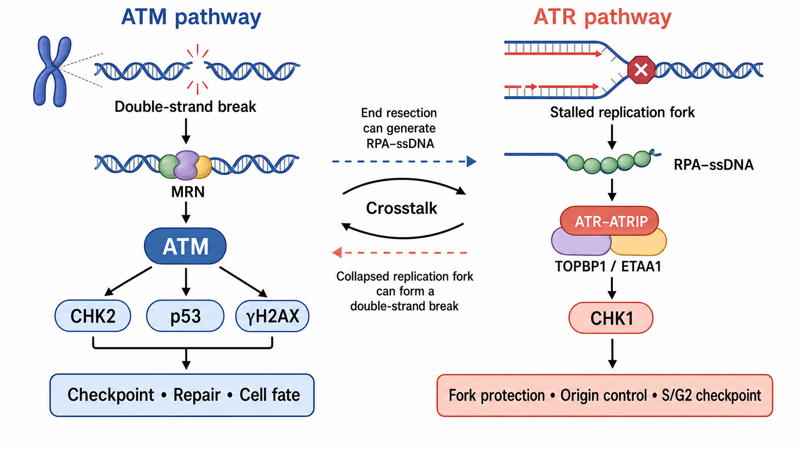

# ATM通路

ATM（ataxia-telangiectasia mutated，共济失调-毛细血管扩张症突变蛋白）是 PIKK（phosphatidylinositol 3-kinase-related kinase，磷脂酰肌醇 3-激酶相关激酶）家族的丝氨酸/苏氨酸蛋白激酶。它是 [DNA 损伤反应](DNA损伤反应.md) 的核心信号节点，最经典的任务是感知和放大 [DNA 双链断裂](DNA双链断裂.md) 信号，并协调检查点、染色质反应、修复和细胞命运。

图：ATM 通路偏向由双链断裂和 MRN 复合物启动，经 [CHK2](CHK1与CHK2.md)、p53 和 γH2AX 等分支协调检查点、修复与细胞命运；[ATR 通路](ATR通路.md) 偏向识别复制叉处的 RPA–ssDNA。两者并非绝对分工：断端切除可把 ATM 主导的损伤转化为 ATR 激活结构，复制叉崩溃也可形成双链断裂并招募 ATM。本图由 Image2 / image-generation model 生成，用于个人学习示意。

## ATM 通路在回答什么问题

细胞发现染色体可能断裂后，需要快速回答四件事：

- 损伤是否足以暂停 [细胞周期](细胞周期.md)。
- 断裂周围是否需要建立更大的染色质信号区域。
- 应优先支持哪类修复和末端处理。
- 损伤若长期无法解决，是否进入衰老、凋亡或其他命运。

ATM 主要承担“信号协调器”而不是“直接把 DNA 接回去”的角色。它通过磷酸化大量底物改变修复蛋白募集、细胞周期和转录状态；真正的断端连接或模板修复仍由 [NHEJ](NHEJ.md)、[HDR](HDR.md) 等机器完成。

## 经典触发：DSB–MRN–ATM

### MRN 识别和组织断端

[MRN 复合物](MRN复合物.md)（MRE11–RAD50–NBS1 complex，MRE11–RAD50–NBS1 复合物）结合 DNA 断端，参与断端桥接、加工并促进 ATM 招募和激活。MRN 缺陷会显著削弱正常 ATM 应答，但 MRN 并不能简单等同于“ATM 的受体”。参考：[Uziel et al., EMBO Journal, 2003](https://doi.org/10.1093/emboj/cdg541)。

### ATM 激活不是单一开关

经典模型中，DNA 损伤可促进 ATM 构象和寡聚状态改变，并伴随人 ATM Ser1981 自磷酸化。该位点常被用作活化读数，但“出现 p-ATM Ser1981”与“该位点在所有模型中都是激酶激活所必需”不是同一句话：小鼠 Ser1987 突变实验显示，该同源位点并非体内所有 ATM 功能的绝对前提。参考：[Bakkenist and Kastan, Nature, 2003](https://doi.org/10.1038/nature01368)；[Pellegrini et al., Nature, 2006](https://doi.org/10.1038/nature05112)。

ATM 也可响应染色质变化和氧化应激。氧化条件下的 ATM 激活可涉及不同于经典 DSB 模式的二硫键依赖构象，因此“ATM 活化 = 一定存在物理双链断裂”并不严谨。参考：[Guo et al., Science, 2010](https://doi.org/10.1126/science.1192912)。

## 主要下游分支

### γH2AX 与损伤区域放大

ATM 可磷酸化 H2AX 的 Ser139，形成 γH2AX（phosphorylated histone H2AX at Ser139，Ser139 磷酸化组蛋白 H2AX）。γH2AX–MDC1（mediator of DNA damage checkpoint protein 1，DNA 损伤检查点介质蛋白 1）轴帮助建立断裂周围的信号平台，继续募集 ATM 和其他损伤应答因子。参考：[Burma et al., Journal of Biological Chemistry, 2001](https://doi.org/10.1074/jbc.C100466200)。

γH2AX 是敏感的损伤应答读数，却不是 ATM 专属底物，也不是 DSB 的一对一计数器；ATR、[DNA-PK](DNA-PK.md)、复制压力和凋亡都可能影响其强度或分布。

### CHK2、p53 与细胞周期

ATM 磷酸化 CHK2（checkpoint kinase 2，检查点激酶 2）Thr68，并可直接或间接稳定 [p53](p53.md)（tumor protein p53，肿瘤蛋白 p53）。CHK2、p53、p21 和 CDC25 phosphatase（CDC25 磷酸酶）等共同影响 G1/S、S 期内和 G2/M 检查点。这里不是一条整齐的单线级联，而是由细胞类型、TP53 状态、损伤剂量和时间决定的网络。

### 修复选择与细胞命运

ATM 通过 KAP1、BRCA1、CtIP 等底物影响染色质松弛、断端切除和重组修复。短暂损伤常表现为停顿和恢复；持续或高强度损伤则可能触发永久停滞、[细胞衰老](细胞衰老.md) 或凋亡。ATM 的系统性功能综述见 [Shiloh and Ziv, Nature Reviews Molecular Cell Biology, 2013](https://doi.org/10.1038/nrm3546)。

## ATM 与 ATR 的区别和串扰

| 比较轴 | ATM 通路 | [ATR 通路](ATR通路.md) |
| --- | --- | --- |
| 偏好触发结构 | 双链断裂、断端与染色质变化 | RPA 包被的单链 DNA、停滞复制叉和 ssDNA–dsDNA junction |
| 典型上游 | MRN 复合物 | RPA、ATRIP、RAD9–RAD1–HUS1、TOPBP1 或 ETAA1 |
| 经典下游 | CHK2、p53、γH2AX | CHK1、RPA、复制叉与复制起点调控因子 |
| 主要细胞周期语境 | 各时期均可响应，G1 中的 DSB 应答尤其典型 | S 期和 G2 期最突出，但并非只在复制细胞中工作 |
| 常用刺激 | 电离辐射、放射模拟药物、拓扑异构酶毒物 | [羟基脲](<../../材(实验耗材工具篇)/羟基脲.md>)、[阿非迪霉素](<../../材(实验耗材工具篇)/阿非迪霉素.md>)、UV、复制障碍 |

最重要的串扰发生在“损伤结构改变”时。DSB 经切除后形成 RPA 包被的单链 DNA，可从 ATM 信号过渡到 ATR 信号；复制叉长期停滞并崩溃后形成断裂，则可进一步激活 ATM。因此实验中不能只按药物名称预判通路，必须结合时间、细胞周期和实际读数。

## 端粒与 ATM

正常端粒必须阻止 ATM 把天然染色体末端当作 DSB。[Shelterin](Shelterin.md) 中的 TRF2 对抑制端粒 ATM 应答尤其重要；TRF2 功能丢失后，可出现端粒损伤焦点、ATM 信号和染色体端到端融合。TRF2 与 POT1 分别偏向抑制 ATM 和 ATR 的证据见 [Denchi and de Lange, Nature, 2007](https://doi.org/10.1038/nature06065)。

## 实验中如何观察 ATM 通路

| 层级 | 常见读数 | 主要含义 | 关键限制 |
| --- | --- | --- | --- |
| 近端激酶 | p-ATM Ser1981 / total ATM | ATM 近端活化与总量 | 单个位点不能代表全部激酶功能 |
| 下游激酶 | p-CHK2 Thr68 / total CHK2 | ATM–CHK2 轴是否响应 | 需结合时间和抑制剂验证归因 |
| 染色质信号 | γH2AX、MDC1、53BP1 focus | 损伤区域和信号平台 | 并非 ATM 或 DSB 专属 |
| 检查点输出 | p53、p21、CDC25、细胞周期分布 | 是否发生停顿或命运变化 | TP53 缺失细胞可能没有典型 p53 输出 |
| 功能结局 | 克隆形成、微核、染色体畸变 | 长期存活和基因组稳定性 | 与即时磷酸化不是同一时间尺度 |

[Western blot](<../../用(实验流程内容篇)/Western blot.md>) 适合比较总蛋白与磷酸化位点，[免疫荧光](<../../用(实验流程内容篇)/免疫荧光.md>) 适合观察焦点和单细胞异质性，[流式细胞术](<../../用(实验流程内容篇)/流式细胞术.md>) 可把信号与 DNA 含量、EdU 和细胞周期联系起来。

### 推荐的最小验证组合

- 设置未处理对照、明确的损伤阳性对照和溶剂对照。
- 同时检测磷酸化蛋白与对应 total protein（总蛋白）。
- 做早期到晚期时间梯度，避免只看一个终点。
- 使用 ATM 抑制剂或遗传缺失作为归因工具，同时检查毒性和 ATR/DNA-PK 代偿。
- 至少组合一个近端读数、一个下游读数和一个功能结局。

## 常见误读与 troubleshooting

| 观察 | 不应立刻得出的结论 | 优先排查 |
| --- | --- | --- |
| p-ATM Ser1981 升高 | ATM 的所有功能都增强 | total ATM、下游底物、定位、时间和抗体特异性 |
| γH2AX 升高但 p-CHK2 不变 | ATM 通路一定异常 | ATR/DNA-PK、复制压力、凋亡和取样时间 |
| ATM 抑制后 γH2AX 仍存在 | 抑制剂无效 | DNA-PK/ATR 代偿、残余 ATM、剂量和 target engagement（靶点占用） |
| DNA 损伤后 p53 不升高 | 没有 DNA 损伤 | TP53 基因型、MDM2、细胞类型和 p53 基线 |
| 晚期同时出现 p-CHK1 与 p-CHK2 | 两种刺激从一开始就等价 | 复制叉崩溃或断端切除导致的通路串扰 |

## 小结

ATM 是以 DSB 应答为核心、但不局限于 DSB 的信号激酶。正确解析 ATM 通路应把“触发结构、近端激酶、下游底物、细胞周期输出和长期结局”分层，并把 ATR 与 DNA-PK 的串扰纳入实验设计；单独一条 p-ATM 或 γH2AX 条带不足以证明完整 ATM 通路被激活。

## 参考来源

- [Bakkenist and Kastan, DNA damage activates ATM through intermolecular autophosphorylation and dimer dissociation, Nature, 2003](https://doi.org/10.1038/nature01368)
- [Uziel et al., Requirement of the MRN complex for ATM activation by DNA damage, EMBO Journal, 2003](https://doi.org/10.1093/emboj/cdg541)
- [Pellegrini et al., Autophosphorylation at serine 1987 is dispensable for murine Atm activation in vivo, Nature, 2006](https://doi.org/10.1038/nature05112)
- [Guo et al., ATM activation by oxidative stress, Science, 2010](https://doi.org/10.1126/science.1192912)
- [Shiloh and Ziv, The ATM protein kinase: regulating the cellular response to genotoxic stress, and more, Nature Reviews Molecular Cell Biology, 2013](https://doi.org/10.1038/nrm3546)
