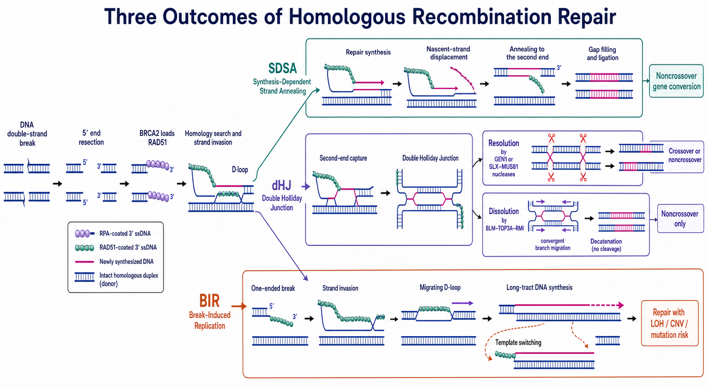

# BIR

BIR（break-induced replication，断裂诱导复制）是一种由同源重组启动、通过长距离 DNA 合成修复 one-ended DNA break（单端 DNA 断裂）的机制。它常用于挽救崩溃复制叉或缺少第二可连接断端的染色体，但复制过程比正常 S 期复制更不稳定，容易伴随突变、模板切换、拷贝数改变和杂合性丢失。

图：BIR 从单端断裂进入，3′ 末端侵入同源模板后形成 migrating D-loop（迁移 D-loop），驱动长距离 DNA 合成。它不依赖第二断端捕获，可修复断裂但也可能造成 LOH、CNV、突变和模板切换。本图由 Image2 / image-generation model 生成，用于个人学习示意。

## 为什么单端断裂需要不同策略

普通 two-ended DSB（双端 DSB）可让两个原始断端通过 NHEJ、[SDSA](SDSA.md)或 dHJ 路径重新配对。one-ended DSB 则只有一个断端可进行修复，常见于复制叉遇到单链缺口后崩溃：复制机器的一侧断开，而“另一端”不是附近可直接捕获的独立断端。

BIR 的解决方式不是寻找第二断端，而是让现有 3′ 末端侵入完整同源模板并建立一个复制装置，持续复制缺失的染色体区域，直到遇到 converging fork（汇合复制叉）、完成目标区域或延伸至染色体末端。

## 基本机制

### 末端切除和同源搜索

单端断裂经过 5′ end resection（5′ 端切除）形成 3′ ssDNA。经典 RAD51-dependent BIR（RAD51 依赖性 BIR）由 RPA、BRCA2 和 RAD51 建立同源搜索与链侵入；酵母中也存在 Rad51-independent BIR（Rad51 非依赖性 BIR），因此不能把所有 BIR 都限定为同一蛋白组合。

### 链侵入并形成 D-loop

3′ 末端侵入完整同源双链，形成 D-loop 并为 DNA polymerase（DNA 聚合酶）提供引物。与 SDSA 不同，BIR 不快速退出模板并回到第二断端，而是把 D-loop 转化为可持续移动的复制结构。

### 迁移 D-loop 和长距离合成

在酿酒酵母机制实验中，Pif1 helicase（Pif1 解旋酶）和 DNA polymerase δ（DNA 聚合酶 δ，Pol δ）促进 D-loop 迁移和长距离合成。新生链在 D-loop 后方被释放，形成 bubble migration（气泡迁移）式复制。参考：[Wilson et al., Nature, 2013](https://doi.org/10.1038/nature12585)。

进一步研究显示酵母 BIR 的两条新生链都可由 Pol δ 合成，并呈 conservative inheritance（保守式继承），即两条新生 DNA 最终位于同一产物，而不是像普通半保留复制那样分别进入两个子双链。参考：[Donnianni et al., Molecular Cell, 2019](https://doi.org/10.1016/j.molcel.2019.07.033)。

> “迁移 D-loop、保守复制”的精细机制主要由酵母实验建立。人细胞中存在 POLD3、RAD52 依赖的 BIR/BIR-like 复制恢复，但不应未经实验就假定每个分子步骤与酵母完全相同。

## BIR 为什么容易出错

### 长合成区放大聚合错误

BIR 可复制数十到数百 kb 甚至更长区域，错误机会远多于局部修复合成。酵母 reporter 显示 BIR 全程的移码突变率可显著高于正常复制，且 mismatch repair（错配修复）和 polymerase proofreading（聚合酶校对）只能部分纠正。参考：[Deem et al., PLoS Biology, 2011](https://doi.org/10.1371/journal.pbio.1000594)。

### 模板切换

不稳定的迁移 D-loop 可能从原同源模板退出，再侵入另一条同源或微同源 DNA。template switching（模板切换）可形成复杂拼接、非互惠易位和拷贝数结构变化。

### LOH 与非互惠复制

若断裂染色体从同源染色体复制到末端，受体远端序列可能被供体信息替换，形成 [杂合性丢失](杂合性丢失.md)（loss of heterozygosity，LOH）。与 reciprocal crossover（互惠交换）不同，BIR 信息转移通常是单向的。

### 拷贝数改变

错误模板选择或复制终止位置可造成 duplication（重复）、deletion（缺失）和 CNV（copy-number variation，拷贝数变异）。人细胞 cyclin E 诱导 [复制压力](复制压力.md)的研究显示，POLD3 对受损复制叉修复和片段性基因组重复形成具有重要作用。参考：[Costantino et al., Science, 2014](https://doi.org/10.1126/science.1243211)。

## BIR 在哪些情境出现

### 崩溃复制叉

复制叉遇到 DNA 缺口、难复制结构、DNA–protein crosslink（DNA–蛋白交联）或严重复制压力后可能形成单端 DSB。人细胞中 RAD52 缺失会损害崩溃复制叉恢复和 BIR reporter 活性。参考：[Sotiriou et al., Molecular Cell, 2016](https://doi.org/10.1016/j.molcel.2016.10.038)。

### 端粒维持

在缺少 telomerase（端粒酶）的细胞中，ALT（[alternative lengthening of telomeres，端粒替代延长](ALT.md)）可利用重组依赖 DNA 合成延长端粒，具有 BIR-like 特征。但 ALT 包含多种模板和核内结构，不能简单写成“ALT 就是经典 BIR”。

### 有丝分裂 DNA 合成

[MiDAS](MiDAS.md)（mitotic DNA synthesis，有丝分裂期 DNA 合成）用于处理进入有丝分裂时仍未复制完成的区域。早期研究发现 common fragile site（常见脆性位点）的 MiDAS 依赖 MUS81–EME1 和 POLD3，具有 BIR-like 特征。参考：[Minocherhomji et al., Nature, 2015](https://doi.org/10.1038/nature16139)。

MiDAS 的底物、时相和聚合酶组合具有自身特点，因此更严谨的表达是“MiDAS 可采用具有 BIR 特征的 DNA 合成”，而不是把两个术语完全互换。

## BIR、SDSA 与 dHJ 对比

| 特征 | BIR | SDSA | dHJ repair |
| --- | --- | --- | --- |
| 典型底物 | 单端断裂 | 双端断裂 | 双端断裂 |
| 第二断端 | 不需要或不可用 | 新生链与第二端退火 | 捕获第二端形成双连接体 |
| DNA 合成 | 长距离、复制样 | 通常局部修复合成 | 围绕断裂区域修复合成 |
| 标准 crossover | 不以互惠 crossover 为主要结局 | 无 | resolution 可有，dissolution 无 |
| 主要遗传后果 | LOH、CNV、突变、模板切换 | 非交换型基因转换 | crossover/noncrossover、连接体处理风险 |

## BIR 与普通复制叉重启的区别

并非所有 stalled fork（停滞复制叉）都断裂，也不是所有 replication restart（复制重启）都需要 BIR。复制叉可通过障碍移除、fork reversal（复制叉逆转）、新起始点激活、模板切换或 translesion synthesis（跨损伤合成）恢复。

只有当证据支持单端断裂、同源侵入和长距离复制时，才适合归为 BIR。单独看到 DNA fiber assay（DNA 纤维实验）中复制重新开始，不能证明采用了 BIR。

## 如何研究或识别 BIR

| 方法 | 可提供的信息 | 主要局限 |
| --- | --- | --- |
| BIR reporter | 特定单端断裂底物上的长距离修复 | 人工模板、选择标记和染色质环境限制外推 |
| DNA fiber assay | 复制轨迹、停滞和重启动力学 | 不能单独区分 BIR 与其他复制重启机制 |
| BrdU/EdU incorporation（核苷类似物掺入） | 非常规 DNA 合成的时间和位置 | 掺入本身不证明模板来源或 BIR 机制 |
| LOH / SNP phasing | 长转换区和供体等位基因来源 | 需要有信息量的杂合标记和足够覆盖 |
| copy-number profiling | duplication、deletion 和扩增 | 结构结果并非 BIR 独有 |
| long-read / whole-genome sequencing | 模板切换、复杂重排和断点结构 | 成本、克隆选择和生物信息流程会影响检出 |

## 与 CRISPR 实验的关系

常规 CRISPR 两端切割更常进入 NHEJ、MMEJ、SDSA 或 dHJ 相关修复；但复制中的切口、大片段删除后只剩一个有效同源端，或诱导靠近重复/脆弱区域时，可能出现 BIR-like 长距离复制和复杂结构结果。

若关键克隆出现远端 LOH、局部扩增或非互惠重排，不应只用切口附近 amplicon sequencing（扩增子测序）解释。需要外侧测序、拷贝数和等位基因分相，必要时扩展到全基因组结构分析。

## 常见异常与 troubleshooting

| 观察 | 容易产生的误读 | 优先检查 |
| --- | --- | --- |
| DNA fiber 显示复制恢复 | 已证明 BIR | 单端断裂、RAD52/RAD51/POLD3 依赖和模板来源 |
| POLD3 干预降低修复 | POLD3 只参与 BIR | 普通复制、其他修复合成和细胞周期影响 |
| 长 LOH 区域出现 | 一定是 crossover | 非互惠 BIR、基因转换和拷贝数状态 |
| 片段重复伴随复杂断点 | 单一模板复制错误 | 模板切换、微同源和多次复制重启 |
| RAD52 焦点增加 | 每个焦点都是 BIR | SSA、复制压力和其他 RAD52 功能 |
| MiDAS 增加 | BIR 效率提高 | 未复制 DNA 负担、细胞进入有丝分裂时机和染色体损伤 |

## 小结

BIR 是单端断裂的“复制型修复”：同源侵入后建立迁移 D-loop，并通过长距离合成恢复染色体。它能挽救崩溃复制叉，却以较高的突变、LOH、CNV 和模板切换风险为代价。酵母提供了最精细的机制模型，人细胞中应结合 POLD3/RAD52 依赖、单端底物和结构结果，谨慎使用 BIR 或 BIR-like 术语。

## 参考来源

- [Deem et al., Break-induced replication is highly inaccurate, PLoS Biology, 2011](https://doi.org/10.1371/journal.pbio.1000594)
- [Wilson et al., Pif1 helicase and Polδ promote recombination-coupled DNA synthesis via bubble migration, Nature, 2013](https://doi.org/10.1038/nature12585)
- [Costantino et al., Break-induced replication repair of damaged forks induces genomic duplications in human cells, Science, 2014](https://doi.org/10.1126/science.1243211)
- [Minocherhomji et al., Replication stress activates DNA repair synthesis in mitosis, Nature, 2015](https://doi.org/10.1038/nature16139)
- [Sotiriou et al., Mammalian RAD52 Functions in Break-Induced Replication Repair of Collapsed DNA Replication Forks, Molecular Cell, 2016](https://doi.org/10.1016/j.molcel.2016.10.038)
- [Donnianni et al., DNA Polymerase Delta Synthesizes Both Strands during Break-Induced Replication, Molecular Cell, 2019](https://doi.org/10.1016/j.molcel.2019.07.033)
