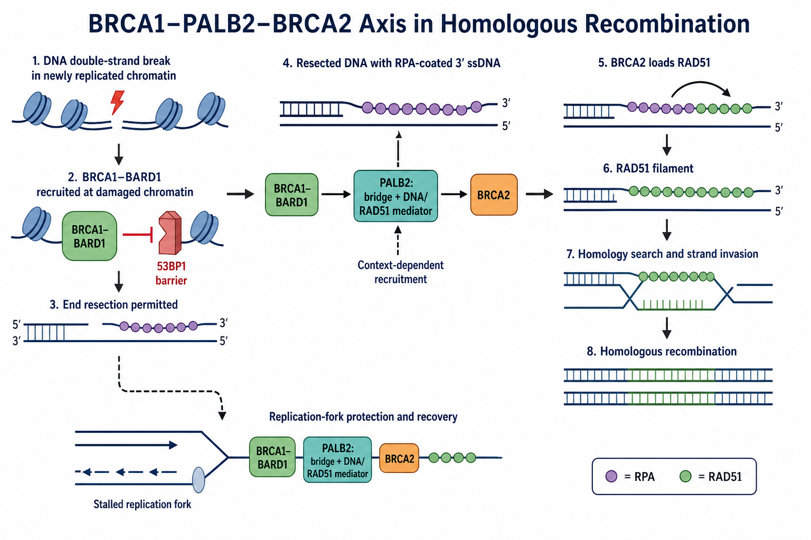

# BRCA1

BRCA1（breast cancer type 1 susceptibility protein，乳腺癌易感蛋白 1）是参与 DNA damage response（DNA 损伤应答）的肿瘤抑制蛋白。它与 [BARD1](BARD1.md) 形成稳定复合物，在受损染色质识别、[DNA 末端切除](DNA末端切除.md)许可、修复路径选择、[PALB2](PALB2.md)–[BRCA2](BRCA2.md)–[RAD51](RAD51.md) 募集以及复制叉保护中发挥作用。

BRCA1 不是切割 DNA 的核酸酶，也不是执行同源搜索的重组酶。把它理解为连接染色质状态、细胞周期与多种修复因子的调控平台，比称其为“DNA 修复酶”更准确。

图：BRCA1–BARD1 在复制后的受损染色质上削弱 53BP1 相关末端保护屏障，使核酸酶系统能够完成末端切除；PALB2 连接并调动 BRCA2，使 RAD51 取代 [RPA](RPA.md) 并形成核蛋白丝。虚线表示 PALB2 还存在依情境而定的 BRCA1 非依赖募集方式；下方分支表示这些蛋白也参与复制叉保护与恢复。本图由 Image2 / image-generation model 生成，用于个人学习示意。

## BRCA1–BARD1 是工作单元

BARD1（BRCA1-associated RING domain protein 1，BRCA1 相关 RING 结构域蛋白 1）通过 N 端 RING domain（RING 结构域）与 BRCA1 结合。二者共同形成 RING-type ubiquitin E3 ligase（RING 型泛素 E3 连接酶），并相互稳定；实验中仅测 BRCA1 总量而不检查 BARD1、亚细胞定位与复合物完整性，可能漏掉真实功能缺陷。

BRCA1–BARD1 的 E3 活性曾存在争议。使用真正丧失连接酶活性的全长复合物进行的研究表明，该活性参与 DNA 末端切除，也影响 homology-directed repair（HDR，同源定向修复）的后续完成步骤。因此，“BRCA1 的 E3 活性完全不重要”并不是稳妥结论。参考：[Wang et al., Molecular Cell, 2023](https://doi.org/10.1016/j.molcel.2023.09.015)。

## 关键结构与功能接口

| BRCA1 区域 | 主要伙伴或作用 | 实验解释 |
| --- | --- | --- |
| N-terminal RING domain（N 端 RING 结构域） | 结合 BARD1，并与 ubiquitin-conjugating enzyme（E2，泛素结合酶）共同支持泛素化 | RING 变异可能同时影响复合物稳定性与 E3 活性 |
| central coiled-coil region（中央卷曲螺旋区） | 直接结合 PALB2 的 N 端 | 破坏该界面可使 BRCA1 仍能到达损伤位点，却难以有效募集 BRCA2–RAD51 |
| tandem BRCT domains（串联 BRCT 结构域） | 识别磷酸化伙伴并组织多种损伤应答复合物 | BRCT 变异可选择性影响不同支路，不能只按蛋白总量判断 |
| 大型中央无序区域 | 提供多种修饰位点和动态相互作用界面 | 截短或标签位置可能改变定位、稳定性和伙伴结合 |

结构域不是互不影响的独立积木。全长 BRCA1 超过 1800 个氨基酸，表达、纯化与转膜都较困难；一个片段能结合某伙伴，不代表全长蛋白在细胞中只执行该单一功能。

## 如何识别“适合 HR”的染色质

同源重组通常依赖已经复制出的姐妹染色单体，因此主要在 S/G2 期发生。新复制染色质上的 histone H4 lysine 20 unmethylated state（H4K20me0，组蛋白 H4 第 20 位赖氨酸未甲基化状态）可被 BARD1 的 ankyrin repeat domain（锚蛋白重复结构域）识别，帮助 BRCA1–BARD1 偏向复制后的染色质；相对地，[53BP1（p53-binding protein 1，p53 结合蛋白 1）](53BP1.md)更倾向识别与未复制染色质相关的标记并保护 DNA 末端。参考：[Nakamura et al., Nature Cell Biology, 2019](https://doi.org/10.1038/s41556-019-0282-9)。

这不是一个绝对的“单一标记开关”。损伤类型、细胞周期、染色质可及性、RNF168 产生的泛素信号和伙伴蛋白共同决定 BRCA1–BARD1 的募集与停留。

## 末端切除与修复路径选择

DNA double-strand break（DSB，DNA 双链断裂）形成后，53BP1–RIF1（replication timing regulatory factor 1，复制时序调控因子 1）–Shieldin complex（Shieldin 屏蔽蛋白复合物）网络可保护末端，抑制过度切除并偏向 end joining（末端连接）。BRCA1–BARD1 通过染色质重塑、泛素化及 CtIP（CtBP-interacting protein，CtBP 相互作用蛋白）–[MRN complex（MRN 复合物）](MRN复合物.md)等网络削弱这一屏障，使 5′ 端切除能够发生，产生 RPA 包被的 3′ single-stranded DNA（3′ 单链 DNA）。

关键边界是：

- BRCA1 **允许并组织**末端切除，但真正切割 DNA 的是 MRN–CtIP、EXO1、DNA2 等核酸酶系统。
- BRCA1 缺失时 HR 常下降，但切除程度会随 53BP1 通路状态、细胞类型和损伤语境变化。
- 53BP1 丢失可部分恢复 BRCA1 缺陷细胞中的切除和 PALB2 募集，却不等于 BRCA1 的全部功能都恢复。

BRCA1–BARD1 介导的核小体泛素化可促进染色质重塑并对抗 53BP1 形成的切除屏障。参考：[Densham et al., Nature Structural & Molecular Biology, 2016](https://doi.org/10.1038/nsmb.3236)。

## 从 PALB2 到 RAD51

末端切除只产生 HR 底物，不能自动完成 HR。BRCA1 的 coiled-coil region 与 PALB2 结合，PALB2 再通过 C 端 WD40 β-propeller（WD40 β 螺旋桨结构域）结合 BRCA2，组织 RAD51 装载。破坏 BRCA1–PALB2 界面会降低 RAD51 focus（RAD51 焦点）和 HR 效率。参考：[Zhang et al., Molecular Cancer Research, 2009](https://doi.org/10.1158/1541-7786.MCR-09-0123)。

但这条轴不是唯一入口。PALB2 还可通过 RNF168（RING finger protein 168，RING 指蛋白 168）、染色质结合区域及其他伙伴实现 BRCA1 非依赖募集，尤其在 BRCA1 或 53BP1 状态改变时更明显。因此图中的 BRCA1→PALB2 箭头应理解为经典主路径，而不是不可绕过的唯一物理路线。参考：[Foo and Xia, Cancer Research, 2022](https://doi.org/10.1158/0008-5472.CAN-22-1535)。

BRCA1–BARD1 也可能参与 RAD51 介导的同源 DNA 配对等较后期步骤，而不只停留在切除上游。参考：[Zhao et al., Nature, 2017](https://doi.org/10.1038/nature24060)。

## 复制叉保护不是一次 DSB-HR 的简单复制

在 [复制压力](复制压力.md) 下，BRCA1–BARD1、PALB2、BRCA2 和 RAD51 可参与停滞或逆转复制叉的保护与恢复，限制新生 DNA 被异常降解。这个功能与完成一次经典 [同源重组](同源重组.md) 有重叠，但并不完全等价：

- HR reporter 正常不能证明复制叉保护一定正常。
- DNA fiber（DNA 纤维）表型异常也不能直接证明 DSB 的 HR 完全丧失。
- 应分别测量 RAD51 装载、功能性 HR、复制叉降解/重启和细胞存活。

## BRCA1、PALB2 与 BRCA2 的显著区别

| 比较轴 | BRCA1 | PALB2 | BRCA2 |
| --- | --- | --- | --- |
| 主要定位 | 受损染色质识别、切除许可、路径选择 | 连接并组织 BRCA1–BRCA2，同时直接参与 DNA/RAD51 调控 | 在 RPA 包被 ssDNA 上装载和稳定 RAD51 |
| 是否核酸酶 | 否 | 否 | 否 |
| 是否核心链交换酶 | 否 | 否 | 否；真正执行链交换的是 RAD51 |
| 典型复合物/界面 | BRCA1–BARD1、BRCA1–PALB2 | BRCA1–PALB2、PALB2–BRCA2 | BRCA2–RAD51、BRCA2–DSS1 |
| 缺陷后常见实验表型 | 切除、PALB2/RAD51 募集及路径选择异常 | BRCA2/RAD51 募集、HR 与复制叉恢复异常 | RAD51 装载、HR 与复制叉保护异常 |

## 遗传病、肿瘤与治疗语境

- 单等位基因 pathogenic germline variant（致病性胚系变异）可增加乳腺、卵巢等肿瘤易感性，但风险取决于变异、人群、年龄与家系背景。
- 双等位基因 BRCA1 致病变异极少见，可与 Fanconi anemia complementation group S（FANCS，范可尼贫血互补组 S）相关；不能把这一语境与成人杂合携带者混为一谈。
- 肿瘤中 BRCA1 功能丢失可形成 [homologous recombination deficiency（HRD，同源重组缺陷）](同源重组缺陷.md)，并影响铂类或 [PARP 抑制剂](PARP抑制剂.md) 敏感性。
- 回复突变、53BP1 轴重塑、PALB2 非经典募集或复制叉保护恢复都可能造成耐药；历史性 HRD scar（HRD 瘢痕）阳性不保证肿瘤当前仍功能缺陷。

机制笔记不能替代临床遗传咨询、规范变异分级或用药决策。

## 实验中如何观察 BRCA1 功能

| 问题 | 推荐读数 | 能回答什么 | 关键限制 |
| --- | --- | --- | --- |
| 蛋白是否存在 | [Western blot](<../../用(实验流程内容篇)/Western blot.md>) | 全长/截短和总量 | BRCA1 分子量大，制样、低百分比胶和转膜条件敏感 |
| 是否到达损伤位点 | [免疫荧光](<../../用(实验流程内容篇)/免疫荧光.md>)、激光微照射 | BRCA1/BARD1 focus 与时序 | 焦点依赖细胞周期、损伤类型、预抽提和抗体质量 |
| 复合物是否完整 | [免疫共沉淀](<../../用(实验流程内容篇)/免疫共沉淀.md>) | BARD1、PALB2 等伙伴结合 | 过表达可制造非生理相互作用；长蛋白容易降解 |
| 末端切除是否发生 | RPA focus、native BrdU（bromodeoxyuridine，溴脱氧尿苷）ssDNA、END-seq（DNA 断端测序）等 | ssDNA 形成与切除范围 | RPA 增加也可能来自复制压力，不是 DSB 切除专属读数 |
| RAD51 是否装载 | S/G2 细胞中的 RAD51 focus | BRCA1 下游募集结果 | 焦点不等于 HR 已完成 |
| HR 是否完成 | direct-repeat green fluorescent protein（DR-GFP，直接重复绿色荧光蛋白）等 [报告基因实验](<../../用(实验流程内容篇)/报告基因实验.md>) | 指定断裂体系的功能性 HR | 受切割效率、细胞周期和 reporter 位点影响 |
| 复制叉是否受保护 | [DNA 纤维实验](<../../用(实验流程内容篇)/DNA纤维实验.md>) | 新生链降解、叉重启 | 必须与经典 HR readout 分开解释 |

### 推荐的证据组合

- 先确认 BRCA1、BARD1 的全长表达和核定位。
- 控制 S/G2 细胞比例，以 RPA→PALB2/BRCA2→RAD51 的时间序列观察通路。
- 同时使用缺失模型、野生型回补和界面/功能分离突变体。
- 把 RAD51 focus 与 HR reporter 配对；若涉及复制压力，另加 DNA fiber。
- 研究药物敏感性时加入克隆形成、回复突变和 53BP1/PALB2 状态，而不是只引用 HRD scar。

## 常见误读与 troubleshooting

| 观察 | 不应立即得出的结论 | 优先排查 |
| --- | --- | --- |
| BRCA1 条带弱或缺失 | 样品一定是 BRCA1-null | 蛋白降解、胶浓度、转膜、抗体表位和截短变体 |
| RPA focus 低 | BRCA1 完全没有到达损伤位点 | 细胞周期、切除、RPA 总量、损伤剂量和检测时点 |
| RPA 高而 RAD51 低 | 没有发生末端切除 | PALB2/BRCA2 募集、RAD51 总量与细胞周期 |
| 53BP1 丢失后 RAD51 恢复 | BRCA1 的全部肿瘤抑制功能恢复 | HR 完成率、复制叉、染色体稳定性和长期存活 |
| HRD scar 阳性 | 当前一定对 PARP 抑制剂敏感 | 回复突变、53BP1 轴、PALB2 募集与叉保护恢复 |

## 小结

BRCA1 是把“复制后的染色质环境”翻译为“允许末端切除并进入 HR”的调控平台。它通过 BARD1 识别和重塑损伤染色质，通过 PALB2 连接 BRCA2–RAD51，并参与复制叉保护；实验上必须把蛋白存在、损伤募集、切除、RAD51 装载、HR 完成和复制叉功能分层检测。

## 参考来源

- [Densham et al., Human BRCA1-BARD1 ubiquitin ligase activity counteracts chromatin barriers to DNA resection, Nature Structural & Molecular Biology, 2016](https://doi.org/10.1038/nsmb.3236)
- [Zhao et al., BRCA1-BARD1 promotes RAD51-mediated homologous DNA pairing, Nature, 2017](https://doi.org/10.1038/nature24060)
- [Nakamura et al., H4K20me0 recognition by BRCA1-BARD1 directs homologous recombination to sister chromatids, Nature Cell Biology, 2019](https://doi.org/10.1038/s41556-019-0282-9)
- [Foo and Xia, BRCA1-Dependent and Independent Recruitment of PALB2-BRCA2-RAD51 in the DNA Damage Response and Cancer, Cancer Research, 2022](https://doi.org/10.1158/0008-5472.CAN-22-1535)
- [Wang et al., Crucial roles of the BRCA1-BARD1 E3 ubiquitin ligase activity in homology-directed DNA repair, Molecular Cell, 2023](https://doi.org/10.1016/j.molcel.2023.09.015)
