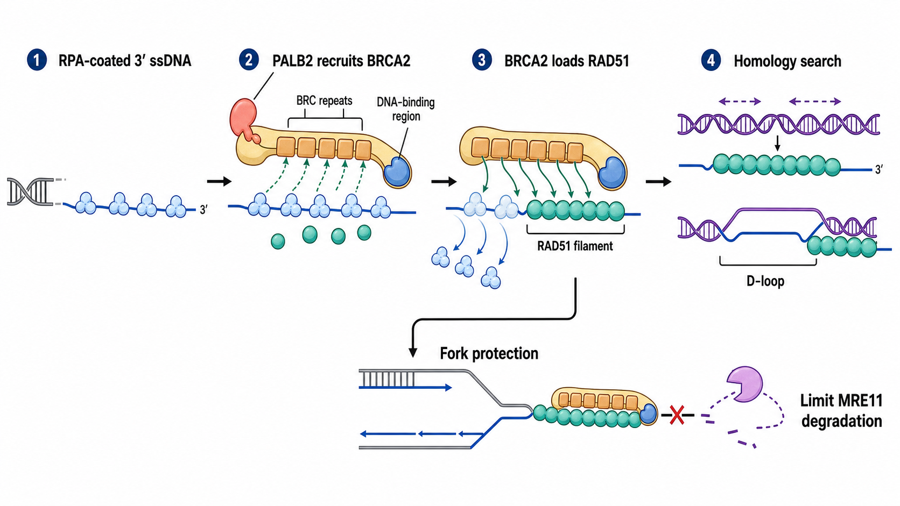

# BRCA2

BRCA2（breast cancer type 2 susceptibility protein，乳腺癌易感蛋白 2）是大型肿瘤抑制蛋白和 recombination mediator（重组介质蛋白）。它本身不是切割 DNA 的核酸酶，也不是执行链交换的重组酶；其核心任务是把 [RAD51](RAD51.md) 正确装载到 [RPA](RPA.md) 包被的单链 DNA 上，并在受压复制叉处稳定 RAD51 相关保护结构。

图：[PALB2](PALB2.md) 帮助 BRCA2 定位到损伤区域；BRCA2 通过 BRC repeats（BRC 重复序列）和 DNA-binding region（DNA 结合区域）促进 RPA 向 RAD51 的受控交接，形成用于同源搜索和 D-loop（displacement loop，置换环）形成的 RAD51 核蛋白丝。下方分支表示 BRCA2–RAD51 还可保护停滞/逆转复制叉，限制 MRE11 对新生 DNA 的异常降解；该功能与完成一次经典 [同源重组](同源重组.md) 并不完全等价。本图由 Image2 / image-generation model 生成，用于个人学习示意。

## BRCA2 不是 BRCA1 的第二个版本

| 比较轴 | [BRCA1](BRCA1.md) | BRCA2 |
| --- | --- | --- |
| 通路位置 | 更靠近损伤信号、末端切除和路径选择 | 更靠近 RAD51 装载、成丝与复制叉保护 |
| 主要桥梁 | 与 BARD1、PALB2、CtIP 等网络连接 | 与 PALB2、DSS1、RAD51 等连接 |
| 对 RAD51 的作用 | 多为上游许可和募集环境建立 | 直接调控 RAD51 定位、成核和核蛋白丝稳定 |
| 缺陷后共同结果 | 均可导致 [同源重组缺陷](同源重组缺陷.md) 和基因组不稳定 | 同左，但具体残余功能和复制叉表型可不同 |

PALB2（partner and localizer of BRCA2，BRCA2 伙伴与定位蛋白）可连接 BRCA1 与 BRCA2。破坏 BRCA1–PALB2 或 PALB2–BRCA2 相互作用都会削弱 RAD51 募集和 HR。参考：[Zhang et al., Molecular Cancer Research, 2009](https://doi.org/10.1158/1541-7786.MCR-09-0123)。

## 关键结构区域

人 BRCA2 是 3418 amino acids（氨基酸）的超大蛋白。理解其功能时可把它分为几个主要模块：

| 区域 | 主要相互作用/功能 | 实验意义 |
| --- | --- | --- |
| N-terminal region（N 端区域） | 与 PALB2 等伙伴结合，帮助定位和复合物组织 | 截短不一定只影响“一个末端”，还可能改变核定位和稳定性 |
| 8 个 BRC repeats（BRC 重复序列） | 以不同方式结合 RAD51 单体或核蛋白丝 | 单个 BRC peptide（BRC 肽段）的效应不能完全代表全长 BRCA2 |
| DNA-binding domain（DNA 结合结构域，DBD） | 包含 helical domain、OB folds 和 tower domain，并与 DSS1 形成结构/功能单元 | 参与 ssDNA、DNA junction 和伙伴蛋白结合 |
| C-terminal RAD51-binding region（C 端 RAD51 结合区） | 稳定 RAD51 filament，并受细胞周期相关磷酸化调节 | 与 BRC repeats 功能重叠但不等同 |
| nuclear localization signals（核定位信号，NLS） | 保证 BRCA2 进入细胞核 | C 端截短可能造成定位缺陷而非单纯催化缺陷 |

BRCA2 的结构域边界和相互作用是功能地图，不代表蛋白由互不影响的独立积木组成。BRCA1 与 BRCA2 的结构和通路差异综述见 [Roy et al., Nature Reviews Cancer, 2012](https://doi.org/10.1038/nrc3181)。

## 核心功能：把 RAD51 装到正确的 DNA 上

### 选择 ssDNA 而不是让 RAD51 随机黏 DNA

[DNA 末端切除](DNA末端切除.md) 后，3′ ssDNA 首先由 RPA 覆盖。RPA 能清除二级结构，却也形成 RAD51 成核的动力学屏障。BRCA2 同时结合 RAD51 与 DNA，使 RAD51 更偏向在 ssDNA 而不是无关 dsDNA 上成核，并促进其逐步取代 RPA。

纯化全长人 BRCA2 的实验表明，BRCA2 可促进 RAD51 在 RPA 包被 ssDNA 上形成稳定核蛋白丝并增强 RAD51 介导的链交换。参考：[Jensen et al., Nature, 2010](https://doi.org/10.1038/nature09399)；[Liu et al., Nature Structural & Molecular Biology, 2010](https://doi.org/10.1038/nsmb.1904)。

### BRC repeats 不是单一开关

8 个 BRC repeats 对 RAD51 单体、寡聚体和核蛋白丝具有不同偏好。孤立 BRC 肽段在高浓度下可抑制 RAD51 聚合，而全长 BRCA2 中多个 BRC repeats 与 DNA 结合区域协同，整体效果是定位、成核和稳定正确的 RAD51 filament。因此不能用“BRC4 肽抑制 RAD51”推翻“BRCA2 促进 RAD51 装载”；两者研究的是不同分子语境。

## 复制叉保护不是 HR 的同义词

停滞复制叉可发生 fork reversal（复制叉逆转），形成需要保护的新生 DNA 末端。BRCA2 和 RAD51 有助于稳定这些结构，限制 [MRN 复合物](MRN复合物.md) 中 MRE11 等核酸酶对新生链的异常降解。

BRCA2 C 端 RAD51 结合区的功能分离突变显示，复制叉保护可以在经典 DSB-HR readout（读数）相对保留或分离的条件下发生改变，说明“HR 修复能力”和“复制叉保护能力”必须分别检测。参考：[Schlacher et al., Cell, 2011](https://doi.org/10.1016/j.cell.2011.03.041)。

## DNA 交联、遗传病与肿瘤抑制

BRCA2 也是 [Fanconi anemia pathway（范可尼贫血通路）](范可尼贫血通路.md) 中的 FANCD1，参与 DNA interstrand crosslink（DNA 链间交联）损伤后的 HR 阶段。

- 单个等位基因的致病性 germline variant（胚系变异）可增加乳腺、卵巢、胰腺、前列腺等肿瘤易感性，但风险随具体变异、性别、家系和人群背景变化。
- 双等位基因 BRCA2 致病变异可导致严重的 Fanconi anemia D1 subtype（范可尼贫血 D1 亚型），其临床语境与成人杂合携带者不同。参考：[Meyer et al., Journal of Medical Genetics, 2014](https://doi.org/10.1136/jmedgenet-2013-101642)。
- 肿瘤中的 BRCA2 功能丢失可形成 HRD 表型，并影响铂类和 [PARP 抑制剂](PARP抑制剂.md) 敏感性；但耐药可通过回复突变、复制叉保护恢复或其他通路重塑出现。

基因变异“位于 BRCA2”不等于已证明致病，也不等于肿瘤当前仍处于 HRD。临床解释需要规范的变异分级、等位基因状态、肿瘤背景和治疗证据，不能由本机制笔记直接替代。

## 实验中如何观察 BRCA2 功能

| 问题 | 推荐读数 | 能回答什么 | 关键限制 |
| --- | --- | --- | --- |
| 蛋白是否表达 | BRCA2 [Western blot](<../../用(实验流程内容篇)/Western blot.md>) | 全长/截短和总量 | 3418 aa 蛋白对制样、低百分比胶和转膜条件敏感 |
| 是否定位/组织复合物 | [免疫荧光](<../../用(实验流程内容篇)/免疫荧光.md>)、[免疫共沉淀](<../../用(实验流程内容篇)/免疫共沉淀.md>) | 损伤募集和 PALB2/RAD51 相互作用 | BRCA2 抗体和焦点检测往往比 RAD51 更困难 |
| RAD51 是否成功装载 | RAD51 focus、染色质结合 RAD51 | BRCA2 下游成丝能力 | focus 不等于 HR 已完成 |
| HR 是否能完成 | DR-GFP 等 [报告基因实验](<../../用(实验流程内容篇)/报告基因实验.md>)、基因编辑产物 | 指定体系中的功能性 HR | reporter 不能覆盖全基因组和复制叉功能 |
| 复制叉是否受保护 | [DNA 纤维实验](<../../用(实验流程内容篇)/DNA纤维实验.md>) | 停滞后新生链降解和重启 | 标记方案、叉逆转和核酸酶背景会影响解释 |
| 是否存在长期 HRD 痕迹 | [LOH](杂合性丢失.md)、large-scale transition、mutational signature | 历史性基因组瘢痕 | 可能保留旧瘢痕而当前功能已恢复 |

### 推荐的证据组合

- 先确认 BRCA2 全长表达、核定位和 PALB2 依赖募集。
- 在 S/G2 细胞中比较 RPA 与 RAD51 的时间序列，而不是只看一个终点。
- 把 RAD51 focus 与功能性 HR reporter 配对。
- 若研究复制压力，另做 DNA fiber；不要用 DR-GFP 代替复制叉保护实验。
- 使用缺失细胞、野生型回补和功能分离突变体区分装载、成丝与叉保护。

## 常见误读与 troubleshooting

| 观察 | 不应立即得出的结论 | 优先排查 |
| --- | --- | --- |
| BRCA2 条带很弱 | 样品一定缺失 BRCA2 | 蛋白降解、胶浓度、转膜、抗体表位和截短变体 |
| RAD51 focus 减少 | 末端切除没有发生 | RPA/ssDNA、PALB2、BRCA2 定位、细胞周期和 RAD51 总量 |
| RAD51 focus 恢复 | BRCA2 所有功能恢复 | HR reporter、叉保护、染色体稳定性和长期存活 |
| HRD scar 阳性 | 当前一定对 PARP 抑制剂敏感 | 回复突变、功能恢复、药物外排和复制叉保护 |
| BRCA2 敲低后 fork degradation | 经典 HR 失败直接造成 | 需要独立验证 MRE11 依赖、叉逆转与 HR readout |

## 小结

BRCA2 是 RAD51 的定位、装载与稳定平台，而不是执行链交换的酶。它把 RPA 包被 ssDNA 转换为具有同源搜索能力的 RAD51 filament，并在受压复制叉处限制异常核酸酶降解；实验上必须把全长蛋白、RAD51 装载、功能性 HR、复制叉保护和历史性 HRD 瘢痕分层观察。

## 参考来源

- [Zhang et al., PALB2 functionally connects the breast cancer susceptibility proteins BRCA1 and BRCA2, Molecular Cancer Research, 2009](https://doi.org/10.1158/1541-7786.MCR-09-0123)
- [Jensen et al., Purified human BRCA2 stimulates RAD51-mediated recombination, Nature, 2010](https://doi.org/10.1038/nature09399)
- [Liu et al., Human BRCA2 protein promotes RAD51 filament formation on RPA-covered single-stranded DNA, Nature Structural & Molecular Biology, 2010](https://doi.org/10.1038/nsmb.1904)
- [Schlacher et al., Double-strand break repair-independent role for BRCA2 in blocking stalled replication fork degradation by MRE11, Cell, 2011](https://doi.org/10.1016/j.cell.2011.03.041)
- [Roy et al., BRCA1 and BRCA2: different roles in a common pathway of genome protection, Nature Reviews Cancer, 2012](https://doi.org/10.1038/nrc3181)
- [Meyer et al., Fanconi anaemia, BRCA2 mutations and childhood cancer, Journal of Medical Genetics, 2014](https://doi.org/10.1136/jmedgenet-2013-101642)
