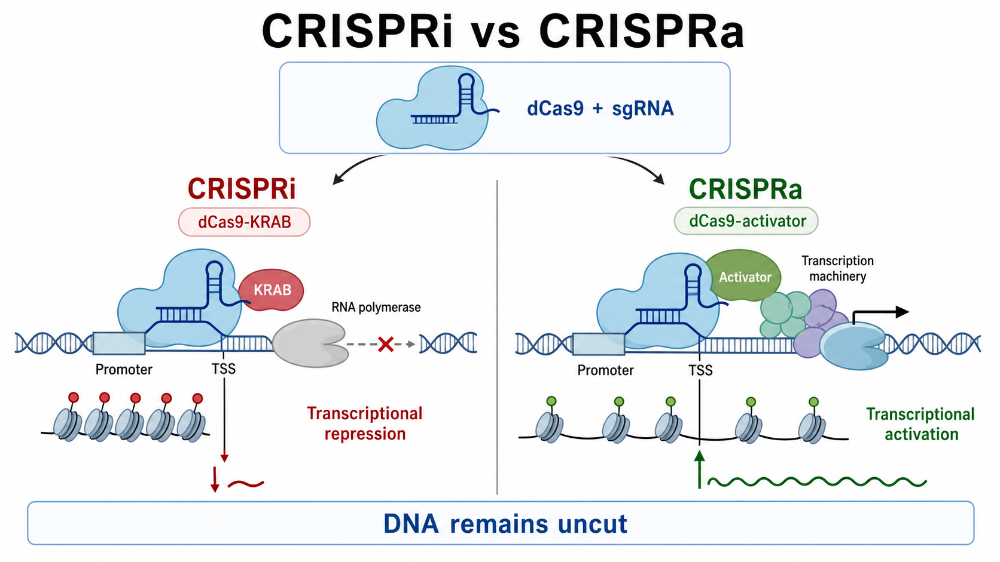

# CRISPRa

CRISPRa（CRISPR activation，CRISPR 激活）是一种由 [sgRNA](sgRNA.md) 引导、利用 [dCas9](dCas9.md) 将转录激活效应器招募到内源基因调控区，从而提高基因转录的可编程 gain-of-function（功能获得）技术。它通常不切断 DNA，也不需要插入外源启动子。

图：CRISPRi 通过 dCas9-抑制效应器降低转录；CRISPRa 通过 dCas9-激活效应器招募转录机器并提高内源 RNA 输出。二者都依赖 sgRNA 与 PAM 提供的位点选择。本图由 Image2 / image-generation model 生成，用于个人学习示意。

## 发展简史

2013 年前后，多项研究证明 dCas9 与转录激活结构域融合后可以按 sgRNA 指定的位置激活哺乳动物内源基因，为 CRISPRa 建立了基础。参考：[Gilbert et al., Cell, 2013](https://doi.org/10.1016/j.cell.2013.06.044)；[Maeder et al., Nature Methods, 2013](https://doi.org/10.1038/nmeth.2598)。

早期 dCas9-VP64 对部分基因的激活较弱，随后出现通过多个激活结构域或信号放大实现更强输出的系统，包括 SunTag、SAM 和 VPR。参考：[Tanenbaum et al., Cell, 2014](https://doi.org/10.1016/j.cell.2014.09.039)；[Konermann et al., Nature, 2015](https://doi.org/10.1038/nature14136)；[Chavez et al., Nature Methods, 2015](https://doi.org/10.1038/nmeth.3312)。

## 适合解决什么问题

- 激活低表达或沉默的内源基因，观察 gain-of-function 表型。
- 做全基因组或定向 [CRISPRa screen（CRISPR 激活筛选）](<../../用(实验流程内容篇)/CRISPR筛选.md>)，寻找耐药、分化或信号调控基因。
- 在不引入外源 coding sequence（编码序列）的情况下提高内源基因表达。
- 同时激活多个基因，研究组合调控或细胞状态转换。
- 与 [CRISPRi](CRISPRi.md) 形成互补的上调/下调证据链。

CRISPRa 不是“精准设定表达量”的万能开关。可达到的激活倍数受基线表达、启动子可及性、TSS 注释、效应器架构、sgRNA 位置和细胞状态共同影响。

## 核心原理

[dCas9](dCas9.md) 保留 sgRNA 引导的 DNA 结合能力，但缺乏典型核酸酶切割活性。把 dCas9 定位到 [转录起始位点](转录起始位点.md)（transcription start site，TSS）附近，并在局部聚集 transcriptional activator（转录激活因子），可以促进染色质开放、转录因子结合或 RNA polymerase（RNA 聚合酶）募集，进而提高目标基因转录。

CRISPRa 激活的是内源位点，因此与普通 cDNA 过表达相比，更可能保留该位点的天然转录本结构、亚细胞调控和部分染色质背景；但它不能保证所有 isoform（转录异构体）按相同比例增加，也不能突破完全不许可的染色质状态。

## 常见系统架构

| 系统 | 主要构成 | 特点 | 需要注意 |
| --- | --- | --- | --- |
| dCas9-VP64 | dCas9 融合 VP64 | 构成简单、适合概念验证 | 对部分内源基因激活较弱 |
| VPR | dCas9 融合 VP64-p65-Rta | 单一融合蛋白携带多个激活结构域 | 载荷较大，表达和递送需优化 |
| SAM | dCas9-VP64 + MS2 修饰 sgRNA + MCP-p65-HSF1 | 通过 sgRNA scaffold 额外招募激活因子，放大明显 | 组件多，guide 必须与 SAM 架构匹配 |
| SunTag | dCas9-重复肽阵列 + scFv-激活蛋白 | 在一个靶位点招募多份激活效应器 | 系统构成较复杂，需确认各组件表达 |

VP64 是由四个 VP16 activation domain（VP16 激活结构域）串联形成的激活模块；p65 是 NF-κB p65 activation domain（NF-κB p65 激活结构域）；HSF1 是 heat shock factor 1（热休克因子 1）；Rta 是 replication and transcription activator（复制与转录激活因子）。这些缩写代表效应器组件，不应只记录“使用了 CRISPRa”而省略具体系统。

## sgRNA 设计逻辑

### 先锁定细胞中的有效 TSS

CRISPRa 通常靶向启动子/TSS 邻近区域。若目标基因有多个启动子或细胞类型特异性转录本，应先确定希望激活哪一个转录起始区域。错误 TSS 是“guide 匹配但没有激活”的常见原因。

### 设计窗口必须与系统匹配

不同 CRISPRa 架构、文库和设计模型对 TSS 相对位置有不同经验规则。不要把某一篇论文的固定窗口当作所有细胞和系统的普遍定律；优先采用与所选效应器和物种匹配的工具，并同时设计多条 sgRNA。Horlbeck 等的研究显示，位置、染色质与序列特征可共同预测 CRISPRa/CRISPRi guide 活性。参考：[Horlbeck et al., eLife, 2016](https://doi.org/10.7554/eLife.19760)。

### 弱激活时可以组合 guide

多个 sgRNA 靶向同一启动子区域有时可增强激活，但也会增加递送复杂度和解释难度。应先验证单条 guide，再判断是否需要组合，并设置总 sgRNA 负荷相当的对照。

## 实验工作流

### 定义需要激活的表达层级

先明确目标是轻度恢复、达到生理高表达范围，还是追求强烈 gain-of-function。只报告 fold change（倍数变化）可能误导：一个低基线基因增加 50 倍，绝对表达量仍可能很低；一个高基线基因增加 2 倍则可能已产生强表型。

### 固定系统后再设计 guide

确定使用 dCas9-VP64、VPR、SAM、SunTag 或其他架构，并确认载体物种、选择标记、启动子和 sgRNA scaffold 是否兼容。不同系统的 guide 骨架不能想当然地互换。

### 建立对照

- non-targeting sgRNA：评估 dCas9-activator、递送和选择本身的影响。
- 已知可被激活的阳性对照基因：验证 CRISPRa 组件完整工作。
- 多个独立目标 sgRNA：避免把单条 guide 的偶然效应当作基因作用。
- cDNA overexpression（cDNA 过表达）或其他正交策略：在关键结论中验证表型方向。

### 分层检测

先用 [RT-qPCR](<../../用(实验流程内容篇)/RT-qPCR.md>) 判断目标转录本是否升高，再检测蛋白和功能表型。若目标是细胞表面分子，可用 [流式细胞术](<../../用(实验流程内容篇)/流式细胞术.md>)；若目标是胞内蛋白，可用 [Western blot](<../../用(实验流程内容篇)/Western blot.md>) 或适合该蛋白的定量方法。

## 结果解析与 troubleshooting

| 结果 | 可能原因 | 优先检查 |
| --- | --- | --- |
| 所有 sgRNA 均无激活 | 系统组件缺失、TSS 错误、靶区不可及 | 阳性对照、组件表达、TSS 与染色质 |
| 只有一条 sgRNA 有效 | 位置和序列活性差异 | 增加独立 sgRNA 并复验 |
| mRNA 增加但蛋白不变 | 翻译受限、蛋白不稳定或检测过早 | 蛋白时间梯度、抗体/检测方法 |
| 激活倍数高但无表型 | 绝对表达仍低、缺少协同因子、模型不响应 | 绝对表达、通路背景、组合激活 |
| non-targeting 对照也有表型 | dCas9-activator 负担、递送毒性或筛选压力 | 降低表达、调整递送、检查对照 |
| 不同细胞系效果差异大 | TSS、染色质和转录因子环境不同 | 在每个模型中重新验证 guide |

## CRISPRa 与常见上调策略对比

| 策略 | 表达来源 | 主要优势 | 主要局限 |
| --- | --- | --- | --- |
| CRISPRa | 内源基因组位点 | 不需克隆完整 ORF，可做大规模筛选和多基因激活 | 依赖 TSS、染色质和效应器，表达量不易精确设定 |
| cDNA 过表达 | 外源表达盒 | 构建后输出直接，可指定 isoform 和标签 | 可能非生理性高表达，载荷受 ORF 大小限制 |
| 启动子 knock-in | 编辑后的内源位点 | 可形成稳定遗传改变 | 需要 DNA 编辑和克隆验证，工作量更大 |
| 小分子/配体刺激 | 内源信号通路 | 操作快速、常可逆 | 特异性受通路网络限制，通常不是单基因定位 |

## 小结

CRISPRa 的价值在于“从内源位点把基因打开”，尤其适合 gain-of-function 筛选、沉默基因激活和多基因调控。实验成功的关键不是简单选择一个 activator，而是让系统架构、sgRNA scaffold、真实 TSS、递送方式和验证层级保持一致。

## 参考来源

- [Gilbert et al., CRISPR-mediated modular RNA-guided regulation of transcription in eukaryotes, Cell, 2013](https://doi.org/10.1016/j.cell.2013.06.044)
- [Maeder et al., CRISPR RNA-guided activation of endogenous human genes, Nature Methods, 2013](https://doi.org/10.1038/nmeth.2598)
- [Tanenbaum et al., A Protein-Tagging System for Signal Amplification in Gene Expression and Fluorescence Imaging, Cell, 2014](https://doi.org/10.1016/j.cell.2014.09.039)
- [Konermann et al., Genome-scale transcriptional activation by an engineered CRISPR-Cas9 complex, Nature, 2015](https://doi.org/10.1038/nature14136)
- [Chavez et al., Highly efficient Cas9-mediated transcriptional programming, Nature Methods, 2015](https://doi.org/10.1038/nmeth.3312)
- [Horlbeck et al., Compact and highly active next-generation libraries for CRISPR-mediated gene repression and activation, eLife, 2016](https://doi.org/10.7554/eLife.19760)
