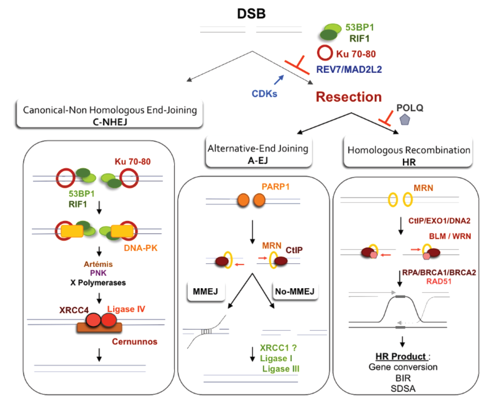

# DNA-PK

DNA-PK（DNA-dependent protein kinase，DNA 依赖性蛋白激酶）是由 DNA-PKcs（DNA-dependent protein kinase catalytic subunit，DNA 依赖性蛋白激酶催化亚基；基因名 `PRKDC`）和 [Ku70–Ku80 complex（Ku70–Ku80 复合物）](Ku70-Ku80复合物.md)共同构成的 DNA 末端依赖性丝氨酸/苏氨酸蛋白激酶复合体。它是 [classical non-homologous end joining（c-NHEJ，经典非同源末端连接）](NHEJ.md)的核心断端组织者，但不是最终连接 DNA 的连接酶。

> 图源：[Gelot et al., The Double-Strand Break Repair Model: From Binarity to Multi-Pathway, *Genes*, 2015](https://doi.org/10.3390/genes6020267)，经 [Wikimedia Commons](https://commons.wikimedia.org/wiki/File:Double-strand_break_repair_pathway_models.png) 获取，CC BY 4.0。左侧显示 Ku70/80 招募 DNA-PK 并组织 Artemis、聚合酶和 XRCC4–LIG4；右侧显示末端切除可把断裂分流至 HR 或替代末端连接。该图是通路概览，不表示所有蛋白严格按单一路线依次进入。

## DNA-PK、DNA-PKcs 与 p-DNA-PKcs 的区别

| 名称 | 实际含义 | 实验中常见读数 |
|---|---|---|
| DNA-PK | DNA-PKcs 加 Ku70/Ku80 形成的完整复合体 | DNA 依赖性激酶活性、复合体组装 |
| DNA-PKcs | 大型催化亚基，由 `PRKDC` 编码 | 总 DNA-PKcs Western blot、定位或敲除 |
| p-DNA-PKcs | DNA-PKcs 某个位点被磷酸化的状态 | p-S2056、T2609 cluster 等位点特异抗体 |

只检测 DNA-PKcs 总蛋白不能证明 DNA-PK 已在断端组装；只检测一个磷酸化位点也不能代表完整 NHEJ 已成功完成。

## 核心组成

### Ku70–Ku80 先识别断端

Ku70（基因名 `XRCC6`）与 Ku80（基因名 `XRCC5`）形成环状异源二聚体，可快速套住暴露的双链 DNA 末端。Ku 既限制不受控降解，也为 DNA-PKcs、Artemis、聚合酶和连接复合体提供装配平台。

Ku 对 DNA 末端的高亲和力使 c-NHEJ 能在多数细胞周期阶段快速竞争断端。它不是简单的静态“盖子”：完成连接后，Ku 必须从已经闭合的 DNA 上移除，否则会妨碍染色质恢复。

### DNA-PKcs 组织保护、桥接与加工转换

DNA-PKcs 是超过 4000 个氨基酸的大型 PIKK（phosphatidylinositol 3-kinase-related kinase，磷脂酰肌醇 3-激酶相关激酶）家族成员。Ku 将其招募到 DNA 末端后，DNA-PKcs 与 DNA、Ku 及另一侧断端复合体共同参与长程突触结构，帮助两端保持在可配对范围内。

DNA-PKcs 结合并不意味着断端永远被封闭。激酶活化和自磷酸化会引起构象变化，使 DNA 末端从保护状态转向可被 Artemis 等加工因子接近的状态。结构研究支持 DNA-PK 在保护与开放加工之间动态转换，而非一次结合后原地不动。参考：[Chen et al., *Molecular Cell*, 2021](https://doi.org/10.1016/j.molcel.2020.12.015)；[Liu et al., *Molecular Cell*, 2022](https://doi.org/10.1016/j.molcel.2021.11.025)。

## 自磷酸化位点应如何理解

DNA-PKcs 存在多个磷酸化簇，常见研究对象包括 ABCDE cluster 和 PQR cluster。不同位点可能调节断端开放、加工、复合体稳定性和释放，功能并非“磷酸化越多，NHEJ 越强”。

| 常用读数 | 较稳妥的解释 | 主要限制 |
|---|---|---|
| p-DNA-PKcs S2056 | 常用作 DNA-PKcs 自磷酸化和断端激活相关读数 | 信号受时间、损伤类型和抗体影响；不能单独证明连接完成 |
| p-DNA-PKcs T2609 cluster | 与损伤后 DNA-PKcs 调控相关 | ATM 等激酶也可贡献部分位点磷酸化，不能简单归为纯自磷酸化 |
| DNA-PK kinase assay | 测量 DNA 依赖性底物磷酸化 | 体外活性不等同于细胞内正确突触和连接 |

磷酸化抗体实验应同时检测总 DNA-PKcs、损伤输入、时间梯度和激酶抑制/遗传缺失对照。

## 在 c-NHEJ 中的主要工作

### 断端保护与突触

Ku–DNA-PKcs 限制断端过早进入长程 [DNA 末端切除](DNA末端切除.md)，并帮助两个断端形成可控突触。此阶段的意义是减少错误断端相遇和染色体易位风险，而不是把两个末端永久锁死。

### 必要的断端加工

若末端带有发夹、受损碱基、不兼容突出端或缺口，直接连接不可行。DNA-PKcs 可调节 Artemis（DNA cross-link repair 1C protein，DNA 交联修复蛋白 1C）核酸酶；Pol μ、Pol λ 等 X family DNA polymerases（X 家族 DNA 聚合酶）可参与填补。加工越多，连接点发生小插入或缺失的概率通常越高。

### 最终连接由其他蛋白完成

XRCC4（X-ray repair cross-complementing protein 4，X 射线修复交叉互补蛋白 4）、XLF 和 DNA ligase IV（DNA 连接酶 IV，LIG4）完成共价连接。DNA-PKcs 负责组织和调控，但不能替代 LIG4 的连接酶反应。

## 生理与疾病背景

- **一般 DSB 修复**：c-NHEJ 是哺乳动物细胞处理大量双链断裂的重要通路。
- **V(D)J recombination（V(D)J 重排）**：DNA-PKcs 与 Artemis 参与打开 RAG 产生的发夹编码端，因此缺陷可影响淋巴细胞发育和免疫功能。
- **放射敏感性**：DNA-PKcs 或核心 NHEJ 因子缺失常导致电离辐射敏感和染色体异常。
- **肿瘤研究**：DNA-PK 抑制可增强部分 DNA 损伤治疗的效应，但结果依赖肿瘤背景、正常组织毒性和替代修复，不能仅凭体外协同直接外推临床。

## DNA-PK、ATM 与 ATR 对比

| 维度 | DNA-PK | [ATM](ATM通路.md) | [ATR](ATR通路.md) |
|---|---|---|---|
| 主要触发结构 | Ku 占据的双链 DNA 末端 | MRN 相关 DSB 信号及染色质环境 | RPA 包被 ssDNA 与复制压力结构 |
| 核心角色 | 组织 c-NHEJ 断端保护、突触和加工 | 放大 DSB 信号并协调检查点与修复 | 协调复制压力、叉稳定和 S/G2 检查点 |
| 共同点 | 均为 PIKK 家族激酶，可在 γH2AX、RPA 等读数上发生交叉 | 同左 | 同左 |
| 不能据此判定 | p-DNA-PKcs 阳性不等于 NHEJ 已完成 | γH2AX 阳性不等于仅 ATM 激活 | p-RPA 阳性不等于仅 ATR 激活 |

## 实验研究策略

### Western blot

[Western blot](<../../用(实验流程内容篇)/Western blot.md>)可检测总 DNA-PKcs、p-S2056 或其他位点。DNA-PKcs 分子量很大，低百分比胶、充分裂解和转膜条件尤其重要；降解片段可能被误认为特异性短条带。

### 免疫荧光与激光微照射

[免疫荧光](<../../用(实验流程内容篇)/免疫荧光.md>)或 [激光微照射](<../../用(实验流程内容篇)/激光微照射.md>)可观察 DNA-PKcs/Ku 在损伤区域的募集。预抽提可降低游离核内背景，但过强会丢失动态结合组分，必须固定同一条件比较。

### 功能性 NHEJ 读数

[报告基因实验](<../../用(实验流程内容篇)/报告基因实验.md>)、连接点测序、克隆形成和染色体畸变分别回答通路输出、序列结果、长期存活和基因组稳定性。单独的焦点或磷酸化条带不能替代这些功能结果。

### 抑制剂与遗传对照

使用 DNA-PK 抑制剂时，应加入 `PRKDC` 敲低/敲除或耐药突变等正交验证，并同步监测细胞周期和毒性。观察到 HR reporter 比例升高，可能来自修复重新分配，也可能来自 NHEJ 细胞死亡后的群体选择，不应直接写成“DNA-PK 抑制促进精准修复”。

## 常见错误与 troubleshooting

| 问题 | 常见原因 | 优先处理 |
|---|---|---|
| 总 DNA-PKcs 条带弱 | 大蛋白降解、胶浓度过高或转膜不足 | 全程低温；加入抑制剂；优化低浓度胶和湿转 |
| p-S2056 很强但修复仍差 | 激活发生但加工、突触或连接步骤失败 | 检查 Ku、Artemis、XRCC4–LIG4 和最终连接产物 |
| 抑制剂处理后 γH2AX 持续升高 | DSB 未解决、复制相关继发损伤或凋亡 | 做时间梯度、死亡控制和 ATM/ATR 交叉读数 |
| DNA-PKcs 焦点少但总蛋白正常 | Ku 招募、断端结构、提取或成像条件异常 | 检查 Ku、预抽提强度和阳性损伤对照 |
| NHEJ reporter 下降但细胞死亡明显 | 通路特异效应与一般毒性混杂 | 在相近存活范围比较，并报告有效细胞数 |

## 关键结论

DNA-PK 是由 Ku70/80 与 DNA-PKcs 组成的动态断端机器。它先保护并组织断端，再通过构象变化和磷酸化允许必要加工，最终把末端交给 XRCC4–LIG4 连接。实验上必须把复合体组装、激酶活性、断端加工和最终连接分层检测。

## 参考来源

- [Zhao et al., The molecular basis and disease relevance of non-homologous DNA end joining, *Nature Reviews Molecular Cell Biology*, 2020](https://doi.org/10.1038/s41580-020-00297-8)
- [Chen et al., Structure of an activated DNA-PK and its implications for NHEJ, *Molecular Cell*, 2021](https://doi.org/10.1016/j.molcel.2020.12.015)
- [Liu et al., Autophosphorylation transforms DNA-PK from protecting to processing DNA ends, *Molecular Cell*, 2022](https://doi.org/10.1016/j.molcel.2021.11.025)
- [Pannunzio et al., Nonhomologous DNA end-joining for repair of DNA double-strand breaks, *Journal of Biological Chemistry*, 2018](https://doi.org/10.1074/jbc.TM117.000374)
- [Gelot et al., The Double-Strand Break Repair Model: From Binarity to Multi-Pathway, *Genes*, 2015](https://doi.org/10.3390/genes6020267)
