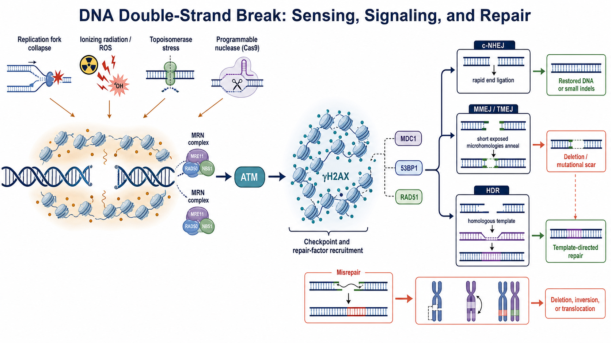

# DNA双链断裂

DNA double-strand break（DNA 双链断裂，DSB）是 DNA 两条互补链在彼此接近的位置同时失去连续性的损伤。与仅影响一条链的缺口不同，DSB 会使染色体局部失去物理连接；若断端被错误连接、长期未修复或在复制过程中进一步恶化，可能形成缺失、倒位、易位或染色体丢失。

图：DSB 可由复制叉崩溃、电离辐射/活性氧、拓扑异构酶应激或 Cas9 等可编程核酸酶产生。MRN complex（MRN 复合物）参与断端感知和 ATM 激活，随后形成以 γH2AX 为代表的染色质信号区域并募集修复因子；断裂可进入 c-NHEJ、MMEJ/TMEJ 或 HDR，也可能因错误连接形成结构变异。本图由 Image2 / image-generation model 生成，用于个人学习示意。

## DSB 不是一种完全相同的损伤

| 类型 | 形成方式 | 实验意义 |
| --- | --- | --- |
| two-ended DSB（双端 DSB） | 一段染色体被切成两个可见断端 | 常见于核酸酶切割或辐射损伤，可发生末端重连或模板修复 |
| one-ended DSB（单端 DSB） | 复制叉遇到缺口或障碍后崩溃，只产生一个可用断端 | 不能靠简单地把两个原始断端接回，通常更依赖复制相关重组修复 |
| simple end（简单断端） | 断端化学结构较规则、损伤较少 | 更可能被快速处理和连接 |
| complex end（复杂断端） | 断端附近同时存在氧化碱基、缺口或不兼容末端 | 需要额外加工，增加序列丢失和错误修复风险 |

“一个 DSB”因此不能只理解为一条整齐的剪刀切口。断端结构、是否位于复制区域、局部染色质状态和细胞周期，都会改变后续修复路径。

## DSB 从哪里来

### 内源性来源

- replication fork collapse（复制叉崩溃）：复制机器遇到单链缺口、DNA 二级结构、DNA-protein crosslink（DNA-蛋白交联）或严重复制压力时形成。
- reactive oxygen species（活性氧，ROS）：先造成碱基和单链损伤；彼此接近的损伤或复制经过未修复位点后可转化为 DSB。
- topoisomerase cleavage complex（拓扑异构酶切割复合物）处理失败：酶与 DNA 的共价中间体未被及时解除，可阻断复制或转录并形成断裂。
- 生理性重排：V(D)J recombination（V(D)J 重组）和 meiotic recombination（减数分裂重组）会有控制地产生 DSB，但需要专门的修复与检查机制。

### 外源性与实验性来源

- ionizing radiation（电离辐射）可在局部产生簇集性 DNA 损伤，断端往往比理想核酸酶切口更复杂。
- 某些化疗药物通过拓扑异构酶捕获、复制压力或交联间接增加 DSB。
- [CRISPR-Cas9](CRISPR-Cas9.md) 等核酸酶可在指定靶位点制造 DSB，用于 [基因敲除](基因敲除.md)、[基因敲入](基因敲入.md) 或结构变异研究。

## 细胞如何识别并放大信号

MRN complex 由 MRE11、RAD50 和 NBS1 组成，可结合断端并促进 ATM（ataxia-telangiectasia mutated，毛细血管扩张性共济失调突变蛋白）激酶激活。MRN 对 ATM 正常响应的重要性可见于 [Uziel et al., EMBO Journal, 2003](https://doi.org/10.1093/emboj/cdg541)。

ATM 随后磷酸化多种底物，其中包括 H2AX histone variant（H2AX 组蛋白变体）；其 Ser139 磷酸化形式称为 γH2AX。γH2AX 会在断裂周围较大的染色质区域扩展，并通过 MDC1（mediator of DNA damage checkpoint protein 1，DNA 损伤检查点介质蛋白 1）等支架招募更多信号与修复因子。γH2AX 与 DSB 的早期联系来自 [Rogakou et al., Journal of Biological Chemistry, 1998](https://doi.org/10.1074/jbc.273.10.5858)。

53BP1（p53-binding protein 1，p53 结合蛋白 1）和 RAD51 等也可形成可观察焦点，但它们代表的是损伤响应结构或修复状态，而不是断端本身。53BP1 参与早期 DSB 应答的研究见 [Schultz et al., Journal of Cell Biology, 2000](https://doi.org/10.1083/jcb.151.7.1381)。

> γH2AX 或 53BP1 focus（焦点）不能在所有条件下被机械地换算成“一个焦点 = 一个 DSB”。焦点可能融合、持续时间不同，也可能受到复制压力、凋亡和染色质背景影响。

## 主要修复路径

| 路径 | 核心逻辑 | 常见结果 | 主要限制 |
| --- | --- | --- | --- |
| [NHEJ](NHEJ.md) / c-NHEJ | 保护、加工并直接连接断端 | 精准重连或小 indel | 断端加工和反复切割可改变序列 |
| [MMEJ](MMEJ.md) / TMEJ | 切除后暴露短微同源序列，再退火和连接 | 带微同源特征的缺失或插入 | 通常留下突变性修复痕迹 |
| [HDR](HDR.md) | 使用姐妹染色单体或外源 [供体模板](供体模板.md) 复制信息 | 高保真修复或预定编辑 | 受模板、细胞周期与递送条件限制 |
| [SSA](单链退火.md) | 较长切除后使断裂两侧重复序列退火 | 删除两段重复序列之间的全部区域 | 结果本质上伴随较大序列丢失 |

通路选择不是一个单独开关。末端切除程度、Ku 与 53BP1-BRCA1 轴、细胞周期、染色质环境、局部序列和修复蛋白状态共同决定一群细胞中各种产物的比例。Repair-seq 等高通量遗传筛选进一步说明，不同基因会以结果特异的方式改变 CRISPR 断裂修复谱。参考：[Hussmann et al., Cell, 2021](https://doi.org/10.1016/j.cell.2021.10.002)。

## DSB 在 CRISPR 实验中的实际含义

Cas9 切开目标位点只是编辑过程的起点，最终得到的是细胞修复后的等位基因集合。局部序列会使某些插入或缺失反复出现，但结果仍会受细胞背景和递送条件影响。

短扩增子测序擅长统计切口附近的小 [indel](indel.md)，却可能漏掉引物结合位点被删除的等位基因、大片段缺失和复杂重排。Cas9 断裂后出现千碱基级缺失与复杂重排已有直接实验报道。参考：[Kosicki et al., Nature Biotechnology, 2018](https://doi.org/10.1038/nbt.4192)。

因此关键项目应把问题拆成三层：

- 是否发生了目标位点切割或损伤响应。
- 修复后形成了哪些局部和结构性等位基因。
- 这些等位基因是否真正改变 RNA、蛋白或细胞功能。

## 如何检测 DSB 或其后果

| 方法 | 主要读出 | 优点 | 不能单独回答的问题 |
| --- | --- | --- | --- |
| γH2AX / 53BP1 immunofluorescence（免疫荧光） | 细胞核内损伤响应焦点 | 可观察单细胞分布与时间变化 | 不能可靠给出每个位点的精确断裂数，也不能确定基因组位置 |
| neutral comet assay（中性彗星实验） | 单细胞 DNA 迁移尾矩 | 比较总体 DSB 负担 | 位点信息有限，样品处理本身会影响结果 |
| pulsed-field gel electrophoresis（脉冲场凝胶电泳，PFGE） | 大 DNA 片段分布 | 适合较高水平、较大尺度断裂 | 灵敏度和位点分辨率有限 |
| break-mapping sequencing（断裂位点测序） | 基因组范围断端位置 | 可定位损伤热点或核酸酶切点 | 建库偏倚和断端化学结构会影响捕获 |
| amplicon / long-read sequencing（扩增子/长读长测序） | 修复后的等位基因 | 直接分析 indel 与部分结构变化 | 测的是修复结果，不是瞬时 DSB 数量 |

选择方法前先明确要测的是“损伤信号”“物理断端”还是“修复产物”。三者相关，但不是同一个变量。

## 常见误读与 troubleshooting

| 观察 | 容易产生的误读 | 优先排查 |
| --- | --- | --- |
| γH2AX 全核强阳性 | DSB 数量极高 | 凋亡、复制压力、固定条件与信号饱和 |
| Cas9 处理后局部 indel 很低 | 没有切割 | 递送失败、切口被精准重连、取样过早/过晚或大缺失逃逸扩增 |
| 短 PCR 扩增失败 | 模板质量差 | 引物位点删除、大片段重排，再使用更外侧引物和正交方法 |
| 单克隆只有局部 Sanger 正确 | 基因型已经完全明确 | 另一等位基因、拷贝数、随机整合和远端结构变化 |
| 抑制一条修复通路后目标产物增加 | 编辑整体更安全 | 同时检查细胞毒性、基因组稳定性和其他异常产物 |

## 小结

DSB 是会中断染色体连续性的高风险 DNA 损伤，也是多种基因编辑策略主动利用的中间状态。正确理解它需要把“断裂本身、损伤信号、修复通路和最终等位基因”分开观察；任何单一焦点染色或短扩增子结果都不足以覆盖全部层级。

## 参考来源

- [Rogakou et al., DNA double-stranded breaks induce histone H2AX phosphorylation on serine 139, Journal of Biological Chemistry, 1998](https://doi.org/10.1074/jbc.273.10.5858)
- [Schultz et al., p53 binding protein 1 is an early participant in the cellular response to DNA double-strand breaks, Journal of Cell Biology, 2000](https://doi.org/10.1083/jcb.151.7.1381)
- [Uziel et al., Requirement of the MRN complex for ATM activation by DNA damage, EMBO Journal, 2003](https://doi.org/10.1093/emboj/cdg541)
- [Xie et al., Distinct roles of chromatin-associated proteins MDC1 and 53BP1 in mammalian double-strand break repair, Molecular Cell, 2007](https://doi.org/10.1016/j.molcel.2007.12.005)
- [Kosicki et al., Repair of double-strand breaks induced by CRISPR-Cas9 leads to large deletions and complex rearrangements, Nature Biotechnology, 2018](https://doi.org/10.1038/nbt.4192)
- [Hussmann et al., Mapping the genetic landscape of DNA double-strand break repair, Cell, 2021](https://doi.org/10.1016/j.cell.2021.10.002)
