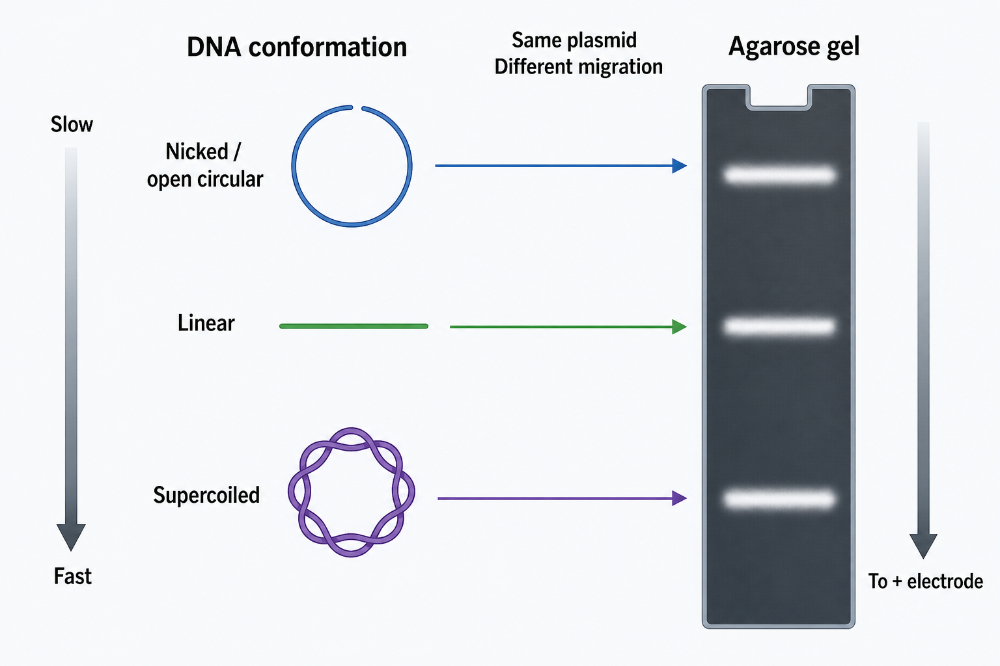

# DNA构象

DNA 构象（DNA conformation）是指 DNA 分子在空间中的形态状态。对于质粒 DNA，最常见的构象包括 supercoiled DNA（超螺旋 DNA）、nicked/open circular DNA（缺口开环 DNA）和 linear DNA（线性 DNA）。这些构象会显著影响 [琼脂糖凝胶电泳](<../../用(实验流程内容篇)/琼脂糖凝胶电泳.md>) 中的迁移位置。

图源：Image2 生成的质粒 DNA 构象示意图；同一个 plasmid（质粒）如果分别处于开环、线性和超螺旋状态，在凝胶上会出现不同迁移位置。

## 三种常见质粒构象

| 构象 | 英文 | 形成原因 | 凝胶迁移趋势 |
| --- | --- | --- | --- |
| 超螺旋 | Supercoiled | 闭合环状 DNA 被进一步扭曲压缩 | 最紧凑，通常迁移最快，条带最低 |
| 线性 | Linear | 两条链都被切开，形成线性分子 | 迁移居中，最适合按 DNA ladder 判断大小 |
| 缺口开环 | Nicked / open circular | 一条链被 nick，环状结构松弛 | 最松散，迁移最慢，条带最高 |

Thermo Fisher 的核酸电泳资料明确说明，supercoiled DNA 通常跑得最快、显示在胶的较低位置；linear DNA 在中间；nicked circular DNA 迁移最慢、位于较高位置。参考：[Thermo Fisher Nucleic Acid Gel Electrophoresis Troubleshooting](https://www.thermofisher.com/us/en/home/technical-resources/technical-reference-library/nucleic-acid-purification-analysis-support-center/nucleic-acid-electrophoresis-blotting-support/nucleic-acid-electrophoresis-blotting-support-troubleshooting.html)。

NEB 的 FAQ 也说明，质粒 DNA 的主要形式通常是 supercoiled；open circular/nicked form 会迁移到比 linear form 更高的位置，concatamers/multimers 也可能出现在更高分子量位置；TAE 和 TBE 中相对位置可能有所差异。参考：[NEB additional bands on plasmid gel](https://www.neb.com/en-us/faqs/what-are-the-additional-bands-i-see-on-the-gel)。

## 为什么同一质粒会出现多个条带

未酶切质粒不是单一“线性尺子”。同一个 5 kb 质粒可能同时有：

- 大部分完整闭合超螺旋分子。
- 少量被机械剪切、冻融、碱裂解或核酸酶作用造成 nick 的开环分子。
- 少量线性化或断裂分子。
- 二聚体、concatamer（串联多聚体）或其他拓扑形式。

因此未切质粒跑胶出现多个条带不一定代表污染，也不一定代表质粒大小有多个版本。需要结合 [质粒提取](<../../用(实验流程内容篇)/质粒提取.md>)、[限制性内切酶酶切](<../../用(实验流程内容篇)/限制性内切酶酶切.md>) 和测序结果判断。

## 读胶时的关键原则

| 问题 | 判断方法 |
| --- | --- |
| 想知道质粒真实大小 | 线性化后和 DNA ladder 比较 |
| 未切质粒有多个条带 | 优先考虑构象差异，而不是马上判定污染 |
| 超螺旋条带比预期“小” | 因为迁移快，不能按线性 DNA ladder 直接读大小 |
| 开环条带很高 | 可能是 nicked/open circular form 增多 |
| 出现更高条带 | 可能是二聚体、多聚体或大分子构象 |

Addgene 的质粒酶切验证文章也提醒，未切 plasmid DNA 跑胶时常见 relaxed/nicked、linear 和 supercoiled 等不同构象；如果 digest lane 看起来像 uncut lane，需要怀疑酶切失败。参考：[Addgene Plasmids 101: Restriction Digest Analysis](https://blog.addgene.org/plasmids-101-how-to-verify-your-plasmid)。

## 与实验操作的关系

| 操作因素 | 可能影响 |
| --- | --- |
| 碱裂解过度 | 可能增加异常构象或变性形式 |
| 反复冻融 | 增加 nicked/open circular 分子 |
| 剧烈吹打 | 机械剪切，尤其影响大质粒 |
| 核酸酶污染 | 导致 nick 或降解 |
| 染料过量或预染方式 | 可能改变迁移表现 |

Thermo Fisher 的 troubleshooting 页面也提醒，不同 plasmid conformation 会显示不同电泳迁移率，且过量 intercalating dye 可能改变质粒构象或迁移。参考：[Thermo Fisher anomalous migration troubleshooting](https://www.thermofisher.com/de/en/home/life-science/cloning/cloning-learning-center/invitrogen-school-of-molecular-biology/na-electrophoresis-education/na-electrophoresis-troubleshooting.html)。

## 常见错误

| 错误 | 为什么错 | 正确做法 |
| --- | --- | --- |
| 用未切质粒条带直接估算大小 | 构象影响迁移 | 线性化后判断大小 |
| 看到 3 条带就认为有 3 个质粒 | 常见构象差异即可造成多条带 | 跑 uncut + single digest + double digest |
| 超螺旋条带越低就认为片段越小 | 超螺旋更紧凑，迁移更快 | 看酶切后的线性条带 |
| 忽略 open circular 增多 | 可能提示提取或储存损伤 | 检查提取、冻融和核酸酶污染 |

## 小结

DNA 构象解释了质粒跑胶中最常见的“看起来大小不对”和“同一质粒多个条带”。对于质粒质控，未切胶看完整性和构象，酶切胶看大小和结构，测序看序列；三者不能互相替代。

## 参考来源

- [Thermo Fisher Nucleic Acid Gel Electrophoresis Troubleshooting](https://www.thermofisher.com/us/en/home/technical-resources/technical-reference-library/nucleic-acid-purification-analysis-support-center/nucleic-acid-electrophoresis-blotting-support/nucleic-acid-electrophoresis-blotting-support-troubleshooting.html)
- [Thermo Fisher Five Considerations for the Nucleic Acid Gel Electrophoresis Process](https://www.thermofisher.com/nz/en/home/life-science/cloning/cloning-learning-center/invitrogen-school-of-molecular-biology/na-electrophoresis-education/na-electrophoresis-considerations.html)
- [NEB FAQ: What are the additional bands I see on the gel?](https://www.neb.com/en-us/faqs/what-are-the-additional-bands-i-see-on-the-gel)
- [Addgene Plasmids 101: Restriction Digest Analysis](https://blog.addgene.org/plasmids-101-how-to-verify-your-plasmid)
