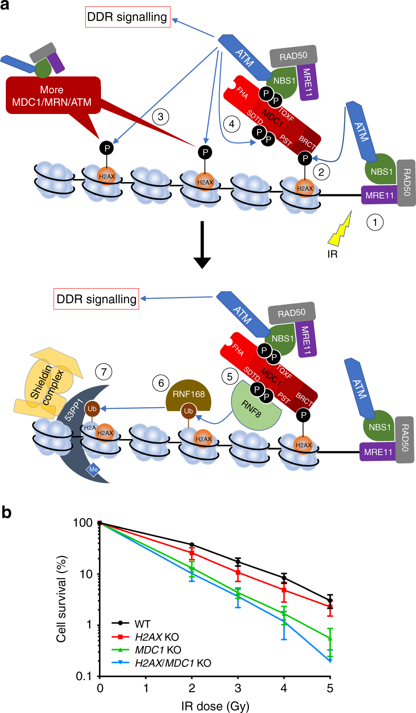

# H2AX 与 γH2AX

H2AX（H2A histone family member X，H2A 组蛋白家族成员 X）是核心组蛋白 H2A 的一种变体；γH2AX（gamma-H2AX，γ-H2AX）则是 H2AX 的第 139 位丝氨酸（Ser139）被磷酸化后的状态。二者不是两个不同基因，也不能把“检测到 H2AX”直接解释为“发生了 DNA 损伤”。

γH2AX 是 [DNA 双链断裂](DNA双链断裂.md)及复制压力研究中最常用的染色质损伤标志之一。它既参与损伤信号放大，也常被当作实验读数，但它不是断裂本身，更不等同于已经完成或尚未完成的修复。

> 图源：[MDC1 PST-repeat region promotes histone H2AX-independent chromatin association and DNA damage tolerance](https://doi.org/10.1038/s41467-019-12929-5)，Figure 1，开放获取。图 a 展示 MRN–ATM–γH2AX–MDC1–RNF8–RNF168–53BP1/Shieldin 信号级联；图 b 展示 H2AX 或 MDC1 缺失对电离辐射后克隆形成存活的影响。图中的编号是机制步骤，不代表严格的时间互斥阶段。

## H2AX 为什么特殊

普通 H2A 与 H2AX 都参与核小体构成，但 H2AX 的 C 端带有可被磷酸化的 SQEY 基序。发生 DNA 损伤后，磷脂酰肌醇 3-激酶相关蛋白激酶家族可磷酸化 Ser139，产生 γH2AX。

| 激酶 | 更常见的触发背景 | 解读重点 |
|---|---|---|
| [ATM](ATM通路.md) | 经典 DNA 双链断裂、电离辐射 | 通常是 DSB 周围 γH2AX 扩展的主要驱动者 |
| DNA-PK（DNA-dependent protein kinase，DNA 依赖性蛋白激酶） | DSB 末端结合、非同源末端连接环境 | 可与 ATM 部分重叠，尤其在 ATM 受限时 |
| ATR（ataxia telangiectasia and Rad3-related，毛细血管扩张性共济失调和 Rad3 相关蛋白） | 复制叉停滞、单链 DNA 暴露 | 复制压力相关 γH2AX 不应自动等同于直接产生的 DSB |

因此，“γH2AX 阳性”首先说明细胞启动了损伤或复制压力相关染色质应答，具体损伤类型仍需结合处理方式、时间、细胞周期及其他标志物判断。

## 从断裂到大范围 γH2AX 结构域

[MRN 复合物](MRN复合物.md)识别并结合断裂区域，促进 ATM 招募和活化。ATM 随后磷酸化断裂附近核小体中的 H2AX。γH2AX 的 C 端磷酸化尾部被 [MDC1](MDC1.md) 的串联 BRCT 结构域识别，MDC1 又保留更多 MRN–ATM，从而形成正反馈。

结果不是只在断口上的一个“点”，而是在断裂两侧可扩展至较大染色质范围的 γH2AX 结构域。它的主要价值是把微小的 DNA 损伤事件转换为足以募集和组织多种应答蛋白的空间平台。

## γH2AX 的功能

- **放大损伤信号**：为 MDC1 提供高密度结合位点，帮助 ATM–MRN 信号沿邻近染色质扩展。
- **组织修复因子**：间接支持 RNF8–RNF168 泛素信号、53BP1 和 BRCA1 相关复合物的聚集。
- **维持基因组稳定性**：H2AX 缺失会增加辐射敏感性、染色体异常及重组调控缺陷。
- **提供实验读数**：免疫荧光、流式细胞术和 Western blot 均可检测 γH2AX，但它们回答的问题并不相同。

## 常见图像模式及其含义

| 观察模式 | 常见解释 | 不能单独得出的结论 |
|---|---|---|
| 少量离散核内焦点 | 局灶性损伤结构域或未解决损伤 | 一个焦点严格等于一个 DSB |
| 焦点数量随处理后短时间上升 | 损伤诱导与信号建立 | 所有焦点都将进入同一种修复途径 |
| 随恢复时间下降 | 损伤信号消退、修复推进或受损细胞丢失 | DNA 已完全且准确修复 |
| S 期细胞弥散或多焦点升高 | 复制压力或复制相关损伤 | 一定由外源性 DSB 直接造成 |
| 全核强阳性 | 严重复制压力、广泛损伤或凋亡相关 DNA 片段化 | 可按普通焦点计数方式定量 |

凋亡细胞可出现极强、近似全核的 γH2AX 信号。若实验处理可能诱导死亡，应联合核形态、活死染色或凋亡标志物排除把凋亡晚期细胞误当作“大量可修复 DSB”。

## 为什么一个焦点不等于一个断裂

焦点是显微镜分辨率下的信号集合。多个相邻断裂可能融合为一个焦点，一个复杂损伤也可能形成不规则结构；焦点大小和亮度还会受到染色质状态、抗体、曝光、物镜、图像分割参数和损伤后时间影响。

如果研究目标是估算损伤负担，应在固定成像条件下比较同批样本，并同时报告至少一种清晰的定量单位，例如每个细胞的焦点数、阳性细胞比例、单核总强度或焦点面积。不要在同一分析中无说明地混用这些指标。

## 与其他损伤标志物的区别

| 标志物 | 主要反映内容 | 与 γH2AX 联用的价值 |
|---|---|---|
| [53BP1](53BP1.md) | 识别 H2AK15ub 与 H4K20me2 形成的损伤染色质状态 | 共定位更支持成熟 DSB 染色质应答，而非单纯 γH2AX 升高 |
| RPA（replication protein A，复制蛋白 A） | 单链 DNA 暴露 | 帮助识别复制压力或 DNA 末端切除 |
| RAD51（RAD51 recombinase，RAD51 重组酶） | 同源重组链交换机器装配 | 提示部分损伤进入 HR，而非代表全部 DSB |
| p-ATM | ATM 活化 | 支持 ATM 依赖的上游损伤信号，但不等于修复完成 |
| cleaved caspase-3 | 凋亡执行阶段 | 帮助排除凋亡相关全核 γH2AX |

## 实验检测策略

### 免疫荧光焦点

[免疫荧光](<../../用(实验流程内容篇)/免疫荧光.md>)适合回答“哪些细胞阳性、焦点位于何处、是否与 53BP1 等因子共定位”。

- 预先定义焦点阈值、核分割和排除全核强阳性细胞的规则。
- 所有比较组使用相同曝光、增益、物镜和分析参数。
- 至少记录基线、损伤峰值附近和恢复期，而不是只看单一时间点。
- 若细胞周期明显影响结果，可联合 EdU、Cyclin A 或 DNA 含量分层。

### 流式细胞术

[流式细胞术](<../../用(实验流程内容篇)/流式细胞术.md>)适合快速比较大量细胞的 γH2AX 强度，并与 DNA 含量或细胞周期联合分析。它牺牲了空间信息，因此无法判断焦点共定位和局部结构。

### Western blot

[Western blot](<../../用(实验流程内容篇)/Western blot.md>)可比较群体水平 γH2AX 总量，适合时间梯度和剂量梯度。应同时检测总 H2AX 或合适的组蛋白/总蛋白归一化指标，避免仅用普通胞质蛋白作为唯一上样参照。

## 推荐的最小证据组合

仅凭一种 γH2AX 读数通常不足以证明“某处理造成 DSB 并改变修复”。较稳妥的组合是：

- γH2AX 时间序列，而非单一终点；
- γH2AX 与 53BP1、RPA 或 RAD51 中至少一种机制相关标志物；
- 细胞周期或复制状态信息；
- 细胞死亡控制；
- 若要声称改变修复结局，再加入克隆形成、彗星实验或途径特异报告系统。

## 常见错误与 troubleshooting

| 问题 | 常见原因 | 调整策略 |
|---|---|---|
| 未处理组背景很高 | 细胞过密、复制压力、污染、固定不合适或曝光过度 | 检查培养状态；缩短曝光；设置第二抗体对照；按细胞周期分层 |
| 所有细胞均全核强阳性 | 损伤剂量过高或大量凋亡 | 降低剂量；增加早期时间点；联合凋亡标志物 |
| 焦点在恢复期不下降 | 持续损伤、修复缺陷、时间窗口不合适 | 延长时间序列；检查细胞活性；联合 53BP1/RAD51 和功能性存活读数 |
| Western blot 增加但焦点数不明显 | 单焦点强度/面积增加、全核信号或群体异质性 | 同时分析每核总强度、焦点面积和阳性细胞比例 |
| 不同批次焦点数差异大 | 成像和分割参数漂移 | 保存分析流程；使用同批阳性对照；盲法统一重分析 |

## 关键结论

γH2AX 最适合被理解为“损伤周围被放大的染色质信号平台”。它非常敏感，但并不天然特异于某一种损伤、某一条修复途径或某一种修复结局。把时间、空间、细胞周期和第二标志物加入实验设计，才会把一个常见染色信号转化为可靠的机制证据。

## 参考来源

- Rogakou EP, et al. DNA double-stranded breaks induce histone H2AX phosphorylation on serine 139. *J Biol Chem*. 1998. [DOI](https://doi.org/10.1074/jbc.273.10.5858)
- Bassing CH, et al. Increased ionizing radiation sensitivity and genomic instability in the absence of histone H2AX. *PNAS*. 2002. [DOI](https://doi.org/10.1073/pnas.122228699)
- Celeste A, et al. H2AX haploinsufficiency modifies genomic stability and tumor susceptibility. *Cell*. 2003. [DOI](https://doi.org/10.1016/S0092-8674(03)00567-1)
- Xie A, et al. Control of sister chromatid recombination by histone H2AX. *Mol Cell*. 2004. [DOI](https://doi.org/10.1016/j.molcel.2004.12.007)
- Cleaver JE. γH2AX: biomarker of damage or functional participant in DNA repair “all that glitters is not gold!”. *Photochem Photobiol*. 2011. [DOI](https://doi.org/10.1111/j.1751-1097.2011.00995.x)
- Salguero I, et al. MDC1 PST-repeat region promotes histone H2AX-independent chromatin association and DNA damage tolerance. *Nat Commun*. 2019. [DOI](https://doi.org/10.1038/s41467-019-12929-5)
