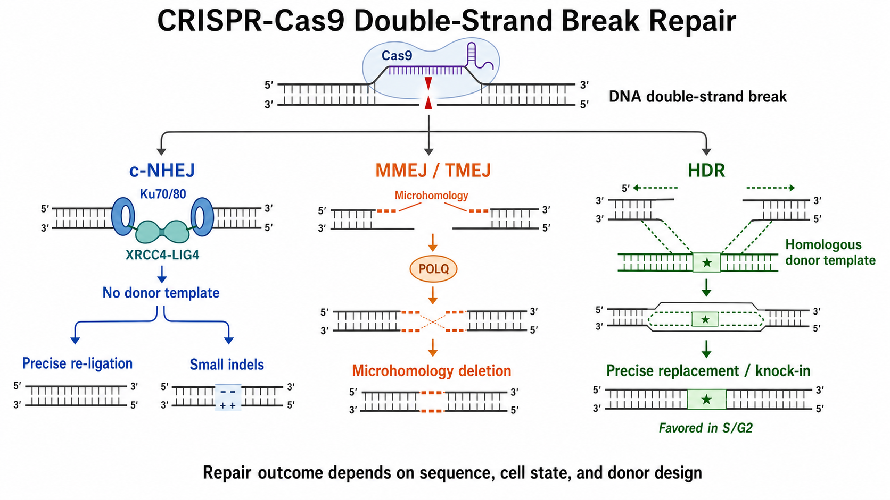

# HDR

HDR（homology-directed repair，同源定向修复）是利用与断裂区域同源的 DNA 序列作为信息模板，修复 DNA 损伤并复制特定序列改变的一组机制。在 [CRISPR-Cas9](CRISPR-Cas9.md) 实验语境中，HDR 常用于点突变、标签插入、序列替换和 [knock-in（基因敲入）](基因敲入.md)。

图：Cas9 双链断裂后，末端连接可直接处理断端，而 HDR 需要同源模板并复制目标改变。实际结果由切口位置、细胞状态、供体形式和验证策略共同决定。本图由 Image2 / image-generation model 生成，用于个人学习示意。

## 术语需要先分清

实验室中常把所有“加同源供体得到精准改变”的结果统称为 HDR，但其分子机制并不一定完全相同。

| 名称 | 英文全称 | 核心含义 |
| --- | --- | --- |
| HDR | homology-directed repair，同源定向修复 | 使用同源序列指导修复的总称 |
| HR | [homologous recombination（同源重组）](同源重组.md) | 通常涉及较长同源序列和 RAD51 等重组机制 |
| SSTR | [single-strand template repair（单链模板修复）](SSTR.md) | 使用 ssODN 等单链供体的修复，可与经典 HR 机制不同 |
| gene conversion | gene conversion，基因转换 | 从同源模板复制信息而不发生互惠交换 |

因此，使用 ssODN（single-stranded oligodeoxynucleotide，单链寡聚脱氧核苷酸）得到精准改变时，写成“template-directed editing（模板指导编辑）”或明确标注 SSTR，往往比笼统假定为经典 HR 更严谨。Richardson 等证明人细胞 Cas9 诱导的 SSTR 依赖 Fanconi anemia pathway（范可尼贫血通路），提示其与普通双链模板 HR 并非完全相同。参考：[Richardson et al., Nature Genetics, 2018](https://doi.org/10.1038/s41588-018-0174-0)。

## 基本修复逻辑

### 产生可使用同源模板的断端

DNA double-strand break（DNA 双链断裂）产生后，部分断端会发生 5' end resection（5' 端切除），形成 3' single-stranded DNA（3' 单链 DNA）区域。末端切除既是同源重组的入口，也会影响修复通路选择。

### 寻找并配对同源序列

在经典同源重组中，RAD51 等因子促进单链 DNA 寻找并侵入同源模板；细胞可利用 sister chromatid（姐妹染色单体）完成高保真修复。CRISPR 精准编辑则常额外提供带有目标改变的外源供体。

### 复制目标序列并恢复染色体

DNA polymerase（DNA 聚合酶）以供体为模板延伸，随后经过分支处理、缺口填补和连接，使供体中的目标碱基、标签或插入片段进入基因组。

## 为什么 HDR 通常比 NHEJ 难

[NHEJ](NHEJ.md) 可在更广泛的细胞状态下快速处理断端，而经典同源修复通常在 [细胞周期](细胞周期.md) 的 S/G2 期更有利。非分裂细胞、缓慢增殖细胞、原代细胞和状态不佳的细胞常表现出较低模板指导编辑效率。

此外，精准结果必须同时满足多个条件：Cas9 在正确位置切割、供体到达细胞核、同源臂被正确识别、目标改变被复制、编辑后位点不被再次切割，并且细胞在这些操作后仍能存活。

Lin 等通过控制 Cas9 RNP（ribonucleoprotein，核糖核蛋白复合物）递送时间提高人细胞 HDR，证明细胞周期和递送时序会显著影响结果。参考：[Lin et al., eLife, 2014](https://doi.org/10.7554/eLife.04766)。

## 常见供体形式

| 供体 | 适合改变 | 优势 | 主要局限 |
| --- | --- | --- | --- |
| ssODN | 点突变、小片段替换、小标签 | 合成方便、无需克隆 | 长度受限，SSTR 机制和方向性需考虑 |
| linear dsDNA（线性双链 DNA） | 中等片段插入 | 制备直接，可携带较大 payload | 细胞毒性、降解和随机整合风险 |
| plasmid donor（质粒供体） | 较大标签、报告基因或选择盒 | 载荷大、便于保存和扩增 | 需要克隆，可能出现 backbone integration（骨架整合） |
| viral donor（病毒供体） | 难递送细胞或较大供体 | 某些细胞中递送效率较好 | 载荷、安全、生产和机构审批要求更高 |

供体的选择不是单纯按“越大越好”。应同时考虑编辑尺寸、细胞类型、递送方式、是否需要筛选、验证难度和随机整合风险。

## 供体设计的关键变量

### 切口到目标改变的距离

Cas9 切口通常越接近预定修改位点，供体中的改变越容易被纳入修复，但最佳距离依赖供体类型和位点。若附近没有合适 [PAM序列](PAM序列.md)，可考虑另一条链、其他 Cas 变体或 [碱基编辑](碱基编辑.md) / [Prime editing](<Prime editing.md>) 等不依赖相同 HDR 几何条件的方案。

### 同源臂

homology arm（同源臂）必须与目标基因组版本和细胞基因型一致。ssODN 的同源臂较短，双链供体通常需要更长同源区域；具体长度没有脱离细胞、载荷和递送方式的统一最佳值。

### 防止再次切割

若 HDR 后的序列仍保留完整 sgRNA 靶点和 PAM，Cas9 可能再次切割已正确编辑的等位基因。可在不改变目标功能的前提下设计 PAM-blocking mutation（PAM 阻断突变）或 guide-binding-site blocking mutation（guide 结合位点阻断突变）。任何额外 silent mutation（同义突变）都应评估剪接、调控元件和密码子使用影响。

### 供体链和不对称性

ssODN 的链方向和同源臂不对称可能影响效率。Richardson 等基于 Cas9 切割后 DNA 链释放的不对称性优化 ssDNA donor（单链 DNA 供体），说明供体方向不是可忽略的格式细节。参考：[Richardson et al., Nature Biotechnology, 2016](https://doi.org/10.1038/nbt.3481)。

## 实验工作流

### 明确最终等位基因

在设计 guide 前先写出预期编辑后序列，包括目标改变、标签 reading frame（阅读框）、linker（连接肽）、PAM 阻断突变和所有同义改变。不要只保存一张示意图，必须保留可直接比对的完整序列。

### 选择切口和供体

综合切口距离、on-target 活性、[脱靶效应](脱靶效应.md)、供体形式和编辑后再切割风险，筛选多个候选方案。对关键项目，可并行测试多条 sgRNA 或不同供体方向。

### 共同递送编辑系统和供体

可使用 Cas9 plasmid、mRNA 或 [CRISPR RNP](<CRISPR RNP.md>) 配合供体。RNP 作用窗口较短，常适合需要限制 Cas9 持续表达的实验；递送基础见 [细胞转染](<../../用(实验流程内容篇)/细胞转染.md>)。

### 恢复、富集和克隆化

递送后先允许细胞恢复，再按设计进行荧光、抗生素或其他富集。筛选只能提高候选比例，不能证明精准整合。是否需要单克隆取决于实验目的：pooled population 可做初筛，稳定精准细胞系通常需要单克隆和多个独立阳性克隆。

## 精准敲入的验证闭环

### 不能只做一条 junction PCR

至少考虑以下层级：

- 5' junction PCR：确认插入片段左端与基因组正确连接。
- 3' junction PCR：确认插入片段右端与基因组正确连接。
- outside-out PCR（外侧-外侧 PCR）：用同源臂外的引物跨越整个编辑区域，减少供体残留造成的假阳性。
- 内部测序：确认 payload、linker、点突变和 reading frame 正确。
- 野生型等位基因检测：判断杂合、纯合、多拷贝或混合基因型。
- 拷贝数和随机整合检查：重要克隆应排除额外供体或 plasmid backbone 随机插入。

PCR 引物若位于供体内部或同源臂之内，残留供体 DNA 就可能产生假阳性。外侧基因组引物和完整产物测序比单一短片段 PCR 更有说服力。

### 基因型正确还要验证功能

标签 knock-in 应验证蛋白大小、定位和功能；启动子或调控区编辑应验证表达；疾病突变模型应检查下游表型。精准序列不保证编辑后的细胞仍保持正常生物学状态。

## 常见异常与 troubleshooting

| 异常 | 常见原因 | 调整方向 |
| --- | --- | --- |
| 有切割但 HDR 很低 | 切口离目标太远、供体递送差、细胞状态/周期不利 | 优化 guide、供体形式、递送和时序 |
| junction PCR 阳性但外侧 PCR 阴性 | 供体残留、随机整合或局部不完整整合 | 改用同源臂外引物并测序 |
| 一端 junction 正确，另一端异常 | 部分整合、NHEJ 捕获或复杂重排 | 同时检查两端、全长和拷贝数 |
| 阳性克隆仍含野生型等位基因 | 杂合编辑、非整倍体或多拷贝基因 | 做等位基因分型和克隆测序 |
| 正确编辑后又出现 indel | 编辑后靶点仍被 Cas9 识别 | 加入合理阻断突变或缩短 Cas9 活性窗口 |
| 细胞死亡严重 | 递送毒性、供体毒性、筛选过强或 DSB 负担 | 降低操作压力并重新平衡效率与存活 |
| 多个阳性克隆表型不一致 | 克隆效应、额外整合、复杂基因型 | 多克隆比较并做拷贝数/功能验证 |

## HDR 与相近编辑策略对比

| 策略 | 是否需要 DSB | 是否需要供体 | 适合改变 | 主要限制 |
| --- | --- | --- | --- | --- |
| HDR / SSTR | 通常是 | 是 | 点突变、标签、序列替换和较大 knock-in | 效率和细胞周期依赖，验证复杂 |
| NHEJ | 是 | 通常否 | knockout、小 indel、删除 | 结果混杂，可能有大缺失/重排 |
| 碱基编辑 | 通常不产生 DSB | 不使用经典同源供体 | 特定单碱基转换 | 编辑窗口、旁观者编辑和可编辑类型受限 |
| Prime editing | 通常不产生 DSB | 使用 pegRNA 携带模板信息 | 小替换、插入和删除 | 系统复杂，位点依赖明显 |

不要因为 HDR 效率低就默认加入 DNA repair inhibitor（DNA 修复抑制剂）。改变修复通路可能同时影响细胞存活、基因组稳定性和修复产物分布，需要在机构安全要求和充分对照下单独评估。

## 小结

HDR 的本质是“让细胞从一个同源模板复制指定信息”，不是“Cas9 自动精准修改”。成功依赖切口位置、供体结构、细胞周期、递送时序、再切割阻断和严格验证。尤其要防止把供体残留或单端 junction 阳性误判为完整、定点、单拷贝 knock-in。

## 参考来源

- [Lin et al., Enhanced homology-directed human genome engineering by controlled timing of CRISPR/Cas9 delivery, eLife, 2014](https://doi.org/10.7554/eLife.04766)
- [Richardson et al., Enhancing homology-directed genome editing by catalytically active and inactive CRISPR-Cas9 using asymmetric donor DNA, Nature Biotechnology, 2016](https://doi.org/10.1038/nbt.3481)
- [van Overbeek et al., DNA Repair Profiling Reveals Nonrandom Outcomes at Cas9-Mediated Breaks, Molecular Cell, 2016](https://doi.org/10.1016/j.molcel.2016.06.037)
- [Richardson et al., CRISPR-Cas9 genome editing in human cells occurs via the Fanconi anemia pathway, Nature Genetics, 2018](https://doi.org/10.1038/s41588-018-0174-0)
- [Brinkman et al., Kinetics and Fidelity of the Repair of Cas9-Induced Double-Strand DNA Breaks, Molecular Cell, 2018](https://doi.org/10.1016/j.molcel.2018.04.016)
