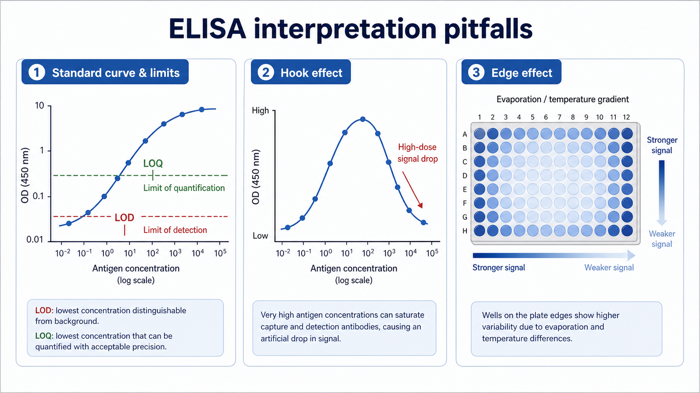

# LOQ

LOQ（limit of quantitation，定量限）是指一个检测方法能在可接受 precision（精密度）和 accuracy（准确度）下进行定量的最低或边界浓度；在生物分析语境中，常进一步分为 LLOQ（lower limit of quantitation，定量下限）和 ULOQ（upper limit of quantitation，定量上限）。



图：ELISA 数据解析常见边界和异常。LOQ 是“可以可靠报告数值”的边界，而不是单纯能看到信号。本图由 Image2 / image-generation model 生成，用于个人学习笔记示意。

## 一句话理解

LOQ 回答的问题是：“这个浓度是否已经进入可以信任的定量范围？”

在 [ELISA](<../../用(实验流程内容篇)/ELISA.md>) 中，读数高于 [LOD](LOD.md) 只能说明可能检测到目标物；只有进入 LOQ 以上、ULOQ 以下的 validated range（已验证范围），才更适合报告具体浓度。

ICH Q2(R2) 对 quantitation limit（定量限）的定义强调最低可定量水平需要合适的 precision 和 accuracy；ICH M10 则在 bioanalytical method validation（生物分析方法验证）中使用 LLOQ 和 ULOQ 描述 calibration range（校准范围）的上下边界。参考：[ICH Q2(R2) Validation of Analytical Procedures](https://database.ich.org/sites/default/files/ICH_Q2%28R2%29_Guideline_2023_1130.pdf)；[ICH M10 Bioanalytical Method Validation](https://database.ich.org/sites/default/files/M10_Guideline_Step4_2022_0524.pdf)。

## LLOQ 和 ULOQ

| 概念 | 英文全称 | 中文 | 含义 |
| --- | --- | --- | --- |
| LLOQ | Lower limit of quantitation | 定量下限 | 可以可靠定量的最低浓度 |
| ULOQ | Upper limit of quantitation | 定量上限 | 可以可靠定量的最高浓度 |
| Quantifiable range | 可定量范围 | 定量范围 | LLOQ 到 ULOQ 之间 |
| Reportable range | 可报告范围 | 报告范围 | 方法和稀释规则允许报告的范围 |

在免疫检测中，ULOQ 同样重要。高浓度样本如果超出 ULOQ，直接读出的浓度可能不可靠，需要稀释后重新测定；如果是夹心免疫检测，还要警惕 [Hook效应](Hook效应.md)。

## LOQ vs LOD

| 项目 | LOD | LOQ |
| --- | --- | --- |
| 关注点 | 是否检出 | 是否可准确定量 |
| 是否一定能报告浓度 | 不一定 | 是，在验证范围内 |
| 对重复性要求 | 较低 | 较高 |
| ELISA 结果处理 | below LOD / detected but not quantifiable | reportable concentration |
| 和标准曲线关系 | 低端统计边界 | 可接受定量范围边界 |

如果样本低于 LLOQ，常见报告方式是 `< LLOQ`，而不是把软件外推的浓度直接填入统计表。

## ELISA 中如何判断

商业 kit 通常会给出 sensitivity（灵敏度）、range（范围）或 detection limit（检出限）。但这些词在不同厂家资料中有时用法不完全一致，因此正式项目要看说明书对 range、sensitivity、minimum detectable dose、LLOQ 等词的具体定义。

自建 ELISA 时，判断 LLOQ 通常需要考虑：

- 低浓度标准品复孔的 CV。
- 回算浓度的 accuracy。
- 空白和低浓度标准品是否能稳定区分。
- 不同天、不同板、不同操作者是否一致。
- 真实样本基质中的 [Spike-and-recovery](Spike-and-recovery.md) 和 [稀释线性](稀释线性.md)。

## 报告和统计处理

低于 LLOQ 的数据不建议简单当作 0。常见处理方式包括：

| 情况 | 可考虑写法 | 注意事项 |
| --- | --- | --- |
| 低于 LOD | Not detected / below LOD | 不说明确浓度 |
| 高于 LOD 但低于 LLOQ | Detected, below LLOQ | 可描述存在但不定量 |
| 高于 ULOQ | Above ULOQ | 稀释后重测 |
| 稀释后进入范围 | Dilution-corrected concentration | 要记录稀释倍数和线性验证 |

具体统计处理要在项目开始前确定，尤其是临床样本或组间比较。事后根据结果好不好看才改变处理方式，会引入偏倚。

## 常见错误与 troubleshooting

| 异常 | 可能原因 | 调整方向 |
| --- | --- | --- |
| LLOQ 偏高 | 背景高、低端曲线不稳定 | 优化封闭、洗板、抗体浓度和读板设置 |
| 低浓度 CV 高 | 移液误差、吸附损失、低端信噪比差 | 增加复孔，使用低吸附耗材 |
| 高浓度超过 ULOQ | 样本太浓或预稀释不足 | 做预稀释梯度 |
| 稀释后不线性 | 基质效应或抗体体系非线性 | 做稀释线性和回收率验证 |
| 软件给出数值但不在范围内 | 曲线外推 | 不直接报告，标注范围外 |

## 记录模板

中文记录：

```text
检测项目：
方法/试剂盒：
样本类型：
LLOQ：
ULOQ：
单位：
定量范围来源：说明书 / 本实验室验证
判断标准：CV / 回算准确度 / 其他
标准曲线模型：
低于 LLOQ 的处理规则：
高于 ULOQ 的稀释规则：
验证日期：
备注：
```

English record:

```text
Target analyte:
Method/kit:
Sample type:
LLOQ:
ULOQ:
Unit:
Quantitation range source: insert / in-house validation
Acceptance criteria: CV / back-calculated accuracy / other
Standard curve model:
Rule for values below LLOQ:
Dilution rule for values above ULOQ:
Validation date:
Notes:
```

## 小结

LOQ 是“可以报告数值”的边界。ELISA 中最安全的结果解释方式，是把样本浓度放回 LLOQ、ULOQ、标准曲线模型和稀释验证一起判断，而不是只相信软件输出的一串数字。

## 参考来源

- [ICH Q2(R2) Validation of Analytical Procedures](https://database.ich.org/sites/default/files/ICH_Q2%28R2%29_Guideline_2023_1130.pdf)
- [ICH M10 Bioanalytical Method Validation and Study Sample Analysis](https://database.ich.org/sites/default/files/M10_Guideline_Step4_2022_0524.pdf)
- [FDA Bioanalytical Method Validation Guidance for Industry](https://www.fda.gov/regulatory-information/search-fda-guidance-documents/bioanalytical-method-validation-guidance-industry)
