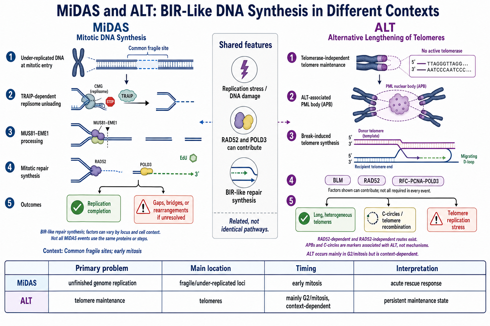

# MiDAS

MiDAS（mitotic DNA synthesis，有丝分裂期 DNA 合成）是细胞在进入有丝分裂后，对尚未完成复制或由复制障碍转化而来的 DNA 中间体进行的补救性 DNA 合成。它常出现在 [复制压力](复制压力.md)后的 common fragile site（[常见脆性位点](常见脆性位点.md)），可帮助完成局部基因组复制，但也提示细胞已经把未解决的复制问题带入有丝分裂。

图：MiDAS 处理有丝分裂进入时仍未复制完成的基因组区域，可经历 TRAIP 依赖的复制体卸载、MUS81–EME1 加工以及 RAD52/POLD3 相关修复合成；ALT 则是端粒酶非依赖的持续端粒维持状态。两者可具有 BIR-like DNA synthesis（BIR 样 DNA 合成）特征，但底物、时间尺度和生物学目的不同。本图由 Image2 / image-generation model 生成，用于个人学习示意。

## MiDAS 解决的是什么问题

正常情况下，绝大多数 DNA 应在 [细胞周期](细胞周期.md)的 S 期完成复制。大基因、复制起始点稀少区域、AT-rich secondary structure（富 AT 二级结构）、转录–复制冲突和受损复制叉可能延迟局部复制。若 G2/M checkpoint（G2/M 检查点）没有完全阻止细胞进入有丝分裂，这些 under-replicated DNA（未充分复制 DNA）就必须在染色体分离前被处理。

MiDAS 因此不是常规 S 期复制的延长版，而是细胞已经进入早期有丝分裂后启动的应急合成。早期研究使用低剂量 aphidicolin（[阿非迪霉素](<../../材(实验耗材工具篇)/阿非迪霉素.md>)）制造温和复制压力，在有丝分裂染色体上观察到局部 [EdU](<../../材(实验耗材工具篇)/EdU.md>) 掺入，并证明该过程依赖 MUS81–EME1 和 POLD3。参考：[Minocherhomji et al., Nature, 2015](https://doi.org/10.1038/nature16139)。

## 常见底物与位置

### 常见脆性位点

common fragile site（CFS，常见脆性位点）是在复制受扰时容易在中期染色体上出现 gap（间隙）或 break（断裂）的基因组区域。许多 CFS 具有晚复制、大转录单元或较低复制起始点密度等特征，因此是 MiDAS 的主要研究对象。

MiDASeq 等直接测序方法显示，MiDAS 位点与已知 CFS 高度重叠，并支持晚复制时间和大转录单元对脆性的重要贡献。参考：[Ji et al., Cell Research, 2020](https://doi.org/10.1038/s41422-020-0357-y)。

### 端粒与其他难复制区域

[端粒](端粒.md)、着丝粒周围重复 DNA 和其他结构复杂区域也可能在复制压力下进入有丝分裂时仍未完成。ALT 细胞中的端粒 MiDAS 与普通 CFS-MiDAS 共享部分蛋白，但调控背景不同，不能把所有端粒合成都归为一种统一机制。

## 可能的机制步骤

### 识别未完成复制和卸载复制体

进入有丝分裂时，停滞复制叉上的 CMG helicase（CMG 解旋酶）需要被移除，才能让修复因子接近 DNA。TRAIP（TRAF-interacting protein，TRAF 相互作用蛋白）E3 ubiquitin ligase（E3 泛素连接酶）促进复制体泛素化和卸载，并参与从未完成复制向 MiDAS 的转换。

线虫胚胎与人细胞研究显示，TRAIP 对有丝分裂期复制体卸载和 MiDAS 都重要；缺失 TRAIP 会增加染色体分离错误。参考：[Sonneville et al., eLife, 2019](https://doi.org/10.7554/eLife.48686)。

### 结构加工或切割

MUS81–EME1 structure-selective endonuclease（MUS81–EME1 结构选择性内切核酸酶）可加工未解决的复制叉或分支 DNA，产生可用于修复合成的 DNA 末端。SLX4 等支架蛋白参与协调部分位点的结构核酸酶活动。

这种切割具有双重性：它可把无法继续的复制结构转化为可修复底物，也可能制造 [DNA双链断裂](DNA双链断裂.md)并增加重排风险。因此“抑制 MUS81 后断裂变少”不等于基因组状况更好，可能只是未完成复制结构没有被处理。

### RAD52/POLD3 相关合成

早期 CFS-MiDAS 研究显示，RAD52 和 POLD3（DNA polymerase delta subunit 3，DNA 聚合酶 δ 亚基 3）有助于 MiDAS，而 RAD51 与 BRCA2 在该实验体系中不是必需。参考：[Bhowmick et al., Molecular Cell, 2016](https://doi.org/10.1016/j.molcel.2016.10.037)。

这使 MiDAS 具有 [BIR](BIR.md)（break-induced replication，断裂诱导复制）样特征，但不同位点、细胞类型和复制压力条件可能使用不同蛋白组合。更严谨的写法是“BIR-like repair synthesis”，而不是把所有 MiDAS 直接定义为经典 BIR。

高分辨率测序提示部分 CFS-MiDAS 的 leading-strand synthesis（前导链合成）与 lagging-strand synthesis（后随链合成）存在解偶联，也支持其不同于普通双向半保留复制。参考：[Macheret et al., Cell Research, 2020](https://doi.org/10.1038/s41422-020-0358-x)。

## MiDAS 是保护还是损伤标志

答案是两者都是。

- 从短期结果看，MiDAS 可减少未复制 DNA 直接进入后期，降低 chromosome bridge（染色体桥）和未分离风险。
- 从上游原因看，出现大量 MiDAS 说明 S/G2 期复制未能按时完成。
- 从机制代价看，切割和修复合成可能伴随缺失、复制模板切换或结构重排。

因此，MiDAS 增加既可能表示“复制压力更严重”，也可能表示“补救能力更活跃”；MiDAS 减少既可能表示“上游问题减少”，也可能表示“细胞失去补救能力”。必须配合损伤和分离结局解释。

## 如何检测 MiDAS

### EdU 脉冲标记

最常见方法是在细胞进入早期有丝分裂后短时间加入 EdU（5-ethynyl-2′-deoxyuridine，5-乙炔基-2′-脱氧尿苷），随后制备 metaphase spread（中期染色体铺片）或固定细胞，检测有丝分裂染色体上的离散 EdU focus（焦点）。

关键是证明 EdU 信号来自有丝分裂期，而不是残留 S/G2 细胞：

- 明确同步、释放和 EdU 脉冲时间。
- 使用 phospho-histone H3（磷酸化组蛋白 H3）或染色体形态确认有丝分裂状态。
- 检查 DNA 含量和细胞周期分布。
- 设置无复制压力、无 EdU 和抑制 DNA 合成对照。

### FANCD2 和染色体标志

FANCD2 twin foci（FANCD2 成对焦点）常位于未完成复制区域两侧，可与 MiDAS 或 CFS 脆性相关。但 FANCD2 焦点不是 MiDAS 的直接替代读出，不能把所有 FANCD2 阳性位点都当作正在合成 DNA。

### BrdU、CO-FISH 与测序

[BrdU](<../../材(实验耗材工具篇)/BrdU.md>)（5-bromo-2′-deoxyuridine，5-溴-2′-脱氧尿苷）掺入、CO-FISH（chromosome orientation fluorescence in situ hybridization，染色体方向荧光原位杂交）和 MiDASeq 可分析合成链方向、位点分布及与 CFS 的关系。测序方法提供群体层面图谱，但不能代替单细胞染色体表型。

## 一个可靠的 MiDAS 实验应同时记录什么

| 层级 | 建议读出 | 原因 |
| --- | --- | --- |
| 上游复制压力 | S 期长度、复制叉速度、RPA/γH2AX、未复制 DNA | 解释 MiDAS 底物是否增加 |
| MiDAS 本身 | 有丝分裂细胞中的 EdU/BrdU 信号 | 直接观察修复合成 |
| 位点身份 | FANCD2、CFS FISH 或 MiDASeq | 判断信号来自何处 |
| 有丝分裂结局 | 染色体 gap、ultrafine bridge、anaphase bridge | 判断补救是否成功 |
| 细胞后果 | 微核、存活、克隆形成、结构变异 | 避免只看短时合成信号 |

## MiDAS、普通复制、BIR 与 ALT 对比

| 特征 | MiDAS | 普通 S 期复制 | BIR | [ALT](ALT.md) |
| --- | --- | --- | --- | --- |
| 主要目的 | 补救未完成复制 | 复制整个基因组 | 修复单端断裂 | 长期维持端粒 |
| 主要时相 | 早期有丝分裂 | S 期 | 依底物而定 | 多见 G2/有丝分裂相关合成，但具有持续状态 |
| 主要位置 | CFS、端粒等难复制区域 | 全基因组 | 单端断裂后的同源模板 | 端粒及 APB |
| 与 BIR 关系 | 部分事件具有 BIR-like 特征 | 不属于 BIR | 定义机制 | 可采用端粒 BIR 路径 |

## 常见异常与 troubleshooting

| 观察 | 可能原因 | 优先检查 |
| --- | --- | --- |
| 对照组也有大量 EdU 焦点 | 基础复制压力高、细胞系不稳定或 EdU 脉冲包含 S/G2 | 细胞周期门控、同步条件和培养状态 |
| 复制压力组 MiDAS 反而减少 | 细胞未进入有丝分裂、毒性过强或 MiDAS 因子受损 | mitotic index、存活率和 POLD3/RAD52/MUS81 状态 |
| EdU 信号弥漫而非离散 | 脉冲过长、S 期污染或染色体铺片质量差 | 缩短脉冲并加强有丝分裂细胞确认 |
| MUS81 抑制后断裂减少 | 未处理结构积累，而非复制问题被解决 | ultrafine bridge、微核和后续结构变异 |
| MiDAS 增加但细胞存活改善 | 补救增强，也可能只是筛选出耐受亚群 | 绝对细胞数、克隆组成和长期基因组稳定性 |
| 不同细胞系结果相反 | CFS 图谱、复制时序和通路依赖不同 | 在每个细胞系单独建立基线和位点验证 |

## 小结

MiDAS 是把未完成复制问题带入有丝分裂后的应急 DNA 合成。它可保护染色体分离，也暴露上游复制压力并可能引入结构变异。实验判读不能只看 EdU 焦点多少，而要同时确认有丝分裂时相、底物位置、复制压力、染色体桥和长期细胞后果。

## 参考来源

- [Minocherhomji et al., Replication stress activates DNA repair synthesis in mitosis, Nature, 2015](https://doi.org/10.1038/nature16139)
- [Bhowmick et al., RAD52 Facilitates Mitotic DNA Synthesis Following Replication Stress, Molecular Cell, 2016](https://doi.org/10.1016/j.molcel.2016.10.037)
- [Sonneville et al., TRAIP drives replisome disassembly and mitotic DNA repair synthesis at sites of incomplete DNA replication, eLife, 2019](https://doi.org/10.7554/eLife.48686)
- [Ji et al., Genome-wide high-resolution mapping of mitotic DNA synthesis sites and common fragile sites by direct sequencing, Cell Research, 2020](https://doi.org/10.1038/s41422-020-0357-y)
- [Macheret et al., High-resolution mapping of mitotic DNA synthesis regions and common fragile sites in the human genome through direct sequencing, Cell Research, 2020](https://doi.org/10.1038/s41422-020-0358-x)
