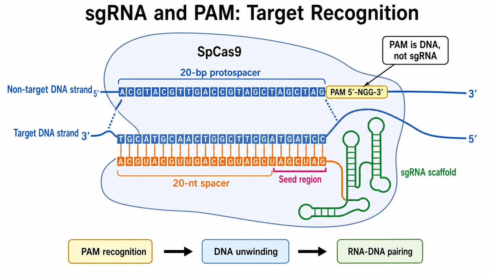

# PAM 序列

PAM（protospacer adjacent motif，原间隔序列邻近基序）是位于靶核酸 protospacer（原间隔序列）旁边、由特定 Cas 蛋白识别的短序列基序。对许多 DNA 靶向 CRISPR 系统，只有存在兼容 PAM，Cas 蛋白才会高效启动靶位点识别。

图：以 SpCas9 为例，sgRNA spacer 与约 20 bp protospacer 配对，而 5'-NGG-3' PAM 位于邻接靶 DNA 上并由 Cas9 读取。PAM 不属于 sgRNA。本图由 Image2 / image-generation model 生成，用于个人学习示意。

## PAM 到底属于谁

PAM 属于靶 DNA，不属于 [sgRNA](sgRNA.md)。设计软件常显示“20 nt protospacer + PAM”，是为了说明完整基因组靶位点；实际合成或克隆 spacer 时，通常只使用工具指定的 guide 序列，不把 PAM 直接并入 spacer。

| 元素 | 所在位置 | 主要作用 |
| --- | --- | --- |
| sgRNA spacer | RNA | 通过碱基互补提供可编程特异性 |
| protospacer | 靶 DNA | 与 spacer 配对的目标区域 |
| PAM | protospacer 邻近的靶 DNA | 被 Cas 蛋白识别，触发后续 DNA 检查 |
| seed region（种子区） | protospacer 的 PAM 邻近部分 | 对部分错配尤其敏感，影响稳定识别 |

## SpCas9 的经典 PAM

常用 Streptococcus pyogenes Cas9（酿脓链球菌 Cas9，SpCas9）最典型的 PAM 写作 5'-NGG-3'，其中 N 代表任意碱基。结构研究显示 SpCas9 通过 PAM 结合区域读取 GG，并促进邻近 DNA 局部解链和 RNA-DNA 杂交。参考：[Anders et al., Nature, 2014](https://doi.org/10.1038/nature13579)。

“NGG”不是 sgRNA 的末端，也不是说 guide 必须以 GG 结束。它描述的是靶 DNA 特定链上的邻近基序。设计工具可能按正链或反链报告靶点，因此必须同时查看方向和完整序列标注。

## PAM 在识别过程中的作用

Cas9 不会先把整条基因组与 sgRNA 完整配对。它会在 DNA 上搜索兼容 PAM；识别 PAM 后，邻近双链 DNA 才更容易局部解链，继而从 PAM 邻近区域开始检查 guide-target complementarity（guide 与靶 DNA 互补性）。单分子和结构研究支持 PAM 是靶位点搜索与后续 R-loop 形成的早期关口。参考：[Sternberg et al., Nature, 2014](https://doi.org/10.1038/nature13011)。

在天然细菌免疫系统中，PAM 还帮助区分外源 protospacer 与 CRISPR 阵列中的自身 spacer，降低对自身 CRISPR 位点的错误攻击。

## 不同 Cas 蛋白的 PAM 不相同

| 核酸酶示例 | 常见 PAM 概念 | 位置特点 | 实验意义 |
| --- | --- | --- | --- |
| SpCas9 | 典型 5'-NGG-3' | 位于 protospacer 邻近一侧 | 工具成熟，但可选位点受 NGG 分布限制 |
| SaCas9 | 常见写作 NNGRRT | 与 SpCas9 不同 | 蛋白较小，但设计必须使用 SaCas9 规则 |
| Cas12a/Cpf1 | 常见为 T-rich PAM，如 TTTV | PAM 方向与 Cas9 习惯表示不同 | 产生不同切割形式并扩展可靶区域 |
| 工程化 Cas9 变体 | 可识别放宽或改变的 PAM | 取决于具体变体 | 扩大靶向空间，但活性和特异性需重新验证 |

表中的基序用于建立概念，不替代具体产品、载体或原始论文给出的序列要求。同一 Cas 家族不同 ortholog（直系同源蛋白）和工程变体可能具有不同 PAM 偏好。

## PAM 如何影响实验设计

### 决定“能不能在这里下手”

若目标位点附近没有兼容 PAM，即使生物学位置理想，所选 Cas 蛋白也无法高效定位。可改用另一条链、邻近靶点、不同 Cas ortholog 或工程化 PAM 变体。

### 影响精准编辑距离

knock-in、[base editing（碱基编辑）](碱基编辑.md) 和 [prime editing（先导编辑）](<Prime editing.md>) 往往对切口或编辑窗口与目标碱基的相对位置敏感。PAM 分布因此直接限制可选编辑窗口；不能只选最高评分 guide，而忽略其几何位置。

### 可用于等位基因特异性设计

若单核苷酸变异新建或破坏 PAM，可能用于 allele-specific targeting（等位基因特异性靶向）。但是否真正只作用于一个等位基因，仍需用基因型和脱靶验证，而不能只凭序列图判断。

### 影响脱靶筛选

潜在脱靶位点通常也需要兼容或可容忍 PAM。脱靶预测应使用与实际 Cas 变体匹配的 PAM 模型；把 SpCas9 的模型直接套到其他核酸酶会得到错误风险排序。

## PAM、protospacer 与 seed region 对比

| 概念 | 是否与 sgRNA spacer 配对 | 是否由 Cas 蛋白直接识别 | 是否随 guide 改变 |
| --- | --- | --- | --- |
| PAM | 否 | 是 | PAM 类型由 Cas 蛋白决定 |
| protospacer | 是 | 作为完整靶 DNA 被检查 | 是，随目标位点改变 |
| seed region | 是 | 间接参与稳定识别 | 是，是 protospacer 的一部分 |
| sgRNA scaffold | 否 | 与 Cas 蛋白结合 | 通常由系统架构决定 |

“seed region 长度固定”并不是所有 Cas、所有条件下都完全相同的简单规则。其功能可受到错配位置、数量、DNA/RNA bulge（凸起）、Cas 变体和实验体系影响，因此应把它看作 PAM 邻近错配敏感区的实用概念。

## 常见错误与 troubleshooting

| 错误 | 后果 | 修正 |
| --- | --- | --- |
| 把 PAM 一起克隆进 spacer | guide 序列错位或长度错误 | 使用设计工具明确输出的 spacer/oligo 序列 |
| 忽略正反链方向 | 选到错误 protospacer 或错误 oligo | 同时记录链方向、完整靶序列和 PAM |
| 用错 Cas 变体的 PAM 规则 | 无结合、无切割或活性很低 | 先锁定 nuclease，再设计 guide |
| 认为所有 NGG 位点活性相同 | guide 表现差异大 | 结合序列、染色质和经验评分选多条 guide |
| 只看 PAM，不看目标位置 | 编辑窗口或 TSS 距离不合适 | 把 PAM 可用性与实验目的共同优化 |

## 小结

PAM 是 Cas 蛋白读取的“准入条件”，sgRNA spacer 才是可编程的互补信息。理解 PAM 的所属链、方向、与 protospacer 的邻接关系，以及不同 Cas 蛋白的 PAM 差异，是避免 CRISPR 设计方向错误的基础。

## 参考来源

- [Mojica et al., Short motif sequences determine the targets of the prokaryotic CRISPR defence system, Microbiology, 2009](https://doi.org/10.1099/mic.0.023960-0)
- [Jinek et al., A programmable dual-RNA-guided DNA endonuclease in adaptive bacterial immunity, Science, 2012](https://doi.org/10.1126/science.1225829)
- [Sternberg et al., DNA interrogation by the CRISPR RNA-guided endonuclease Cas9, Nature, 2014](https://doi.org/10.1038/nature13011)
- [Anders et al., Structural basis of PAM-dependent target DNA recognition by the Cas9 endonuclease, Nature, 2014](https://doi.org/10.1038/nature13579)
