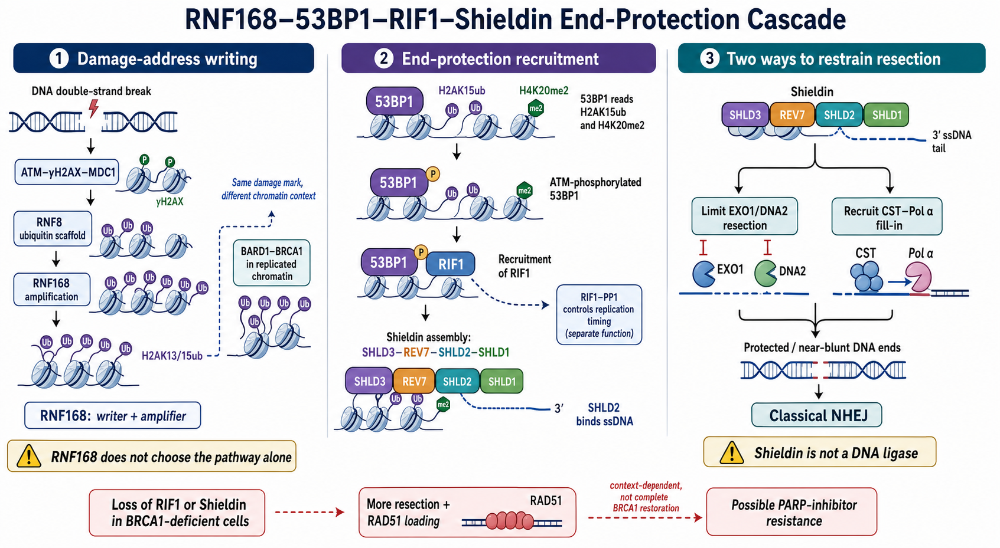

# RIF1

RIF1（replication timing regulatory factor 1，复制时序调控因子 1；历史名称 Rap1-interacting factor 1）是兼具 DNA 复制调控与 DSB 末端保护功能的大型染色质蛋白。在 DSB 修复中，它由磷酸化 [53BP1](53BP1.md) 募集，帮助组织 [Shieldin复合物](Shieldin复合物.md)并限制 [DNA 末端切除](DNA末端切除.md)；在未发生断裂时，它又是 [DNA复制时序](DNA复制时序.md)和复制起始的重要调控者。

因此，RIF1 敲低后的复制压力、细胞周期和修复表型不能全部归因于 53BP1–Shieldin 轴，也不能用一个 RAD51 focus 实验概括。

图：RNF168 建立 H2AK13/15ub 后，53BP1 读取损伤染色质并经 ATM 磷酸化募集 RIF1；RIF1 继续组织 Shieldin，使其结合短 ssDNA、限制 EXO1/DNA2 切除并募集 CST–Pol α 回填。图中单独画出的 RIF1–PP1 分支表示复制时序是另一项重要功能。BRCA1 缺陷细胞中丢失 RIF1 可增加切除与 RAD51 装载，但是否形成完整 HR 与 PARP 抑制剂耐药取决于具体背景。本图由 Image2 / image-generation model 生成，用于个人学习示意。

## 名称与功能演化

Rif1 最早在 budding yeast（出芽酵母）中作为 Rap1-interacting factor（Rap1 相互作用因子）被发现，与端粒长度调节有关。哺乳动物 RIF1 的功能已经扩展为：

- 全基因组复制时序与复制起始控制。
- DSB 修复路径选择和断端保护。
- 复制压力下的复制叉稳定/恢复。
- 染色质高阶结构和核内复制域组织。

因此现代正式名称更强调 `replication timing regulatory factor 1`。不能因为历史名称含有 Rap1，就把所有哺乳动物 RIF1 表型都解释为端粒表型。

## DSB 修复中的 53BP1–RIF1 轴

### 招募依赖 ATM 磷酸化的 53BP1

DSB 后，[ATM](ATM通路.md) 磷酸化 53BP1 N 端多个 S/TQ 位点，形成 RIF1 识别与募集平台。RIF1 在 G0/G1 的损伤焦点通常更突出，并与 BRCA1–CtIP 促进切除的活动相拮抗。

RIF1 被确认是 53BP1 抑制 5′ end resection（5′ 端切除）的关键效应因子；失去 RIF1 可增加 CtIP、BLM、EXO1 等切除网络的作用，并在部分 BRCA1 缺陷背景中恢复 RPA/RAD51。参考：[Zimmermann et al., Science, 2013](https://doi.org/10.1126/science.1231573)；[Escribano-Díaz et al., Molecular Cell, 2013](https://doi.org/10.1016/j.molcel.2013.01.001)。

### RIF1 不是最后一层末端保护因子

RIF1 更像中间调度器：它把磷酸化 53BP1 与 REV7–Shieldin 网络连接起来。Shieldin 的 SHLD2 才能直接结合 ssDNA，并进一步连接 [CST复合物](CST复合物.md)–DNA polymerase α（Pol α，DNA 聚合酶 α）回填系统。

所以：

- RIF1 自身不是 DNA 连接酶。
- RIF1 focus 不等于 Shieldin 一定完整装配。
- Shieldin/CST 缺陷可在 RIF1 仍有焦点时造成末端保护失败。
- 53BP1 的 PTIP 支路与 RIF1–Shieldin 支路有重叠但不完全相同，不能合并成一个模糊“53BP1 下游”。

## RIF1 对复制时序与复制起始的控制

### 建立早复制与晚复制域

哺乳动物基因组不是同时复制。RIF1 与高阶染色质结构、核内定位和晚复制域相关；RIF1 缺失会使早/晚复制区域的时序边界变乱，而不只是简单地让全部区域提前复制。

人细胞与小鼠研究分别显示，RIF1 是全基因组 replication timing（复制时序）程序的重要决定因子。参考：[Yamazaki et al., EMBO Journal, 2012](https://doi.org/10.1038/emboj.2012.180)；[Cornacchia et al., EMBO Journal, 2012](https://doi.org/10.1038/emboj.2012.214)。

### 通过 PP1 对抗 DDK–MCM 激活

RIF1 可募集 protein phosphatase 1（PP1，蛋白磷酸酶 1），对抗 Dbf4-dependent kinase（DDK，Dbf4 依赖激酶）对 minichromosome maintenance complex（MCM，微小染色体维持复合物）的磷酸化：

- DDK 磷酸化 MCM2–7，促进复制解旋酶激活与 origin firing（复制起点激活）。
- RIF1–PP1 去磷酸化 MCM，抑制不合时机的起点启动。
- RIF1 缺失可增加起点激活并改变复制因子供需、复制叉稳定性和复制压力。

RIF1–PP1 对复制起始和 replisome（复制体）稳定性的证据见 [Hiraga et al., Cell Reports, 2017](https://doi.org/10.1016/j.celrep.2017.02.042)。

## 两种功能如何在实验中互相干扰

| 观察 | DSB 修复解释 | 复制调控解释 |
| --- | --- | --- |
| RPA 增加 | 53BP1–RIF1 末端保护减弱、切除增加 | 起点/复制叉异常产生更多 ssDNA |
| RAD51 focus 增加 | HR 底物与装载增加 | 复制压力和停滞叉增多 |
| γH2AX 增加 | DSB 修复失败 | 异常起点激活或复制叉崩溃 |
| PARP 抑制剂反应变化 | BRCA1 缺陷背景中 HR 部分恢复 | 复制压力与复制叉依赖改变 |
| 细胞周期分布变化 | 损伤检查点改变 | 复制时序程序和 S 期推进异常 |

要把两类功能分开，必须配对使用 DSB 特异系统与全基因组复制读数，而不是只依赖自然生长细胞中的焦点。

## BRCA1 缺陷与 PARP 抑制剂耐药

在 BRCA1 缺陷细胞中，53BP1–RIF1–Shieldin 轴会限制切除、PALB2–BRCA2–RAD51 装载和 HR。RIF1 丢失可能解除这层限制，产生 [PARP抑制剂](PARP抑制剂.md)耐药。

但恢复具有条件性：

- 若 BRCA1 变异仍保留部分 PALB2 连接或后切除功能，RIF1 丢失更可能恢复 RAD51 装载。
- 若 PALB2、BRCA2 或 RAD51 轴本身损坏，仅增加切除通常不能完成 HR。
- RIF1 丢失同时扰乱复制时序，药物反应可能包含复制层面的贡献。
- 克隆形成耐药不等于修复精度、染色体稳定性或复制叉保护完全正常。

## RIF1、53BP1 与 Shieldin 的区别

| 比较轴 | 53BP1 | RIF1 | Shieldin |
| --- | --- | --- | --- |
| 通路位置 | 读取损伤染色质的上游支架 | 连接磷酸化 53BP1 与下游效应网络 | 靠近 ssDNA 的四亚基末端保护复合物 |
| 主要直接输入 | H2AK15ub+H4K20me2 | 53BP1 磷酸化平台 | RIF1 依赖募集、ssDNA |
| 主要输出 | 招募 RIF1/PTIP 等 | 组织 Shieldin并限制切除 | ssDNA 结合、切除限制、CST–Pol α 回填 |
| 额外功能 | 染色质移动、CSR 等 | 复制时序、起点控制、复制叉 | REV7 亚基还参与其他复合物，但不等于 Shieldin 全体 |

## 实验中如何观察 RIF1

| 问题 | 推荐读数 | 能回答什么 | 关键限制 |
| --- | --- | --- | --- |
| 蛋白是否存在 | [Western blot](<../../用(实验流程内容篇)/Western blot.md>) | 全长/截短与敲低效率 | 人 RIF1 约 275 kDa；高分子量蛋白对降解和转膜敏感 |
| 是否进入 DSB 焦点 | [免疫荧光](<../../用(实验流程内容篇)/免疫荧光.md>)、[激光微照射](<../../用(实验流程内容篇)/激光微照射.md>) | 53BP1/ATM 依赖募集 | 需按细胞周期分层；焦点不等于 Shieldin 完整 |
| 是否结合 53BP1/PP1 | [免疫共沉淀](<../../用(实验流程内容篇)/免疫共沉淀.md>)、界面突变 | DSB 与复制两类复合物是否建立 | 裂解条件可破坏大型染色质复合物 |
| 末端切除是否改变 | RPA、native BrdU、[END-seq](<../../用(实验流程内容篇)/END-seq.md>) | 切除比例与长度 | 复制压力也可产生 RPA/ssDNA |
| HR/NHEJ 如何变化 | DR-GFP/EJ5-GFP 等 [报告基因实验](<../../用(实验流程内容篇)/报告基因实验.md>) | 指定断裂体系中的路径输出 | reporter 不能覆盖全基因组修复和复制时序 |
| 复制时序是否改变 | [Repli-seq](<../../用(实验流程内容篇)/Repli-seq.md>) | 基因组区域在 S 期的复制顺序 | 群体同步、分群与测序归一化会影响结果 |
| 起点与复制叉是否改变 | [DNA纤维实验](<../../用(实验流程内容篇)/DNA纤维实验.md>) | 起点间距、叉速率与重启 | 单分子局部读数不能替代全基因组 Repli-seq |

### 推荐的证据组合

- 用 53BP1 缺失或 53BP1 磷酸化位点突变验证 RIF1 的 DSB 募集依赖性。
- 配对检测 RIF1、Shieldin、RPA、RAD51 与 HR/NHEJ reporter。
- 将 DSB 特异 readout 与 Repli-seq、DNA fiber 分开设计，避免复制表型污染修复解释。
- 使用野生型回补、53BP1-binding-defective 与 PP1-binding-defective 分离突变体。
- 所有焦点分析按 [细胞周期](细胞周期.md)或 [EdU](<../../材(实验耗材工具篇)/EdU.md>) 分层。

## 常见误读与 troubleshooting

| 观察 | 不应立即得出的结论 | 优先排查 |
| --- | --- | --- |
| RIF1 focus 消失 | RIF1 总蛋白一定缺失 | ATM、53BP1 磷酸化、细胞周期、固定和抗体 |
| RPA/RAD51 增加 | HR 一定完整恢复 | 复制压力、PALB2/BRCA2、HR reporter 与修复产物 |
| 复制起点增加 | DSB 末端保护一定失败 | RIF1–PP1、DDK–MCM 与复制时序 |
| PARP 抑制剂耐药 | 只由 Shieldin 丢失造成 | BRCA1 回复、RIF1、53BP1、复制叉和药物外排 |
| RIF1 敲低细胞生长慢 | 修复缺陷是唯一原因 | S 期推进、复制时序、起点激活和克隆差异 |

## 小结

RIF1 是连接 53BP1 与 Shieldin 的末端保护调度器，同时也是 RIF1–PP1 复制时序/起点控制系统的核心成员。实验上必须把 DSB 修复、全基因组复制时序和复制叉三类功能拆开检测，才能解释 RIF1 缺失后的 RPA、RAD51、药敏与生长表型。

## 参考来源

- [Yamazaki et al., Rif1 regulates the replication timing domains on the human genome, EMBO Journal, 2012](https://doi.org/10.1038/emboj.2012.180)
- [Cornacchia et al., Mouse Rif1 is a key regulator of the replication-timing programme in mammalian cells, EMBO Journal, 2012](https://doi.org/10.1038/emboj.2012.214)
- [Zimmermann et al., 53BP1 regulates DSB repair using Rif1 to control 5′ end resection, Science, 2013](https://doi.org/10.1126/science.1231573)
- [Escribano-Díaz et al., A cell cycle-dependent regulatory circuit composed of 53BP1-RIF1 and BRCA1-CtIP controls DNA repair pathway choice, Molecular Cell, 2013](https://doi.org/10.1016/j.molcel.2013.01.001)
- [Hiraga et al., Reversal of DDK-mediated MCM phosphorylation by RIF1-PP1 regulates replication initiation and replisome stability independently of ATR/Chk1, Cell Reports, 2017](https://doi.org/10.1016/j.celrep.2017.02.042)
- [Mirman et al., 53BP1-RIF1-shieldin counteracts DSB resection through CST- and Polα-dependent fill-in, Nature, 2018](https://doi.org/10.1038/s41586-018-0324-7)

