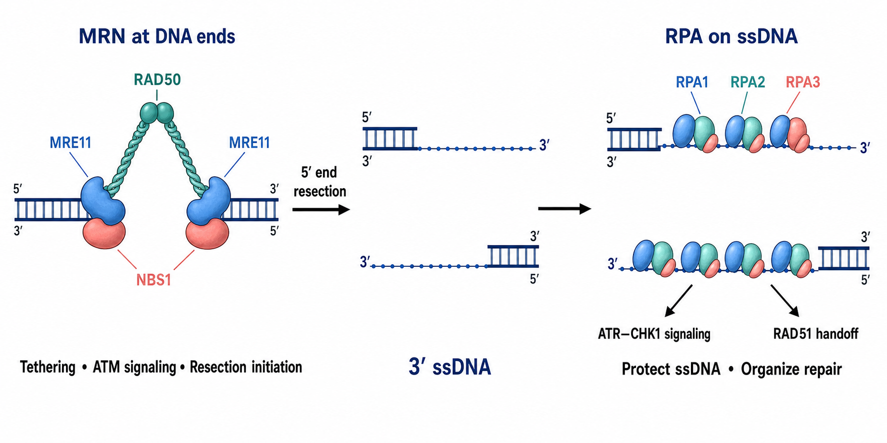

# RPA

RPA（replication protein A，复制蛋白 A）是真核细胞主要的 single-stranded DNA-binding protein（单链 DNA 结合蛋白，SSB protein），通常由 RPA1、RPA2 和 RPA3 三个亚基组成。它不仅覆盖和保护 ssDNA，还把复制、[ATR 通路](ATR通路.md)、DNA 修复和重组蛋白组织到正确的核酸中间体上。

图：[MRN 复合物](MRN复合物.md) 在 DNA 断端组织 ATM 信号并启动切除；形成 3′ ssDNA 后，RPA 三聚体包被单链区域，抑制二级结构和非特异降解，并为 ATR–CHK1 信号及 RAD51 装载提供平台。RPA 与 RAD51 的转换是受调控的接力，不是 RPA 自动从 DNA 上脱落。本图由 Image2 / image-generation model 生成，用于个人学习示意。

## 名称与三个亚基

| 亚基 | 常见别名 | 主要特征 | 不应如何简化 |
| --- | --- | --- | --- |
| RPA1 | RPA70 | 含多个主要 oligonucleotide/oligosaccharide-binding fold（寡核苷酸/寡糖结合折叠，OB-fold），承担大部分 ssDNA 结合并提供伙伴蛋白界面 | 不只是“最大的结构亚基” |
| RPA2 | RPA32 | N 端含可调磷酸化区域，也参与 DNA 结合和三聚体核心 | p-RPA2/RPA32 不是 RPA 总量的替代读数 |
| RPA3 | RPA14 | 较小的结构亚基，参与稳定异源三聚体 | 小并不等于可有可无 |

canonical RPA（经典 RPA）通常指 RPA1–RPA2–RPA3 异源三聚体。RPA4 是可在部分组织表达的 RPA2 旁系同源蛋白，能形成 alternative RPA（替代型 RPA），但不能在所有功能上替代经典 RPA2；检测抗体和基因命名必须分清 RPA2 与 RPA4。RPA4 不能支持正常染色体 DNA 复制的实验结果见 [Haring et al., Nucleic Acids Research, 2010](https://doi.org/10.1093/nar/gkp1062)。

## RPA 如何结合 ssDNA

RPA 通过多个 DNA-binding domain（DNA 结合结构域，DBD）以不同结合模式接触 ssDNA。常见教材会写约 8–10 nt、20 nt 或 30 nt 的结合模式，但这些不是三种永远固定的“档位”：RPA 会随 ssDNA 长度、盐条件、蛋白浓度和伙伴蛋白动态重排、扩展结合并沿 ssDNA 扩散。

这种“高亲和但可动态交换”的性质很关键：

- 足够稳定，能压制 hairpin（发卡）和 G-quadruplex（G-四链体）等二级结构并减少核酸酶攻击。
- 又不能永久封死 ssDNA，否则聚合酶、核酸酶、RAD51 和修复因子无法接管。
- RPA 的功能不仅由结合强度决定；过紧、缺乏动态性的突变体也可能失去功能。

RPA 动态结合模型综述见 [Chen and Wold, BioEssays, 2014](https://doi.org/10.1002/bies.201400107)。

## RPA 的核心功能

### DNA 复制

复制解旋酶打开双链后，RPA 覆盖暴露的 ssDNA，抑制重新退火与二级结构，并协调引物合成、聚合酶切换和 Okazaki fragment（冈崎片段）成熟。RPA 是正常 DNA 复制的基础因子，不应把所有染色质结合 RPA 都解释为“异常损伤”。

### 复制压力与 ATR 激活

复制叉处的解旋与合成失去同步时，会产生更多 RPA-coated ssDNA（RPA 包被的单链 DNA）。ATRIP（ATR-interacting protein，ATR 相互作用蛋白）通过 RPA–ssDNA 环境招募 ATR，随后在 TOPBP1/ETAA1 等激活因子和 CLASPIN 介导下形成 CHK1 信号。RPA–ssDNA 对 ATR 招募的经典证据见 [Zou and Elledge, Science, 2003](https://doi.org/10.1126/science.1083430)。

RPA 是有限资源。压力过大且复制起点持续启动时，细胞核可出现 functional RPA exhaustion（功能性 RPA 耗竭）：新产生的 ssDNA 超过可用 RPA 保护能力，引发广泛复制叉断裂和 replication catastrophe（复制灾难）。这并不是简单的“RPA 蛋白完全消失”。参考：[Toledo et al., Cell, 2013](https://doi.org/10.1016/j.cell.2013.10.043)。

### 同源重组中的保护与交接

[DNA 末端切除](DNA末端切除.md) 形成 3′ ssDNA 后，RPA 首先覆盖并保护该区域。随后 [BRCA2](BRCA2.md)、PALB2 等 mediator（介质蛋白）帮助 [RAD51](RAD51.md) 在 ssDNA 上成核并替换 RPA，形成用于同源搜索和链侵入的 RAD51 nucleoprotein filament（RAD51 核蛋白丝）。

因此 RPA 与 RAD51 不是简单竞争关系：RPA 先清除二级结构并保护底物，受控的 RAD51 handoff（RAD51 交接）再把底物推进 [同源重组](同源重组.md)。交接失败时可出现“RPA 很高、RAD51 很低”，这通常提示 mediator 或 RAD51 装载异常，而非“切除不足”。

### 其他 DNA 修复和端粒功能

RPA 也参与 [核苷酸切除修复](核苷酸切除修复.md)、错配修复相关步骤和多种 ssDNA 中间体处理。在 [端粒](端粒.md) 处，RPA 可短暂参与复制，但正常 [Shelterin](Shelterin.md) 中 POT1 会在端粒 3′ overhang 上限制 RPA–ATR 信号；端粒上出现 RPA 不能脱离细胞周期和 POT1 状态解释。

## RPA 磷酸化应如何理解

RPA2/RPA32 的 N 端具有多个 CDK 和 PIKK 家族激酶调控位点。常见实验读数包括：

| 读数 | 常见关联 | 解释限制 |
| --- | --- | --- |
| p-RPA32 Ser33 | 常与 ATR 和复制压力早期应答相关 | 不是“ssDNA 长度计”，也需结合总 RPA32 |
| p-RPA32 Ser4/Ser8 | 强损伤或复制压力下常与 DNA-PK 贡献相关 | ATM/ATR、刺激和时间可改变位点组合 |
| hyperphosphorylated RPA32（高磷酸化 RPA32） | 多位点修饰和迁移率变化 | 条带上移不能单独指出具体激酶或损伤类型 |

不同激酶对 RPA 位点存在重叠和顺序依赖；“某个 p-RPA 位点阳性 = 某条通路唯一激活”通常过度解读。ATM、ATR 与 DNA-PK 对 RPA 磷酸化的差异可参考 [Liu et al., Nucleic Acids Research, 2012](https://doi.org/10.1093/nar/gks849)。

## RPA、RAD51 与细菌 SSB 的区别

| 比较对象 | RPA | RAD51 | bacterial SSB（细菌单链 DNA 结合蛋白） |
| --- | --- | --- | --- |
| 主要对象 | 真核 ssDNA | 已准备进入同源搜索的 ssDNA | 细菌 ssDNA |
| 核心任务 | 保护、展开和组织 ssDNA 反应 | 形成核蛋白丝并催化同源配对/链交换 | 保护和组织细菌 ssDNA 代谢 |
| 典型结构 | RPA1–RPA2–RPA3 异源三聚体 | ATPase 重组酶聚合丝 | 常见同源四聚体或物种特异寡聚体 |
| 在 HR 中的顺序 | 通常先结合切除产生的 ssDNA | 后由 BRCA2 等帮助装载 | 不属于真核 HR 的直接替代物 |

实验中“RPA focus”与“RAD51 focus”代表不同阶段，不能把其中一个当作另一个的同义读数。

## 实验中如何观察 RPA

| 问题 | 推荐读数 | 能回答什么 | 关键限制 |
| --- | --- | --- | --- |
| RPA 总量是否变化 | RPA1、RPA2、RPA3 [Western blot](<../../用(实验流程内容篇)/Western blot.md>) | 亚基表达与稳定性 | 总裂解液会掩盖染色质重分布 |
| 是否形成 ssDNA 结合池 | 预抽提后 [免疫荧光](<../../用(实验流程内容篇)/免疫荧光.md>)、染色质分级、RPA focus | chromatin-bound RPA | 抽提强度和固定方式高度影响结果 |
| 是否发生复制压力信号 | p-RPA32、p-CHK1、RPA focus | 信号与结构变化 | 单个磷酸化位点不具通路唯一性 |
| 是否产生 ssDNA | native BrdU、ssDNA-specific assay | 单链区域 | 需要控制 DNA 复制标记和抗体可及性 |
| 复制叉是否受影响 | [DNA 纤维实验](<../../用(实验流程内容篇)/DNA纤维实验.md>) | 复制速度、停滞、降解和重启 | 不能直接证明 RPA 是因果节点 |
| HR 交接是否完成 | RPA 与 RAD51 时间序列、焦点共定位/互斥 | 从保护到重组酶装载的转换 | 焦点重叠受空间分辨率限制 |

### 推荐的最小验证组合

- 同时检测 total RPA32 与至少一个 phospho-RPA32 位点。
- 比较总蛋白、可溶蛋白和染色质结合蛋白池。
- 设置短期与恢复期时间点，观察 RPA 是否能从染色质解除。
- 把 RPA 与 p-CHK1、RAD51、γH2AX 和细胞周期/[EdU](<../../材(实验耗材工具篇)/EdU.md>) 联合解释。
- 改变 RPA 表达时检查三个亚基、细胞增殖和基础复制，避免把普遍复制缺陷误写成特异修复机制。

## 常见误读与 troubleshooting

| 观察 | 不应立即得出的结论 | 优先排查 |
| --- | --- | --- |
| RPA focus 增多 | DSB 数量增加 | 正常 S 期、复制压力、末端切除和固定/预抽提条件 |
| p-RPA32 Ser33 增高 | ATR 是唯一参与激酶 | 总 RPA32、其他位点、ATM/DNA-PK 与时间顺序 |
| RPA 高而 RAD51 低 | 没有产生 ssDNA | BRCA2/PALB2/RAD51 装载和 HR competence（HR 能力） |
| 总 RPA 不变但细胞复制灾难 | RPA 没有参与 | 染色质结合比例、可用游离池和全核 ssDNA 负荷 |
| 预抽提后 RPA 信号消失 | 样品没有 RPA | 抽提强度、固定顺序、抗体表位和可溶/结合池差异 |
| 高磷酸化 RPA 条带上移 | 某个已知位点一定被磷酸化 | 使用位点特异抗体或质谱验证 |

## 小结

RPA 是 ssDNA 的动态保护层和反应组织平台。RPA1、RPA2、RPA3 共同形成异源三聚体，在正常复制、复制压力、ATR 信号、切除后保护和 RAD51 交接中发挥不同层级作用；可靠实验解释必须把总量、染色质结合、磷酸化、细胞周期和后续修复结局放在同一时间轴上。

## 参考来源

- [Iftode et al., Replication protein A: the eukaryotic SSB, Critical Reviews in Biochemistry and Molecular Biology, 1999](https://doi.org/10.1080/10409239991209255)
- [Zou and Elledge, Sensing DNA damage through ATRIP recognition of RPA-ssDNA complexes, Science, 2003](https://doi.org/10.1126/science.1083430)
- [Haring et al., A naturally occurring human RPA subunit homolog does not support DNA replication or cell-cycle progression, Nucleic Acids Research, 2010](https://doi.org/10.1093/nar/gkp1062)
- [Liu et al., Distinct roles for DNA-PK, ATM and ATR in RPA phosphorylation and checkpoint activation in response to replication stress, Nucleic Acids Research, 2012](https://doi.org/10.1093/nar/gks849)
- [Toledo et al., ATR prohibits replication catastrophe by preventing global exhaustion of RPA, Cell, 2013](https://doi.org/10.1016/j.cell.2013.10.043)
- [Chen and Wold, Replication protein A: single-stranded DNA's first responder, BioEssays, 2014](https://doi.org/10.1002/bies.201400107)
- [Dueva and Iliakis, Replication protein A: a multifunctional protein with roles in DNA replication, repair and beyond, NAR Cancer, 2020](https://doi.org/10.1093/narcan/zcaa022)
