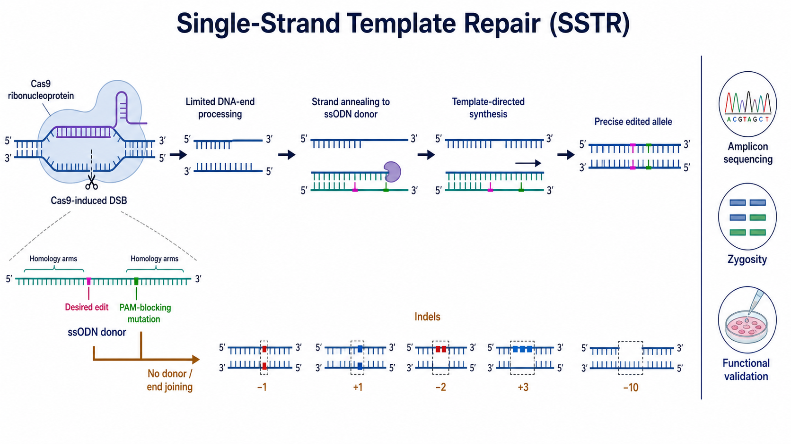

# SSTR

SSTR（single-strand template repair，单链模板修复）是在 DNA 损伤后使用 single-stranded DNA donor（单链 DNA 供体）复制预定序列改变的模板指导修复方式。在 [CRISPR-Cas9](CRISPR-Cas9.md) 实验中，供体通常是 ssODN（single-stranded oligodeoxynucleotide，单链寡聚脱氧核苷酸），适合点突变、小片段替换和较短序列插入。

图：Cas9 产生 DSB 后，一部分断端经有限加工与 ssODN 的同源臂退火，并通过模板指导合成复制目标改变；未使用供体的断裂则常由末端连接形成 indel。精准等位基因仍需扩增子测序、合子型和功能验证。本图仅表示一种概念性供体方向，不代表所有位点都偏好同一条供体链；由 Image2 / image-generation model 生成，用于个人学习示意。

## SSTR 不应被简单等同于经典 HR

[HDR](HDR.md)（homology-directed repair，同源定向修复）是使用同源信息修复的总称，classical homologous recombination（经典同源重组，HR）通常涉及 RAD51、姐妹染色单体或较长双链同源模板。SSTR 虽然也依赖同源序列，却可以使用短单链供体并采用不同的蛋白网络。

Richardson 等在人体细胞中发现，Cas9 诱导的 SSTR 依赖 Fanconi anemia pathway（范可尼贫血通路，FA pathway），且其遗传依赖性与经典 HR 不完全相同。参考：[Richardson et al., Nature Genetics, 2018](https://doi.org/10.1038/s41588-018-0174-0)。因此实验记录宜明确写“SSTR”或“ssODN-mediated template-directed editing（ssODN 介导的模板指导编辑）”，不要仅因结果精准就默认它是 RAD51-HR。

## ssODN 供体由什么组成

| 组成 | 作用 | 设计时的问题 |
| --- | --- | --- |
| left homology arm（左同源臂） | 与切口一侧基因组序列配对 | 是否与实际细胞基因型完全一致 |
| desired edit（目标改变） | 点突变、小替换或短插入 | 距离切口多远，是否改变功能元件 |
| PAM/guide-blocking mutation（PAM/guide 阻断突变） | 降低正确编辑后被 Cas9 再次切割的概率 | 是否影响剪接、调控、密码子或蛋白功能 |
| right homology arm（右同源臂） | 与切口另一侧序列配对 | 是否需要与另一侧做不对称设计 |
| optional terminal modification（可选末端修饰） | 提高核酸酶稳定性或细胞内有效浓度 | 可能增加成本、毒性或改变递送表现 |

ssODN 属于 [供体模板](供体模板.md) 的一种。下单前应保存完整的“编辑前序列、供体序列、编辑后预期序列”，并明确所有非目标改变，避免后续只凭商品订单或手绘示意追溯设计。

## 可能的修复过程

### Cas9 切割并产生可退火中间体

Cas9 在 [sgRNA](sgRNA.md) 和 [PAM序列](PAM序列.md) 共同决定的位置切割 DNA。断端经过一定程度处理后暴露单链区域，为 ssODN 同源臂配对创造条件。

### 单链供体与断端退火

供体的一侧同源臂与互补基因组单链退火。供体链方向会影响这一过程，但偏好取决于核酸酶、切口与目标改变的相对位置、转录和位点环境，不能使用“所有 Cas9 位点都选 target strand”之类的固定规则。

Richardson 等根据 Cas9 切割复合物释放 DNA 链的不对称性提出不对称 ssDNA donor 设计，并在多个位点提高编辑。该工作支持“根据机制测试方向”，而不是“存在一个普适方向”。参考：[Richardson et al., Nature Biotechnology, 2016](https://doi.org/10.1038/nbt.3481)。

### 模板指导合成与等位基因完成

DNA polymerase（DNA 聚合酶）复制供体中的目标改变，随后经过缺口填补和连接形成双链等位基因。不同位置的碱基被复制进入基因组的概率可能不同，因此供体上存在某个改变，不代表它一定与目标改变同时进入最终产物。

## 设计变量

### 切口到目标改变的距离

通常应优先选择靠近目标改变的切口，因为距离增加可能降低目标碱基被纳入修复转换区的概率。但最佳几何关系依赖位点，不能用一个固定碱基数代替实测。若附近没有合适 PAM，可比较其他 Cas 变体、[碱基编辑](碱基编辑.md) 或 [Prime editing](<Prime editing.md>)。

### 同源臂长度与对称性

同源臂需要足以支持配对，又要避免无意义地增加供体长度、成本和合成错误。对称供体适合作为直观起点，不对称同源臂在部分 Cas9 条件下可能更有效；具体长度应结合文献、供应商合成能力和小规模预实验，而不是把某一篇论文的参数当作普适 protocol。

### 供体链方向

候选方向至少包括与 target strand（靶链）或 non-target strand（非靶链）对应的 ssODN。若项目重要且位点缺乏可靠先验，可并行测试两种方向；比较时保持纯度、递送量和其他序列变量一致。

### 阻断再次切割

正确编辑后若 [PAM序列](PAM序列.md) 和 guide recognition sequence（向导识别序列）仍完整，Cas9 可能再次制造 DSB，使精准产物重新进入末端连接。优先改变 PAM 或 seed region（种子区）中的非关键碱基；引入所谓 silent mutation（同义突变）前仍需检查剪接增强子、RNA 结构、调控元件和密码子偏好。

### 供体纯度与化学修饰

高纯度供体可减少截短合成产物；末端 phosphorothioate linkage（硫代磷酸酯连接）等修饰有时可提高稳定性，但也可能改变毒性和剂量窗口。所有修饰都应记录在 [供体模板](供体模板.md) 页面或项目实验记录中。

## 实验设计与操作逻辑

### 先定义预期等位基因

写出完整编辑后序列，标注目标改变、所有阻断突变、阅读框和潜在剪接/调控区域。若目标是疾病突变纠正，还要区分“恢复参考序列”和“恢复功能”这两个不同终点。

### 选择切口并准备备选方案

综合 on-target activity（靶向活性）、切口距离、[脱靶效应](脱靶效应.md) 和再切割风险选择候选 sgRNA。关键项目准备至少一个独立方案，避免单个位点的修复偏好决定全部结果。

### 共同递送编辑系统和供体

Cas9 可采用 plasmid、mRNA 或 [CRISPR RNP](<CRISPR RNP.md>)；ssODN 与编辑系统共同进入细胞后才有机会参与 SSTR。不同细胞类型对核酸剂量、转染方式和单链 DNA 毒性的容忍度差异很大，递送条件见 [细胞转染](<../../用(实验流程内容篇)/细胞转染.md>)。

### 恢复、取样和候选富集

取样过早可能仍有未清除供体或未完成修复，过晚则可能受到细胞增殖竞争影响。筛选或荧光富集只能增加候选比例，不能证明目标序列已经精准进入基因组。

## 验证闭环

### 扩增设计要排除游离供体干扰

优先把 PCR primers（PCR 引物）放在供体同源臂之外。若引物直接落在 ssODN 覆盖区或使用供体特异短扩增，很容易把残留供体、错配退火或 PCR 重组误认为基因组编辑。

### 完整读取目标区域

测序不仅要确认目标碱基，还要检查阻断突变、同源臂边界和切口附近 indel。混合群体可用 amplicon NGS（扩增子高通量测序）量化；候选克隆应获得可解释的逐等位基因序列。

### 明确 zygosity（合子型）

“出现正确峰”可能同时伴随野生型、indel 或另一精准等位基因。二倍体之外的细胞系还可能存在多个拷贝，不能只用“杂合/纯合”二分法替代拷贝级分析。

### 做功能验证

点突变纠正应验证蛋白或通路功能；标签插入要检查蛋白大小、定位和表达；调控位点编辑要检测目标转录输出。精准 DNA 序列是必要证据，但不是所有实验结论的终点。

## SSTR 与相近方法对比

| 方法 | 核酸酶结果 | 模板 | 适合任务 | 主要限制 |
| --- | --- | --- | --- | --- |
| SSTR | 通常从 DSB 或 nick（切口）进入 | ssODN | 点突变、小替换、短插入 | 位点和细胞依赖，供体毒性，再切割与混合产物 |
| 双链供体 HDR | 通常为 DSB | linear/plasmid dsDNA | 较大标签或片段敲入 | 随机整合、骨架整合、递送和验证更复杂 |
| 碱基编辑 | 通常不产生 DSB | 无外源同源供体 | 特定单碱基转换 | 编辑窗口、旁观者编辑和转换类型受限 |
| Prime editing | 以 nick 为主 | pegRNA 内置模板 | 小替换、插入和删除 | 系统复杂、位点依赖和产物分析要求高 |

## 常见异常与 troubleshooting

| 结果 | 可能原因 | 优先检查 |
| --- | --- | --- |
| indel 高、精准编辑低 | 供体未进入、切口离改变远、方向/同源臂不合适 | 供体递送、两种方向、切口位置和完整设计 |
| 目标改变出现但阻断突变缺失 | conversion tract（转换区）未覆盖全部改变 | 改变间距、供体布局并逐位点统计共现 |
| 精准产物随后下降 | 编辑后仍被 Cas9 再切割或细胞适应性较差 | PAM/guide 阻断、时间序列和细胞生长 |
| PCR 显示高编辑，NGS 很低 | 残留 ssODN 或扩增偏倚 | 同源臂外引物、无模板/无 Cas9 对照与独立建库 |
| 单克隆峰图混乱 | 多拷贝、混合克隆或结构异常 | 重新单克隆、逐等位基因测序和拷贝数检测 |
| 细胞死亡明显 | ssODN、转染或 DSB 负担过高 | 分别做供体、编辑系统和递送对照，降低操作压力 |

## 小结

SSTR 的优势是用结构简单的单链供体写入小而明确的序列改变；难点在于它不是一套固定的“ssODN 配方”。切口位置、供体方向、同源臂、阻断突变、细胞背景和验证方法共同决定结果。最可靠的设计不是押注一个经验规则，而是明确预期等位基因、保留可比较备选，并用基因型与功能证据闭环验证。

## 参考来源

- [Richardson et al., Enhancing homology-directed genome editing by catalytically active and inactive CRISPR-Cas9 using asymmetric donor DNA, Nature Biotechnology, 2016](https://doi.org/10.1038/nbt.3481)
- [Kan et al., Mechanisms of precise genome editing using oligonucleotide donors, Genome Research, 2017](https://doi.org/10.1101/gr.214775.116)
- [Richardson et al., CRISPR-Cas9 genome editing in human cells occurs via the Fanconi anemia pathway, Nature Genetics, 2018](https://doi.org/10.1038/s41588-018-0174-0)
