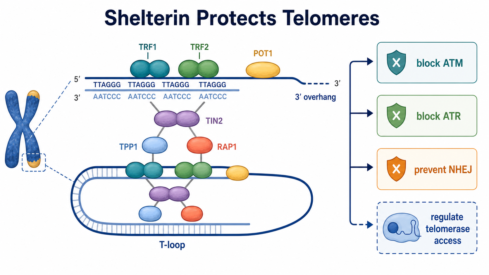

# Shelterin

Shelterin（端粒保护蛋白复合物，也称 telosome）是专门结合 [端粒](端粒.md)的六蛋白复合体，主要由 TRF1、TRF2、POT1、TIN2、TPP1 和 RAP1 组成。它的核心功能是把正常染色体末端伪装和组织成“端粒”，防止细胞把它误判为 [DNA双链断裂](DNA双链断裂.md)并错误修复。

图：Shelterin 结合端粒 TTAGGG 重复序列和 3′ overhang（3′ 突出端），促进 T-loop（端粒环）保护状态，并分别抑制 ATM/ATR DNA damage response（DNA 损伤反应）、NHEJ（non-homologous end joining，非同源末端连接）等会把染色体末端当作断裂处理的通路。本图由 Image2 / image-generation model 生成，用于个人学习示意。

## 为什么端粒需要 Shelterin

线性染色体末端在结构上很像 DNA 断裂：有 DNA 末端、可被核酸酶接触，也可能被 DNA repair machinery（DNA 修复机器）识别。如果没有端粒保护，细胞会尝试激活 [ATM通路](ATM通路.md)、[ATR通路](ATR通路.md)、NHEJ 或同源重组相关修复，结果可能是染色体端到端融合、端粒降解、[细胞衰老](细胞衰老.md)、凋亡或染色体不稳定。

de Lange 在 2005 年系统提出 shelterin 作为端粒专属保护复合体的概念，并强调它不是普通 DNA repair factor 的集合，而是专门把端粒从 DNA 损伤反应中“排除”出来的端粒平台。参考：[de Lange, Genes & Development, 2005](https://doi.org/10.1101/gad.1346005)。

## 六个核心组分

| 组分 | 主要结合位置 | 核心作用 | 出问题时常见后果 |
| --- | --- | --- | --- |
| TRF1 | 双链 TTAGGG 重复序列 | 支持端粒复制、减少 fragile telomere（脆弱端粒） | 端粒复制障碍、端粒脆性增加 |
| TRF2 | 双链 TTAGGG 重复序列 | 促进 T-loop，抑制 ATM 和 NHEJ | 端粒损伤信号、端到端融合 |
| POT1 | 单链 3′ overhang | 覆盖单链端粒 DNA，抑制 ATR，调控端粒酶进入 | ATR 激活、端粒长度调控异常 |
| TIN2 | 桥接 TRF1/TRF2 与 TPP1-POT1 | 稳定复合体结构 | shelterin 装配不稳，多个组分定位异常 |
| TPP1 | 连接 POT1，帮助端粒酶招募 | 调控 POT1 功能和端粒酶 processivity（过程性） | 端粒酶招募或端粒长度维持异常 |
| RAP1 | 与 TRF2 结合 | 辅助抑制端粒重组和异常修复 | 端粒重组、转录/代谢相关效应可能改变 |

这里的分工是实验理解的框架，不是绝对一对一。实际细胞中六个组分互相依赖，去除一个蛋白可能改变整个端粒复合体的空间结构。

## 核心保护逻辑

### TRF2 主要压住 ATM 和 NHEJ

TRF2（telomeric repeat-binding factor 2，端粒重复结合因子 2）对防止端粒被 NHEJ 连接非常关键。经典实验显示，抑制 TRF2 会导致人细胞端粒去保护、DNA 损伤信号和端粒融合。参考：[van Steensel et al., Cell, 1998](https://doi.org/10.1016/S0092-8674(00)80932-0)。

TRF2 不是简单“堵住末端”的盖子。它帮助形成或稳定 T-loop，并通过多种机制降低 ATM 相关损伤反应和末端连接机会。一旦 TRF2 功能丢失，端粒可以像普通 double-strand break（双链断裂）一样被连接，形成 dicentric chromosome（双着丝粒染色体）。

### POT1 主要压住 ATR

POT1（protection of telomeres 1，端粒保护蛋白 1）结合单链 G-rich overhang（富 G 单链突出端）。由于单链 DNA 很容易招募 RPA 并触发 ATR 反应，POT1 的一个核心任务就是让端粒 overhang 不被当作复制压力或单链损伤处理。

Denchi 和 de Lange 证明，TRF2 与 POT1 可分别控制端粒处 ATM 和 ATR 反应：TRF2 主要阻止 ATM，POT1 主要阻止 ATR。参考：[Denchi and de Lange, Nature, 2007](https://doi.org/10.1038/nature06065)。

### TIN2-TPP1 把复合体连成一个平台

TIN2（TRF1-interacting nuclear factor 2，TRF1 相互作用核因子 2）连接 TRF1/TRF2 与 TPP1-POT1，是 shelterin 的结构支架之一。TPP1 则通过与 POT1 结合并与 [端粒酶](端粒酶.md)相互作用，影响端粒酶被招募到端粒末端的效率。

因此 shelterin 有两面性：一方面保护末端、阻止损伤反应；另一方面又必须在合适时机允许端粒酶进入，否则端粒会持续缩短。

## Shelterin 不是“越多越好”

Shelterin 的功能需要平衡。保护不足会让端粒被当成 DNA 损伤；保护过强或端粒酶进入受限，则可能让短端粒无法被维护。不同端粒长度、[细胞周期](细胞周期.md)阶段和细胞类型中，shelterin 组分的结合密度和功能输出可能不同。

这也是为什么端粒状态不能只看一个 shelterin 蛋白表达量。更可靠的判断通常需要结合 [端粒长度检测](端粒长度检测.md)、telomere dysfunction-induced foci（端粒功能障碍诱导焦点，TIF）、端粒融合和 [TRAP assay](<../../用(实验流程内容篇)/TRAP assay.md>) 等读出。

## 与端粒酶和 ALT 的关系

### 与端粒酶

Shelterin 既限制又帮助端粒酶。POT1-TPP1 复合体可参与端粒酶招募和过程性调控，但端粒过长或 shelterin 覆盖较充分时，端粒酶进入机会通常下降。端粒酶调控因此不是简单“有端粒酶就会延长”，而是端粒末端状态、TPP1-POT1 和细胞周期共同决定。

端粒酶招募机制可参考：[Nandakumar and Cech, Nature Reviews Molecular Cell Biology, 2013](https://doi.org/10.1038/nrm3644)。

### 与 ALT

[ALT](ALT.md)（alternative lengthening of telomeres，端粒替代延长）细胞常伴随端粒复制压力、端粒重组和 APB（ALT-associated PML body，ALT 相关 PML 核体）。Shelterin 仍然存在并影响端粒是否被去保护、是否能进入重组模板复制状态。

因此 ALT 不是“没有端粒保护”。更准确地说，ALT 细胞在保留一定端粒保护的同时，允许端粒发生更高水平的重组和 BIR-like DNA synthesis（BIR 样 DNA 合成）。

## 实验上怎么观察 Shelterin

| 目的 | 常用方法 | 能回答什么 | 注意事项 |
| --- | --- | --- | --- |
| 看蛋白表达 | Western blot、RT-qPCR | 总量是否变化 | 总量不等于端粒定位 |
| 看端粒定位 | ChIP-qPCR、ChIP-seq、CUT&RUN | 蛋白是否结合端粒重复序列 | 重复序列分析和抗体特异性很关键 |
| 看空间共定位 | 免疫荧光 + telomere FISH | shelterin 是否位于端粒 | 二维投影可能造成假共定位 |
| 看功能后果 | TIF、端粒融合、端粒脆性、细胞周期 | 去保护是否有生物学后果 | 需要和细胞毒性、复制压力区分 |
| 看端粒维护 | 端粒长度、TRAP、C-circle | 端粒酶或 ALT 是否受影响 | 机制结论不能只靠一个读出 |

Sfeir 和 de Lange 使用条件性去除 shelterin 的实验显示，端粒可被多条 DNA repair pathway（DNA 修复通路）处理，包括 NHEJ、HDR 和 resection 相关过程。参考：[Sfeir and de Lange, Science, 2012](https://doi.org/10.1126/science.1218498)。

## 常见误读

| 说法 | 更准确的理解 |
| --- | --- |
| Shelterin 就是端粒帽子 | 它是动态调控平台，不只是物理盖子 |
| TRF2 负责所有端粒保护 | TRF2 重要，但 POT1、TIN2、TPP1、TRF1、RAP1 都有分工 |
| shelterin 蛋白表达高说明端粒安全 | 需要看端粒定位、端粒长度和损伤读出 |
| 端粒酶活性强就不需要 shelterin | 没有保护的端粒即使能被延长，也可能被错误修复 |
| ALT 就是 shelterin 失效 | ALT 仍需端粒保护，只是端粒重组和模板复制更活跃 |

## 小结

Shelterin 是端粒身份的核心执行者：TRF1/TRF2 识别双链端粒重复序列，POT1 保护单链 overhang，TIN2-TPP1 把复合体组织成平台，RAP1 辅助 TRF2 功能。它同时压制 DNA 损伤反应、阻止端粒融合、调节端粒复制和端粒酶进入。理解 shelterin 的关键不是背六个名字，而是看它如何在“保护末端”和“允许维护”之间保持平衡。

## 参考来源

- [van Steensel et al., TRF2 protects human telomeres from end-to-end fusions, Cell, 1998](https://doi.org/10.1016/S0092-8674(00)80932-0)
- [de Lange, Shelterin: the protein complex that shapes and safeguards human telomeres, Genes & Development, 2005](https://doi.org/10.1101/gad.1346005)
- [Denchi and de Lange, Protection of telomeres through independent control of ATM and ATR by TRF2 and POT1, Nature, 2007](https://doi.org/10.1038/nature06065)
- [Palm and de Lange, How shelterin protects mammalian telomeres, Annual Review of Genetics, 2008](https://doi.org/10.1146/annurev.genet.41.110306.130350)
- [Sfeir and de Lange, Removal of shelterin reveals the telomere end-protection problem, Science, 2012](https://doi.org/10.1126/science.1218498)
- [Nandakumar and Cech, Finding the end: recruitment of telomerase to telomeres, Nature Reviews Molecular Cell Biology, 2013](https://doi.org/10.1038/nrm3644)
