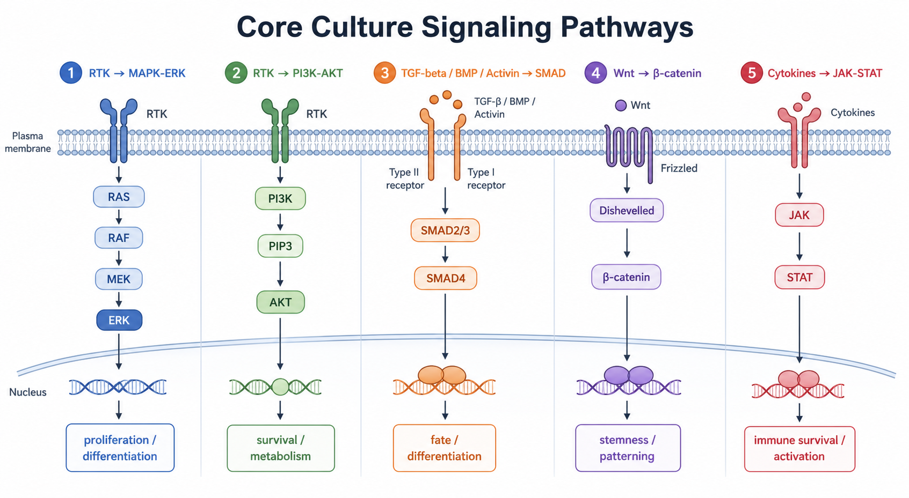

# Wnt-β-catenin通路

Wnt-β-catenin pathway（Wnt-beta-catenin pathway，Wnt-β-连环蛋白通路）是经典 canonical Wnt signaling（经典 Wnt 信号）主轴，常用于解释 stemness（干性）、patterning（模式化）、organoid expansion（类器官扩增）和发育/分化时序。



图源：Image2 生成的核心培养信号通路总览；Wnt-β-catenin 位于 Wnt -> β-catenin 模块。

## 核心逻辑

没有 Wnt 信号时，β-catenin（beta-catenin，β-连环蛋白）容易被 destruction complex（降解复合体）标记并降解；Wnt 配体结合 Frizzled（卷曲受体）和 LRP5/6（low-density lipoprotein receptor-related protein 5/6，低密度脂蛋白受体相关蛋白 5/6）后，β-catenin 稳定并进入细胞核，与 TCF/LEF 相关转录因子共同调控目标基因。Reactome 的 Signaling by WNT 页面整理了 Wnt 配体、Frizzled/LRP 受体、β-catenin 稳定和下游转录事件。参考：[Reactome Signaling by WNT](https://reactome.org/content/detail/R-HSA-195721)。

在培养体系里，Wnt-β-catenin 不是简单的“促增殖通路”。它更像是维持某些 stem/progenitor niche（干细胞/祖细胞生态位）状态、决定分化时序和空间模式的信号轴；剂量、时间和细胞类型都会改变最终结果。

## 在本知识库中的连接

| 上游试剂/因子 | 常见连接方式 | 实验解释重点 |
| --- | --- | --- |
| [Wnt3A](<../../材(实验耗材工具篇)/Wnt3A.md>) | Wnt 配体 -> Frizzled/LRP -> β-catenin | 直接提供经典 Wnt 信号输入 |
| [R-spondin](<../../材(实验耗材工具篇)/R-spondin.md>) | LGR/RNF43/ZNRF3 相关模块增强 Wnt 受体可用性 | 更像“放大器”，不是 Wnt 配体本身 |
| [Noggin](<../../材(实验耗材工具篇)/Noggin.md>) | 抑制 BMP-SMAD | 常与 Wnt/R-spondin 联用，帮助维持类器官生态位 |
| [EGF](<../../材(实验耗材工具篇)/EGF.md>) | RTK 信号并行支持增殖/存活 | 类器官 cocktail 中常与 Wnt 轴共同出现 |

## Wnt3A vs R-spondin vs Noggin

| 因子 | 主要作用 | 容易误解的点 |
| --- | --- | --- |
| Wnt3A | 提供 Wnt 配体刺激 | 不是所有细胞都需要外源 Wnt3A |
| R-spondin | 增强 Wnt 信号，常提高受体层面的敏感性 | 不是 Wnt 配体，单独使用不等于完整 Wnt 输入 |
| Noggin | 拮抗 BMP，降低 BMP-SMAD 分化压力 | 它不激活 Wnt，而是改变另一个通路背景 |

## 常见 readout

| Readout | 代表含义 | 注意事项 |
| --- | --- | --- |
| nuclear β-catenin | β-catenin 入核 | 免疫染色需要良好核/胞质区分 |
| AXIN2、LGR5、MYC 等基因 | Wnt 目标基因响应 | marker 强依赖细胞类型 |
| TOP/FOP reporter | TCF/LEF 转录活性 | 适合通路验证，不一定代表内源目标全部改变 |
| 类器官形态/出芽 | Wnt/R-spondin/Noggin cocktail 的综合结果 | 受基质、EGF、BMP背景和传代状态共同影响 |

## 和 SMAD 通路的区别

Wnt-β-catenin 常与 [SMAD通路](SMAD通路.md) 在发育和类器官体系里共同出现，但实验角色不同。

| 项目 | Wnt-β-catenin | SMAD |
| --- | --- | --- |
| 常见主轴 | Wnt -> β-catenin -> TCF/LEF | TGF-β/Activin/BMP -> SMAD |
| 类器官中常见角色 | 干性、扩增、生态位维持 | BMP抑制、分化压力、命运调控 |
| 常见组合 | Wnt3A + R-spondin + EGF + Noggin | BMP4 或 TGF-β/Activin；Noggin 作为 BMP 拮抗 |
| 解释风险 | 把 R-spondin 当成 Wnt | 把所有 SMAD 分支当成一种信号 |

## 实验记录建议

推荐记录模板（中文）：

```text
Wnt来源：重组Wnt3A/条件培养基/Wnt替代激动剂/其他
是否加入R-spondin：
是否加入Noggin：
品牌/货号/批号：
终浓度或加入比例：
基质条件：
细胞/类器官类型：
处理时间：
readout：
异常形态或异常分化：
```

Recommended record template (English):

```text
Wnt source: recombinant Wnt3A/conditioned medium/Wnt surrogate/other
R-spondin included:
Noggin included:
Brand/catalog/lot:
Final concentration or dilution ratio:
Matrix condition:
Cell/organoid type:
Treatment time:
Readout:
Abnormal morphology or differentiation:
```

## 常见错误与 troubleshooting

| 现象 | 可能原因 | 处理 |
| --- | --- | --- |
| Wnt刺激无响应 | Wnt3A失活、受体表达低、readout不匹配 | 使用新鲜分装并设置阳性 reporter 或 AXIN2 |
| 类器官扩增差 | Wnt/R-spondin/Noggin/EGF 任一环节不足，或基质问题 | 分别排查 cocktail 和基质批次 |
| 分化异常 | Wnt信号过强、过弱或时序错误 | 优化撤除/加入时间点 |
| 条件培养基批间差异大 | Wnt活性和背景成分不稳定 | 做活性桥接或改用定义化重组组分 |

## 小结

Wnt-β-catenin 是类器官、干细胞和发育分化实验中的核心通路。最重要的实验习惯是把 Wnt 配体、R-spondin 增强、Noggin 抑制 BMP 和 EGF 支持增殖这几件事分开记录。

## 参考来源

- [Reactome Signaling by WNT](https://reactome.org/content/detail/R-HSA-195721)
