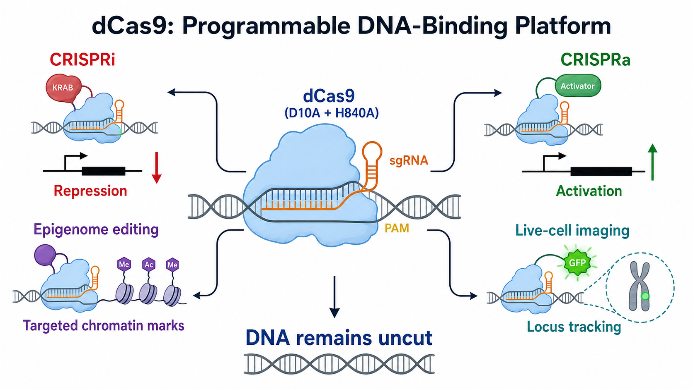

# dCas9

dCas9（catalytically dead Cas9，催化失活 Cas9；也称 nuclease-dead Cas9，核酸酶失活 Cas9）是失去 DNA 切割活性、但仍能在 [sgRNA](sgRNA.md)（single-guide RNA，单导向 RNA）引导下识别并结合特定 DNA 位点的 [Cas9](CRISPR-Cas9.md) 变体。它把 CRISPR 从“可编程核酸酶”扩展成了“可编程 DNA 定位平台”。

图：dCas9-sgRNA 提供共同的定位核心；替换或招募不同效应器后，可用于 [CRISPRi](CRISPRi.md)（CRISPR interference，CRISPR 干扰）、[CRISPRa](CRISPRa.md)（CRISPR activation，CRISPR 激活）、[表观基因组编辑](表观基因组编辑.md)和[活细胞基因组位点成像](CRISPR成像.md)。设计目标是结合 DNA 而不产生双链断裂。本图由 Image2 / image-generation model 生成，用于个人学习示意。

## 它是怎样从 Cas9 变成 dCas9 的

常用 Streptococcus pyogenes Cas9（酿脓链球菌 Cas9，SpCas9）具有两个负责切割 DNA 的核酸酶结构域：RuvC 切割 non-target strand（非靶链），HNH 切割与 sgRNA 配对的 target strand（靶链）。经典 dCas9 同时引入 D10A 和 H840A 突变，使这两个催化中心失活。

这些突变并未删除 Cas9 的主要识别框架。因此 dCas9 仍然需要：

- 与所用 Cas9 版本兼容的 sgRNA scaffold（sgRNA 骨架）。
- 与 spacer（间隔区/靶向区）互补的 DNA protospacer（原间隔序列）。
- 兼容的 [PAM序列](PAM序列.md)（protospacer adjacent motif，原间隔序列邻近基序）。
- 能够接近目标位点的局部染色质环境。

2013 年，Qi 等证明 dCas9 可在不切断 DNA 的情况下按 RNA 指定位置阻碍转录，并将这一策略发展为 CRISPR interference（CRISPR 干扰，CRISPRi）。参考：[Qi et al., Cell, 2013](https://doi.org/10.1016/j.cell.2013.02.022)。同年，Gilbert 等进一步展示 dCas9 可作为模块化效应器招募平台。参考：[Gilbert et al., Cell, 2013](https://doi.org/10.1016/j.cell.2013.06.044)。

## dCas9 的核心价值

野生型 Cas9 的主要输出是 DNA 断裂；dCas9 的主要输出是“在指定 DNA 位点停留，并把一个功能模块带到那里”。因此更换 effector（效应器）后，同一定位逻辑可以产生不同结果。

| dCas9 系统 | 常见效应器或标签 | 主要输出 | 对应页面 |
| --- | --- | --- | --- |
| 转录抑制 | KRAB 或其他抑制结构域 | 降低目标基因转录 | CRISPRi |
| 转录激活 | VP64、VPR、SAM、SunTag 等 | 提高内源基因转录 | CRISPRa |
| 表观基因组编辑 | p300、TET、DNMT 等酶结构域 | 定位改变组蛋白或 DNA 修饰 | 表观调控机制研究 |
| CRISPR 成像 | GFP 或其他荧光标签 | 标记和追踪基因组位点 | 活细胞染色质动态 |
| dCas9 单独结合 | 无外加效应器 | 空间位阻或位点占据 | 细菌 CRISPRi、结合实验 |

Chen 等使用 dCas9-EGFP 和优化 sgRNA 在活细胞中观察内源基因组位点，说明 dCas9 不只是一种转录调控工具。参考：[Chen et al., Cell, 2013](https://doi.org/10.1016/j.cell.2013.12.001)。Hilton 等则将 dCas9 与 p300 acetyltransferase core（p300 乙酰转移酶核心）融合，在特定启动子和增强子定点增加 H3K27 acetylation（组蛋白 H3 第 27 位赖氨酸乙酰化）。参考：[Hilton et al., Nature Biotechnology, 2015](https://doi.org/10.1038/nbt.3199)。

## 效应器如何与 dCas9 组合

### 直接融合

把效应器蛋白直接连接到 dCas9 的 N 端或 C 端，系统组成较直观，例如 dCas9-KRAB、dCas9-VP64 和 dCas9-p300。优点是组件少；局限是融合蛋白较大，并且效应器相对 DNA 的空间位置可能影响活性。

### 间接招募

利用 RNA aptamer（RNA 适配体）、抗体-肽对或其他蛋白互作模块，在一个 dCas9-sgRNA 靶位点招募多个效应器。SAM 和 SunTag 属于这类思路。信号可被放大，但系统组件、表达比例和载体兼容性也更复杂。

### 多位点或多 guide 协同

在同一调控区域布置多条 sgRNA，可能增强转录调控或成像信号。但多 guide 也会增加递送负担、潜在脱靶结合和结果解释难度，应设置 guide 数量相当的对照。

## 实验设计逻辑

### 先选功能，再选靶位点

dCas9 的最佳靶区取决于任务，而不是存在一个通用“最佳 guide”：

- CRISPRi/a 重点关注真实 [转录起始位点](转录起始位点.md)（transcription start site，TSS）及启动子结构。
- 表观基因组编辑需要考虑希望改变的 promoter（启动子）、enhancer（增强子）或其他调控元件。
- CRISPR 成像通常优先利用重复序列，或用多条 sgRNA tiled array（平铺阵列）增强非重复位点信号。

### 系统版本必须成套匹配

需要同时确认 dCas9 来源/变体、PAM、sgRNA scaffold、效应器、核定位信号、表达启动子和递送载体。只写“使用 dCas9”无法复现实验，也无法判断某条 sgRNA 是否兼容。

### 控制表达量和持续时间

dCas9 蛋白较大，持续高表达可能带来细胞负担；大量 sgRNA 也可能竞争有限的 dCas9。短期实验、稳定细胞系和诱导表达系统的背景效应不同，应按实验周期设计。

### 把定位成功与功能成功分开验证

dCas9 能到达目标位点，不代表效应器一定产生预期输出。转录调控应检测 RNA、蛋白和表型；表观编辑应检测对应 chromatin mark（染色质标记）和转录变化；成像应与 FISH（fluorescence in situ hybridization，荧光原位杂交）或已知位置标记交叉验证。

## 推荐对照

| 对照 | 解决的问题 |
| --- | --- |
| non-targeting sgRNA | dCas9、效应器、载体和筛选本身是否造成背景 |
| dCas9 + 无效应器或催化失活效应器 | 表型来自定位/空间位阻还是效应器催化活性 |
| 多个独立 sgRNA | 是否由单条 guide 的偶然结合造成 |
| 已知有效阳性 guide | 系统在当前细胞中是否具备功能 |
| 不表达 dCas9 的细胞 | sgRNA 或载体是否独立产生影响 |

## dCas9 与相关 Cas9 形式对比

| 形式 | 核酸酶状态 | 主要 DNA 输出 | 常见用途 |
| --- | --- | --- | --- |
| wild-type Cas9（野生型 Cas9） | 两个结构域均有活性 | DNA 双链断裂 | [基因编辑](<../../用(实验流程内容篇)/基因编辑.md>)、敲除、敲入 |
| Cas9 nickase（Cas9 切口酶） | 仅一个结构域失活 | 单链切口 | 成对切口、部分精准编辑策略 |
| dCas9 | 两个结构域均失活 | 结合但不主动切割 | 转录调控、表观编辑、成像 |

“dead”只表示核酸酶催化失活，不表示生物学惰性。dCas9 仍可占据 DNA、阻碍蛋白结合、改变局部染色质，融合效应器还可能形成持续的转录或表观遗传影响。

## 常见异常与 troubleshooting

| 异常 | 常见原因 | 调整方向 |
| --- | --- | --- |
| 完全没有功能输出 | dCas9/效应器未表达、sgRNA 无效、PAM 不匹配 | 分别验证组件表达与阳性 guide |
| 有结合但调控弱 | 靶点几何位置不合适、效应器太弱、染色质不可及 | 更换靶区、效应器架构或多 guide 组合 |
| non-targeting 对照也改变表型 | 表达负担、筛选压力、效应器非特异活性 | 降低表达量，增加效应器失活对照 |
| 不同细胞系结果差异大 | 染色质、TSS、转录因子环境和递送效率不同 | 在每个模型中重新验证 guide 与表达条件 |
| 成像背景过高 | 游离 dCas9-荧光蛋白过多、guide 数不足 | 优化表达比例、信号放大和洗脱/成像条件 |

## 小结

dCas9 的本质不是“不能切的 Cas9”，而是一个由 sgRNA 编程的 DNA 定位底座。实验设计应从希望招募的功能出发，再确定 dCas9 版本、sgRNA、PAM、靶区、效应器和验证方法；同时牢记“不切 DNA”并不等于“没有脱靶结合或生物学副作用”。

## 参考来源

- [Qi et al., Repurposing CRISPR as an RNA-guided platform for sequence-specific control of gene expression, Cell, 2013](https://doi.org/10.1016/j.cell.2013.02.022)
- [Gilbert et al., CRISPR-mediated modular RNA-guided regulation of transcription in eukaryotes, Cell, 2013](https://doi.org/10.1016/j.cell.2013.06.044)
- [Chen et al., Dynamic imaging of genomic loci in living human cells by an optimized CRISPR/Cas system, Cell, 2013](https://doi.org/10.1016/j.cell.2013.12.001)
- [Hilton et al., Epigenome editing by a CRISPR-Cas9-based acetyltransferase activates genes from promoters and enhancers, Nature Biotechnology, 2015](https://doi.org/10.1038/nbt.3199)
