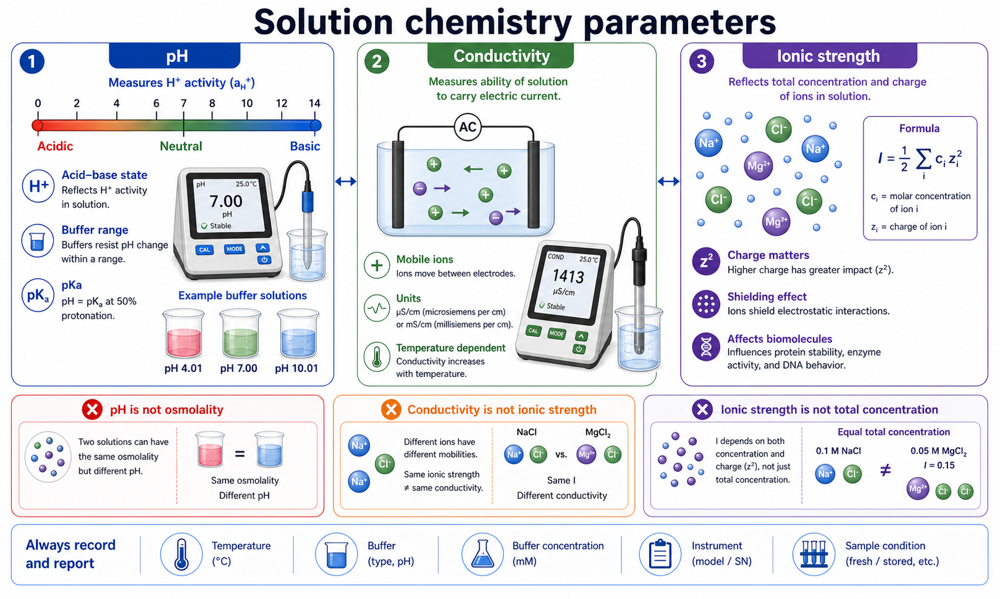

# pH

pH 是描述 solution acid-base state（溶液酸碱状态）的核心参数，严格来说和 hydrogen ion activity（氢离子活度）相关，而不是简单等同于 H+ concentration（氢离子浓度）。在实验 protocol 里，pH 会影响缓冲液性能、蛋白质构象、酶活性、细胞培养状态、核酸杂交和电泳迁移行为。



图源：Image2 生成的溶液酸碱与离子参数概念图。pH 反映酸碱状态，[电导率](电导率.md) 反映可移动离子的导电能力，[离子强度](离子强度.md) 反映离子浓度和电荷对相互作用的综合影响；三者不能互相替代。

## 定义与命名

pH 没有展开式。常见解释是 power of hydrogen 或 potential of hydrogen，但实际 protocol 里更重要的是理解它和 H+ activity（氢离子活度）有关。IUPAC Gold Book 对 pH 的定义强调标准化的活度测量，而不是单纯浓度。参考：[IUPAC Gold Book pH](https://goldbook.iupac.org/terms/view/P04524/pdf)。

通常理解：

```text
pH = -log10(aH+)
```

其中 aH+ 是氢离子活度。稀溶液里可以近似用 H+ 浓度帮助直觉理解，但在高盐、高蛋白、有机溶剂或复杂培养基中，活度和浓度不再完全等价。

## pH 为什么重要

| 影响对象 | pH 改变会发生什么 |
| --- | --- |
| 蛋白质 | 改变电荷、构象、稳定性和溶解性 |
| 酶反应 | 影响催化基团质子化状态和最适活性 |
| 核酸 | 影响碱基质子化、结构和某些杂交条件 |
| 细胞培养 | 影响代谢、膜蛋白、酶活、细胞应激和[酚红](<../../材(实验耗材工具篇)/酚红.md>)颜色 |
| 抗体/抗原结合 | 影响电荷分布和非特异吸附 |
| 电泳/转膜 | 影响分子带电状态和迁移方向/速度 |

pH 变化通常不是孤立发生的。比如用 [氢氧化钠](<../../材(实验耗材工具篇)/氢氧化钠.md>) 或 [盐酸](<../../材(实验耗材工具篇)/盐酸.md>) 调 pH 时，也会引入 Na+、Cl- 或改变 buffer composition（缓冲体系组成），从而影响离子强度和电导率。

## pH、pKa 和缓冲范围

pKa 是 acid dissociation constant（酸解离常数 Ka）的负对数，用来描述某个弱酸/弱碱体系在何处最能抵抗 pH 变化。一般来说，buffer（缓冲液）在 pH 接近 pKa ± 1 的范围内比较有效。

| 概念 | 意义 |
| --- | --- |
| pH | 当前溶液酸碱状态 |
| pKa | 缓冲组分半解离时对应的 pH |
| buffer range（缓冲范围） | 缓冲液能有效抵抗 pH 改变的范围 |
| buffer capacity（缓冲容量） | 抵抗酸/碱加入导致 pH 改变的能力 |

例如 [HEPES](<../../材(实验耗材工具篇)/HEPES.md>) 常用于细胞培养和生物反应体系，是因为它在接近生理 pH 的范围内有较好的缓冲能力；而 [PBS](<../../材(实验耗材工具篇)/PBS.md>) 的 phosphate buffer（磷酸盐缓冲体系）适合许多洗涤和稀释场景，但并不适合所有金属离子敏感或钙镁相关反应。

## 常见实验场景

| 场景 | pH 重点 |
| --- | --- |
| PBS / [DPBS](<../../材(实验耗材工具篇)/DPBS.md>) | 接近生理 pH，避免洗细胞时造成酸碱刺激 |
| [培养基](<../../材(实验耗材工具篇)/培养基.md>) | CO2/碳酸氢盐体系、酚红颜色和细胞代谢共同影响 pH |
| 酶反应液 | 需要接近酶的最适 pH |
| 抗体孵育液 | pH 影响抗体结合和背景 |
| [转膜缓冲液](<../../材(实验耗材工具篇)/转膜缓冲液.md>) | pH 影响蛋白带电状态和转移效率 |
| [SDS-PAGE](<../../用(实验流程内容篇)/SDS-PAGE.md>) | stacking/resolving gel 的 pH 差异参与蛋白聚焦 |
| 核酸电泳 | pH 影响核酸稳定性和迁移环境 |

对 CO2/bicarbonate（CO2/碳酸氢盐）缓冲体系，瓶外空气中测得的 pH 不能简单等同于 [CO2培养箱](<../../材(实验耗材工具篇)/CO2培养箱.md>)内平衡后的 pH。

## pH vs 电导率/离子强度/渗透压

| 参数 | 看起来相关的原因 | 关键区别 |
| --- | --- | --- |
| pH | 酸碱调节常加入离子 | pH 主要反映 H+ 活度，不等于总离子量 |
| 电导率 | 酸、碱、盐都会改变导电能力 | 同 pH 的两种溶液电导率可能完全不同 |
| 离子强度 | 酸碱和盐都会贡献离子 | pH 不告诉你 Mg2+、Na+、Cl- 等总电荷环境 |
| [渗透压](渗透压.md) | 加酸碱和盐会改变渗透活性粒子 | pH 正常也可能高渗或低渗 |
| [折光率](折光率.md) | 溶质浓度改变会影响 RI | RI 不能说明酸碱状态 |

举例：两份溶液都可以是 pH 7.4，但一份是低盐缓冲液，另一份是高盐 PBS，它们对细胞、蛋白相互作用和电泳迁移的影响会不同。

## 如何测量和记录

pH 通常用 [pH计](<../../材(实验耗材工具篇)/pH计.md>)测量。关键不是只记录结果，而是记录测量条件。

```text
样品名称：
配方：
目标 pH：
实测 pH：
测量温度：
仪器型号：
电极类型：
校准液：
校准点：
校准日期：
调 pH 试剂：
调节后终体积：
是否灭菌后复测：
异常现象：
```

English record template:

```text
Sample name:
Formulation:
Target pH:
Measured pH:
Measurement temperature:
Instrument model:
Electrode type:
Calibration buffers:
Calibration points:
Calibration date:
pH adjustment reagent:
Final volume after adjustment:
Rechecked after sterilization:
Abnormal observation:
```

## 常见错误与 troubleshooting

| 问题 | 可能原因 | 处理 |
| --- | --- | --- |
| pH 一直漂移 | 电极污染、CO2 交换、温度未平衡 | 清洁电极，控制测量条件，记录温度 |
| pH 正常但细胞状态差 | 渗透压、毒性、污染或离子强度问题 | 同时检查 osmolality、电导率和污染 |
| 灭菌后 pH 改变 | 热处理导致 buffer 或 CO2 状态变化 | 灭菌后复测，必要时重新优化配方 |
| 加少量酸碱 pH 变化很大 | 缓冲容量不足 | 提高或更换缓冲体系 |
| 不同人测量差异大 | 校准液、电极状态、读数稳定标准不同 | 统一 SOP 和记录模板 |

## 小结

pH 是实验溶液的酸碱状态指标，但不是溶液质量的全部。一个可靠的 protocol 应该同时考虑 pH、缓冲范围、温度、离子强度、电导率和渗透压，尤其是在细胞培养、蛋白实验、电泳和酶反应中。

## 参考来源

- [IUPAC Gold Book pH](https://goldbook.iupac.org/terms/view/P04524/pdf)
- [Mettler Toledo pH measurement guide](https://www.mt.com/us/en/home/library/guides/lab-analytical-instruments/ph-measurement-guide.html)
- [Thermo Fisher Scientific pH meters and electrodes](https://www.thermofisher.com/us/en/home/life-science/lab-equipment/electrochemistry/ph-meters-electrodes.html)
