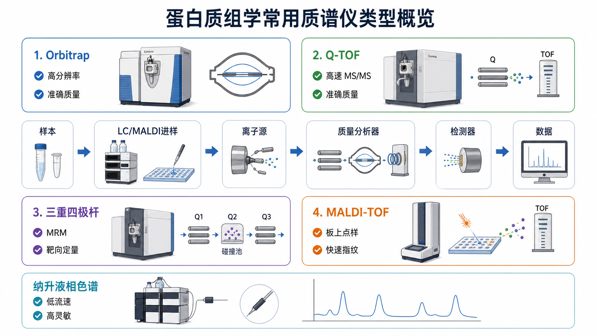

# transition

Transition（离子转变，常译为 transition 或离子对）在靶向质谱中指一个 [前体离子](前体离子.md) 到一个 [产物离子](产物离子.md) 的监测关系，通常写作 precursor m/z -> product m/z。它是 [选择反应监测](选择反应监测.md)（SRM）和 [多反应监测](多反应监测.md)（MRM）的基本单位。



图源：Image2 生成的质谱仪器类型参考图。三重四极杆模块中 Q1 选择前体离子、Q2 碰撞、Q3 选择产物离子，这条路径对应一个 transition。

## transition 的格式

典型写法：

```text
precursor m/z -> product m/z
```

例如：

```text
523.2762 -> 684.3910
```

如果是肽段，还常同时记录电荷态、肽段序列、保留时间、碰撞能量和离子类型。

Thermo Fisher 的 Triple Quadrupole LC-MS 页面强调三重四极杆用于 targeted compound detection and quantitation（靶向化合物检测和定量），并提到 SRM assay table 等靶向采集方式。transition 就是这类 assay table 中最核心的条目之一。参考：[Thermo Fisher Triple Quadrupole LC-MS](https://www.thermofisher.com/us/en/home/industrial/mass-spectrometry/liquid-chromatography-mass-spectrometry-lc-ms/lc-ms-systems/triple-quadrupole-lc-ms.html)

## 一个 transition 包含什么

| 字段 | 含义 |
| --- | --- |
| Target name | 目标分子、肽段或代谢物名称 |
| Precursor m/z | 前体离子 m/z |
| Precursor charge | 前体离子电荷态 |
| Product m/z | 产物离子 m/z |
| Product ion type | 例如 y7、b5 或特征碎片 |
| Collision energy | 碰撞能量 |
| Retention time window | 保留时间窗口 |
| Quantifier / qualifier | 定量或确认 transition |
| Internal standard | 是否对应内标 transition |

## 定量 transition 和确认 transition

| 类型 | 英文 | 作用 |
| --- | --- | --- |
| 定量 transition | quantifier transition | 峰面积用于主要定量 |
| 确认 transition | qualifier transition | 用于确认目标身份和离子比 |
| 内标 transition | internal standard transition | 修正进样、回收和离子化差异 |

实际方法里，一个目标通常不只用一个 transition。至少一个定量 transition 加一个确认 transition，能降低基质干扰导致的假阳性风险。

## transition 如何选择

| 原则 | 解释 |
| --- | --- |
| 前体离子特异 | 避免与基质或同系物重叠 |
| 产物离子强且稳定 | 定量重复性更好 |
| 避免低 m/z 背景区 | 减少非特异背景干扰 |
| 保留时间匹配 | transition 峰必须出现在合理 RT 窗口 |
| 离子比稳定 | 定量/确认 transition 比值应在方法允许范围内 |
| 内标同步 | 内标 transition 应与目标行为相近 |

## 在不同方法中的意义

| 方法 | transition 角色 |
| --- | --- |
| SRM | 监测一个 selected reaction |
| MRM | 同时监测多个 transition |
| PRM | 不固定单个 product m/z，而是采集目标前体的碎片全谱 |
| DIA | 不预设单个 transition，但分析时常用 fragment ion traces 类似 transition 逻辑辅助定量 |

## 常见错误

| 错误 | 后果 |
| --- | --- |
| 只用一个 transition | 容易假阳性，确认能力弱 |
| 只选最强碎片 | 可能背景干扰高，不一定最特异 |
| 不验证离子比 | 错峰也可能被积分成目标 |
| 不记录碰撞能量 | 方法难复现，转移困难 |
| 保留时间窗口太宽 | 增加错误峰和背景积分 |

## 小结

transition 是靶向质谱的“检测坐标”：一个前体离子加一个产物离子。好的 transition 不只是强，还要特异、稳定、可验证，并和保留时间、离子比、内标和碰撞能量一起构成可靠的定量方法。

## 参考来源

- [Thermo Fisher Triple Quadrupole LC-MS](https://www.thermofisher.com/us/en/home/industrial/mass-spectrometry/liquid-chromatography-mass-spectrometry-lc-ms/lc-ms-systems/triple-quadrupole-lc-ms.html)
