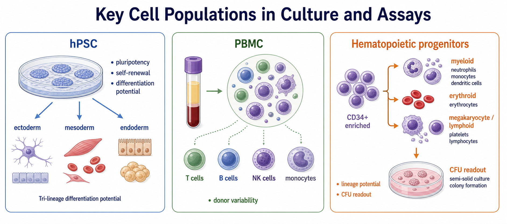

# 人胚胎干细胞

人胚胎干细胞（human embryonic stem cell，hESC）是从 early blastocyst（早期囊胚）的 inner cell mass（内细胞团）建立的人源多能干细胞，属于 [人多能干细胞](人多能干细胞.md)（human pluripotent stem cells，hPSC）的一类。它具有 self-renewal（自我更新）能力，并能在合适条件下分化为 ectoderm（外胚层）、mesoderm（中胚层）和 endoderm（内胚层）相关细胞类型。



图源：Image2 生成的关键细胞群概览图；hESC 属于 hPSC 分支，重点是稳定多能性、标准化培养和分化潜能验证。

## 核心定位

hESC 的实验价值来自两个特点：第一，它来自早期胚胎内细胞团，长期被视为研究人类早期发育和多能性调控的重要参考模型；第二，成熟的 hESC line（人胚胎干细胞系）通常可以在标准化培养体系中长期扩增，并用于分化为神经、心肌、肝样、胰岛样、造血样等多种细胞类型。

NIH Stem Cell Basics 将 pluripotent stem cells（多能干细胞）分为 embryonic stem cells（胚胎干细胞）和 induced pluripotent stem cells（诱导多能干细胞）等类型，并指出早期囊胚中的 inner cell mass 最终可形成机体多种组织。参考：[NIH Stem Cell Basics](https://stemcells.nih.gov/info/basics/stc-basics)。

## 发明与历史背景

1998 年，Thomson 等人在 Science 发表人胚胎干细胞系的建立工作，这是 hESC 研究的重要起点。这个历史节点让体外研究人类多能性、早期发育和定向分化成为可能。参考：[Thomson et al., 1998, Science, DOI: 10.1126/science.282.5391.1145](https://www.science.org/doi/10.1126/science.282.5391.1145)；PubMed 条目：[PMID 9804556](https://pubmed.ncbi.nlm.nih.gov/9804556/)。

需要注意，hESC 研究涉及 embryo source（胚胎来源）、informed consent（知情同意）、伦理审查和不同地区法规。实际项目中不能只按普通细胞系处理，应明确细胞系来源、授权范围和机构合规要求。

## 与 iPSC 的关系

| 项目 | hESC | iPSC |
| --- | --- | --- |
| 英文全称 | human embryonic stem cell | induced pluripotent stem cell |
| 中文 | 人胚胎干细胞 | 诱导多能干细胞 |
| 来源 | 早期胚胎内细胞团 | 体细胞重编程获得 |
| 常见优势 | 标准化参考模型、发育研究价值高 | 可保留供体遗传背景，适合疾病模型和个体化研究 |
| 常见限制 | 伦理和来源限制更突出 | 克隆差异、重编程记忆和遗传/表观遗传异常需要 QC |

hESC 和 [诱导多能干细胞](诱导多能干细胞.md) 都属于 hPSC，但它们不是简单互相替代。做分化 protocol 开发时，hESC 常作为稳定参考；做患者来源疾病模型时，iPSC 通常更有优势。

## 实验中的核心用途

| 场景 | hESC 的价值 | 记录重点 |
| --- | --- | --- |
| 早期发育研究 | 观察多能性维持和胚层分化趋势 | 细胞系、传代数、培养基、基质和 marker |
| 定向分化 protocol 开发 | 作为较标准的 hPSC 输入模型 | 起始状态、分化批次、细胞密度和分化效率 |
| 药物筛选 | 分化为特定体细胞后进行功能或毒性测试 | 分化细胞类型、成熟度、读数窗口 |
| 类器官模型 | 作为构建复杂组织模型的起始细胞 | 分化路线、matrix、培养时长和形态 |
| 方法学对照 | 与 iPSC 或其他细胞来源比较 | 是否同一培养体系、是否同一 passage window |

## 在本知识库中的连接

| 相关页面 | 和 hESC 的关系 |
| --- | --- |
| [人多能干细胞](人多能干细胞.md) | hESC 的上级概念入口 |
| [诱导多能干细胞](诱导多能干细胞.md) | hESC 的主要对照类型 |
| [干细胞培养](<../../用(实验流程内容篇)/干细胞培养.md>) | hESC 日常维持、传代、冻存和状态控制方法入口 |
| [mTeSR](<../../材(实验耗材工具篇)/mTeSR.md>) | hPSC feeder-free culture（无饲养层培养）常见培养基产品族 |
| [细胞外基质胶](<../../材(实验耗材工具篇)/细胞外基质胶.md>) | hESC 贴壁和克隆形态维持的重要变量 |
| [免疫荧光](<../../用(实验流程内容篇)/免疫荧光.md>)、[流式细胞术](<../../用(实验流程内容篇)/流式细胞术.md>) | 多能性 marker 和分化 marker 验证 |

## 关键 QC 指标

| 指标 | 意义 | 常见问题 |
| --- | --- | --- |
| 克隆形态 | 判断未分化状态的日常入口 | 边缘分化、克隆散开、细胞间隙变大 |
| OCT4、SOX2、NANOG | pluripotency marker（多能性标志物） | marker 阳性不能替代功能验证 |
| SSEA-3/SSEA-4、TRA-1-60、TRA-1-81 | hPSC 表面 marker | 不同抗体和平台阈值不完全一致 |
| 三胚层分化潜能 | 功能性多能性验证 | 分化能力会受起始状态影响 |
| 核型或基因组稳定性 | 长期培养可靠性 | 高传代或强选择压力可能带来异常 |
| [支原体检测](<../../用(实验流程内容篇)/支原体检测.md>) | 排除隐性感染 | 支原体会显著改变生长和分化 |

## 常见误区与 troubleshooting

| 现象/误区 | 可能原因 | 处理思路 |
| --- | --- | --- |
| 把 hESC 当普通贴壁细胞 | 忽视多能性和自发分化风险 | 按 hPSC 规则记录形态、传代方式、基质和 QC |
| 分化效率突然下降 | 起始克隆状态差、传代数变化、隐性分化 | 固定 passage window，分化前做形态和 marker 检查 |
| 长期培养后状态改变 | 遗传漂移、选择压力或污染 | 建立低传代 master stock，定期核型/QC |
| 只记录“hESC”不记录细胞系 | 不同 hESC line 的分化倾向不同 | 写清 line name、来源、授权范围和培养体系 |
| 忽略伦理和使用范围 | hESC 来源特殊 | 保存来源文件、MTA/授权、伦理审批信息 |

## 推荐记录模板

中文记录模板：

```text
hESC细胞系：
来源/授权：
伦理或使用限制：
传代数：
培养基：
培养基货号/批号：
matrix品牌/货号/批号：
传代方式：
克隆形态：
自发分化比例：
多能性marker：
三胚层分化或功能验证：
支原体检测：
核型/基因组QC：
后续用途：
异常现象：
```

English record template:

```text
hESC line:
Source/authorization:
Ethical or use restrictions:
Passage number:
Medium:
Medium catalog/lot:
Matrix brand/catalog/lot:
Passaging method:
Colony morphology:
Spontaneous differentiation percentage:
Pluripotency markers:
Trilineage differentiation or functional validation:
Mycoplasma test:
Karyotype/genomic QC:
Downstream use:
Abnormal observation:
```

## 小结

hESC 是 hPSC 体系中的经典参考模型，适合研究人类多能性、早期发育和定向分化。但它不是“普通细胞系”：来源合规、培养体系、传代数、形态、多能性 marker、分化潜能和遗传稳定性都需要清楚记录。

## 参考来源

- [NIH Stem Cell Basics](https://stemcells.nih.gov/info/basics/stc-basics)
- [Thomson et al., 1998, Science, DOI: 10.1126/science.282.5391.1145](https://www.science.org/doi/10.1126/science.282.5391.1145)
- [Embryonic stem cell lines derived from human blastocysts, PubMed](https://pubmed.ncbi.nlm.nih.gov/9804556/)
