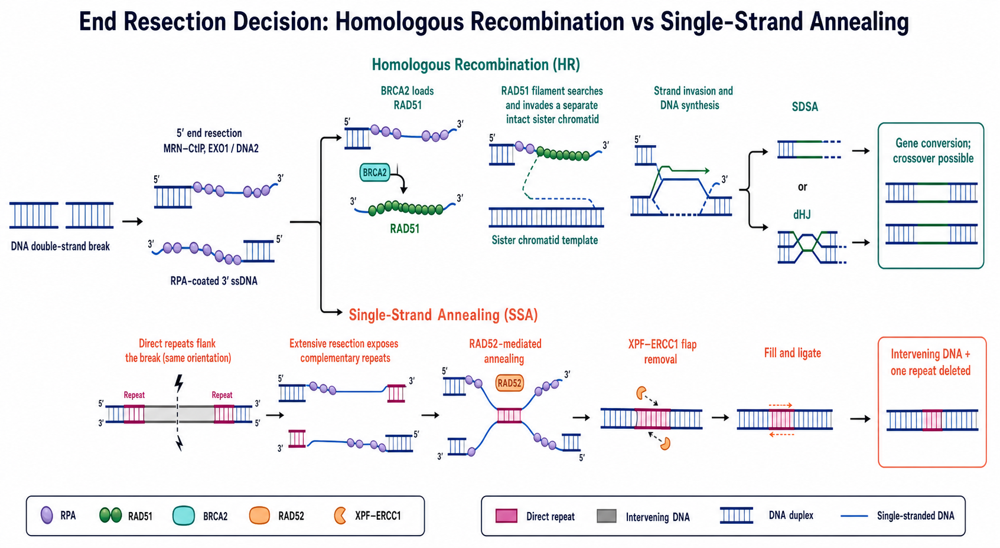

# 单链退火

SSA（single-strand annealing，单链退火）是一种以断裂两侧同向直接重复序列为配对基础的 [DNA双链断裂](DNA双链断裂.md) 修复方式。它经过较广泛的末端切除，使两份重复序列暴露并相互退火；修复完成后，中间区段和其中一份重复序列会被删除，因此 SSA 本质上是带确定性序列损失的修复路径。



图：HR 与 SSA 都从 5′ 端切除产生 RPA 包被的 3′ 单链 DNA，但后续逻辑不同。HR 通过 BRCA2–RAD51 进行同源模板搜索和链侵入；SSA 则由 RAD52 促进断裂两侧原有直接重复序列退火，经 XPF–ERCC1 去除不配对尾端后连接，并删除中间 DNA 和一份重复序列。本图由 Image2 / image-generation model 生成，用于个人学习示意。

## 首先不要把 SSA 与 SDSA 混淆

| 缩写 | 英文全称 | 中文名称 | 核心动作 | 常见结局 |
| --- | --- | --- | --- | --- |
| SSA | single-strand annealing | 单链退火 | 两侧直接重复序列在切除后彼此退火 | 删除重复序列之间的区段及一份重复 |
| [SDSA](SDSA.md) | synthesis-dependent strand annealing | 合成依赖性链退火 | RAD51 链侵入同源模板、延伸后退出，再与另一断端退火 | 通常形成非交换型基因转换 |
| [SSTR](SSTR.md) | single-strand template repair | 单链模板修复 | 使用外源 ssODN 等单链供体复制目标改变 | 点突变、小替换或短插入 |

三个名称都含有 single-strand 或 annealing，但底物、关键蛋白和结果并不相同。SSA 不需要外源供体，也不经过经典 RAD51 链侵入；SDSA 则属于 [同源重组](同源重组.md) 的常见结果路径。

## SSA 发生需要什么条件

### 断裂两侧存在同向直接重复序列

direct repeat（直接重复序列）是方向相同的两段相似 DNA。只有当 DSB 位于两段重复序列之间，且末端切除足以暴露两份互补重复时，才具备典型 SSA 底物。

重复序列可能来自人工 reporter（报告系统），也可能来自天然重复元件、基因家族片段或局部低复杂度序列。重复越长、相似度越高，通常越有利于退火；但不存在脱离细胞背景、重复间距和切除能力的统一阈值。

### 末端切除达到重复区域

MRN–CtIP 参与启动 5′ end resection（5′ 端切除），EXO1 或 DNA2–BLM 等可进一步延伸切除，产生 3′ single-stranded DNA（3′ 单链 DNA）。RPA（replication protein A，复制蛋白 A）先覆盖这些单链区域，防止非特异折叠并参与通路调节。

SSA 与 [MMEJ](MMEJ.md) 都需要切除，但 SSA 通常需要暴露更长、更远的重复序列，因此对广泛切除的依赖更强。两者共享早期切除步骤的实验依据可见 [Truong et al., PNAS, 2013](https://doi.org/10.1073/pnas.1213431110)。

## 基本机制

### RAD52 促进互补单链退火

当两份重复序列被暴露后，RAD52（RAD52 homolog, DNA repair protein，RAD52 同源 DNA 修复蛋白）促进互补单链 DNA 配对。纯化人 RAD52 能结合经过切除的 DNA 末端并形成可直接观察的退火中间体。参考：[Van Dyck et al., EMBO Reports, 2001](https://doi.org/10.1093/embo-reports/kve201)。

较新的结构与生化研究显示，RAD52 与 RPA 协同调节单链退火，活跃构象并不等同于传统印象中的封闭 RAD52 环。参考：[Liang et al., Nature, 2024](https://doi.org/10.1038/s41586-024-07347-7)。

> 酵母 RAD52 在同源重组中的作用范围比哺乳动物更广。讨论人细胞时，不应把酵母中“Rad52 是 HR 核心介质”的结论原样搬过来；哺乳动物经典 HR 的 RAD51 装载主要由 BRCA2 等介导，而 RAD52 在 SSA 等退火反应中尤其重要。

### 去除不配对的 3′ 尾端

重复序列完成退火后，重复区之外会形成 non-homologous 3′ flaps（非同源 3′ 尾端）。XPF–ERCC1 structure-specific endonuclease（XPF–ERCC1 结构特异性内切核酸酶）参与切除这些尾端，使 DNA 能继续补缺和连接。哺乳动物细胞实验支持 ERCC1–XPF 对高效 SSA 的作用。参考：[Al-Minawi et al., Nucleic Acids Research, 2008](https://doi.org/10.1093/nar/gkm888)。

### 填补缺口并连接

尾端移除后，DNA polymerase（DNA 聚合酶）填补残余缺口，DNA ligase（DNA 连接酶）恢复骨架连续性。修复后的染色体仅保留一份重复序列：两重复序列之间的 DNA 和另一份重复序列已经不可逆丢失。

## 为什么 SSA 必然造成缺失

```text
断裂前：  A — [重复 R] — 中间区段 — DSB — [重复 R] — B
切除后：      [R 单链]  <------>  [R 单链]
SSA 后：  A — [重复 R] — B
```

两份 `R` 相互退火后，位于它们之间的序列没有可保留的位置，因此最终连接产物只能剩下一份 `R`。这与可能精准恢复原序列的 HR 不同，也比多数局部小 indel 具有更明确的结构性后果。

Fishman-Lobell 等通过可诱导 DSB 系统区分了基因转换和 SSA 两条可分离路径，为这一模型提供了经典遗传学证据。参考：[Fishman-Lobell et al., Molecular and Cellular Biology, 1992](https://doi.org/10.1128/MCB.12.3.1292)。

## SSA 与 MMEJ 的区别

| 特征 | SSA | MMEJ / TMEJ |
| --- | --- | --- |
| 配对序列 | 较长的同向直接重复序列 | 通常为断端附近较短微同源序列 |
| 切除范围 | 常需扩展至两侧重复区 | 通常较局部，但可因位点而异 |
| 代表因子 | RAD52、XPF–ERCC1 等 | POLQ/Polθ 等 |
| 典型产物 | 删除两重复之间全部序列及一份重复 | 连接点带微同源特征的缺失/插入 |
| 单凭连接点能否归因 | 需结合重复结构与机制证据 | 微同源本身也不是 Polθ 依赖的充分证明 |

“缺失连接点有几碱基相同”更接近 MMEJ 样结果；“两段较长直接重复之间的整个区段消失，并只剩一份重复”才更符合 SSA 结构。

## 在 CRISPR 实验中的意义

### 重复区附近切割可能产生预期外的大缺失

若 Cas9 切口位于两份同向重复之间，广泛切除可能把修复导向 SSA。此时只分析切口附近几十到数百碱基的短扩增子，可能完全看不到已经删除引物位点的等位基因。

### 也可以用于设计性删除

研究者可有意识地利用目标区域两侧的直接重复序列，使 DSB 后偏向形成定义明确的区段缺失。这种策略的优势是结局结构直观；局限是依赖位点重复结构，并可能同时产生 [NHEJ](NHEJ.md)、MMEJ 或其他重排产物。

### 短片段 PCR 可能夸大删除等位基因

当野生型扩增子明显长于 SSA 删除产物时，较短产物可能在 PCR 中被优先扩增。凝胶上强烈的短条带不等于它在原始细胞群中占同样高的比例，需要使用校正过的定量方法、数字 PCR 或测序读数谨慎解释。

## 实验检测与验证

| 方法 | 能回答的问题 | 主要局限 |
| --- | --- | --- |
| SSA reporter | 比较特定构建中的 SSA 活性 | 人工重复长度、间距和染色质环境未必代表内源位点 |
| 跨缺失区 PCR | 是否存在预测的短连接产物 | 短产物扩增优势会扭曲频率 |
| junction sequencing（连接点测序） | 是否只剩一份重复以及边界是否符合设计 | 不能单独排除其他等位基因或拷贝数变化 |
| 外侧长片段 PCR / long-read sequencing（长读长测序） | 同时观察野生型、预期删除和复杂重排 | 建库与扩增仍可能存在长度偏倚 |
| ddPCR / copy-number assay（数字 PCR / 拷贝数检测） | 目标区段是否真实丢失及相对比例 | 需要合适的参考位点和等位基因模型 |

经典哺乳动物 reporter 研究显示，SSA、基因转换和末端连接具有不同遗传依赖和突变后果。参考：[Stark et al., Molecular and Cellular Biology, 2004](https://doi.org/10.1128/MCB.24.21.9305-9316.2004)。

## 常见异常与 troubleshooting

| 观察 | 可能原因 | 优先检查 |
| --- | --- | --- |
| 预测有直接重复但 SSA 产物很低 | 切除不足、重复距离过远、相似度不足或染色质不可及 | 重复方向/序列、切口位置、细胞周期和切除标志 |
| 短缺失条带非常强 | 短扩增子 PCR 优势 | 使用绝对定量、限制循环数并比较无扩增偏倚方法 |
| 只有一个连接点符合 SSA | 位点修复高度偏好该重复，或克隆采样太少 | 增加生物学重复和等位基因测序深度 |
| RAD52 干预后删除减少但细胞状态变差 | RAD52 还参与其他复制/修复过程 | 加入存活、细胞周期和总体 DSB 负担对照 |
| 删除边界不在完整重复处 | MMEJ、端连接或复杂重排混入 | 逐等位基因检查微同源与更大范围结构 |
| 两侧局部 PCR 均正常但功能缺失 | 区段倒位、远端重排或拷贝数改变 | 外侧 PCR、长读长和拷贝数分析 |

## 与相关修复路径的快速对比

| 路径 | 是否需外源供体 | 配对依据 | 典型用途/后果 |
| --- | --- | --- | --- |
| SSA | 否 | 断裂两侧直接重复 | 区段删除，保留一份重复 |
| MMEJ/TMEJ | 否 | 短微同源 | 微同源相关 indel 或整合 |
| HR / [HDR](HDR.md) | 内源或外源同源模板 | 较长同源序列与链侵入 | 基因转换、模板修复或精准编辑 |
| SSTR | 是，ssODN | 单链供体同源臂 | 点突变和较小模板编辑 |

## 小结

SSA 是“通过删除来完成修复”的路径：广泛切除暴露断裂两侧同向重复序列，RAD52 促进退火，XPF–ERCC1 去除尾端，最终丢失中间 DNA 和一份重复。实验中最重要的是不要把它与 SDSA、SSTR 或 MMEJ 混为一谈，并警惕短 PCR 对删除产物的扩增偏倚。

## 参考来源

- [Fishman-Lobell et al., Two alternative pathways of double-strand break repair that are kinetically separable and independently modulated, Molecular and Cellular Biology, 1992](https://doi.org/10.1128/MCB.12.3.1292)
- [Van Dyck et al., Visualization of recombination intermediates produced by RAD52-mediated single-strand annealing, EMBO Reports, 2001](https://doi.org/10.1093/embo-reports/kve201)
- [Stark et al., Genetic Steps of Mammalian Homologous Repair with Distinct Mutagenic Consequences, Molecular and Cellular Biology, 2004](https://doi.org/10.1128/MCB.24.21.9305-9316.2004)
- [Al-Minawi et al., The ERCC1/XPF endonuclease is required for efficient single-strand annealing and gene conversion in mammalian cells, Nucleic Acids Research, 2008](https://doi.org/10.1093/nar/gkm888)
- [Truong et al., Microhomology-mediated End Joining and Homologous Recombination share the initial end resection step, PNAS, 2013](https://doi.org/10.1073/pnas.1213431110)
- [Liang et al., Mechanism of single-stranded DNA annealing by RAD52–RPA complex, Nature, 2024](https://doi.org/10.1038/s41586-024-07347-7)
