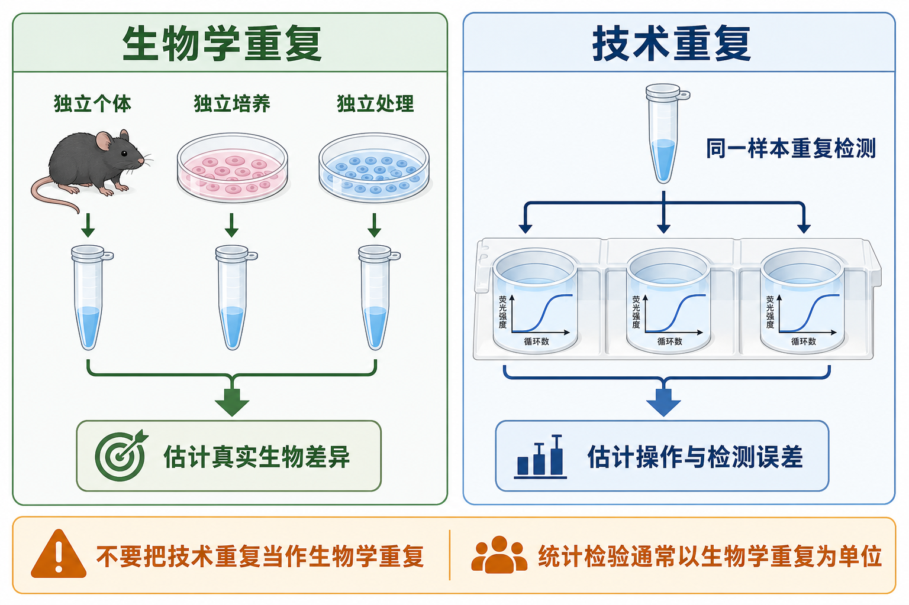

# 技术重复

Technical replicate（技术重复）是对同一个 sample（样本）或同一份 preparation（制备物）进行多次检测，用来估计移液、上机、成像、读数、仪器或试剂体系带来的 measurement error（测量误差）。

图：技术重复来自同一样本的重复检测，主要帮助发现操作和检测误差；它不能自动替代生物学重复。本图由 Image2 / image-generation model 生成，用于个人学习笔记示意。

## 一句话理解

技术重复回答的是：“同一个样本重复测，结果稳不稳？”

它能帮你判断检测过程是否可靠，但通常不能单独支持“这个处理在生物学上显著改变了结果”。

## 常见实验中的技术重复

| 实验 | 常见技术重复 | 主要检查什么 |
| --- | --- | --- |
| [qPCR](<../../用(实验流程内容篇)/qPCR.md>) | 同一 cDNA 同一基因做 2-3 个孔 | 移液误差、气泡、孔间差异 |
| ELISA | 同一样本做 duplicate 或 triplicate wells | 加样、洗板、显色和读板稳定性 |
| Western blot | 同一样本重复跑胶或重复曝光 | 上样、转膜、曝光范围 |
| 免疫荧光 | 同一孔多个视野 | 成像区域和局部噪声 |
| 流式细胞术 | 同一样本重复上机或重复染色 | 上机稳定性、抗体染色波动 |
| 质谱 | 同一样本重复进样 | LC-MS 进样和仪器漂移 |

NCBI Assay Guidance Manual 将 technical replicates 定义为同一样本在单次 run 或 experiment 中的重复测量，可用于识别 within-sample variation（样本内变异），但这些重复是在相同条件下检测的 dependent replicates（非独立重复）。参考：[NCBI Assay Guidance Manual](https://www.ncbi.nlm.nih.gov/sites/books/NBK550206/)。

## 技术重复有什么用

| 用途 | 解释 |
| --- | --- |
| 发现操作错误 | 某一个 qPCR 复孔 Cq 偏离很大，可能是气泡、漏加或移液错误 |
| 提高单个样本估计稳定性 | 多个技术复孔取平均可减少随机测量噪声 |
| 判断 assay 是否稳定 | 复孔差异长期偏大说明体系需要优化 |
| 辅助异常孔排除 | 有重复才能判断某个孔是否离群 |
| 监控仪器和耗材 | 板边、通道、曝光、洗板等技术因素会反映到重复差异 |

## 不能做什么

技术重复最容易被误用的地方，是把复孔数当成样本数。

例如一个 RT-qPCR 实验只有 1 个处理组样本和 1 个对照组样本，每个样本各做 3 个技术复孔。这个实验可以判断同一样本的检测是否稳定，但不能证明处理造成了可推广的生物学差异，因为生物学重复数仍然是 n = 1。

Molecular Biology of the Cell 的统计方法指南明确指出，biological replicates 用于参数估计和统计检验；technical replicates 用于改善每个生物学重复的测量估计。把技术重复当作生物学重复属于 pseudoreplication（[伪重复](伪重复.md)），常会低估方差并产生错误统计结果。参考：[Empowering statistical methods for cellular and molecular biologists](https://pmc.ncbi.nlm.nih.gov/articles/PMC6724699/)。

## qPCR 中怎么处理技术复孔

常见做法：

- 每个样本每个 assay 做 2-3 个技术复孔。
- 先查看扩增曲线、熔解曲线、Cq range 和 [复孔CV](复孔CV.md)。
- 如果某个孔明显异常，必须有曲线、板图或操作记录支持，不能因为“不好看”随意删除。
- 对技术复孔取平均后，再进入 ΔCq、ΔΔCq 或标准曲线分析。
- 统计检验通常以 [生物学重复](生物学重复.md) 为单位，而不是以技术复孔为单位。

## 技术重复数量怎么选

| 场景 | 常见选择 | 原因 |
| --- | --- | --- |
| 预实验 | duplicate 或 triplicate | 快速发现体系是否可用 |
| 常规 qPCR | duplicate/triplicate | 平衡成本和孔位资源 |
| 低拷贝或高变异样本 | 增加技术复孔 | 降低随机检测误差 |
| 高通量筛选 | 可能减少技术复孔但增加样本/条件 | 资源优先给生物学信息 |
| 关键结论验证 | 技术复孔 + 独立重复 | 同时控制技术误差和生物差异 |

技术重复越多并不一定越好。如果真正的问题是生物差异，增加独立样本通常比把同一样本重复测十次更有价值。

## 常见错误与 troubleshooting

| 异常 | 可能原因 | 调整方向 |
| --- | --- | --- |
| 复孔差异很大 | 移液不准、气泡、混匀不足、孔位污染 | 重做加样，短离心，检查板图和封膜 |
| 技术复孔稳定但组间差异不稳定 | 生物学重复不足或样本异质性大 | 增加独立样本，不只增加复孔 |
| 只保留最接近预期的复孔 | 选择性排除 | 预先设定异常孔排除规则 |
| 同一板边缘孔偏移 | 蒸发或温控边缘效应 | 改善封膜，避免关键样本集中边缘 |
| 高通量数据重复性差 | 自动化加样、读板或仪器漂移 | 加入 QC 样本和板间校准 |

## 小结

技术重复是实验质量控制工具，不是生物学证据本身。它能让同一样本的测量更稳，也能暴露操作问题；但真正支撑统计推断的通常是独立的生物学重复。最稳妥的写法是同时报告生物学重复数和技术重复设置，例如“n = 3 biological replicates, each measured in technical triplicate”。

## 参考来源

- [NCBI Assay Guidance Manual: Basic Guidelines for Reporting Non-Clinical Data](https://www.ncbi.nlm.nih.gov/sites/books/NBK550206/)
- [Empowering statistical methods for cellular and molecular biologists, Molecular Biology of the Cell, 2019](https://pmc.ncbi.nlm.nih.gov/articles/PMC6724699/)
- [Bell, Replicates and repeats, BMC Biology, 2016](https://link.springer.com/article/10.1186/s12915-016-0254-5)
- [Lazic, Genuine replication and pseudoreplication, Nature Reviews Methods Primers, 2022](https://www.nature.com/articles/s43586-022-00114-w)
