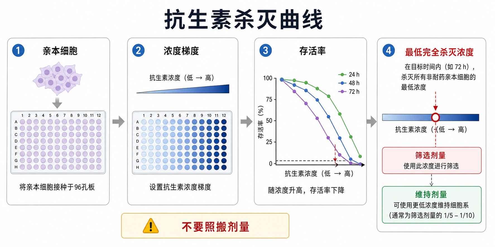

# 抗生素杀灭曲线

Antibiotic kill curve（抗生素杀灭曲线）是在正式进行[稳定细胞系构建](<../../用(实验流程内容篇)/稳定细胞系构建.md>)之前，用未带抗性基因的亲本细胞测试不同抗生素浓度下细胞死亡速度和存活率变化，从而确定 selection dose（筛选剂量）和 maintenance dose（维持剂量）的预实验。

它的核心目的不是“找到一个很猛的抗生素浓度”，而是找到**能在目标时间窗内杀死全部未抗性细胞的最低有效浓度**。剂量太低会留下阴性细胞，剂量太高会给阳性细胞造成额外压力，甚至筛选出适应性异常的细胞亚群。



## 什么时候需要做

只要实验涉及抗生素筛选，就应该优先考虑杀灭曲线，尤其是以下场景：

| 场景 | 为什么需要 |
| --- | --- |
| 新细胞系第一次做稳定转染/转导 | 不同细胞对同一种抗生素敏感性差异很大 |
| 换了培养基、血清或细胞密度 | 培养条件会改变细胞耐受性和死亡速度 |
| 换了抗生素品牌、批号或储存方式 | 抗生素效价可能变化 |
| 从混合稳定池转向单克隆筛选 | 单细胞或低密度状态更脆弱 |
| 长期构建株表达逐渐漂移 | 需要重新确认维持筛选压力是否足够 |

Thermo Fisher 和 InvivoGen 等厂商在选择性抗生素说明中都强调，不同细胞类型对 Geneticin/G418、puromycin、hygromycin、blasticidin、Zeocin 等抗生素的敏感性不同，应对目标细胞建立合适筛选条件。参考：[Thermo Fisher Geneticin selective antibiotic](https://www.thermofisher.com/order/catalog/product/10131035)、[InvivoGen Puromycin](https://www.invivogen.com/puromycin)、[InvivoGen Zeocin](https://www.invivogen.com/zeocin)

## 核心概念

| 概念 | 英文 | 含义 |
| --- | --- | --- |
| 抗生素杀灭曲线 | antibiotic kill curve | 不同抗生素浓度随时间造成细胞死亡的曲线 |
| 筛选剂量 | selection dose | 正式筛选阳性细胞时使用的抗生素浓度 |
| 维持剂量 | maintenance dose | 稳定株建立后维持选择压力的较低抗生素浓度 |
| 最低完全杀灭浓度 | lowest complete-kill concentration | 在目标时间内杀死所有未抗性亲本细胞的最低浓度 |
| 筛选窗口 | selection window | 阴性细胞死亡、阳性细胞仍可恢复的时间和剂量范围 |

最常用的判断逻辑是：先在 parental cells（亲本细胞）中做梯度，选出能在 3-7 天内清除全部阴性细胞的最低浓度作为候选筛选剂量；稳定株建立后，如果需要长期保留抗性压力，再用较低的维持剂量。

## 常见抗生素

| 抗生素 | 常见筛选标记 | 常见用途 | 需要特别注意 |
| --- | --- | --- | --- |
| [嘌呤霉素](<../../材(实验耗材工具篇)/嘌呤霉素.md>) | pac / puroR | 快速筛选，常见于 shRNA 和慢病毒载体 | 起效快，剂量过高容易造成强烈细胞压力 |
| [G418](<../../材(实验耗材工具篇)/G418.md>) | neo / neomycin resistance | 经典稳定转染筛选 | 起效相对慢，筛选时间通常更长 |
| [潮霉素B](<../../材(实验耗材工具篇)/潮霉素B.md>) | hygromycin resistance | 适合与其他抗性标记组合 | 不同细胞差异明显 |
| [Blasticidin](<../../材(实验耗材工具篇)/Blasticidin.md>) | bsd | 快速筛选，可用于双筛系统 | 对部分细胞毒性强 |
| [Zeocin](<../../材(实验耗材工具篇)/Zeocin.md>) | Sh ble | 适合部分哺乳动物、酵母和细菌系统 | 光照、储存和培养条件会影响效果 |

这些梯度设计思路只能作为预实验参考，不能直接当作正式 protocol。真正的筛选剂量必须由目标细胞、培养条件、细胞密度和抗生素批次共同决定。

## 实验目的

杀灭曲线要回答四个问题：

| 问题 | 结果用途 |
| --- | --- |
| 未抗性亲本细胞在什么浓度下会全部死亡 | 决定筛选剂量下限 |
| 死亡需要几天出现 | 决定筛选起止时间和换液节奏 |
| 低浓度是否只能抑制增殖而不能清除细胞 | 避免阴性细胞残留 |
| 高浓度是否导致过度碎片和培养环境恶化 | 避免正式筛选时给阳性细胞过强压力 |

## 简要实验原理

抗生素筛选依赖“抗性基因保护阳性细胞、未抗性细胞被杀死”的差异。杀灭曲线就是在没有抗性基因的亲本细胞中提前测出这条差异的背景阈值。

如果正式筛选剂量低于亲本细胞最低完全杀灭浓度，未转导/未转染细胞可能混入最终细胞池；如果剂量远高于必要范围，阳性细胞也会经历过度应激，造成增殖变慢、表型改变、克隆瓶颈或假阴性。

## 所需材料

| 类别 | 例子 | 说明 |
| --- | --- | --- |
| 细胞 | 未带抗性基因的亲本细胞 | 必须与正式构建使用的细胞状态尽量一致 |
| 培养耗材 | [微孔板](<../../材(实验耗材工具篇)/微孔板.md>)、培养基、血清、补充剂 | 常用 24 孔板、48 孔板或 96 孔板 |
| 抗生素 | 嘌呤霉素、G418、潮霉素B、Blasticidin、Zeocin | 使用正式实验计划采购和储存的同一批次更好 |
| 读数方法 | 显微镜观察、[细胞计数](<../../用(实验流程内容篇)/细胞计数.md>)、[台盼蓝](<../../材(实验耗材工具篇)/台盼蓝.md>)、[CCK-8实验](<../../用(实验流程内容篇)/CCK-8实验.md>)、[MTT实验](<../../用(实验流程内容篇)/MTT实验.md>) | 显微镜观察适合日常判断，定量读数适合记录和比较 |

## 实验操作

### 设计浓度梯度

先根据抗生素类型和厂商建议设置一个覆盖低、中、高剂量的梯度。每个浓度至少设置重复孔，并保留 0 抗生素对照。

常见设计思路：

| 抗生素 | 可用于初筛的梯度思路 | 备注 |
| --- | --- | --- |
| Puromycin | 低微克级梯度，通常跨度不宜太窄 | 起效快，建议观察更密集 |
| G418/Geneticin | 数百微克级梯度 | 起效较慢，筛选周期常更长 |
| Hygromycin B | 数十到数百微克级梯度 | 细胞差异明显 |
| Blasticidin | 低到中微克级梯度 | 对部分细胞非常强 |
| Zeocin | 数十到数百微克级梯度 | 注意避光和储存条件 |

操作意义：梯度要覆盖“完全无效、部分杀伤、完全杀灭、过度杀伤”四个区间。如果梯度太窄，就很容易看不到拐点。

注意事项：

| 注意点 | 原因 |
| --- | --- |
| 用和正式筛选相同的培养基、血清、密度 | 条件改变会改变敏感性 |
| 每个浓度设置重复孔 | 单孔死亡可能来自接种误差或边缘效应 |
| 不要把不同细胞系的剂量直接套用 | 抗生素敏感性高度依赖细胞背景 |
| 记录抗生素品牌、货号、批号和开封时间 | 方便解释批次差异 |

### 接种亲本细胞

把状态良好的亲本细胞接种到板中，使其在加药时处于适合正式构建的生长状态。通常需要避免过稀或过密。

为什么重要：细胞密度会显著影响药物杀伤曲线。细胞太稀时容易因为低密度应激而夸大抗生素毒性；细胞太密时可能因为群体保护、营养竞争或接触抑制而让读数不清楚。

可能出错：

| 现象 | 原因 | 后果 |
| --- | --- | --- |
| 0 抗生素孔也状态很差 | 起始细胞状态不好或接种密度不合适 | 整条曲线不可用 |
| 高浓度孔死亡很快但低浓度孔波动大 | 接种不均、边缘效应或换液扰动 | 需要增加重复或换板型 |
| 细胞长满后才死亡 | 起始密度太高或观察窗口过长 | 难以判断真实筛选剂量 |

### 加入抗生素并连续观察

在每个浓度孔加入对应抗生素，按固定时间点观察细胞形态、融合度、漂浮细胞、死亡碎片和存活率。必要时换含相同浓度抗生素的新鲜培养基。

观察内容：

| 观察指标 | 如何理解 |
| --- | --- |
| 细胞形态 | 变圆、脱落、碎片增多提示毒性 |
| 细胞密度 | 低浓度可能只是增殖变慢，不一定完全杀死 |
| 存活率 | 最好用台盼蓝、CCK-8 或成像定量辅助 |
| 死亡时间 | 正式筛选时需要知道阴性细胞几天能清除 |

### 选择筛选剂量

一般选择能在目标时间窗内杀死所有未抗性亲本细胞的最低浓度作为筛选剂量。这里的“所有”不是指当天看起来少了一些，而是指连续观察中没有可恢复增殖的存活细胞。

判断方式：

| 结果 | 是否适合作筛选剂量 |
| --- | --- |
| 细胞完全死亡，且没有恢复增殖 | 可以作为候选 |
| 细胞数量明显减少，但仍有贴壁细胞恢复 | 不足，可能留下阴性细胞 |
| 细胞迅速全部崩解、碎片很多 | 可能过强，不一定是最佳 |
| 0 抗生素孔也异常死亡 | 本次实验无效，需要重做 |

### 区分筛选剂量和维持剂量

筛选剂量用于建株早期清除阴性细胞；维持剂量用于稳定株建立后降低阴性细胞或低表达细胞重新占比的风险。维持剂量通常低于筛选剂量，但具体比例依赖细胞和抗性系统，不应机械固定。

实际策略：

| 阶段 | 推荐思路 |
| --- | --- |
| 初始筛选 | 使用杀灭曲线确定的最低完全杀灭浓度 |
| 阳性池恢复 | 观察细胞状态，必要时短暂停药或降低压力，但要记录 |
| 长期维持 | 使用较低维持剂量，并定期复测目标表达 |
| 正式功能实验 | 是否保留抗生素要根据实验问题决定，并保证对照组一致 |

## 结果解析

| 曲线形态 | 含义 | 下一步 |
| --- | --- | --- |
| 随浓度升高，存活率平滑下降 | 梯度设计合理 | 选择最低完全杀灭浓度 |
| 所有浓度都几乎不杀细胞 | 浓度范围太低、抗生素失效或细胞天然耐受 | 扩大浓度范围或检查抗生素 |
| 所有浓度都快速全死 | 浓度范围太高或细胞状态差 | 降低梯度并检查 0 抗生素对照 |
| 重复孔差异很大 | 接种不均、边缘效应或读数方法不稳定 | 增加重复，优化接种和读数 |
| 早期死亡后低浓度孔恢复 | 低浓度只能造成暂时压力 | 不能作为正式筛选剂量 |

## 常见错误与 troubleshooting

| 错误 | 后果 | 解决思路 |
| --- | --- | --- |
| 直接套用文献或师兄师姐剂量 | 可能筛不干净或压力过强 | 每个新细胞系重做杀灭曲线 |
| 只观察 24 h 就定剂量 | 很多抗生素需要更长时间体现效果 | 连续观察到目标筛选窗口 |
| 只看显微镜，不做定量记录 | 后续难以复盘 | 用细胞计数、台盼蓝或活性实验辅助 |
| 0 抗生素对照状态不好仍继续判断 | 曲线失真 | 先解决细胞状态和接种密度 |
| 正式筛选时细胞密度和杀灭曲线差异很大 | 剂量判断可能失效 | 杀灭曲线尽量模拟正式条件 |
| 长期维持剂量过高 | 改变细胞状态或造成慢性选择压力 | 降低维持剂量并定期验证目标表达 |

## 与正式稳定株筛选的关系

| 项目 | 抗生素杀灭曲线 | 正式稳定株筛选 |
| --- | --- | --- |
| 使用细胞 | 未抗性亲本细胞 | 转染/转导后的细胞 |
| 目的 | 确定阴性细胞死亡阈值 | 富集携带抗性标记的阳性细胞 |
| 读数 | 死亡速度、存活率、最低完全杀灭浓度 | 阳性细胞恢复、表达水平、功能表型 |
| 主要风险 | 梯度设计不合适 | 筛选过强、阴性残留、群体漂移 |
| 是否能证明构建成功 | 不能 | 也不能单独证明，还需要 RNA/蛋白/表型验证 |

## 推荐记录模板

中文模板：

```text
细胞系：
传代号：
培养基/血清/补充剂：
接种板型：
接种密度：
抗生素名称：
品牌/公司：
货号：
批号：
储存条件：
开封日期：
浓度梯度：
加药日期：
换液节奏：
观察时间点：
0 抗生素对照状态：
最低完全杀灭浓度：
建议筛选剂量：
建议维持剂量：
备注：
```

English template:

```text
Cell line:
Passage number:
Medium/serum/supplements:
Plate format:
Seeding density:
Antibiotic:
Brand/company:
Catalog number:
Lot number:
Storage condition:
Open date:
Concentration gradient:
Treatment date:
Medium-change schedule:
Observation time points:
No-antibiotic control status:
Lowest complete-kill concentration:
Recommended selection dose:
Recommended maintenance dose:
Notes:
```

## 总结

抗生素杀灭曲线是稳定细胞系构建前最容易被省略、但最能降低失败率的小实验。它让筛选剂量从“凭经验照搬”变成“由目标细胞实际反应决定”。判断时要抓住一句话：**选能在目标时间内完全清除未抗性亲本细胞的最低有效浓度，而不是越高越好。**

## 参考来源

- [Thermo Fisher Geneticin selective antibiotic](https://www.thermofisher.com/order/catalog/product/10131035)
- [InvivoGen Puromycin](https://www.invivogen.com/puromycin)
- [InvivoGen Hygromycin B](https://www.invivogen.com/hygromycin-b)
- [InvivoGen Blasticidin](https://www.invivogen.com/blasticidin)
- [InvivoGen Zeocin](https://www.invivogen.com/zeocin)
- [Addgene Lentiviral Guide](https://www.addgene.org/guides/lentivirus/)
