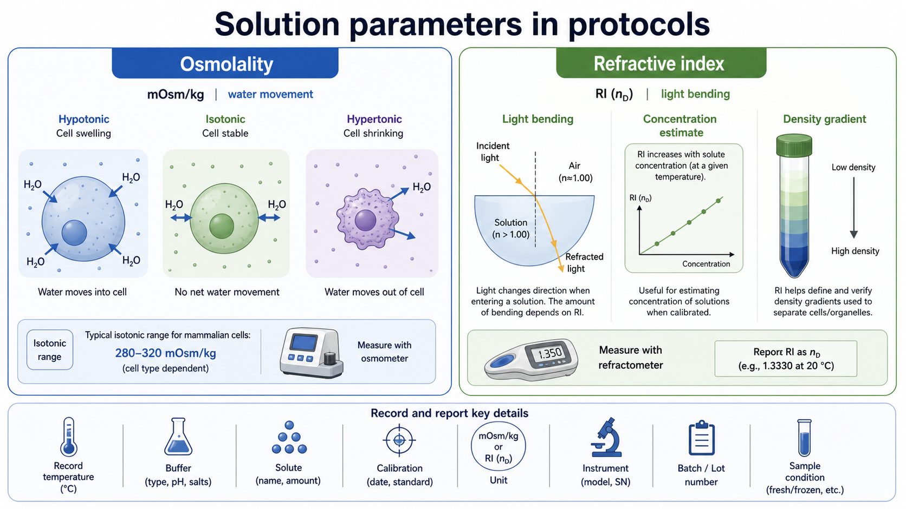

# 折光率

Refractive index（RI，折光率）描述光在某种介质中传播速度相对于真空的变化，常写作 n 或 nD。在实验室里，折光率常用于估算溶液 concentration（浓度）、验证 density gradient（密度梯度）层是否配对，或监测某些可溶性介质的批间一致性。



图源：Image2 生成的溶液参数示意图。右侧展示光线进入溶液后发生偏折，以及 RI 如何在校准条件下辅助判断浓度和密度梯度；左侧展示 [渗透压](渗透压.md) 对细胞水分移动的影响。

## 定义与命名

IUPAC Gold Book 将 refractive index 定义为 light speed in vacuum（光在真空中的速度）与 light speed in a given medium（光在某介质中的速度）之比。参考：[IUPAC Gold Book refractive index](https://goldbook.iupac.org/terms/view/R05240/pdf)。

折光率没有常规质量或体积单位，常写作：

| 写法 | 含义 |
| --- | --- |
| n | 一般折光率 |
| nD | 以 sodium D line（钠 D 线）波长测得的折光率 |
| nD20 | 20°C 条件下以钠 D 线测得的折光率 |
| RI | refractive index 的常用缩写 |

由于折光率受 wavelength（波长）和 temperature（温度）影响，严谨记录时不要只写“RI=1.35”，而应写清温度、仪器、校准方式和样品条件。

## 为什么可以估算浓度和密度

溶液中溶质越多，通常会改变光在溶液中的传播速度，使 RI 发生变化。对于同一种溶质、同一温度和同一测量波长，RI 往往可以和 concentration（浓度）或 density（密度）建立经验对应关系。

| 能做什么 | 前提 | 不能做什么 |
| --- | --- | --- |
| 估算同一溶质的浓度 | 有可靠标准曲线或厂家表 | 不适合直接比较不同溶质 |
| 验证密度梯度层 | 同一体系、同一温度、同一配方 | 不能替代所有 marker 检测 |
| 判断配制是否偏离 | 历史批次有 RI 记录 | 不能告诉你 pH 或渗透压 |
| 快速质控 | 仪器校准稳定 | 不能证明生物学功能正常 |

一句话：折光率是“配方是否像以前那样”的很好线索，但不是万能质量证明。

## 和密度梯度的关系

在 [密度梯度离心](<../../用(实验流程内容篇)/密度梯度离心.md>) 中，梯度层的 density（密度）决定细胞、细胞器或颗粒最后停留的位置。对某些介质来说，RI 可以作为 density 的快速间接读数。

| 介质/体系 | RI 的用途 |
| --- | --- |
| [OptiPrep](<../../材(实验耗材工具篇)/OptiPrep.md>) / iodixanol（碘克沙醇） | 可用 RI 或密度表辅助确认梯度层 |
| [Nycodenz](<../../材(实验耗材工具篇)/Nycodenz.md>) / iohexol（碘海醇） | 自配储备液和工作梯度时可辅助质控 |
| sucrose gradient（蔗糖梯度） | 常用 RI 估算 [蔗糖](<../../材(实验耗材工具篇)/蔗糖.md>)浓度 |
| [Percoll](<../../材(实验耗材工具篇)/Percoll.md>) | 可用 RI/密度关系监测梯度形成 |
| protein/salt/sugar mixtures（蛋白/盐/糖混合液） | 需要专门校准，不能套用单一溶质表 |

Cytiva 的 Percoll 方法资料中把 refractive index 作为 density gradient 相关测量变量之一，用于描述 Percoll gradient 的密度关系。参考：[Cytiva Percoll methodology and applications](https://cdn.cytivalifesciences.com/api/public/content/digi-12439-pdf)。

## 如何测量

折光率通常用 [refractometer（折光仪/折射仪）](<../../材(实验耗材工具篇)/折光仪.md>)测量。常见形式有 handheld refractometer（手持折光仪）和 digital refractometer（数字折光仪）。

| 步骤 | 意义 | 注意事项 |
| --- | --- | --- |
| 校准仪器 | 建立零点或标准点 | 常用纯水或厂家标准液 |
| 控制温度 | RI 对温度敏感 | 记录温度，使用温控或 ATC 时也要注明 |
| 上样少量液体 | 折光仪通常只需少量样品 | 避免气泡、颗粒、蒸发和残留 |
| 读数并清洁 | 防止交叉污染 | 清洁棱镜或测量面 |
| 对照标准曲线 | 把 RI 转换为浓度或密度 | 只使用同溶质、同温度、同体系的表 |

如果样品含蛋白、脂质、细胞碎片、气泡或悬浮颗粒，RI 读数可能不稳定。密度梯度 fraction 若含颗粒或沉淀，最好先澄清或按 SOP 统一处理后再测。

## 折光率 vs 渗透压/密度/pH

| 参数 | 主要反映什么 | 常见仪器 | 是否可互相替代 |
| --- | --- | --- | --- |
| 折光率 | 光学性质，常与浓度/密度相关 | 折光仪 | 不能替代渗透压 |
| 渗透压 | 渗透活性粒子总效应 | 渗透压仪 | 不能由 RI 精确推断 |
| 密度 | 单位体积质量 | 密度计、称量/体积法 | 可与 RI 建表，但不是同一概念 |
| pH | 酸碱状态 | [pH 计](<../../材(实验耗材工具篇)/pH计.md>) | 与 RI 基本不是同一维度 |
| 电导率 | 离子导电能力 | [电导率仪](<../../材(实验耗材工具篇)/电导率仪.md>) | 对非离子溶质不敏感 |

例如 [OptiPrep](<../../材(实验耗材工具篇)/OptiPrep.md>) 和 [Nycodenz](<../../材(实验耗材工具篇)/Nycodenz.md>) 都是非离子碘化介质。它们能显著改变 RI 和 density，但不一定像高盐溶液那样显著改变电导率；这也是为什么记录单一参数不够。

## 常见错误与 troubleshooting

| 问题 | 可能原因 | 处理 |
| --- | --- | --- |
| RI 与预期不符 | 配制浓度错误、温度不同、仪器未校准 | 重新校准，统一温度，复核称量和定容 |
| 同一梯度层读数波动大 | 混匀不充分或层间污染 | 重新取样，避免扰动界面 |
| 用 RI 推断渗透压失败 | RI 和 osmolality 测量不同物理量 | 分别使用折光仪和渗透压仪 |
| 不同溶质套用同一标准曲线 | RI-浓度关系具有体系特异性 | 只用对应溶质/介质的标准表 |
| 高蛋白/浑浊样品读数异常 | 光散射或颗粒干扰 | 澄清样品或换用其他质控方法 |
| 记录无法复现 | 没写温度、仪器、校准液 | 建立 RI 记录模板 |

## 推荐记录模板

中文记录模板：

```text
样品名称：
用途：
溶质/介质：
理论浓度或密度：
批号：
测量日期：
仪器型号：
校准液：
校准日期：
测量温度：
读数：RI / nD
是否使用温度补偿：
对应浓度/密度换算表：
重复次数：
异常现象：
处理决定：
```

English record template:

```text
Sample name:
Use case:
Solute/medium:
Theoretical concentration or density:
Lot number:
Measurement date:
Instrument model:
Calibration standard:
Calibration date:
Measurement temperature:
Reading: RI / nD
Temperature compensation used:
Reference table for concentration/density:
Replicates:
Abnormal observation:
Decision:
```

## 小结

折光率是密度梯度和溶液配制里非常有用的快速质控参数，尤其适合确认 OptiPrep、Nycodenz、Percoll 或蔗糖梯度是否配对。但它必须和温度、仪器、校准液和对应标准曲线一起记录；它不能单独替代渗透压、pH、密度或生物学 marker 检测。

## 参考来源

- [IUPAC Gold Book refractive index](https://goldbook.iupac.org/terms/view/R05240/pdf)
- [Cytiva Percoll methodology and applications](https://cdn.cytivalifesciences.com/api/public/content/digi-12439-pdf)
- [Axis-Shield OptiPrep](https://axis-shield-density-gradient-media.com/optiprep-the-optimum-density-gradient-medium/)
- [Axis-Shield Nycodenz technical overview](https://axis-shield-density-gradient-media.com/blog/nycodenz-64/understanding-nycodenz-a-technical-overview-33)
