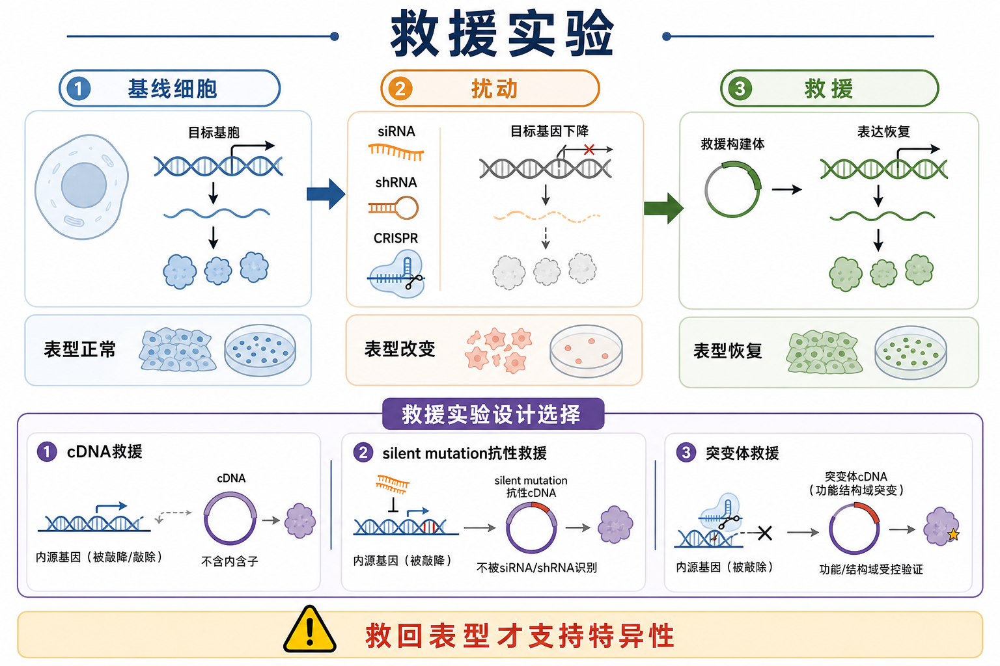

# 救援实验

救援实验（rescue experiment）是一种用于验证因果关系和特异性的实验设计：先通过敲低、敲除或抑制让目标基因/蛋白下降并产生表型，再用一个能绕开原扰动机制的救援构建体恢复目标功能，观察表型是否随之恢复。



图：救援实验的核心不是“再过表达一次”，而是检验“目标基因下降是否足以解释表型”。如果扰动导致表型改变，而特异性恢复目标基因功能后表型也恢复，就能明显增强因果解释。本图由 Image2 / image-generation model 生成，用于个人学习示意。

## 为什么需要救援实验

在 [siRNA瞬时敲低](<../../用(实验流程内容篇)/siRNA瞬时敲低.md>)、[shRNA稳定敲低](<../../用(实验流程内容篇)/shRNA稳定敲低.md>) 和 [CRISPR-Cas9](CRISPR-Cas9.md) 实验中，单纯看到“扰动后表型改变”并不等于目标基因一定是原因。可能的混杂因素包括 [脱靶效应](脱靶效应.md)、转染毒性、载体负担、抗生素筛选压力、单克隆效应、细胞状态差异和过度表达应激。

RNAi 文献中常把 rescue 视为验证 siRNA/shRNA 结果特异性的强证据：Sigoillot 和 King 在 RNAi screening 综述中明确把非靶向形式基因的表达能否救回 siRNA/shRNA 表型作为重要验证逻辑。参考：[Sigoillot and King, ACS Chemical Biology, 2011](https://pmc.ncbi.nlm.nih.gov/articles/PMC3306249/)。

一句话判断：没有 rescue 的 loss-of-function 实验可以支持“相关功能线索”；有设计良好的 rescue，才更接近支持“目标基因特异性导致这个表型”。

## 核心逻辑

救援实验通常包含三层因果链：

| 阶段 | 发生什么 | 读者应看到什么 |
| --- | --- | --- |
| 基线 | 目标基因正常表达 | 细胞或模型呈现基线表型 |
| 扰动 | 目标基因被敲低、敲除或抑制 | 目标表达下降，同时表型发生变化 |
| 救援 | 恢复目标基因或关键功能结构 | 目标功能恢复，表型朝基线方向恢复 |

这里的关键是“救援构建体必须不被原扰动同时打掉”。如果 siRNA 靶向的是某段 mRNA，那么 rescue construct（救援构建体）需要避开这段靶序列；如果 CRISPR 敲除了内源基因，救援构建体通常应从外源 [cDNA](cDNA.md) 或基因组安全位点重新表达。

## 常见救援类型

| 类型 | 典型用法 | 适合回答的问题 | 关键风险 |
| --- | --- | --- | --- |
| cDNA rescue（cDNA 救援） | 用不含被靶向 UTR 或内含子的 cDNA 恢复表达 | 敲低表型是否由目标基因下降导致 | 表达量过高、缺少天然调控区 |
| silent mutation-resistant rescue（[沉默突变](沉默突变.md) 抗性救援） | 在 siRNA/shRNA 靶点引入不改变蛋白序列的突变 | RNAi 表型是否序列特异 | 突变不足、仍被 siRNA/shRNA 识别 |
| ortholog rescue（同源物种救援） | 用鼠源/人源同源 cDNA 互相救援 | 目标蛋白功能是否保守 | 蛋白不完全等价、表达定位不同 |
| mutant rescue（突变体救援） | 用野生型与突变体 cDNA 对比 | 哪个功能域或酶活位点负责表型 | 突变体表达、折叠或定位异常 |
| pathway rescue（通路救援） | 恢复下游节点或补充下游产物 | 表型是否经过某条下游通路 | 只能支持通路方向，不能完全证明直接关系 |

## 设计救援实验前先问什么

### 原扰动是什么

如果原实验是 RNAi，重点是 rescue construct 不应含有 siRNA/shRNA 可识别的靶序列。常见策略包括去掉 3' UTR（3' untranslated region，3' 非翻译区）、使用只含 [开放阅读框](开放阅读框.md)（open reading frame，ORF）的 cDNA，或对靶序列做沉默突变。

如果原实验是 CRISPR knockout（基因敲除），重点是确认内源基因真的失活，并避免 rescue construct 再次被 sgRNA/Cas9 切割。Addgene 的 CRISPR 实验规划强调，基因编辑后应根据实验目标用 DNA、RNA 或蛋白层面方法验证编辑和表达变化。参考：[Addgene Plan Your CRISPR Experiment](https://www.addgene.org/guides/crispr/plan-your-experiment/)。

### 要救回的是表达量、结构域还是通路

救援可以只回答“这个基因是否相关”，也可以进一步回答“哪个结构域重要”。例如：

- wild-type rescue（野生型救援）：恢复完整蛋白，判断能否救回表型。
- catalytic-dead mutant rescue（催化失活突变体救援）：如果救不回，说明酶活可能重要。
- domain-deletion rescue（功能域缺失救援）：用于判断某个 [蛋白功能域](蛋白功能域.md) 是否必要。
- localization-defective rescue（定位缺陷救援）：用于判断 [蛋白定位](蛋白定位.md) 是否影响功能。

### 表型有没有可救回的窗口

不是所有表型都能被救回。若扰动已经造成不可逆死亡、DNA 损伤积累、分化命运改变或强烈选择压力，即使目标基因恢复，表型也可能回不来。因此救援实验要设计在表型仍可逆的时间窗口内。

## 实验设计模块

### 选择 rescue construct

最常见的是把目标基因 cDNA 克隆进 [过表达载体](<../../材(实验耗材工具篇)/过表达载体.md>)，并让它避开原来的 RNAi 或 CRISPR 靶向区域。对于 RNAi，常见做法是使用不含目标 siRNA/shRNA 靶点的 cDNA，或在靶点区域引入 silent mutations（沉默突变）。对于 CRISPR，则常见做法是外源表达不受 sgRNA 靶位点影响的 cDNA。

为什么重要：如果 rescue construct 也被原扰动打掉，实验会表现为“救援失败”，但原因不是目标基因无关，而是救援设计本身无效。

关键注意事项：

- 表达量应尽量接近生理水平，过高表达可能产生非生理表型。
- 标签不能破坏蛋白功能、定位或互作。
- cDNA 缺少 UTR、内含子和天然染色质调控，解释时要承认这个限制。
- 对多转录本基因，要确认 rescue 的 isoform 与实验问题一致。

替代方案：

- 使用 inducible expression（诱导表达）控制救援表达量。
- 使用 knock-in rescue（敲入式救援）在更接近内源水平下恢复表达。
- 使用 ortholog cDNA 做跨物种救援，避开 RNAi 靶序列。

可能出错：救援表达过强，把细胞推到另一种非生理状态，导致“表型恢复”其实是过表达造成的二次效应。

### 设置对照组

一个完整救援实验通常至少包含：control（对照）、perturbation only（仅扰动）、perturbation + empty vector（扰动加空载体）、perturbation + wild-type rescue（扰动加野生型救援），以及根据问题加入 mutant rescue（突变体救援）。

为什么重要：救援实验不是简单比较“敲低组 vs 救援组”。空载体、表达载体本身、筛选标记和转染/感染过程都可能影响表型。

关键注意事项：

- RNAi 实验中，救援构建体应在靶序列层面对 siRNA/shRNA 抗性。
- CRISPR 实验中，救援前要确认 knockout 或目标蛋白丢失。
- 如果使用突变体救援，要同时确认野生型和突变体表达量相近。
- 如果 rescue construct 单独过表达也会改变表型，需要额外解释。

替代方案：

- 表型很强时，可以先做小规模表达量梯度，找到不过度扰动细胞的救援窗口。
- 如果无法构建 rescue，可用多条独立 siRNA/shRNA、CRISPRi 或药理学正交验证补强，但证据等级通常低于直接 rescue。

可能出错：只做“敲低 + rescue”而没有“敲低 + 空载体”，无法排除载体或筛选过程本身造成的差异。

### 验证救援是否真的发生

救援成功至少要证明两件事：原扰动确实降低了目标基因或蛋白，救援构建体确实恢复了目标功能。常用验证包括 [RT-qPCR](<../../用(实验流程内容篇)/RT-qPCR.md>)、[Western blot](<../../用(实验流程内容篇)/Western blot.md>)、免疫荧光定位、下游通路 marker 和功能读出。

为什么重要：没有表达验证的 rescue 很容易变成“表型故事”。读者需要看到目标分子水平和表型水平同步变化。

关键注意事项：

- RT-qPCR 引物要能区分内源转录本和外源 rescue 转录本时，最好分开设计。
- Western blot 应确认目标蛋白大小、标签大小和内参稳定性。
- 如果救援构建体带 tag，要检查 tag 是否改变蛋白定位。
- 对 secreted protein（分泌蛋白）或 membrane protein（膜蛋白），表达恢复不等于功能恢复，需要功能或定位验证。

替代方案：

- 没有好抗体时，可使用带标签构建体，但要补充定位和功能验证。
- 对酶类蛋白，可检测酶活或下游底物修饰，而不只看蛋白表达。

可能出错：救援构建体表达了，但没有正确定位或没有功能，导致表型救不回。

### 判断表型是否被救回

救援不是要求每个数值完全回到对照组，而是看表型是否按预期方向显著恢复，并且恢复程度与目标功能恢复相匹配。完全 rescue、部分 rescue 和不能 rescue 的含义不同。

为什么重要：生物系统有剂量效应、补偿效应和不可逆变化。救援结果不能只用“有/没有”粗暴判断。

关键注意事项：

- 定义主要 readout，不要在多个指标里挑最漂亮的。
- 对多 readout 实验，要区分核心表型和伴随表型。
- 统计比较应包括 control、perturbation、empty vector rescue 和 wild-type rescue。
- 部分 rescue 可能仍然有意义，尤其是表达量没有完全恢复或表型有不可逆成分时。

替代方案：

- 用时间梯度判断表型恢复是否滞后于蛋白恢复。
- 用表达量梯度判断是否存在 dosage effect（[剂量效应](剂量效应.md)）。
- 用突变体救援区分结构域、酶活或定位贡献。

可能出错：只看到 rescue 组比扰动组稍微好一点，就直接宣称“完全救援”，会让结论显得过度。

## 结果解析

| 结果模式 | 较合理解释 | 下一步 |
| --- | --- | --- |
| 野生型救援恢复表达并恢复表型 | 目标基因特异性参与该表型 | 可进一步做突变体救援定位机制 |
| 野生型表达恢复但表型不恢复 | 表型可能来自脱靶、不可逆变化、表达量/定位不合适 | 检查时间窗口、定位、表达量和对照 |
| 突变体不能救回，野生型能救回 | 被突变的功能域或活性可能是必要条件 | 验证突变体表达、稳定性和定位 |
| 野生型和突变体都能救回 | 被突变位点可能不是关键，或突变设计不足 | 换关键位点/结构域，做功能 readout |
| 空载体也能救回 | 表型可能受载体、筛选或培养条件影响 | 重新审查对照和实验系统 |
| rescue construct 单独改变表型 | 过表达本身造成影响 | 降低表达量，使用诱导系统或内源敲入 |

## 常见错误与 troubleshooting

| 问题 | 可能原因 | 优先解决 |
| --- | --- | --- |
| 救援构建体表达不上去 | 克隆错误、启动子不适合、细胞难转染、蛋白不稳定 | 测序、换载体、优化递送、检查蛋白稳定性 |
| 表达量很高但救不回 | 蛋白定位错误、tag 干扰、缺少关键 isoform 或表型不可逆 | 做定位、换 tag、换 isoform、提前救援 |
| 救回表达但不救回功能 | 蛋白无活性、下游通路未恢复、扰动有脱靶 | 做突变体/酶活/通路 readout |
| 多次重复救援效果不稳定 | 转染效率波动、细胞密度不同、表达量差异 | 建稳定 rescue 细胞系或使用诱导表达 |
| RNAi 体系中 rescue 仍被敲低 | 靶序列未完全避开，沉默突变不足 | 重新设计 RNAi-resistant construct |
| CRISPR 体系中 rescue 结果混乱 | 克隆背景差异、残余蛋白、补偿突变 | 使用多个克隆、混合群体验证、测序确认 |

## 与相近概念对比

| 概念 | 核心目的 | 与救援实验的区别 |
| --- | --- | --- |
| [基因过表达](<../../用(实验流程内容篇)/基因过表达.md>) | 单独提高目标基因表达，看是否产生表型 | 不一定建立在原扰动基础上，因果链较短 |
| 救援实验 | 在扰动造成表型后恢复目标功能，看表型是否恢复 | 强调排除脱靶和验证特异性 |
| complementation（互补实验） | 用一个功能拷贝补偿突变或缺陷 | 常见于遗传学，救援实验可视为功能验证中的互补逻辑 |
| epistasis analysis（上位性分析） | 判断基因或通路先后关系 | 更强调多个基因之间的顺序，不只验证单基因特异性 |
| reconstitution（重构实验） | 在简化系统中重新组装功能模块 | 更强调从组分恢复功能，常用于生化或细胞系统 |

## 推荐记录模板

中文记录：

```text
项目：
原始扰动方式：
目标基因/转录本/蛋白：
原扰动靶序列或编辑位点：
救援构建体类型：
救援构建体是否避开原扰动：
载体骨架/启动子/tag/筛选标记：
野生型或突变体信息：
递送方式：
空载体对照：
扰动组表达验证：
救援组表达验证：
蛋白定位或功能验证：
主要表型 readout：
救援程度：
是否存在过表达单独效应：
异常现象与解释：
```

English record:

```text
Project:
Original perturbation method:
Target gene/transcript/protein:
Original target sequence or editing site:
Rescue construct type:
Whether the rescue construct escapes the original perturbation:
Vector backbone/promoter/tag/selection marker:
Wild-type or mutant construct information:
Delivery method:
Empty-vector control:
Perturbation validation:
Rescue-expression validation:
Protein localization or functional validation:
Primary phenotype readout:
Degree of rescue:
Overexpression-only effect:
Abnormal observations and interpretation:
```

## 小结

救援实验是功能验证中非常强的“特异性检查”：扰动造成表型，恢复目标功能后表型也恢复，才更能说明目标基因确实驱动了观察到的现象。它的难点不在于“多做一个过表达”，而在于 rescue construct 必须绕开原扰动、表达量要合理、对照要完整，并且要同时验证分子层面和表型层面的恢复。

## 参考来源

- [Sigoillot and King, Vigilance and validation: Keys to success in RNAi screening, ACS Chemical Biology, 2011](https://pmc.ncbi.nlm.nih.gov/articles/PMC3306249/)
- [Echeverri et al., Minimizing the risk of reporting false positives in large-scale RNAi screens, Nature Methods, 2006](https://pubmed.ncbi.nlm.nih.gov/16990807/)
- [Cullen, Enhancing and confirming the specificity of RNAi experiments, Nature Methods, 2006](https://doi.org/10.1038/nmeth913)
- [Birmingham et al., 3' UTR seed matches, but not overall identity, are associated with RNAi off-targets, Nature Methods, 2006](https://doi.org/10.1038/nmeth854)
- [Addgene RNAi Guide](https://www.addgene.org/guides/rnai/)
- [Addgene Plan Your CRISPR Experiment](https://www.addgene.org/guides/crispr/plan-your-experiment/)
