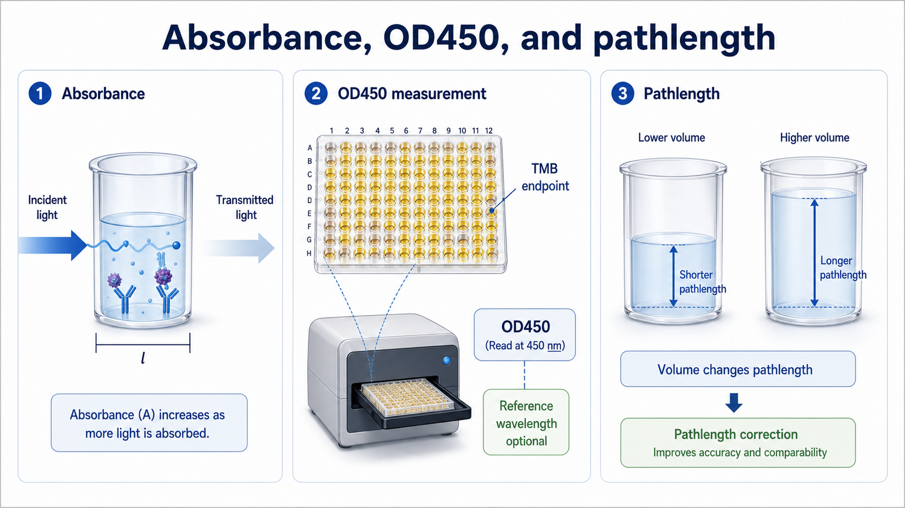

# 比尔-朗伯定律

Beer-Lambert law（比尔-朗伯定律，也常写作 Beer-Lambert-Bouguer law）描述了吸光物质浓度、光程和 [吸光度](吸光度.md) 之间的关系，是分光光度法、酶标仪读数、核酸/蛋白定量和显色实验的基础概念。



图：吸光度、OD450 和光程的关系。比尔-朗伯定律的核心是：浓度相同但光程不同，吸光度也会不同。本图由 Image2 / image-generation model 生成，用于个人学习笔记示意。

## 一句话理解

在理想条件下，样品越浓、光穿过样品的距离越长，吸光度越高。

常见写法：

```text
A = ε × c × l
```

其中：

| 符号 | 英文 | 中文 | 含义 |
| --- | --- | --- | --- |
| A | Absorbance | 吸光度 | 仪器读出的光衰减程度 |
| ε | Molar absorptivity / molar absorption coefficient | 摩尔吸光系数 | 某物质在特定波长下吸光能力 |
| c | Concentration | 浓度 | 吸光物质浓度 |
| l | Pathlength | 光程 | 光穿过样品的距离 |

IUPAC Gold Book 对 absorbance 的定义基于入射光和透射光功率之比；在吸收光谱的常用条件下，吸光度与浓度和光程的线性关系就是比尔-朗伯定律的实验基础。参考：[IUPAC Gold Book: absorbance](https://goldbook.iupac.org/terms/view/A00028)。

## 适用条件

比尔-朗伯定律是一个非常有用的近似，但不是任何情况都完美成立。

通常更适合：

- 样品均一、澄清。
- 吸光物质浓度不太高。
- 光源波长选择合适。
- 没有明显沉淀、气泡或浑浊。
- 反应产物稳定。
- 仪器读数仍在可靠线性范围内。

容易偏离：

| 情况 | 为什么会偏离 |
| --- | --- |
| 样品过浓 | 分子相互作用、仪器饱和、杂散光影响增大 |
| 样品浑浊 | 光散射也会让透射光减少 |
| 有气泡 | 光路被局部改变 |
| 波长不合适 | 不在目标产物吸收峰附近 |
| 光程不一致 | 同浓度也会读出不同吸光度 |
| 显色反应还在变化 | 吸光度不是稳定终点 |

## 和透光率的关系

[透光率](透光率.md) 是透过样品的光占入射光的比例。吸光度可以理解为对透光率进行对数转换后的读数：

```text
透光率越低 → 吸光度越高
透光率越高 → 吸光度越低
```

吸光度使用对数形式的好处是，在合适条件下它和浓度更容易呈线性关系，方便做标准曲线和定量。

## 和 ELISA 的关系

在 HRP-TMB endpoint [ELISA](<../../用(实验流程内容篇)/ELISA.md>) 中，[TMB](<../../材(实验耗材工具篇)/TMB.md>) 终止后形成黄色产物，用 [酶标仪](<../../材(实验耗材工具篇)/酶标仪.md>) 读取 [OD450](OD450.md)。如果孔内体积一致、标准品和样本在同一块板上读数，那么 [标准曲线](标准曲线.md) 已经把当前光程和底物条件纳入换算。

因此常规 ELISA 不一定需要把 OD450 换算成 1 cm 光程等效吸光度；但如果不同孔体积不一致、不同板型比较、或者做直接吸收测定，就要考虑 [光程校正](光程校正.md)。

## 常见应用

| 应用 | 读数 | 解释方式 |
| --- | --- | --- |
| ELISA | OD450 | 用标准曲线换算浓度 |
| BCA 蛋白定量 | 562 nm 吸光度 | 用蛋白标准曲线换算浓度 |
| 核酸定量 | A260 | 用吸光系数或仪器算法换算浓度 |
| 酶活检测 | 特定波长随时间变化 | 用产物吸光系数或标准曲线计算速率 |
| 细菌 OD600 | 浊度/散射为主 | 近似反映菌体密度，不是纯吸收 |

## 常见错误与 troubleshooting

| 异常 | 可能原因 | 调整方向 |
| --- | --- | --- |
| 标准曲线高端不线性 | 浓度太高或仪器饱和 | 稀释标准品或缩短显色 |
| 同浓度不同体积读数不同 | 光程不同 | 固定每孔体积或使用光程校正 |
| 吸光度异常高 | 气泡、浑浊、污染或显色过强 | 检查孔内状态和空白 |
| 低浓度点不稳定 | 接近噪音和背景 | 增加复孔，检查 LOD/LOQ |
| 不同仪器读数不一致 | 光路、滤光片、校正方式不同 | 记录仪器型号和设置 |

## 记录模板

中文记录：

```text
实验名称：
检测物：
检测波长：
读数类型：
光程是否固定：
每孔/比色皿体积：
是否光程校正：
是否使用标准曲线：
是否在仪器线性范围内：
空白设置：
异常观察：
```

English record:

```text
Experiment:
Analyte:
Measurement wavelength:
Readout type:
Fixed pathlength: yes / no
Volume per well/cuvette:
Pathlength correction: yes / no
Standard curve used: yes / no
Within instrument linear range: yes / no
Blank setting:
Notes/abnormal observations:
```

## 小结

比尔-朗伯定律是吸光度定量的底层逻辑：吸光度受浓度和光程共同影响。实验中最容易忘记的是后半句：浓度没变，但光程、体积、浑浊、气泡和仪器范围变了，吸光度也会变。

## 参考来源

- [IUPAC Gold Book: absorbance](https://goldbook.iupac.org/terms/view/A00028)
- [Thermo Fisher Overview of ELISA](https://www.thermofisher.com/us/en/home/life-science/protein-biology/protein-biology-learning-center/protein-biology-resource-library/pierce-protein-methods/overview-elisa.html)
- [BioLegend sandwich ELISA protocol](https://www.biolegend.com/en-us/protocols/sandwich-elisa-protocol)
