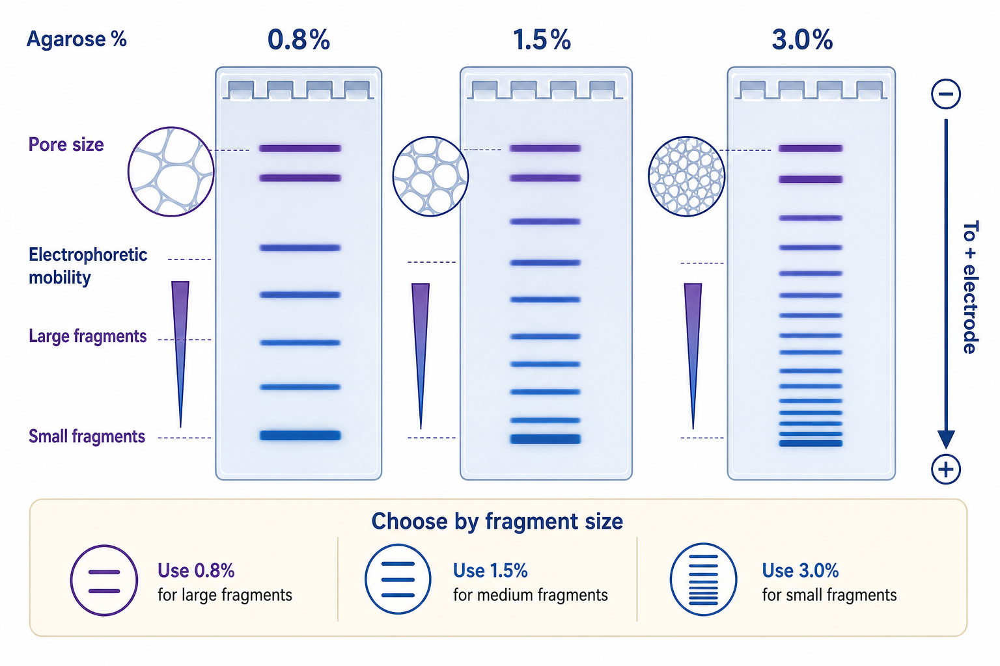

# 电泳迁移率

电泳迁移率（electrophoretic mobility）是带电分子在电场中迁移快慢的表现。在核酸凝胶电泳中，DNA/RNA 因磷酸骨架带负电而向正极移动；迁移速度不仅由片段大小决定，还受 [凝胶浓度](凝胶浓度.md)、缓冲液、构象、染料、盐浓度、电压和温度影响。

图源：Image2 生成的凝胶浓度与迁移率示意图；同样的 DNA ladder 在不同琼脂糖百分比中会呈现不同的分离窗口。

## 一句话理解

在没有凝胶时，核酸主要按电荷和摩擦阻力迁移；在琼脂糖凝胶中，凝胶孔径会额外“筛分”片段。小片段更容易穿过孔网，通常跑得更快；大片段受到阻力更大，通常跑得更慢。

Addgene 的 agarose gel electrophoresis protocol 用基础方式解释了这个现象：DNA 带负电，在电场中向正极迁移；短片段穿过凝胶更快，因此可以和 [DNA Ladder](<../../材(实验耗材工具篇)/DNA Ladder.md>) 对照估算片段大小。参考：[Addgene Agarose Gel Electrophoresis Protocol](https://www.addgene.org/protocols/gel-electrophoresis/)。

## 影响因素

| 因素 | 对迁移的影响 |
| --- | --- |
| 片段大小 | 小片段通常迁移更快，大片段更慢 |
| 凝胶浓度 | 高浓度胶孔径小，更限制大片段 |
| 电压/电场强度 | 电压越高跑得越快，但发热和条带弯曲风险增加 |
| 缓冲液 | TAE/TBE 离子组成影响电流、发热和分辨率 |
| 样本盐浓度 | 盐高会导致条带拖尾、弯曲或迁移异常 |
| DNA 构象 | 同样大小的质粒，超螺旋、线性、开环迁移不同 |
| 核酸染料 | 预染或过量嵌入染料可改变迁移 |

Thermo Fisher 的核酸电泳 troubleshooting 资料提醒，样本不同构象、异常序列、盐分和缓冲液错误都可能造成 anomalous migration（异常迁移）。参考：[Thermo Fisher Nucleic Acid Gel Electrophoresis Troubleshooting](https://www.thermofisher.com/de/en/home/life-science/cloning/cloning-learning-center/invitrogen-school-of-molecular-biology/na-electrophoresis-education/na-electrophoresis-troubleshooting.html)。

## 迁移率与分辨率不是一回事

| 目标 | 常见做法 | 代价 |
| --- | --- | --- |
| 跑得更快 | 提高电压，缩短胶长 | 发热、条带弯曲、分辨率下降 |
| 分得更开 | 降低电压，延长时间，调整胶浓度 | 耗时增加 |
| 小片段更清楚 | 提高凝胶浓度 | 大片段迁移变慢 |
| 大片段更清楚 | 降低凝胶浓度 | 小片段容易跑散 |

所以，“跑得快”不等于“结果好”。如果两个条带很近，需要的是分辨率；如果只是快速确认有无目标条带，才更关心速度。

## 异常迁移常见原因

| 表现 | 可能原因 | 建议 |
| --- | --- | --- |
| 同一片段看起来大小不对 | 质粒构象不同、染料影响、胶浓度不合适 | 线性化后再判断大小 |
| 条带笑脸状弯曲 | 电压过高、发热、盐浓度高 | 降低电压，换新 buffer |
| 条带拖尾 | 样本盐高、上样过量、DNA 降解 | 纯化或减少上样量 |
| 小片段跑丢 | 电泳时间太长、胶浓度低 | 提高胶浓度，缩短时间 |
| 大片段卡在上方 | 胶浓度太高、电压不合适 | 降低胶浓度，延长低电压运行 |

## 小结

电泳迁移率是核酸条带位置背后的核心概念。读胶时不要只按“越低越小”机械解释；质粒构象、染料、胶浓度、盐分和电压都可能让同一 DNA 片段显示出不同位置。

## 参考来源

- [Addgene Agarose Gel Electrophoresis Protocol](https://www.addgene.org/protocols/gel-electrophoresis/)
- [Thermo Fisher Nucleic Acid Gel Electrophoresis Troubleshooting](https://www.thermofisher.com/de/en/home/life-science/cloning/cloning-learning-center/invitrogen-school-of-molecular-biology/na-electrophoresis-education/na-electrophoresis-troubleshooting.html)
- [Bio-Rad Nucleic Acid Electrophoresis](https://www.bio-rad.com/pt-br/applications-technologies/nucleic-acid-electrophoresis?ID=LUSNS52B7)
