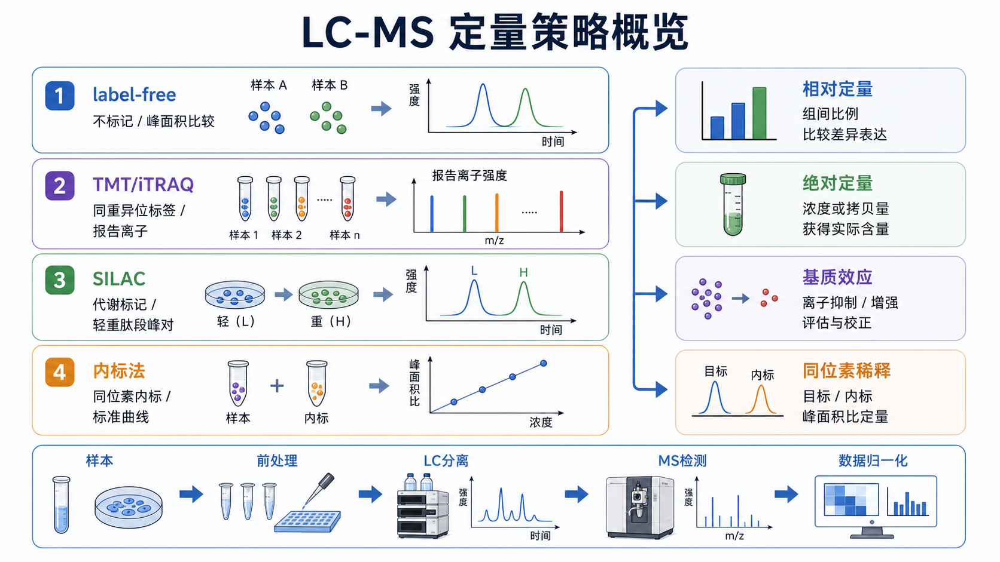

# 相对定量

Relative quantification（相对定量）是指比较不同样本、处理组或时间点之间的信号比例或丰度变化，而不是直接报告目标物的绝对浓度、拷贝数或质量。它回答的问题是：“实验组相对于对照组增加或减少了多少？”



图源：Image2 生成的 LC-MS 定量策略示意图。label-free、TMT/iTRAQ 和 SILAC 常用于相对定量；它们的读数通常是组间比例，而不是天然的绝对浓度。

## 一句话理解

相对定量给的是 fold change（倍数变化）或 ratio（比例），不是“样本里到底有多少”。例如：

```text
处理组 / 对照组 = 2.3
```

这表示处理组信号约为对照组 2.3 倍，但不等于目标物浓度是 2.3 ng/mL。

## 常见实验中的相对定量

| 实验 | 相对定量读数 | 关键参照 |
| --- | --- | --- |
| [RT-qPCR](<../../用(实验流程内容篇)/RT-qPCR.md>) | 2^-ΔΔCq 或 fold change | reference gene（参考基因）和对照组 |
| [Western blot](<../../用(实验流程内容篇)/Western blot.md>) | 条带灰度比 | loading control（上样内参）或总蛋白 |
| [免疫荧光](<../../用(实验流程内容篇)/免疫荧光.md>) | 平均荧光强度或阳性面积比例 | 同一成像参数、背景扣除 |
| [label-free定量](label-free定量.md) | [峰面积](峰面积.md)、强度或 [谱图计数](谱图计数.md) 比较 | 跨样本归一化和批次控制 |
| [TMT](TMT.md) / [iTRAQ](iTRAQ.md) | reporter ion（报告离子）比例 | 通道平衡和同位素杂质校正 |
| [SILAC](SILAC.md) | light/heavy peptide ratio | 轻重标记峰面积比 |

Livak 和 Schmittgen 在 2001 年系统描述了 2^-ΔΔCt 方法，使相对基因表达分析成为 RT-qPCR 最常用的数据处理方式之一。参考：[Livak and Schmittgen, 2001](https://doi.org/10.1006/meth.2001.1262)。

## 和绝对定量的区别

| 项目 | 相对定量 | [绝对定量](绝对定量.md) |
| --- | --- | --- |
| 回答问题 | 相比对照变化多少 | 样本中实际有多少 |
| 常见结果 | fold change、ratio、relative abundance | ng/mL、pg/mL、copies/uL、mol/L |
| 是否一定需要标准曲线 | 不一定 | 通常需要 [标准曲线](标准曲线.md) 或校准物 |
| 依赖重点 | 对照组、内参、归一化 | 标准品、校准曲线、回收率 |
| 适合场景 | 筛选、组间比较、机制探索 | 临床检测、药物浓度、定量报告 |

## 为什么相对定量仍然很有用

很多实验真正关心的是变化方向和变化幅度，而不是绝对浓度。例如药物处理后某个蛋白是否上调、敲低后某条通路是否下降、病例组和对照组是否出现差异。这些问题用相对定量往往更自然，也更容易跨批次比较。

但相对定量不是“低要求”。它依赖稳定参照体系：qPCR 需要可靠内参，WB 需要合适 loading control，质谱需要归一化和批次校正。参照体系不稳，相对结果会被放大或扭曲。

## 关键要求

| 要求 | 为什么重要 |
| --- | --- |
| 明确对照组 | 没有基准，就没有相对变化 |
| 使用合适 normalization（[归一化](归一化.md)） | 校正总量、上机量或整体信号差异 |
| 控制 [批次效应](批次效应.md) | 避免把日期、仪器或操作者差异误判为生物差异 |
| 避免信号饱和 | 饱和信号不能反映真实比例 |
| 保留原始读数 | 方便检查异常点和重复性 |

## 常见错误与 troubleshooting

| 异常 | 可能原因 | 调整方向 |
| --- | --- | --- |
| fold change 很大但重复性差 | 低信号、背景扣除不稳、样本量少 | 增加重复，检查原始信号和背景 |
| 所有目标都一起变化 | 总量归一化或内参不稳定 | 换参照方式，检查上样量/总信号 |
| 批次之间方向不一致 | 批次效应、仪器漂移、试剂批号差异 | 设计桥接样本或同批完成关键比较 |
| 低丰度目标缺失多 | 接近检测下限 | 不强行计算比例，考虑靶向验证 |
| 图中只显示百分比 | 缺少对照基准和原始单位 | 同时保留 raw signal 和 normalized value |

## 小结

相对定量适合回答“相比对照改变多少”，是机制研究和组间比较的主力语言。它不要求直接报告实际浓度，但必须有稳定对照、合理归一化和可追溯原始数据，否则比例本身会失去可信度。

## 参考来源

- [Livak and Schmittgen, Analysis of relative gene expression data using real-time quantitative PCR and the 2^-ΔΔCt method, Methods, 2001](https://doi.org/10.1006/meth.2001.1262)
- [Bustin et al., The MIQE guidelines, Clinical Chemistry, 2009](https://doi.org/10.1373/clinchem.2008.112797)
- [Cox et al., Accurate proteome-wide label-free quantification by delayed normalization and maximal peptide ratio extraction, Molecular & Cellular Proteomics, 2014](https://doi.org/10.1074/mcp.M113.031591)
