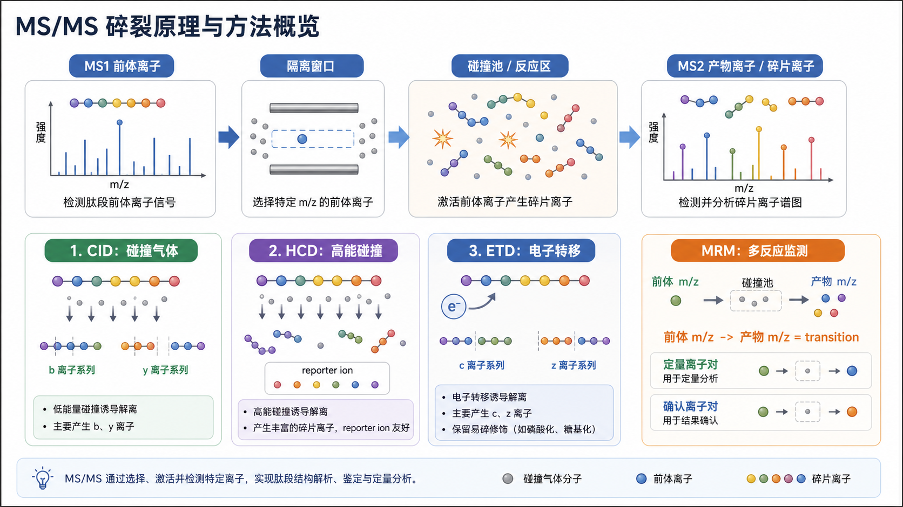

# 碎片离子

Fragment ion（碎片离子）是 [串联质谱](串联质谱.md) 中 [前体离子](前体离子.md) 经碎裂后形成的离子，也常在靶向质谱语境中称为 [产物离子](产物离子.md)。碎片离子是 MS/MS 谱图中最关键的结构证据：它们告诉我们“这个前体离子被拆开后出现了哪些片段”。



图源：Image2 生成的 MS/MS 碎裂方式示意图。右上角 MS2 谱图和下方 CID/HCD/ETD 模块展示了前体离子碎裂后产生碎片离子的基本逻辑。

## 在 MS/MS 中的位置

Thermo Fisher 的 mass spectrometry technology overview 描述 tandem mass spectrometry（MS/MS）时指出，先选择某个离子，使其 fragmentation（碎裂），再分析 fragments（碎片）。这些 fragments 就是碎片离子。参考：[Thermo Fisher Mass Spectrometry Technology Overview](https://www.thermofisher.com/us/en/home/industrial/mass-spectrometry/mass-spectrometry-learning-center/mass-spectrometry-technology-overview.html)

```text
MS1：检测前体离子
-> isolation：隔离前体离子
-> fragmentation：碎裂
-> MS2：检测碎片离子
-> interpretation：鉴定、定位或定量
```

## 碎片离子提供什么信息

| 场景 | 碎片离子的作用 |
| --- | --- |
| 肽段鉴定 | b/y 或 c/z 离子系列支持序列推断 |
| PTM 定位 | 判断修饰质量落在哪一段肽段上 |
| TMT 定量 | reporter ion（报告离子）提供相对定量信号 |
| 小分子结构解析 | 特征碎片帮助排除或支持候选结构 |
| MRM/SRM | 特定产物离子与前体离子组成 transition |
| DIA/PRM | 多个碎片离子轨迹共同确认目标 |

如果只有前体 m/z，通常只能说明“可能是什么”；有碎片离子后，才更接近“为什么是它”。

## 肽段碎片离子类型

| 类型 | 常见碎裂方式 | 解释 |
| --- | --- | --- |
| b ions（b 离子） | CID/HCD | 从肽段 N 端方向形成 |
| y ions（y 离子） | CID/HCD | 从肽段 C 端方向形成 |
| c ions（c 离子） | ETD | 从 N 端方向形成，适合某些修饰解析 |
| z ions（z 离子） | ETD | 从 C 端方向形成，常与 c 离子配对解释 |
| reporter ions（报告离子） | HCD | TMT/iTRAQ 等同位素标记定量常见 |
| neutral loss ions（中性丢失离子） | 多种 | 水、氨、磷酸等中性丢失可能提示结构或修饰 |

碎片离子类型与碎裂方式相关。CID/HCD 常产生 b/y 离子；ETD 更常产生 c/z 离子，对某些易碎修饰更友好。

## 碎片离子质量好不好怎么看

| 观察 | 可能含义 |
| --- | --- |
| 碎片离子连续覆盖肽段 | 序列证据强 |
| 只有少数强峰 | 可能仍可定量，但鉴定/定位证据有限 |
| 噪声峰很多 | 共隔离、过度碎裂或样本背景高 |
| 关键修饰附近没有碎片 | PTM 定位不可靠 |
| 定量碎片强但确认碎片弱 | MRM 方法需要重新评估 |

## 常见误解

| 误解 | 更准确的理解 |
| --- | --- |
| 碎片离子越多越好 | 关键是可解释、覆盖关键区域、信噪比好 |
| 最强碎片一定最特异 | 强峰可能来自常见背景或非特异断裂 |
| 有一个碎片匹配就能确认 | 通常需要多个碎片、保留时间、前体质量和 FDR/标准品支持 |
| 不同仪器碎片谱完全一样 | 碰撞能量、碎裂方式和仪器结构都会改变碎片谱 |

## 和产物离子的关系

在一般 MS/MS 解释中，“fragment ion”和“product ion”常接近同义；在三重四极杆和 MRM/SRM 中，“product ion”更常指 Q3 监测的那个特定产物离子。可以这样理解：

```text
碎片离子：碎裂后产生的所有片段信号
产物离子：在特定前体离子碎裂后被作为结果分析或监测的片段离子
```

## 小结

碎片离子是 MS/MS 的证据核心。它让质谱从“测到一个 m/z”变成“看到结构和序列线索”。无论是肽段鉴定、PTM 定位、TMT 定量，还是 MRM 方法开发，真正可信的解释都离不开高质量碎片离子。

## 参考来源

- [Thermo Fisher Mass Spectrometry Technology Overview](https://www.thermofisher.com/us/en/home/industrial/mass-spectrometry/mass-spectrometry-learning-center/mass-spectrometry-technology-overview.html)
- [Thermo Fisher Triple Quadrupole LC-MS](https://www.thermofisher.com/us/en/home/industrial/mass-spectrometry/liquid-chromatography-mass-spectrometry-lc-ms/lc-ms-systems/triple-quadrupole-lc-ms.html)
