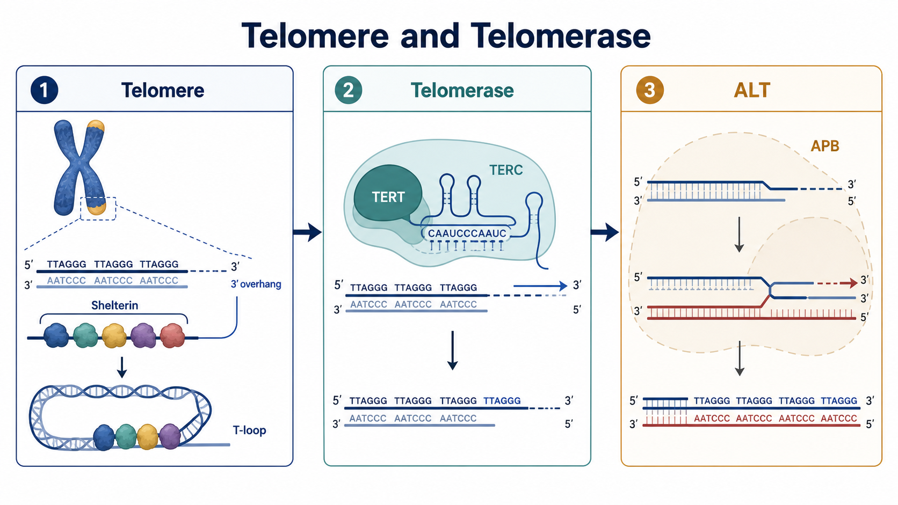

# 端粒

端粒（telomere）是真核线性染色体末端的重复 DNA 与结合蛋白构成的核蛋白结构。它的核心任务不是“让染色体末端变长”，而是让细胞知道：这里是正常染色体末端，不是需要被连接、切除或报警的 [DNA双链断裂](DNA双链断裂.md)。

图：端粒由 TTAGGG 重复序列、3′ G-rich overhang（富 G 3′ 突出端）和 [shelterin complex（端粒保护蛋白复合物）](Shelterin.md)共同形成保护结构；[端粒酶](端粒酶.md)可用 RNA 模板补充端粒重复序列；[ALT](ALT.md)则可通过重组和 BIR-like DNA synthesis（BIR 样 DNA 合成）维持端粒。本图由 Image2 / image-generation model 生成，用于个人学习示意。

## 基本结构

人类端粒 DNA 的主要重复序列是 5′-TTAGGG-3′，互补链为 3′-AATCCC-5′。Moyzis 等在 1988 年证明，人染色体末端富集高度保守的 TTAGGG 重复序列。参考：[Moyzis et al., PNAS, 1988](https://doi.org/10.1073/pnas.85.18.6622)。

端粒并不是裸露 DNA。末端通常具有 3′ G-rich overhang（富 G 3′ 突出端），并可形成 T-loop（端粒环）结构，使末端被“藏入”端粒重复序列内部。T-loop 的提出为端粒如何避免被当作断裂 DNA 提供了直接结构模型。参考：[Griffith et al., Cell, 1999](https://doi.org/10.1016/S0092-8674(00)80760-6)。

与端粒结合的 shelterin complex 主要包括 TRF1、TRF2、POT1、TIN2、TPP1 和 RAP1。它们共同调控端粒末端保护、端粒酶进入、复制过程和 DNA damage response（DNA 损伤反应）抑制。参考：[de Lange, Genes & Development, 2005](https://doi.org/10.1101/gad.1346005)。

## 端粒为什么会变短

端粒缩短主要来自 end-replication problem（末端复制问题）和末端加工。普通 DNA polymerase（DNA 聚合酶）需要引物和模板，不能在每次复制后完全补齐线性染色体最末端；复制结束后 RNA primer（RNA 引物）去除、5′ 端处理和核酸酶加工也会造成末端损失。

Harley、Futcher 和 Greider 发现，人二倍体成纤维细胞在体外传代衰老过程中端粒逐渐缩短，说明端粒长度可记录细胞分裂历史的一部分。参考：[Harley et al., Nature, 1990](https://doi.org/10.1038/345458a0)。

但端粒长度不是简单的“年龄计数器”。不同组织、细胞类型、氧化压力、复制压力、炎症状态和遗传背景都会影响端粒长度。因此实验中不要只凭一次端粒长度测定推断细胞真实年龄或增殖潜能。

## 端粒的三件核心工作

### 区分正常末端与 DNA 断裂

如果染色体末端失去保护，细胞会把它当作 double-strand break（双链断裂），启动 ATM/ATR、53BP1、NHEJ 或其他修复反应，最终可能形成 chromosome end-to-end fusion（染色体端到端融合）。端粒保护的本质是“禁止错误修复”，而不是让末端完全没有损伤信号。

### 缓冲复制造成的末端损失

端粒重复序列不编码常规蛋白，可以作为染色体末端的牺牲缓冲区。端粒过短时，细胞更容易进入 replicative senescence（复制性衰老）或 crisis（危象），这与肿瘤抑制和组织再生能力下降都有关系。

### 调控端粒维持机制

端粒长度和端粒结合蛋白会影响端粒酶是否能进入末端，也会影响 ALT 细胞中端粒重组和模板复制。也就是说，端粒不是被动“尺子”，而是一个会调控自身维护方式的染色体末端平台。

## 端粒过短会发生什么

当端粒短到不能维持有效 shelterin 保护时，细胞可能出现 DNA damage foci（DNA 损伤焦点）、细胞周期阻滞、[细胞衰老](细胞衰老.md)或凋亡。如果 p53、RB 等检查点失效，细胞可能继续分裂并进入 crisis，产生端粒融合、断裂-融合-桥循环和复杂染色体重排。

这个阶段有双重意义：一方面，端粒缩短限制异常细胞无限增殖；另一方面，如果细胞逃过检查点并重新激活端粒维持机制，就可能获得肿瘤永生化能力。

## 端粒如何被维持

### 端粒酶维持

[端粒酶](端粒酶.md)（telomerase）是含 RNA 模板的 reverse transcriptase（逆转录酶）复合体，可在 3′ overhang 末端添加 TTAGGG 重复序列。端粒酶活性常见于生殖细胞、部分干/祖细胞、活化免疫细胞和多数肿瘤细胞，但在多数成熟体细胞中较低或不可检测。

端粒酶维持不是“端粒永远不短”。它通常使端粒长度处于某个动态平衡范围内，而不是无限延长所有端粒。

### ALT 维持

[ALT](ALT.md)（alternative lengthening of telomeres，端粒替代延长）是一类端粒酶非依赖的端粒维持状态，主要依赖同源模板复制、端粒重组和 APB 等核内结构。ALT 细胞常表现为端粒长度极不均一、C-circle 阳性和端粒重组增加。

ALT 与 [BIR](BIR.md)（break-induced replication，断裂诱导复制）关系密切，但 ALT 不是经典 BIR 的简单等价物。它是一种持续的端粒维持生态，可能包含多条 BIR-like 路径。

## 端粒为什么是难复制区域

端粒重复序列可形成 G-quadruplex（G 四链体）、R-loop、T-loop 和其他二级结构。复制叉接近染色体末端时，还要面对重复序列、蛋白复合物、末端几何结构和端粒 RNA 转录等因素。因此端粒容易成为 [复制压力](复制压力.md)集中区域。

在特定背景下，未完成端粒复制可进入有丝分裂并触发 telomeric MiDAS（端粒有丝分裂期 DNA 合成）。因此 [MiDAS](MiDAS.md) 和 ALT 经常在端粒研究中被一起讨论，但二者的时间尺度和生物学目的不同。

## 怎么测端粒状态

端粒实验不要只测一个指标。常见读出可以分成三类：

| 读出 | 常见方法 | 能回答什么 | 主要局限 |
| --- | --- | --- | --- |
| 端粒长度 | TRF Southern blot、qPCR、Flow-FISH、qFISH | 平均长度、分布或单细胞差异 | 平均长度会掩盖最短端粒；不同方法不可直接互换 |
| 端粒保护 | 端粒 FISH + γH2AX/53BP1、端粒融合检测 | 端粒是否被当作 DNA 损伤 | 损伤共定位不等于已经失去全部端粒功能 |
| 端粒维持机制 | [TRAP assay](<../../用(实验流程内容篇)/TRAP assay.md>)、TERT/TERC 表达、C-circle assay、APB | 是端粒酶、ALT，还是两者混合 | 单一标志不能定义完整机制 |

更系统的实验可放入 [端粒长度检测](端粒长度检测.md) 和端粒维持机制检测页面继续展开。

## 端粒、端粒酶与 ALT 对比

| 项目 | 端粒 | 端粒酶维持 | ALT 维持 |
| --- | --- | --- | --- |
| 本质 | 染色体末端保护结构 | RNA 模板逆转录添加重复序列 | 重组和模板复制维持端粒 |
| 主要对象 | 所有线性染色体末端 | 有端粒酶活性的细胞 | 部分肿瘤或永生化细胞 |
| 典型标志 | TTAGGG、3′ overhang、shelterin、T-loop | TERT/TERC、TRAP 活性 | C-circle、APB、端粒长度高度异质 |
| 主要风险 | 过短后触发损伤反应和融合 | 支持细胞长期增殖 | 端粒重组、复制压力和染色体桥 |
| 实验误区 | 把平均长度当成全部端粒状态 | 把 TRAP 阳性等同于无 ALT | 把任一 ALT 标志当作充分证据 |

## 常见误读

| 说法 | 更准确的理解 |
| --- | --- |
| 端粒越长越好 | 过短有风险，但异常延长或维持也可能支持肿瘤永生化 |
| 端粒长度等于细胞年龄 | 它受分裂历史影响，但也受细胞类型、压力和遗传背景影响 |
| 端粒短一定说明细胞快死亡 | 短端粒需要结合损伤信号、检查点和增殖能力判断 |
| 端粒酶阳性就不是 ALT | 端粒酶和 ALT 标志可以在某些细胞背景中并存 |
| 平均端粒长度正常就安全 | 少数极短端粒也可能触发损伤和染色体不稳定 |

## 小结

端粒是线性染色体末端的保护和维护平台。它由 TTAGGG 重复序列、3′ overhang、T-loop 和 shelterin 共同构成，既要防止末端被误修复，又要缓冲复制带来的缩短。理解端粒时要同时看长度、保护状态和维持机制，不能只用“长或短”一个维度解释全部生物学后果。

## 参考来源

- [Moyzis et al., A highly conserved repetitive DNA sequence, (TTAGGG)n, present at the telomeres of human chromosomes, PNAS, 1988](https://doi.org/10.1073/pnas.85.18.6622)
- [Griffith et al., Mammalian telomeres end in a large duplex loop, Cell, 1999](https://doi.org/10.1016/S0092-8674(00)80760-6)
- [de Lange, Shelterin: the protein complex that shapes and safeguards human telomeres, Genes & Development, 2005](https://doi.org/10.1101/gad.1346005)
- [Harley et al., Telomeres shorten during ageing of human fibroblasts, Nature, 1990](https://doi.org/10.1038/345458a0)
- [Armanios and Blackburn, The telomere syndromes, Nature Reviews Genetics, 2012](https://doi.org/10.1038/nrg3246)
