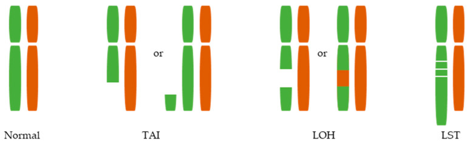

# 聚ADP核糖基化

PARylation（poly(ADP-ribosyl)ation，聚 ADP-核糖基化）是一种以 [NAD+](NAD.md) 为底物、把 ADP-ribose 单元连接到底物蛋白或 PARP 自身上的翻译后修饰。它最常见于 DNA 损伤应答语境中，由 [PARP1](PARP1.md)和 [PARP2](PARP2.md)快速生成 poly(ADP-ribose)（PAR，聚 ADP-核糖）链。

一句话理解：PARylation 是一种很快、很动态的“损伤现场临时标记”，负责把修复因子、染色质状态和 PARP 自身释放连接起来。

> 图源：[van der Wiel et al., Homologous Recombination Deficiency Scar: Mutations and Beyond—Implications for Precision Oncology, *Cancers*, 2022](https://doi.org/10.3390/cancers14174157)，Figure 1，CC BY 4.0。该图用于提示 PARylation-PARP 抑制剂常与 HRD 背景相连；它不是 PAR 链结构图。

## PARylation 和 ADP-ribosylation 的关系

| 术语 | 含义 | 重点 |
| --- | --- | --- |
| ADP-ribosylation | ADP-核糖基化，总称 | 可以是单个 ADP-ribose 或链状结构 |
| MARylation | mono(ADP-ribosyl)ation，单 ADP-核糖基化 | 加一个 ADP-ribose |
| PARylation | poly(ADP-ribosyl)ation，聚 ADP-核糖基化 | 形成线性或分支 PAR 链 |
| PAR | poly(ADP-ribose)，聚 ADP-核糖 | 带强负电，可作为蛋白招募平台 |

很多文献会把 ADP-ribosylation 泛称为 PARP 相关修饰，但实验解释时最好区分 MAR 和 PAR，因为它们的酶、读数和功能可能不同。

## 反应如何发生

PARP1/2 识别 DNA 损伤或相关结构后，催化结构域使用 NAD+ 生成 ADP-ribose 单元，并把它连接到自身或其他蛋白上。PAR 链可迅速增加，随后由 [PARG](PARG.md)等水解酶降解。

因此 PARylation 是一个高周转系统：

- 生成快；
- 降解也快；
- 信号强烈依赖取样时间；
- 固定、裂解和抑制剂处理方式会显著影响结果。

PARP/PAR 的细胞功能综述可参考 [Gibson and Kraus, *Nature Reviews Molecular Cell Biology*, 2012](https://doi.org/10.1038/nrm3376)。

## PARylation 在 DNA 修复中的作用

### 招募和组织修复因子

PAR 链可以被 XRCC1、CHFR、APLF、macro-domain proteins 等 PAR-binding proteins（PAR 结合蛋白）识别，从而把修复因子带到损伤区域。对于 [DNA单链断裂](DNA单链断裂.md)和 [碱基切除修复](碱基切除修复.md)相关缺口，PARylation 常作为早期组织信号。

### 改变染色质和蛋白亲和力

PAR 链带强负电，可改变局部蛋白-DNA、蛋白-蛋白和染色质相互作用。PARP1 自身 PARylation 还会降低它对 DNA 的亲和力，帮助它从损伤位点释放。

### 与 PARP 抑制剂毒性相连

[PARP抑制剂](PARP抑制剂.md)抑制 PARylation 后，PAR 信号下降；但更重要的是，PARP1/2 可能无法通过自 PARylation 高效离开 DNA，从而形成 [PARP捕获](PARP捕获.md)。所以“PAR 低”不只是信号低，也可能意味着蛋白滞留风险升高。

## 实验中如何检测 PARylation

| 问题 | 推荐读数 | 能回答什么 | 关键限制 |
| --- | --- | --- | --- |
| 总 PAR 是否升高 | anti-PAR Western blot、dot blot | 损伤诱导 PAR 信号 | PAR 链动态快，样本处理影响大 |
| PAR 是否定位到损伤点 | anti-PAR 免疫荧光 | 损伤区域局部 PAR 信号 | 固定条件和抗体特异性很关键 |
| PARP 抑制剂是否有效 | PAR 信号下降 | 催化抑制是否发生 | 不能代表 trapping 强度 |
| PAR 降解是否改变 | PARG 抑制/敲低后 PAR 持续性 | PAR 周转 | PAR 增加可能来自降解下降 |
| 是否影响修复结局 | XRCC1、γH2AX、RAD51、克隆形成 | PAR 信号后果 | 需与一般毒性分开 |

## 常见误读与 troubleshooting

| 观察 | 不应立即得出的结论 | 优先排查 |
| --- | --- | --- |
| PAR 信号强 | 修复一定更好 | 可能是损伤更多或 PAR 降解变慢 |
| PAR 信号弱 | 损伤少 | PARP 被抑制、NAD+ 低或取样太晚 |
| PARP 抑制剂后 PAR 消失 | 细胞毒性一定强 | trapping、HRD 背景和长期存活 |
| PARG 抑制后 PAR 增加 | PARP 激活增强 | 可能只是降解被阻断 |

## 小结

PARylation 是 PARP 依赖 DNA 损伤应答的快速动态标记。解读 PAR 信号时必须同时考虑 PARP1/2 合成、NAD+ 底物、PARG 降解、取样时间和 PARP trapping，而不能只把它当作一个简单的“修复强弱指标”。

## 参考来源

- [Gibson and Kraus, New insights into the molecular and cellular functions of poly(ADP-ribose) and PARPs, *Nature Reviews Molecular Cell Biology*, 2012](https://doi.org/10.1038/nrm3376)
- [Bai, Biology of poly(ADP-ribose) polymerases: the factotums of cell maintenance, *Molecular Cell*, 2015](https://doi.org/10.1016/j.molcel.2015.01.034)
- [Murai et al., Trapping of PARP1 and PARP2 by clinical PARP inhibitors, *Cancer Research*, 2012](https://doi.org/10.1158/0008-5472.CAN-12-2753)
