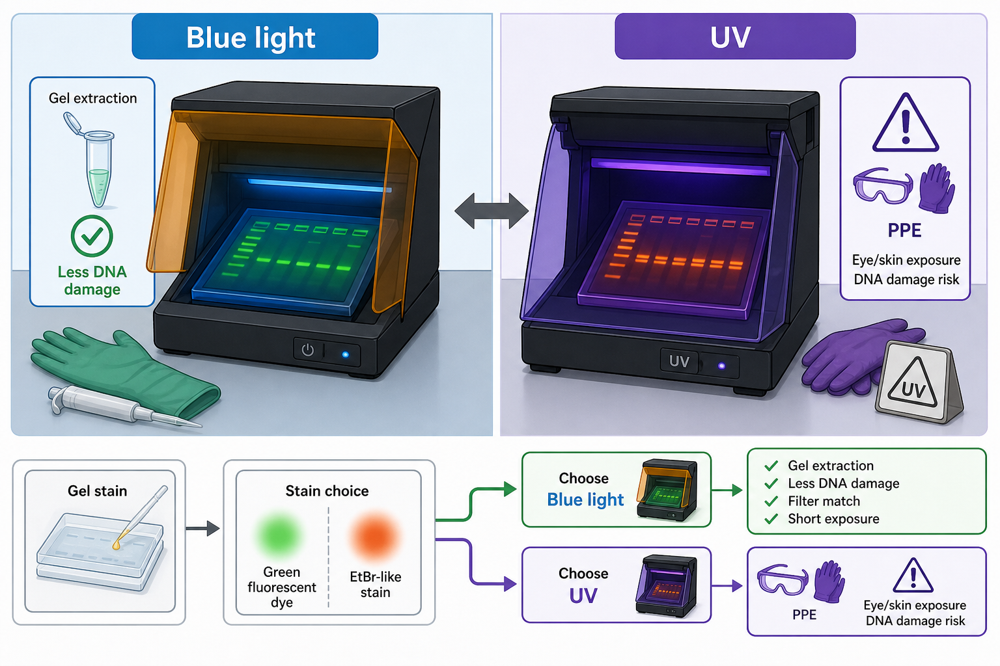

# 蓝光成像

蓝光成像（blue-light imaging / blue-light transillumination）是在较长波长可见蓝光下激发核酸荧光染料，从而观察琼脂糖凝胶中 DNA/RNA 条带的成像方式。它常用于 [SYBR Safe](<../../材(实验耗材工具篇)/SYBR Safe.md>)、[GelGreen](<../../材(实验耗材工具篇)/GelGreen.md>) 等绿色核酸染料体系，是 [凝胶回收](<../../用(实验流程内容篇)/凝胶回收.md>) 和克隆实验中常被优先考虑的成像策略。

图源：Image2 生成的蓝光与 UV 凝胶成像对比图；蓝光侧强调胶回收、较低 DNA 损伤和滤光片匹配，UV 侧强调经典 EtBr 成像和防护要求。

## 为什么蓝光重要

蓝光成像的核心优势不是“更亮”，而是减少 UV 对 DNA 和操作者的损伤。对于只是看 PCR 条带，UV 和蓝光都可能够用；但如果要切胶回收目标片段用于连接、克隆、测序或建库，减少 UV 暴露就会变得很重要。

Thermo Fisher 的 SYBR Safe FAQ 明确指出，蓝光相比 UV 对 DNA 损伤更小；若 DNA 片段用于 cloning，应避免 UV exposure。参考：[Thermo Fisher SYBR Safe FAQ](https://www.thermofisher.com/us/en/home/life-science/dna-rna-purification-analysis/nucleic-acid-gel-electrophoresis/dna-stains/sybr-safe.html)。

## 适合场景

| 场景 | 为什么适合蓝光 |
| --- | --- |
| 胶回收 | 减少 DNA 损伤，提高下游克隆友好性 |
| 蓝光兼容染料 | SYBR Safe、GelGreen 等可被蓝光激发 |
| 教学或低风险流程 | 相比 UV 更容易做安全培训 |
| 需要长时间观察 | 对操作者和样本更温和，但仍应避免过度照射 |

## 与 UV 成像对比

| 项目 | 蓝光成像 | [紫外成像](紫外成像.md) |
| --- | --- | --- |
| 光源 | 可见蓝光 | UV |
| 常见染料 | SYBR Safe、GelGreen | EB/EtBr、GelRed、部分 SYBR 染料 |
| 对 DNA 损伤 | 通常更低 | 更高，尤其长时间暴露 |
| 安全压力 | 较低，但仍需滤光片和护目 | 更高，需要 UV 防护 |
| 设备兼容性 | 需要蓝光台和合适滤片 | 老式 GelDoc 常见 |

## 使用注意事项

- 不是所有核酸染料都适合蓝光；先看染料的 excitation/emission（激发/发射）和推荐滤光片。
- 蓝光观察时通常需要 amber filter（琥珀色滤片）阻挡激发光并提高条带对比。
- 成像时也要避免曝光饱和；蓝光不等于可以无限照。
- 若条带太弱，可能是染料不匹配、滤光片不匹配或 DNA 量太低。

## 小结

蓝光成像适合把“看见条带”和“保护 DNA”同时考虑的场景。只要染料和滤光片匹配，它通常是胶回收和克隆前成像的更友好选择。

## 参考来源

- [Thermo Fisher SYBR Safe DNA Gel Stain FAQ](https://www.thermofisher.com/us/en/home/life-science/dna-rna-purification-analysis/nucleic-acid-gel-electrophoresis/dna-stains/sybr-safe.html)
- [Biotium GelRed and GelGreen DNA Gel Stains](https://biotium.com/technology/nucleic-acid-gel-stains/gelred-gelgreen-dna-gel-stains/)
