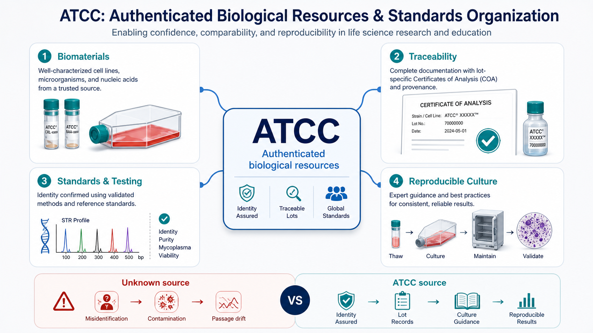
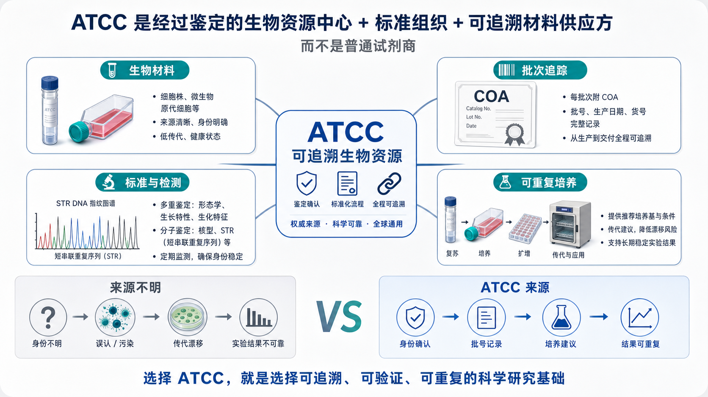

# ATCC

## 一句话定位

ATCC 是 American Type Culture Collection（美国典型培养物保藏中心/美国模式培养物保藏中心）的缩写。它不只是一个“卖细胞或菌株的试剂商”，更准确地说，是一个 biological resource center（生物资源中心）、standards organization（标准组织）和 authenticated biomaterials supplier（经过鉴定的生物材料供应方）。ATCC 官方将自己定位为全球生物材料与标准资源机构，资源类型覆盖细胞系、微生物、原代细胞、类器官、核酸材料和相关服务。[参考：ATCC About Us](https://www.atcc.org/about-us)





## 名称、历史与核心身份

ATCC 最早的名称来自 type culture（模式/典型培养物）collection（保藏集合）。从这个名字就能看出，它的底层逻辑不是普通商业目录，而是“把可复现、可追踪、可分发的生物材料保存下来”。ATCC 官方历史资料将其起点追溯到 1925 年，之后逐渐从微生物保藏发展为覆盖细胞、分子材料和标准化服务的生物资源中心。[参考：ATCC History](https://www.atcc.org/about-us/who-we-are/our-history)

National Academies Press（美国国家科学院出版社）在《Resource Sharing in Biomedical Research》中的 ATCC 章节也把 ATCC 描述为研究资源共享体系中的关键机构之一，重点不只是“供应材料”，而是长期保藏、质量控制、标准化分发和研究可重复性。[参考：NCBI Bookshelf: The American Type Culture Collection](https://www.ncbi.nlm.nih.gov/books/NBK209072/)

所以在 protocol 里写 ATCC 时，真正应该记录的不是“买了 ATCC 的细胞”这句话，而是：哪一个 ATCC catalog number（货号）、哪一个 lot number（批号）、哪一版 product sheet（产品说明书）、哪一次 thaw（复苏）、哪一个 passage number（传代数）、是否做过 cell line authentication（细胞系鉴定）和 mycoplasma testing（支原体检测）。

## 它的独特价值：把“材料身份”变成可追踪变量

在 [细胞培养](<../../用(实验流程内容篇)/细胞培养.md>) 里，很多实验失败不是因为培养基或操作突然“错了”，而是因为细胞本身已经不是你以为的那一株细胞：细胞系交叉污染、误认、长期传代漂移、支原体污染、冻存复苏损伤都会改变结果。International Cell Line Authentication Committee（ICLAC，国际细胞系鉴定委员会）长期维护 misidentified cell lines（误认细胞系）相关资源，说明细胞系身份问题不是少数实验室的偶发现象，而是生命科学重复性中的系统性风险。[参考：ICLAC](https://iclac.org/)

ATCC 的价值就在这里：它把“细胞来源”从一句模糊描述，尽量转化为一组可记录、可验证、可复查的变量。

- Material identity（材料身份）：细胞系名称、物种、组织来源、疾病背景、形态和生长方式。
- Provenance（来源/谱系）：来源信息、保藏记录、授权限制和传递链条。
- Lot traceability（批次追踪）：同一货号下不同 lot 的记录、COA（Certificate of Analysis，分析证书）和质量检测信息。
- Culture guidance（培养建议）：推荐 [培养基](<../../材(实验耗材工具篇)/培养基.md>)、传代比例、复苏方式、冻存条件、biosafety level（BSL，生物安全等级）等。
- Authentication support（鉴定支持）：ATCC 提供 [细胞系鉴定](<../../用(实验流程内容篇)/细胞系鉴定.md>) 相关服务，包括 STR（Short Tandem Repeat，短串联重复序列）分析等。[参考：ATCC Cell Authentication](https://www.atcc.org/services/cell-authentication)

如果细胞来自同门实验室、共享冻存管或来源不明的“传下来的细胞”，并不代表一定不能用，但它会引入更多不可见变量：细胞到底是否同一株、是否被其他细胞污染、传代了多少代、冻融几次、培养条件是否长期偏移、是否有支原体。对于药敏、转录组、分化、机制验证、发表论文和长期项目，这些变量会直接影响结果可信度。

## 核心资源与服务

| 类型 | 英文 | 中文 | 对实验的意义 |
| --- | --- | --- | --- |
| Cell lines | 细胞系 | 已建立并可连续传代的细胞资源 | 是 ATCC 最常被实验室接触的资源之一，适合建立项目起点、复现实验和做标准化对照 |
| Primary cells | 原代细胞 | 直接来源于组织、有限传代的细胞 | 更接近体内状态，但批次、供体和培养条件更敏感 |
| Organoids | 类器官 | 3D 自组织细胞模型 | 适合疾病建模、药物筛选和组织发育相关研究，可连接 [类器官培养](<../../用(实验流程内容篇)/类器官培养.md>) |
| Microorganisms | 微生物 | 细菌、真菌、病毒等资源 | 常用于质控、方法验证、感染模型和标准菌株 |
| Molecular materials | 分子材料 | DNA、RNA、质粒、标准品等 | 用于分子检测、方法学验证和参考材料 |
| Authentication services | 鉴定服务 | STR 分型、支原体检测等 | 用于确认细胞身份和污染状态，尤其适合关键结果前后验证 |
| Standards | 标准 | 生物材料和检测相关标准 | 让不同实验室的材料、检测和记录更容易对齐 |

ATCC 的 standards development（标准制定）工作也很重要。ATCC 官方说明其 Standards Development Organization（SDO，标准制定组织）参与生物材料相关标准制定；人源细胞系鉴定方面，ANSI/ATCC ASN-0002-2022 是 human cell line authentication（人源细胞系鉴定）的标准之一。[参考：ATCC Standards in Biomaterials](https://www.atcc.org/about-us/what-we-do/standards)；[参考：ANSI/ATCC ASN-0002-2022](https://webstore.ansi.org/standards/atcc/ansiatccasn00022022)

ATCC 官方质量承诺页面还列出 ISO 9001、ISO 13485、ISO/IEC 17025、ISO 17034、ISO 20387 等质量体系或认可信息。对实验室用户来说，这些信息的实际意义不是“看到 ISO 就不用验证”，而是说明它的材料获取、鉴定、保存、分发和记录体系有可审计的框架。真正落到单个实验时，仍然要读具体产品的 COA、product sheet 和本实验室 QC 记录。[参考：ATCC Quality Commitment](https://www.atcc.org/about-us/quality-commitment)

## 如何读 ATCC 产品页和资料

拿到一个 ATCC 细胞或菌株时，不要只看名称。更应该像读 protocol 一样读产品页、product sheet（产品说明书）和 COA。

- Catalog number / Cat. No.（货号）：这是引用和采购时最关键的身份字段。
- Lot number（批号）：同一个货号也可能有不同批次，尤其细胞、血清和复杂生物材料都要记录。
- Product name（产品名）：例如 HeLa、A549、HEK293 等，但名称本身不够，必须配合货号。
- Organism / tissue / disease（物种、组织、疾病背景）：决定模型是否适合你的科学问题。
- Growth properties（生长特性）：adherent（贴壁）、suspension（悬浮）或 mixed（混合）。
- Morphology（形态）：上皮样、成纤维样、淋巴母细胞样等，用来日常判断状态。
- Recommended medium（推荐培养基）：例如 [DMEM](<../../材(实验耗材工具篇)/DMEM.md>)、RPMI 1640、特殊基础培养基，常常还需要 [FBS](<../../材(实验耗材工具篇)/FBS.md>) 或其他补充剂。
- Subculturing information（传代信息）：推荐比例、消化方式、是否适合 [Trypsin-EDTA](<../../材(实验耗材工具篇)/Trypsin-EDTA.md>)、传代间隔和汇合度。
- Cryopreservation（冻存条件）：冻存液、降温方式和复苏建议，可连接 [细胞冻存](<../../用(实验流程内容篇)/细胞冻存.md>)。
- Biosafety level（生物安全等级）：决定实验室条件和废弃物处理要求。
- Authentication / testing（鉴定/检测）：STR profile、支原体、无菌、活率等项目。
- Restrictions / MTA（限制/材料转让协议）：有些材料有用途限制或转让限制，不能随意二次分发。

ATCC 的资料不是为了让实验者机械照抄，而是给出一个可靠起点。真正建立本实验室 SOP（Standard Operating Procedure，标准操作流程）时，还需要结合自己的培养箱、培养基批次、传代习惯和实验目的重新稳定化。

## 什么时候优先选择 ATCC

以下场景中，ATCC 的价值通常高于普通商业供应商或实验室共享来源。

- 新课题从零建立细胞模型：优先从 ATCC 或同等级细胞库获得清楚来源，避免一开始就把身份问题带进项目。
- 论文或基金需要可复现材料来源：记录 ATCC 货号、批号、传代数和鉴定结果，比只写“某某细胞系”可靠得多。
- 关键阳性/阴性对照：微生物标准株、参考细胞株或检测方法验证材料最好有清楚来源。
- 长期细胞项目：适合建立 master cell bank（主细胞库）和 working cell bank（工作细胞库），减少长期传代漂移。
- 药敏、组学、分化和机制研究：这些实验对细胞状态非常敏感，更需要低传代、来源清楚、污染阴性的材料。
- 复现实验：如果原文明确写了 ATCC catalog number，尽量从相同来源开始，而不是用同名但来源不明的细胞替代。

## 什么时候不必迷信 ATCC

ATCC 是高质量起点，但不是“买来就自动可靠到终点”。

- ATCC 细胞到手后仍然需要本地 QC（Quality Control，质量控制）：复苏活率、形态、增长曲线、[支原体检测](<../../用(实验流程内容篇)/支原体检测.md>)、关键节点的细胞系鉴定仍然要做。
- ATCC 推荐培养条件是起点，不一定是你实验目的的最优条件。某些细胞在特定分化、药物处理或无血清体系下需要重新优化。
- 价格、运输、进口和 biosafety 限制可能明显高于普通试剂。
- 同一细胞系在不同资源中心、不同来源、不同 passage history 下可能已经形成亚系差异。不要假设“同名细胞系等于完全相同材料”。
- 对某些非常新的 patient-derived model（患者来源模型）、类器官、干细胞或免疫细胞体系，专门资源库或专门供应商可能更合适。

一句话：ATCC 解决的是“起点更可靠、身份更可查、记录更标准”的问题；它不能替代你自己的培养记录、污染监测和实验验证。

## 和其他资源中心或供应商的对比

| 对象 | 更像什么 | 典型强项 | 什么时候优先 |
| --- | --- | --- | --- |
| ATCC | 全球性生物资源中心 + 标准组织 + 认证材料供应方 | 细胞系、微生物、标准化资料、鉴定服务、批次追踪 | 建立可靠模型起点、复现实验、需要明确 catalog/lot/COA 时 |
| [Gibco](Gibco.md) | 细胞培养试剂体系供应商 | 培养基、血清、PBS/DPBS、解离试剂、补充剂 | 需要稳定培养体系和试剂资料时 |
| [DSMZ](DSMZ.md) | 生物资源中心/细胞库/微生物资源库 | 欧洲资源中心，细胞系和微生物资源强 | 文献指定 DSMZ 来源，或需要特定欧洲细胞库资源时 |
| [ECACC](ECACC.md) | 欧洲细胞培养物保藏中心 | 细胞系和相关质量资料 | 英国/欧洲体系文献或机构指定 ECACC 来源时 |
| [JCRB Cell Bank](<JCRB Cell Bank.md>) | 日本细胞资源库 | 日本来源细胞系、亚洲研究体系常见资源 | 文献指定 JCRB 或需要日本资源库细胞时 |
| [RIKEN BRC](<RIKEN BRC.md>) | 日本理化学研究所生物资源中心 | 生物资源、细胞材料、模式生物资源 | 需要 RIKEN 特定资源或复现日本研究来源时 |
| [Addgene](Addgene.md) | 非营利质粒库 | 质粒、载体、基因编辑工具分发 | 需要 plasmid（质粒）而不是细胞资源时 |
| [CGMCC](CGMCC.md) / [CCTCC](CCTCC.md) | 中国微生物/细胞资源保藏体系 | 国内资源保藏、专利保藏、部分微生物和细胞资源 | 国内项目、专利保藏、指定中国资源来源时 |
| [STEMCELL Technologies](<STEMCELL Technologies.md>)、[Lonza](Lonza.md)、[ScienCell](ScienCell.md)、[PromoCell](PromoCell.md) | 专门细胞/培养体系供应商 | 干细胞、原代细胞、免疫细胞、内皮细胞、专用培养体系 | 某一类细胞或培养体系比“标准细胞系来源”更重要时 |

这个对比的核心是：ATCC 更像“材料身份和起点标准化”的基础设施；Gibco 更像“培养试剂体系”；Addgene 更像“质粒资源库”；专门细胞公司更像“特定细胞类型和培养系统解决方案”。

## Protocol 中如何记录 ATCC 材料

不要写：

```text
Cells were purchased from ATCC.
```

这句话信息量太低。更推荐写成：

```text
A549 human lung carcinoma cells, ATCC, Cat. No. CCL-185, Lot No. xxxxxxxx, thawed on yyyy-mm-dd, passage Pxx at experiment, cultured in F-12K medium with 10% FBS.
```

中文记录模板：

```text
细胞/菌株名称：
ATCC 货号：
ATCC 批号：
产品说明书版本/访问日期：
COA 是否保存：
复苏日期：
当前传代数：
推荐培养基与实际培养基：
FBS 品牌、货号、批号：
支原体检测日期与结果：
细胞系鉴定日期与结果：
冻存管编号：
操作者：
备注：
```

English record template:

```text
Cell line / strain name:
ATCC catalog number:
ATCC lot number:
Product sheet version / access date:
COA archived: yes / no
Thaw date:
Passage number at experiment:
Recommended medium and actual medium:
FBS brand, catalog number, and lot number:
Mycoplasma test date and result:
Cell line authentication date and result:
Cryovial / stock ID:
Operator:
Notes:
```

## 常见错误与 troubleshooting

| 问题 | 常见原因 | 后果 | 建议 |
| --- | --- | --- | --- |
| 只记录“ATCC 细胞” | 没写货号、批号、传代数 | 别人无法复现，也无法判断是否同一来源 | 至少记录 Cat. No.、Lot No.、复苏日期、实验传代数 |
| 复苏后状态差 | 运输损伤、复苏太慢、离心太强、培养基不匹配 | 活率低、贴壁慢、死亡碎片多 | 按 product sheet 起步，先恢复 1-2 代再做正式实验 |
| 同名细胞结果不同 | 不同来源、不同传代史、不同培养体系 | 药敏、表达谱、形态和增殖速度不同 | 记录来源，必要时用同一资源中心重新起株 |
| 长期培养后表型漂移 | 传代数过高、选择压力、培养条件改变 | 结果逐渐偏离早期细胞 | 建立低传代 master stock，限定实验 passage window |
| 结果异常但找不到原因 | 跳过支原体检测或细胞系鉴定 | 可能把污染或误认当成生物学现象 | 关键实验前后做支原体检测；重要课题做 STR 鉴定 |
| 照抄 ATCC 培养条件仍不稳定 | 本地培养箱、血清、培养基、密度和传代节奏不同 | 细胞状态波动 | 把 ATCC 条件作为起点，在本实验室建立稳定 SOP |

## 可参考的调研报告和标准来源

如果要理解为什么 ATCC 这类机构重要，可以优先看几类资料：

- 《Resource Sharing in Biomedical Research》中的 ATCC 章节：这是偏“研究资源共享/机构角色”的资料，适合理解 ATCC 为什么不仅是供应商。[参考：NCBI Bookshelf](https://www.ncbi.nlm.nih.gov/books/NBK209072/)
- OECD（Organisation for Economic Co-operation and Development，经济合作与发展组织）关于 Biological Resource Centres（生物资源中心）的报告：适合理解生物资源中心在生命科学和生物技术基础设施中的作用。[参考：OECD Biological Resource Centres](https://www.oecd.org/en/publications/biological-resource-centres_9789264193550-en.html)
- ICLAC 的细胞系鉴定资料：适合理解细胞系误认、交叉污染和 authentication workflow。[参考：ICLAC](https://iclac.org/)
- NIST（National Institute of Standards and Technology，美国国家标准与技术研究院）的 cell line assurance 数据库资源：适合理解细胞系身份确认、STR 参考信息和外部数据库如何支持鉴定。[参考：NIST Cell Line Assurance](https://www.nist.gov/programs-projects/cell-line-identification-and-authentication/databases-cell-line-assurance)
- ATCC standards 页面和 ANSI/ATCC ASN-0002-2022：适合做细胞系鉴定 SOP 或质量体系时参考。[参考：ATCC Standards in Biomaterials](https://www.atcc.org/about-us/what-we-do/standards)

## 小结

ATCC 最值得记住的不是“美国品牌”或“细胞卖得贵”，而是它把生物材料的来源、身份、批次、质量资料和培养建议系统化了。对于细胞培养和微生物实验，ATCC 的核心价值是让实验从一个更可靠、更可追踪的起点开始。

实际写 protocol 时，不要只写 ATCC。要写清楚 ATCC catalog number、lot number、product sheet、COA、复苏日期、传代数、培养条件、支原体检测和细胞系鉴定结果。只有这些信息一起出现时，ATCC 的“可靠来源”价值才真正进入你的实验记录。
