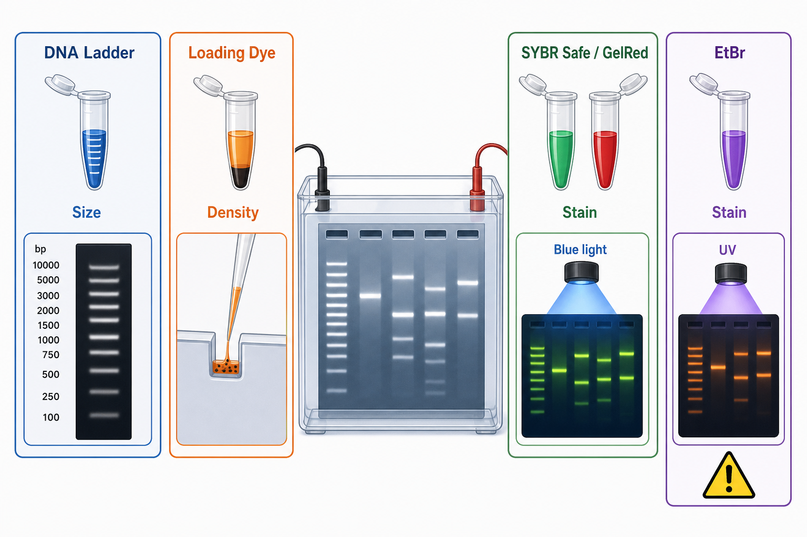

# Biotium

Biotium 是一家以 fluorescent reagents（荧光试剂）、核酸染料、细胞功能探针和生物成像试剂见长的生命科学试剂公司。它在日常分子生物学 protocol 中最容易被记住的产品线是 [GelRed](<../../材(实验耗材工具篇)/GelRed.md>) 和 [GelGreen](<../../材(实验耗材工具篇)/GelGreen.md>) 等核酸凝胶染料，用于替代 [EB](<../../材(实验耗材工具篇)/EB.md>) 并改善凝胶成像和安全管理。



图源：Image2 生成的核酸跑胶试剂组参考图；Biotium 在这个体系中的代表位置是 GelRed/GelGreen 类核酸凝胶染料，而不是电泳槽、ladder 或 loading dye。

## 公司定位

Biotium 的核心特色不是“综合型实验室大供应商”，而是围绕荧光检测和生物成像提供比较专门的试剂。它的产品常见于核酸染色、细胞活性检测、细胞死亡染色、细胞器探针、抗体标记和荧光成像相关实验。

Biotium 官方页面将自身介绍为研发和生产荧光试剂、细胞检测、核酸凝胶染料和生物成像工具的公司。参考：[Biotium official website](https://biotium.com/)。

## 在 protocol 中最常见的位置

| 场景 | Biotium 常见价值 |
| --- | --- |
| 琼脂糖凝胶电泳 | GelRed/GelGreen 替代 EtBr，用于核酸条带可视化 |
| 蓝光或 UV 成像 | 根据 GelGreen/GelRed 选择光源和滤光片 |
| 细胞活性/死亡检测 | 部分 live/dead、膜完整性和功能探针 |
| 荧光显微镜/流式 | 染料、抗体标记和功能探针 |

Biotium 的 GelRed/GelGreen 页面把这类产品定位为 safer ethidium bromide alternatives，并说明可用于 precast 或 post-electrophoresis staining。参考：[Biotium GelRed and GelGreen DNA Gel Stains](https://biotium.com/technology/nucleic-acid-gel-stains/gelred-gelgreen-dna-gel-stains/)。

## 和大平台厂商的区别

| 厂商类型 | 代表 | 优势 | 局限 |
| --- | --- | --- | --- |
| 专门荧光试剂公司 | Biotium | 染料和成像探针选择细，常有特定替代方案 | 不一定覆盖完整细胞培养或仪器生态 |
| 综合生命科学平台 | Thermo Fisher / Invitrogen | 产品线完整，资料和生态强 | 同类产品很多，选择时容易混乱 |
| 分子生物学酶试剂强项 | NEB | 酶、buffer、克隆和 ladder 体系强 | 荧光成像探针不是唯一重点 |
| 常规化学品平台 | Sigma-Aldrich / Merck | 化学品和基础试剂覆盖广 | 专用荧光探针的应用资料需仔细看 |

选择 Biotium 的典型理由是：你已经明确需要某类荧光染料或成像探针，并且它的产品说明、滤光片匹配和应用场景正好适合你的 protocol。

## 购买和记录建议

对于 Biotium 产品，不要只写“GelRed”或“Biotium dye”。应记录完整产品名、形式、浓缩倍数、货号、批号、推荐激发/发射、成像系统、预染或后染方式，以及是否用于胶回收。

推荐记录字段：

```text
中文：产品名 / 品牌 / 货号 / 批号 / 形式 / 稀释倍数 / 成像光源 / 滤光片 / 用途 / 是否用于胶回收
English: product name / brand / catalog number / lot number / format / dilution / excitation source / filter / application / gel extraction yes or no
```

## 小结

Biotium 更适合作为“荧光试剂和成像探针专家”来理解。它不是所有实验材料的默认供应商，但在核酸凝胶染料、细胞功能探针和荧光成像试剂上值得重点关注。

## 参考来源

- [Biotium official website](https://biotium.com/)
- [Biotium GelRed and GelGreen DNA Gel Stains](https://biotium.com/technology/nucleic-acid-gel-stains/gelred-gelgreen-dna-gel-stains/)
