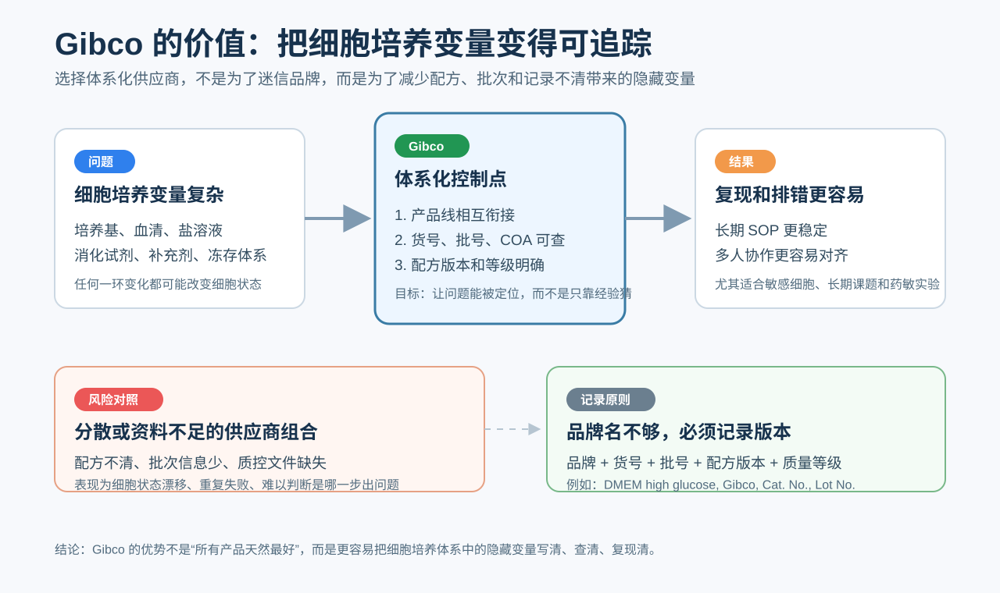

# Gibco

## 一句话定位

Gibco 是 [Thermo Fisher Scientific（赛默飞世尔科技）](赛默飞.md)旗下的生命科学试剂品牌，最核心的领域是细胞培养相关试剂。它的价值不只是“卖培养基、血清、PBS 这些单品”，而是提供相对完整的细胞培养试剂体系、配方资料、批次追踪、质量文件和技术支持。[参考：Thermo Fisher Gibco 品牌页](https://www.thermofisher.com/my/en/home/brands/gibco.html)



## 名称来源与品牌关系

Gibco 源自 Grand Island Biological Company，中文可理解为“格兰德岛生物公司”。[Thermo Fisher Scientific](赛默飞.md) 的资料中提到，Gibco 品牌起源于 1962 年美国纽约州 Grand Island，早期从动物血清供应起步，后来逐渐发展成细胞培养试剂品牌。[参考：Thermo Fisher FBS manufacturing](https://www.thermofisher.com/mx/es/home/references/gibco-cell-culture-basics/cell-culture-environment/fbs-basics/steps-taken-manufacture-fbs.html)

目前 Gibco 属于 [Thermo Fisher Scientific](赛默飞.md) 旗下。需要注意的是，Thermo Fisher 旗下还有 [Invitrogen](Invitrogen.md)、[Applied Biosystems](<Applied Biosystems.md>)、[Thermo Scientific](<Thermo Scientific.md>) 等品牌，不是所有 Thermo Fisher 产品都等于 Gibco。

## 核心优势：体系化细胞培养供应商

Gibco 的独特价值在于“体系化”。一个细胞培养流程往往不是单个试剂决定成败，而是多个环节共同决定细胞状态：基础培养基、血清、平衡盐溶液、细胞解离试剂、补充剂、抗生素、冻存体系、无血清或特定细胞培养体系等。

Gibco 的优势是这些产品线相对完整，而且配套资料比较容易查，包括 COA（Certificate of analysis，分析证书）、货号、批号、配方版本、储存条件、质量检测项目和技术说明。[Thermo Fisher Scientific](赛默飞.md) 对 Gibco 质量体系的说明中也强调了生产、质控、GMP-compliant media、ISO 13485 等质量体系信息。[参考：Gibco Media GMP Quality](https://www.thermofisher.com/ca/en/home/life-science/cell-culture/mammalian-cell-culture/cell-culture-media/gibco-media-gmp-quality.html)

这种体系化的好处是：当实验失败时，变量更容易追踪；当别人复现实验时，产品版本更容易被确认；当长期项目需要稳定性时，也更容易围绕同一批次、同一货号建立 SOP（Standard operating procedure，标准操作流程）。

## 反面例子：不成体系试剂可能带来的问题

如果一个细胞培养流程中每一步都来自资料不完整的小品牌或杂牌，可能会遇到：

- 培养基配方细节不清楚，例如是否含 L-glutamine（L-谷氨酰胺）、sodium pyruvate（丙酮酸钠）、phenol red（酚红）不明确。
- 血清批次差异大，但缺少详细检测数据。
- 平衡盐溶液的 pH、渗透压、无菌、内毒素信息不完整。
- 细胞解离试剂活性不稳定，导致消化时间和细胞状态漂移。
- 技术资料少，实验失败后难以判断是操作问题还是试剂问题。

这些问题不一定表现为“某瓶试剂明显坏了”，更常见的表现是细胞增殖速度变化、形态变差、药敏结果不稳定、转染效率下降、分化效率波动，或者重复实验时结果对不上。

第三方研究也支持一个基本事实：培养基和血清选择会显著影响细胞状态和实验结果。例如 CHO（Chinese hamster ovary，中国仓鼠卵巢细胞）细胞培养基 benchmark 研究显示，不同商业培养基会影响细胞生长、代谢、抗体产量和 IgG（Immunoglobulin G，免疫球蛋白 G）质量；另有研究系统比较 FBS 和培养基差异，发现它们会影响细胞增殖、形态、线粒体状态、药物反应和分化能力。这类研究不能直接证明 Gibco 一定最好，但能说明“培养体系和供应商选择”确实是需要控制的实验变量。[参考：Benchmarking of commercially available CHO cell culture media](https://link.springer.com/article/10.1007/s00253-015-6514-4)；[参考：Systematic Comparison of FBS and Medium Variation Effect](https://pmc.ncbi.nlm.nih.gov/articles/PMC11898771/)

## 代表性产品线

Gibco 的产品线可以粗略分为：

| 类别 | 英文 | 中文 | 例子 |
| --- | --- | --- | --- |
| Basal media | 基础培养基 | 给细胞提供基础营养、盐和缓冲环境 | [DMEM](<../../材(实验耗材工具篇)/DMEM.md>)、RPMI 1640、MEM |
| Sera | 血清 | 提供复杂生长因子、蛋白、脂质和激素 | [FBS](<../../材(实验耗材工具篇)/FBS.md>) |
| Balanced salt solutions | 平衡盐溶液 | 洗涤、稀释、短时间维持细胞 | [PBS](<../../材(实验耗材工具篇)/PBS.md>)、[DPBS](<../../材(实验耗材工具篇)/DPBS.md>)、HBSS |
| Dissociation reagents | 细胞解离试剂 | 让贴壁细胞从培养表面脱落 | Trypsin-EDTA、TrypLE |
| Supplements | 补充剂 | 为特定细胞或体系补充功能成分 | GlutaMAX、B-27、N-2 |
| CTS products | Cell Therapy Systems，细胞治疗系统产品 | 面向细胞治疗、基因治疗或生产场景的试剂体系 | CTS 培养基、CTS 级试剂 |

这里不需要把所有产品都单独创建笔记。更适合单独建页的是高频、关键或具有代表性的产品，例如 FBS、DMEM、PBS、DPBS，以及后续如果常用再展开的 TrypLE、GlutaMAX、B-27、CTS 系列等。

## FBS 是理解 Gibco 的关键产品

FBS（Fetal bovine serum，胎牛血清）是 Gibco 很有代表性的产品。血清是细胞培养中最复杂、最不“定义”的成分之一，不同来源、不同批次、不同处理方式都可能影响细胞状态。

[Thermo Fisher Scientific](赛默飞.md) 的 Gibco FBS 页面会按照不同等级和应用场景区分血清产品，并强调 origin traceability（来源可追溯性）和 fingerprinting（指纹溯源）等质量控制。[参考：Gibco FBS traceability and fingerprinting](https://www.thermofisher.com/ca/en/home/life-science/cell-culture/mammalian-cell-culture/fbs/gibco-fbs-isia-traceability-certified-and-fingerprinting-origin-guarantee.html)

实际使用建议：FBS 不要只认品牌，还要认批号。对于敏感细胞、长期课题、药敏实验、分化实验，最好先小样测试，再批量购买同一 lot（批号）。

## 什么时候优先选 Gibco

以下情况更适合优先考虑 Gibco：

- 细胞培养主干试剂，例如 DMEM、RPMI 1640、FBS、PBS/DPBS、Trypsin-EDTA。
- 需要长期复现实验或多人协作的课题。
- 对细胞状态非常敏感的实验，例如原代细胞、干细胞、类器官、分化实验、药敏实验。
- 需要清楚记录货号、批号、COA 和配方版本的 SOP。
- 需要和文献、细胞库、经典 protocol 保持一致时。

## 什么时候不必迷信 Gibco

Gibco 不是所有情况下都必须选。

- 普通 PBS、常规缓冲液、基础盐溶液，如果国产或其他品牌的无菌、pH、渗透压、内毒素、COA 都满足要求，也可以使用。
- 某些专门细胞体系，可能 [STEMCELL Technologies](<STEMCELL Technologies.md>)、[Lonza](Lonza.md)、[PromoCell](PromoCell.md)、[ATCC](ATCC.md)、[ScienCell](ScienCell.md) 等专门厂商更有优势。
- 抗体、检测试剂盒等产品不能因为属于 [Thermo Fisher Scientific](赛默飞.md) 体系就默认可靠，仍然要看验证数据、应用类型和文献引用。
- FBS 即使是 Gibco，也仍然存在批次差异。

一句话：Gibco 的优势是稳定、体系完整、资料清楚、行业认可度高，但不是“所有产品天然最优”。

## Protocol 中如何记录 Gibco 产品

不建议只写“Gibco 培养基”或“Gibco FBS”。更推荐写成：

```text
DMEM, high glucose, with L-glutamine, without sodium pyruvate, Gibco, Cat. No. xxxxx, Lot No. xxxxx
```

至少记录：

- 品牌：Gibco。
- 公司：[Thermo Fisher Scientific](赛默飞.md)。
- 货号：Catalog number / Cat. No.
- 批号：Lot number，尤其 FBS 必须记录。
- 配方版本：高糖/低糖、是否含 L-glutamine、是否含 sodium pyruvate、是否含 phenol red。
- 产品等级：research use、cell culture grade、CTS、GMP-compliant 等。
- 储存条件、开封日期和有效期。

这对细胞培养尤其重要，因为“Gibco DMEM”不是唯一产品。不同版本的 DMEM 在糖浓度、谷氨酰胺、丙酮酸钠、酚红等方面都可能不同。

## 小结

Gibco 是细胞培养领域非常重要的一线品牌。它真正值得被重视的地方，不只是某一个试剂，而是相对完整的细胞培养产品体系、清楚的配方和质量资料、较强的批次追踪能力，以及广泛的文献和实验室使用基础。

但在实际采购和 protocol 记录中，仍然不能只写品牌名。真正可靠的写法是：品牌 + 货号 + 批号 + 配方版本 + 质量等级。对于 FBS、培养基和关键细胞培养试剂，这些细节往往比“是不是 Gibco”本身更重要。
