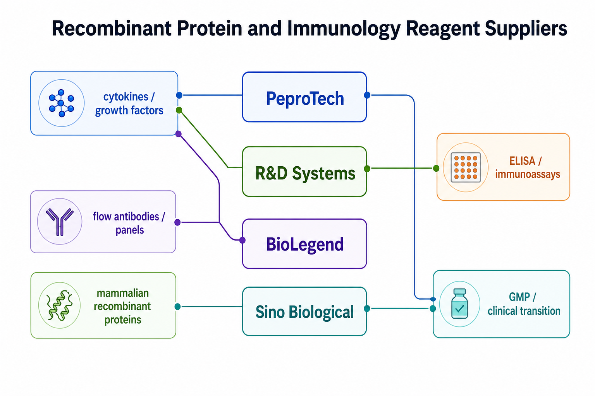

# R&D Systems

R&D Systems（Research and Diagnostic Systems，研发与诊断系统；现为 [Bio-Techne](<Bio-Techne.md>) 旗下品牌）是重组蛋白、抗体、ELISA/immunoassay（酶联免疫/免疫检测）和细胞因子检测体系中非常常见的供应商。它在生长因子、细胞因子和配套检测方案上尤其有存在感。



图源：Image2 生成的供应商定位图；这张图只表达常见使用倾向，不代表完整产品线。

## 品牌关系与核心定位

R&D Systems 属于 [Bio-Techne](<Bio-Techne.md>)。Bio-Techne 的品牌资料将 R&D Systems 定位为 antibodies（抗体）、proteins（蛋白）、ELISA kits（ELISA 试剂盒）、multiplex assays（多重检测）和 cell culture reagents（细胞培养试剂）等产品线的重要品牌。参考：[Bio-Techne R&D Systems brand](https://www.bio-techne.com/brands/r-d-systems)。

在这个知识库里，R&D Systems 最适合被看作“蛋白功能试剂 + 免疫检测体系”的供应商。它不只是卖某个 recombinant protein（重组蛋白），还常提供与该靶点相关的抗体、ELISA、标准品、说明书和背景资料。

## 核心优势

| 优势 | 对实验的意义 |
| --- | --- |
| 重组蛋白资料详细 | 物种、成熟片段、表达系统、活性测试和内毒素信息更容易追踪 |
| ELISA/免疫检测产品线强 | 适合检测细胞培养上清、血清、组织裂解液中的 cytokine/growth factor |
| 与靶点背景资料连接紧密 | 产品页常包含生物学背景、受体、功能和应用信息 |
| 适合做标准化记录 | 货号、批号、标准曲线、检测范围和样本类型可写进 SOP |

R&D Systems 的资料常被用作“这个因子是什么、常见活性是什么、用什么检测”的入口，但仍然要注意：产品页不是实验综述，不能替代具体细胞体系优化。

## 适合优先考虑 R&D Systems 的情况

- 需要 recombinant growth factor/cytokine 并同时希望查到清楚 bioactivity（生物活性）资料。
- 需要检测某个细胞因子或生长因子，例如使用 [ELISA试剂盒](<../../材(实验耗材工具篇)/ELISA试剂盒.md>) 测培养上清。
- 做 TGF-β superfamily、neurotrophin、interleukin、chemokine 等信号相关实验。
- 需要把“刺激因子”和“检测方法”放在同一供应商体系中减少匹配变量。

在前面的笔记中，[EGF](<../../材(实验耗材工具篇)/EGF.md>)、[BMP4](<../../材(实验耗材工具篇)/BMP4.md>)、[Activin A](<../../材(实验耗材工具篇)/Activin A.md>)、[BDNF](<../../材(实验耗材工具篇)/BDNF.md>)、[GDNF](<../../材(实验耗材工具篇)/GDNF.md>)、[IL-2](<../../材(实验耗材工具篇)/IL-2.md>) 等页面都用到了 R&D Systems 的产品资料作为参考。

## 不要过度迷信的地方

- R&D Systems 不是细胞培养基主干供应商；培养基、FBS、PBS/DPBS 等仍更常见于 [Gibco](Gibco.md)、Corning、HyClone 等体系。
- ELISA kit（ELISA 试剂盒）不能只按靶点名字替换，必须看样本类型、检测范围、交叉反应、标准品和基质效应。
- recombinant protein（重组蛋白）不能只按 ng/mL 替换，必须看物种、片段、标签、表达系统、活性单位和内毒素。
- 免疫细胞或类器官实验中，即使品牌稳定，也仍需要批号桥接。

## 与相近供应商对比

| 供应商 | 更强的典型场景 | 与 R&D Systems 的区别 |
| --- | --- | --- |
| [PeproTech](PeproTech.md) | cytokine/growth factor 添加剂 | PeproTech 更像高频功能蛋白供应商 |
| [BioLegend](BioLegend.md) | [流式抗体](<../../材(实验耗材工具篇)/流式抗体.md>)、多色 panel、免疫表型 | BioLegend 更适合 flow cytometry 和抗体 panel |
| [Sino Biological](<Sino Biological.md>) | 哺乳动物表达蛋白、病毒抗原、定制服务 | Sino 在某些靶点蛋白和 custom service 上更突出 |
| [Cell Signaling Technology](<Cell Signaling Technology.md>) | 磷酸化信号抗体、WB/IF 信号通路抗体 | CST 更偏信号通路抗体验证 |

## Protocol 中如何记录

推荐记录模板（中文）：

```text
产品类型：重组蛋白/抗体/ELISA试剂盒/其他
品牌：R&D Systems
母公司：Bio-Techne
货号：
批号：
靶点：
物种反应性：
样本类型或应用：
检测范围或活性单位：
表达系统/标签：
内毒素水平：
储存条件：
开封日期：
异常现象：
```

Recommended record template (English):

```text
Product type: recombinant protein/antibody/ELISA kit/other
Brand: R&D Systems
Parent company: Bio-Techne
Catalog number:
Lot number:
Target:
Species reactivity:
Sample type or application:
Detection range or activity unit:
Expression system/tag:
Endotoxin level:
Storage condition:
Open date:
Abnormal observation:
```

## 小结

R&D Systems 是“重组蛋白 + 抗体 + 免疫检测”连接得很紧的供应商。它特别适合需要同时考虑刺激因子、靶点背景和检测方案的实验。但对于细胞培养主干试剂或流式多色 panel，不应把它默认当作第一选择。

## 参考来源

- [Bio-Techne R&D Systems brand](https://www.bio-techne.com/brands/r-d-systems)
- [R&D Systems official site](https://www.rndsystems.com/)
