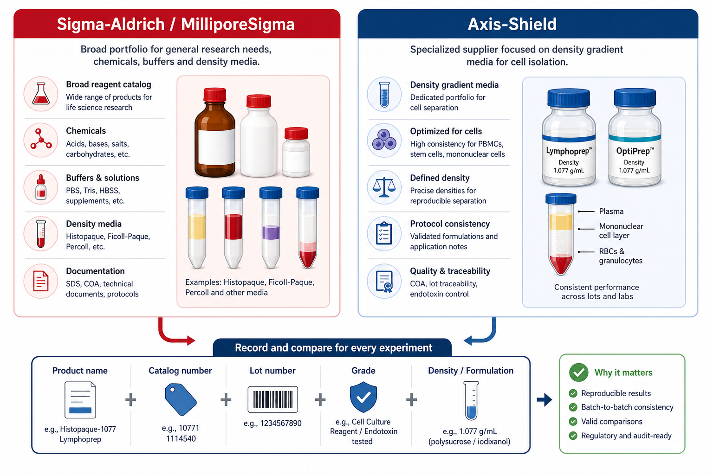

# Sigma-Aldrich

Sigma-Aldrich 是生命科学实验中非常常见的试剂与耗材品牌，尤其强在 research chemicals（科研化学试剂）、biochemicals（生化试剂）、buffer components（缓冲液组分）、protein biology reagents（蛋白实验试剂）、cell culture supplements（细胞培养补充剂）和部分 density gradient media（密度梯度介质）。在本知识库里，它最适合作为“通用试剂与配方追溯型供应商”理解，而不是像 [Gibco](Gibco.md) 那样优先理解为细胞培养 workflow 生态线。



图源：Image2 生成的供应商记录示意图。重点是 Sigma-Aldrich/MilliporeSigma 与 Axis-Shield 这类供应商在 protocol 记录中必须落到产品名、货号、批号、等级和配方/密度，而不是只写品牌名。

## 品牌身份

Sigma-Aldrich 现在属于 [Merck](Merck.md) 生命科学业务体系；在美国和加拿大，Merck KGaA, Darmstadt, Germany 的生命科学业务以 [MilliporeSigma](MilliporeSigma.md) 名称运营。Merck 官方品牌页面也将 Sigma-Aldrich、Millipore、Milli-Q、[Supelco](Supelco.md) 等列为生命科学相关品牌。参考：[Merck Life Science brands](https://www.merckgroup.com/en/products/life-science/brands.html)。

历史上，Merck 在 2015 年完成对 Sigma-Aldrich 的收购；这个背景有助于理解为什么同一产品页面或发票上可能同时出现 Merck、Sigma-Aldrich、MilliporeSigma、Supelco 等名称。参考：[Merck completes Sigma-Aldrich acquisition](https://www.merckgroup.com/en/news/sigma-aldrich-acquisition-18-11-2015.html)。

## 核心优势

| 优势 | 实验中的意义 |
| --- | --- |
| 化学试剂覆盖广 | 自配 buffer、抑制剂、染料、盐类和有机溶剂时常能找到对应等级 |
| 货号和 SDS/COA 体系完整 | 方便追溯安全信息、批号、纯度和质量文件 |
| 不同 grade 细分多 | 可按 molecular biology grade、cell culture grade、BioUltra 等选择 |
| 经典产品多 | 许多方法学论文和实验室 SOP 直接引用 Sigma-Aldrich 货号 |
| 与 Merck/Millipore 体系连接 | 化学、生化、过滤、色谱和生命科学工具线较完整 |

Sigma-Aldrich 的强项是“从基础试剂到方法配方都能找到具体货号”。这对 protocol 记录很重要，因为自配试剂的失败往往不是“成分名写错”，而是 grade、批号、水分、稳定剂、纯度或储存条件没有记录。

## 特别适合的场景

| 场景 | 为什么适合 |
| --- | --- |
| 自配 WB / PAGE / buffer 体系 | Tris、SDS、Tween-20、DTT、TEMED、APS、蛋白酶抑制剂等货号丰富 |
| 化学和生化小分子 | DMSO、PMSF、β-巯基乙醇、盐类、pH 调节组分等选择多 |
| 安全风险较高试剂 | SDS 文件和 GHS 信息较完整，便于安全管理 |
| 密度梯度介质 | [Histopaque](<../../材(实验耗材工具篇)/Histopaque.md>) 是常见 Sigma-Aldrich 产品线 |
| 自配培养或补充体系 | HEPES、NEAA、胰岛素、转铁蛋白、硒等可找到不同等级 |

## 不要过度信任的地方

| 风险 | 解释 |
| --- | --- |
| 品牌名不等于适用等级 | “Sigma-Aldrich”下有很多 grade，普通分析纯不一定适合细胞或分子实验 |
| 同名试剂可能有多个形态 | 粉末、溶液、水合物、盐型、稳定剂和浓度可能不同 |
| 货号比品牌名更重要 | 只写 Sigma-Aldrich 无法复现，必须写 catalog number 和 lot number |
| 不是所有细胞培养产品都优先选它 | 细胞培养 workflow 有时 Gibco、Corning、STEMCELL、ATCC 更有体系优势 |
| 更换货号等同于更换试剂 | 同为 “DMSO” 或 “Ficoll/Histopaque” 也可能等级和用途不同 |

## 代表性产品入口

这里不做产品目录，只列本知识库里经常需要追溯到 Sigma-Aldrich 的典型入口。

| 产品/类别 | 知识库入口 | 记录重点 |
| --- | --- | --- |
| Histopaque | [Histopaque](<../../材(实验耗材工具篇)/Histopaque.md>) | 1077/1119、密度、货号、批号 |
| DMSO | [DMSO](<../../材(实验耗材工具篇)/DMSO.md>) | cell culture grade、无菌、含水量、批号 |
| TEMED/APS/acrylamide | [TEMED](<../../材(实验耗材工具篇)/TEMED.md>)、[过硫酸铵](<../../材(实验耗材工具篇)/过硫酸铵.md>)、[丙烯酰胺](<../../材(实验耗材工具篇)/丙烯酰胺.md>) | 电泳等级、安全和储存 |
| 抑制剂 | [PMSF](<../../材(实验耗材工具篇)/PMSF.md>)、[Leupeptin](<../../材(实验耗材工具篇)/Leupeptin.md>)、[Pepstatin A](<../../材(实验耗材工具篇)/Pepstatin A.md>) | 溶剂、稳定性、stock 浓度 |
| 常规 buffer 成分 | [Tris](<../../材(实验耗材工具篇)/Tris.md>)、[EDTA](<../../材(实验耗材工具篇)/EDTA.md>)、[HEPES](<../../材(实验耗材工具篇)/HEPES.md>) | grade、pH、盐型、批号 |

## 和其他供应商的对比

| 供应商 | 更突出的优势 | Sigma-Aldrich 相对位置 |
| --- | --- | --- |
| [Gibco](Gibco.md) | 细胞培养基、PBS/DPBS、血清、细胞培养 workflow | Sigma-Aldrich 更偏通用化学/生化试剂 |
| [Cytiva](Cytiva.md) | Ficoll-Paque、过滤、分离和生物工艺体系 | Sigma-Aldrich 的 Histopaque 是相邻密度介质选择 |
| [BioLegend](BioLegend.md) | 抗体、流式、免疫学试剂 | Sigma-Aldrich 不应作为流式抗体首选体系 |
| [Thermo Scientific](<Thermo Scientific.md>) | Pierce 蛋白实验、仪器耗材、部分试剂盒 | Sigma-Aldrich 更适合基础成分和自配体系 |
| [Axis-Shield](Axis-Shield.md) | Lymphoprep/OptiPrep 等密度梯度介质 | Sigma-Aldrich 通过 Histopaque 参与同类场景 |

## 购买与记录建议

购买 Sigma-Aldrich 产品时，最小记录单元应该是具体货号，而不是品牌名。

中文记录模板：

```text
品牌/公司：Sigma-Aldrich / Merck / MilliporeSigma
产品名称：
货号：
批号：
级别：
规格：
配方/浓度/盐型：
储存条件：
开封日期：
有效期：
COA/SDS版本：
用途：
替换自哪个品牌/货号：
异常现象：
```

English record template:

```text
Brand/company: Sigma-Aldrich / Merck / MilliporeSigma
Product name:
Catalog number:
Lot number:
Grade:
Package size:
Formulation/concentration/salt form:
Storage condition:
Open date:
Expiration date:
COA/SDS version:
Application:
Replacement for which brand/catalog:
Abnormal observation:
```

## 小结

Sigma-Aldrich 的价值不是“所有东西都最好”，而是通用化学和生化试剂覆盖广、货号体系成熟、质量文件和 SDS 追溯方便。实验记录中不要只写 Sigma-Aldrich；真正需要写清的是完整产品名、货号、批号、等级、配方和储存条件。

## 参考来源

- [Merck Life Science brands](https://www.merckgroup.com/en/products/life-science/brands.html)
- [Merck completes Sigma-Aldrich acquisition](https://www.merckgroup.com/en/news/sigma-aldrich-acquisition-18-11-2015.html)
- [Sigma-Aldrich Histopaque-1077](https://www.sigmaaldrich.com/US/en/product/sigma/10771)
- [Sigma-Aldrich Histopaque-1119](https://www.sigmaaldrich.com/US/en/product/sigma/11191)
